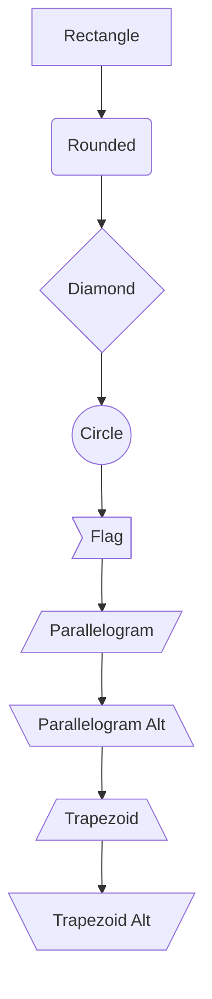
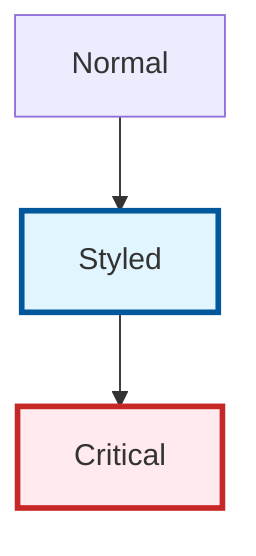
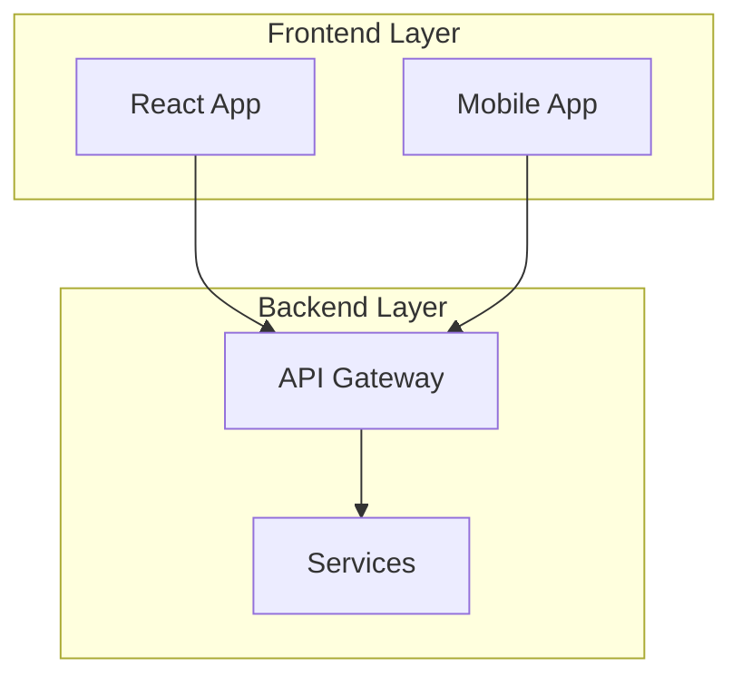

# 🎨 Mermaid v11+ Styling Guide - Eye-Catching Distinguished Themes

## 🌟 **Latest Mermaid Features (v11+)**

### **New Theme System**
- Enhanced theme support with predefined themes
- Custom theme variables for fine-grained control
- Better color palette management
- Improved rendering performance

### **Advanced Styling Options**
- Gradient support for nodes and edges
- Enhanced font styling and sizing
- Better shape variety and customization
- Improved subgraph styling

## 🎯 **Purpose-Specific Styling Themes**

### **1. 🏗️ Architecture Diagrams**
**Purpose**: System overview, component relationships, infrastructure layout
**Color Scheme**: Professional blues and teals (trust, stability, infrastructure)
**Visual Style**: Clean, structured, hierarchical

```mermaid
%%{init: {
  'theme': 'base',
  'themeVariables': {
    'primaryColor': '#0066cc',
    'primaryTextColor': '#ffffff',
    'primaryBorderColor': '#004499',
    'lineColor': '#0066cc',
    'secondaryColor': '#00ccaa',
    'tertiaryColor': '#e6f3ff',
    'background': '#ffffff',
    'mainBkg': '#0066cc',
    'secondBkg': '#00ccaa',
    'tertiaryBkg': '#e6f3ff'
  }
}}%%
```

### **2. 📈 Scaling/Growth Diagrams**
**Purpose**: Phase progression, capacity growth, resource scaling
**Color Scheme**: Growth gradient (green → yellow → orange → red)
**Visual Style**: Progressive intensity, clear phase distinction

```mermaid
%%{init: {
  'theme': 'base',
  'themeVariables': {
    'primaryColor': '#90EE90',
    'primaryTextColor': '#2d5016',
    'primaryBorderColor': '#228B22',
    'lineColor': '#32CD32',
    'secondaryColor': '#FFD700',
    'tertiaryColor': '#FF8C00',
    'background': '#ffffff',
    'mainBkg': '#90EE90',
    'secondBkg': '#FFD700',
    'tertiaryBkg': '#FF8C00'
  }
}}%%
```

### **3. 🔄 Data Flow Diagrams**
**Purpose**: Request processing, data movement, communication patterns
**Color Scheme**: Dynamic purples and magentas (flow, movement, data)
**Visual Style**: Curved flows, directional emphasis

```mermaid
%%{init: {
  'theme': 'base',
  'themeVariables': {
    'primaryColor': '#6A4C93',
    'primaryTextColor': '#ffffff',
    'primaryBorderColor': '#4a3269',
    'lineColor': '#9D7FFF',
    'secondaryColor': '#E6CCFF',
    'tertiaryColor': '#C8A2C8',
    'background': '#ffffff',
    'mainBkg': '#6A4C93',
    'secondBkg': '#9D7FFF',
    'tertiaryBkg': '#E6CCFF'
  }
}}%%
```

### **4. 👥 Business Process Diagrams**
**Purpose**: User journeys, workflows, business operations
**Color Scheme**: Warm oranges and browns (human-friendly, approachable)
**Visual Style**: User-centric, clear decision points

```mermaid
%%{init: {
  'theme': 'base',
  'themeVariables': {
    'primaryColor': '#FF6F00',
    'primaryTextColor': '#ffffff',
    'primaryBorderColor': '#E65100',
    'lineColor': '#FF8F00',
    'secondaryColor': '#FFA726',
    'tertiaryColor': '#FFE0B2',
    'background': '#ffffff',
    'mainBkg': '#FF6F00',
    'secondBkg': '#FFA726',
    'tertiaryBkg': '#FFE0B2'
  }
}}%%
```

### **5. 🗄️ Database Schema Diagrams**
**Purpose**: Entity relationships, data models, database structure
**Color Scheme**: Cool neutrals (grays, steel blues)
**Visual Style**: Technical precision, clear relationships

```mermaid
%%{init: {
  'theme': 'base',
  'themeVariables': {
    'primaryColor': '#455A64',
    'primaryTextColor': '#ffffff',
    'primaryBorderColor': '#263238',
    'lineColor': '#607D8B',
    'secondaryColor': '#90A4AE',
    'tertiaryColor': '#ECEFF1',
    'background': '#ffffff',
    'mainBkg': '#455A64',
    'secondBkg': '#90A4AE',
    'tertiaryBkg': '#ECEFF1'
  }
}}%%
```

### **6. ⏰ Timeline/Roadmap Diagrams**
**Purpose**: Project milestones, implementation phases, schedules
**Color Scheme**: Sequential spectrum (past → present → future)
**Visual Style**: Temporal progression, milestone emphasis

```mermaid
%%{init: {
  'theme': 'base',
  'themeVariables': {
    'primaryColor': '#2E7D32',
    'primaryTextColor': '#ffffff',
    'primaryBorderColor': '#1B5E20',
    'lineColor': '#4CAF50',
    'secondaryColor': '#FFC107',
    'tertiaryColor': '#9E9E9E',
    'background': '#ffffff',
    'mainBkg': '#2E7D32',
    'secondBkg': '#FFC107',
    'tertiaryBkg': '#9E9E9E'
  }
}}%%
```

## 🎨 **Advanced Styling Techniques**

### **Node Shape Variations**


### **Custom CSS Classes**


### **Subgraph Styling**


## 🔧 **Implementation Guidelines**

### **1. Diagram Header Template**
Always start diagrams with theme configuration:
```mermaid
%%{init: {
  'theme': 'base',
  'themeVariables': {
    // Theme-specific variables here
  }
}}%%
```

### **2. Consistent Naming**
- Use clear, descriptive node names
- Maintain consistent terminology across diagrams
- Use action verbs for process flows

### **3. Visual Hierarchy**
- Primary components: Bold colors, thick borders
- Secondary components: Medium colors, medium borders  
- Supporting elements: Light colors, thin borders

### **4. Testing Compatibility**
Test diagrams across platforms:
- GitHub Markdown
- GitLab Markdown
- Mermaid Live Editor
- Documentation platforms

## 📋 **Diagram Categories to Update**

### **Architecture Diagrams (15+ diagrams)**
- Overall system architecture
- Component relationships
- Infrastructure layout
- Microservices architecture

### **Scaling Diagrams (New - 5+ diagrams)**
- Three-phase scaling progression
- Capacity growth visualization
- Infrastructure evolution
- Resource allocation changes

### **Data Flow Diagrams (8+ diagrams)**
- API request flows
- Payment processing
- Location updates
- Real-time communication

### **Business Process Diagrams (17+ diagrams)**
- User registration flows
- Trip booking process
- Driver onboarding
- Payment workflows

### **Database Schema Diagrams (1+ diagrams)**
- Entity relationships
- Data model structure
- Foreign key relationships

### **Timeline Diagrams (2+ diagrams)**
- Development roadmap
- Implementation phases
- Milestone tracking

## 🚀 **Next Steps**

1. **Update README.md diagrams** (2 diagrams)
2. **Update ARCHITECTURE.md diagrams** (15+ diagrams)
3. **Update BUSINESS_PROCESSES.md diagrams** (17+ diagrams)
4. **Create new scaling diagrams** (5+ diagrams)
5. **Update DATABASE_SCHEMA.md diagrams** (1+ diagrams)
6. **Test all diagram rendering**

**Total Estimated Diagrams**: 48+ diagrams to update/create

