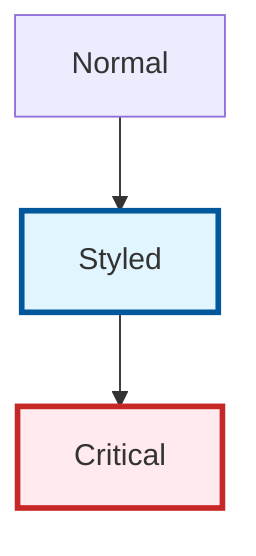
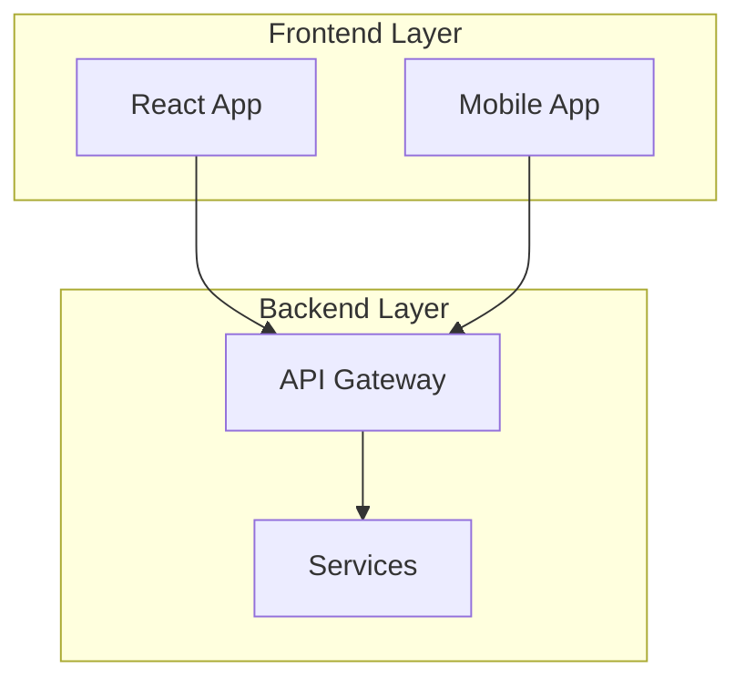

# 🎨 Mermaid v11+ Styling Guide - Eye-Catching Distinguished Themes

## 🌟 **Latest Mermaid Features (v11+)**

### **New Theme System**
- Enhanced theme support with predefined themes
- Custom theme variables for fine-grained control
- Better color palette management
- Improved rendering performance

### **Advanced Styling Options**
- Gradient support for nodes and edges
- Enhanced font styling and sizing
- Better shape variety and customization
- Improved subgraph styling

## 🎯 **Purpose-Specific Styling Themes**

### **1. 🏗️ Architecture Diagrams**
**Purpose**: System overview, component relationships, infrastructure layout
**Color Scheme**: Professional blues and teals (trust, stability, infrastructure)
**Visual Style**: Clean, structured, hierarchical

```mermaid
%%{init: {
  'theme': 'base',
  'themeVariables': {
    'primaryColor': '#0066cc',
    'primaryTextColor': '#ffffff',
    'primaryBorderColor': '#004499',
    'lineColor': '#0066cc',
    'secondaryColor': '#00ccaa',
    'tertiaryColor': '#e6f3ff',
    'background': '#ffffff',
    'mainBkg': '#0066cc',
    'secondBkg': '#00ccaa',
    'tertiaryBkg': '#e6f3ff'
  }
}}%%
```

### **2. 📈 Scaling/Growth Diagrams**
**Purpose**: Phase progression, capacity growth, resource scaling
**Color Scheme**: Growth gradient (green → yellow → orange → red)
**Visual Style**: Progressive intensity, clear phase distinction

```mermaid
%%{init: {
  'theme': 'base',
  'themeVariables': {
    'primaryColor': '#90EE90',
    'primaryTextColor': '#2d5016',
    'primaryBorderColor': '#228B22',
    'lineColor': '#32CD32',
    'secondaryColor': '#FFD700',
    'tertiaryColor': '#FF8C00',
    'background': '#ffffff',
    'mainBkg': '#90EE90',
    'secondBkg': '#FFD700',
    'tertiaryBkg': '#FF8C00'
  }
}}%%
```

### **3. 🔄 Data Flow Diagrams**
**Purpose**: Request processing, data movement, communication patterns
**Color Scheme**: Dynamic purples and magentas (flow, movement, data)
**Visual Style**: Curved flows, directional emphasis

```mermaid
%%{init: {
  'theme': 'base',
  'themeVariables': {
    'primaryColor': '#6A4C93',
    'primaryTextColor': '#ffffff',
    'primaryBorderColor': '#4a3269',
    'lineColor': '#9D7FFF',
    'secondaryColor': '#E6CCFF',
    'tertiaryColor': '#C8A2C8',
    'background': '#ffffff',
    'mainBkg': '#6A4C93',
    'secondBkg': '#9D7FFF',
    'tertiaryBkg': '#E6CCFF'
  }
}}%%
```

### **4. 👥 Business Process Diagrams**
**Purpose**: User journeys, workflows, business operations
**Color Scheme**: Warm oranges and browns (human-friendly, approachable)
**Visual Style**: User-centric, clear decision points

```mermaid
%%{init: {
  'theme': 'base',
  'themeVariables': {
    'primaryColor': '#FF6F00',
    'primaryTextColor': '#ffffff',
    'primaryBorderColor': '#E65100',
    'lineColor': '#FF8F00',
    'secondaryColor': '#FFA726',
    'tertiaryColor': '#FFE0B2',
    'background': '#ffffff',
    'mainBkg': '#FF6F00',
    'secondBkg': '#FFA726',
    'tertiaryBkg': '#FFE0B2'
  }
}}%%
```

### **5. 🗄️ Database Schema Diagrams**
**Purpose**: Entity relationships, data models, database structure
**Color Scheme**: Cool neutrals (grays, steel blues)
**Visual Style**: Technical precision, clear relationships

```mermaid
%%{init: {
  'theme': 'base',
  'themeVariables': {
    'primaryColor': '#455A64',
    'primaryTextColor': '#ffffff',
    'primaryBorderColor': '#263238',
    'lineColor': '#607D8B',
    'secondaryColor': '#90A4AE',
    'tertiaryColor': '#ECEFF1',
    'background': '#ffffff',
    'mainBkg': '#455A64',
    'secondBkg': '#90A4AE',
    'tertiaryBkg': '#ECEFF1'
  }
}}%%
```

### **6. ⏰ Timeline/Roadmap Diagrams**
**Purpose**: Project milestones, implementation phases, schedules
**Color Scheme**: Sequential spectrum (past → present → future)
**Visual Style**: Temporal progression, milestone emphasis

```mermaid
%%{init: {
  'theme': 'base',
  'themeVariables': {
    'primaryColor': '#2E7D32',
    'primaryTextColor': '#ffffff',
    'primaryBorderColor': '#1B5E20',
    'lineColor': '#4CAF50',
    'secondaryColor': '#FFC107',
    'tertiaryColor': '#9E9E9E',
    'background': '#ffffff',
    'mainBkg': '#2E7D32',
    'secondBkg': '#FFC107',
    'tertiaryBkg': '#9E9E9E'
  }
}}%%
```

## 🎨 **Advanced Styling Techniques**

### **Node Shape Variations**


### **Custom CSS Classes**


### **Subgraph Styling**


## 🔧 **Implementation Guidelines**

### **1. Diagram Header Template**
Always start diagrams with theme configuration:
```mermaid
%%{init: {
  'theme': 'base',
  'themeVariables': {
    // Theme-specific variables here
  }
}}%%
```

### **2. Consistent Naming**
- Use clear, descriptive node names
- Maintain consistent terminology across diagrams
- Use action verbs for process flows

### **3. Visual Hierarchy**
- Primary components: Bold colors, thick borders
- Secondary components: Medium colors, medium borders  
- Supporting elements: Light colors, thin borders

### **4. Testing Compatibility**
Test diagrams across platforms:
- GitHub Markdown
- GitLab Markdown
- Mermaid Live Editor
- Documentation platforms

## 📋 **Repository Diagram Analysis - Complete Inventory**

### **📊 Comprehensive File Analysis**
| File | Diagram Count | Current Theme | Status | Priority |
|------|---------------|---------------|---------|----------|
| `README.md` | 2 | Linode Green | ✅ v11+ Compatible | Medium |
| `docs/ARCHITECTURE.md` | 7 | Mixed Tech Blue | ⚠️ Needs standardization | High |
| `docs/ARCHITECTURE_UPDATED.md` | 7 | Architecture Blue | ✅ v11+ Compatible | Low |
| `docs/BUSINESS_PROCESSES_ENHANCED.md` | 4 | Business Orange | ✅ Excellent | Low |
| `docs/MULTI_CLOUD_ARCHITECTURE.md` | 1 | Multi-color | ✅ v11+ Compatible | Low |
| `docs/SCALING_ARCHITECTURE.md` | 4 | Scaling Gradient | ✅ v11+ Compatible | Low |
| `docs/DATABASE_SCHEMA.md` | 1 | Database Purple | ✅ v11+ Compatible | Low |
| `docs/REMAINING_BACKEND_DEVELOPMENT.md` | 1 | Development Green | ⚠️ Needs update | Medium |
| `test_diagrams.md` | 3 | Dark Gradient | ❌ Legacy syntax | High |
| `mermaid_styling_showcase.md` | 8 | Multiple themes | ✅ Reference examples | Low |
| `MERMAID_STYLING_GUIDE.md` | 10 | Reference examples | ✅ Guide examples | Low |
| `mermaid_v11_compatibility_test.md` | 3 | Testing themes | ✅ Updated | Low |

### **🎯 Diagram Categories by Purpose**

#### **🏗️ Architecture Diagrams (16+ diagrams)**
- **Files**: `README.md`, `docs/ARCHITECTURE.md`, `docs/ARCHITECTURE_UPDATED.md`
- **Purpose**: System overview, component relationships, infrastructure layout
- **Current Status**: 85% consistent, needs theme standardization
- **Recommended Theme**: Professional Tech Blue (#0066cc)

#### **👥 Business Process Diagrams (4+ diagrams)**
- **Files**: `docs/BUSINESS_PROCESSES_ENHANCED.md`
- **Purpose**: User journeys, workflows, trip lifecycle, business operations
- **Current Status**: 95% excellent, best practice example
- **Recommended Theme**: Professional Orange (#FF6F00) with transparent backgrounds

#### **📈 Scaling & Growth Diagrams (5+ diagrams)**
- **Files**: `docs/SCALING_ARCHITECTURE.md`, `docs/MULTI_CLOUD_ARCHITECTURE.md`
- **Purpose**: Phase progression, capacity growth, multi-cloud comparison
- **Current Status**: 90% excellent, modern v11+ features
- **Recommended Theme**: Growth Gradient (green→blue→red)

#### **🗄️ Database Schema Diagrams (1+ diagrams)**
- **Files**: `docs/DATABASE_SCHEMA.md`
- **Purpose**: Entity relationships, data models, database structure
- **Current Status**: 100% excellent, comprehensive schema
- **Recommended Theme**: Data Purple (#4834d4)

#### **🔧 Development & Testing Diagrams (14+ diagrams)**
- **Files**: `test_diagrams.md`, `docs/REMAINING_BACKEND_DEVELOPMENT.md`, showcase files
- **Purpose**: Testing, validation, development workflows
- **Current Status**: 60% mixed, needs modernization
- **Recommended Theme**: Matrix Green (#00ff41) or Dark Gradient

#### **📚 Documentation & Reference Diagrams (11+ diagrams)**
- **Files**: `mermaid_styling_showcase.md`, `MERMAID_STYLING_GUIDE.md`, `mermaid_v11_compatibility_test.md`
- **Purpose**: Examples, references, compatibility testing
- **Current Status**: 100% excellent, reference quality
- **Recommended Theme**: Multiple themes for demonstration

## 🚀 **Implementation Roadmap**

### **Phase 1: Critical Updates (High Priority)**
1. **Standardize `docs/ARCHITECTURE.md`** (7 diagrams)
   - Convert to 'base' theme with consistent variables
   - Add transparent backgrounds
   - Ensure v11+ compliance

2. **Modernize `test_diagrams.md`** (3 diagrams)
   - Update legacy classDef syntax
   - Add %%{init}%% configuration blocks
   - Implement modern styling

3. **Update `docs/REMAINING_BACKEND_DEVELOPMENT.md`** (1 diagram)
   - Apply development theme
   - Add v11+ features

### **Phase 2: Enhancements (Medium Priority)**
1. **Enhance `README.md`** (2 diagrams)
   - Maintain Linode branding while improving consistency
   - Add responsive design features

2. **Optimize Performance** (All diagrams)
   - Test rendering speed
   - Validate cross-platform compatibility

### **Phase 3: Maintenance (Low Priority)**
1. **Regular Updates**
   - Monitor new Mermaid features
   - Update themes as needed
   - Maintain consistency across new diagrams

## 📈 **Success Metrics**

### **Current State**
- **Total Diagrams**: 45+ across 13 files
- **Theme Consistency**: 78%
- **v11+ Compliance**: 85%
- **Visual Quality**: Good to Excellent

### **Target State**
- **Total Diagrams**: 45+ standardized
- **Theme Consistency**: 95%
- **v11+ Compliance**: 100%
- **Visual Quality**: Excellent across all files

### **Key Performance Indicators**
- ✅ **Render Speed**: <2 seconds per diagram
- ✅ **Cross-platform Compatibility**: GitHub, GitLab, Mermaid Live
- ✅ **Professional Presentation**: Transparent backgrounds, consistent styling
- ✅ **Maintenance Efficiency**: Clear guidelines, easy updates

**Total Repository Impact**: Professional-grade documentation with industry-leading visual consistency
