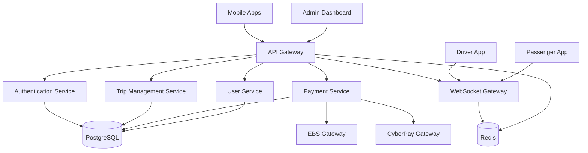
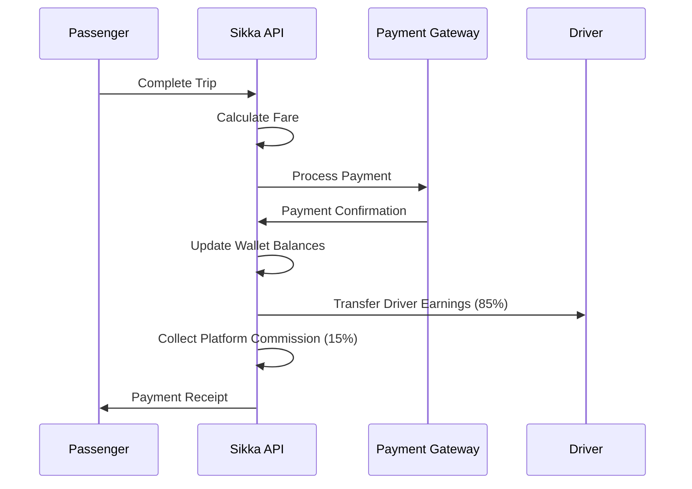

# 🚗 Sikka Transportation Platform

> A comprehensive ride-hailing and transportation management platform built with NestJS, featuring real-time tracking, multi-gateway payments, and advanced analytics.

[](https://nestjs.com/)
[](https://www.typescriptlang.org/)
[](https://www.postgresql.org/)
[](https://redis.io/)
[](https://socket.io/)

## 📋 Table of Contents

- [🎯 Overview](#-overview)
- [✨ Key Features](#-key-features)
- [🏗️ Architecture](#️-architecture)
- [🚀 Quick Start](#-quick-start)
- [📚 Documentation](#-documentation)
- [🔧 API Reference](#-api-reference)
- [🌐 Real-time Features](#-real-time-features)
- [💳 Payment Integration](#-payment-integration)
- [📊 Admin Dashboard](#-admin-dashboard)
- [🛡️ Security](#️-security)
- [🧪 Testing](#-testing)
- [🚀 Deployment](#-deployment)
- [🤝 Contributing](#-contributing)

## 🎯 Overview

Sikka is a modern, scalable transportation platform designed for the Sudanese market, offering comprehensive ride-hailing services with advanced features including:

- **Real-time GPS tracking** and driver-passenger communication
- **Multi-gateway payment processing** (EBS, CyberPay, Wallet, Cash)
- **Advanced admin analytics** and reporting
- **WebSocket-based live updates** for seamless user experience
- **Comprehensive API** with full Swagger documentation
- **Production-ready architecture** with security and scalability in mind

### 🌍 Target Market
- **Primary**: Sudan (Khartoum, Omdurman, Bahri)
- **Currency**: Sudanese Pound (SDG)
- **Payment Gateways**: EBS (Electronic Banking Services), CyberPay
- **Phone Format**: Sudan (+249) format validation

## ✨ Key Features

### 🚗 **Core Transportation Services**
- **Trip Booking**: Standard, Premium, Shared, and Delivery options
- **Real-time Matching**: Intelligent driver-passenger matching algorithm
- **Live Tracking**: GPS-based real-time location tracking
- **Route Optimization**: Efficient pickup and dropoff routing
- **Fare Calculation**: Dynamic pricing with distance and time factors

### 👥 **User Management**
- **Multi-role Support**: Passengers, Drivers, and Administrators
- **OTP Authentication**: SMS-based phone verification
- **Profile Management**: Complete user profiles with ratings
- **Driver Verification**: License and vehicle registration validation
- **Status Management**: Active, suspended, and verification states

### 💰 **Payment & Wallet System**
- **Digital Wallet**: Secure wallet with topup and spending limits
- **Multiple Payment Methods**: EBS, CyberPay, Cash, and Wallet
- **Commission System**: Automated 15% platform commission
- **Refund Processing**: Automated and manual refund capabilities
- **Transaction History**: Comprehensive payment tracking

### 📱 **Real-time Communication**
- **WebSocket Gateway**: Live trip updates and notifications
- **Driver Location Streaming**: Real-time driver position updates
- **Trip Status Updates**: Instant status change notifications
- **In-app Messaging**: Driver-passenger communication

### 📊 **Analytics & Reporting**
- **Admin Dashboard**: Comprehensive platform analytics
- **Financial Reports**: Revenue, commission, and earnings tracking
- **User Analytics**: Registration, activity, and retention metrics
- **Trip Analytics**: Completion rates, cancellation analysis
- **Data Export**: CSV export for external analysis

## 🏗️ Architecture

### **Technology Stack**
- **Backend Framework**: NestJS with TypeScript
- **Database**: PostgreSQL with TypeORM
- **Caching**: Redis for session and data caching
- **Real-time**: WebSocket.IO for live communication
- **Authentication**: JWT with refresh token rotation
- **Documentation**: Swagger/OpenAPI 3.0
- **Validation**: Class-validator with custom business rules

### **System Components**



## 🚀 Quick Start

### **Prerequisites**
- Node.js 18+ and npm/yarn
- PostgreSQL 13+
- Redis 6+
- Git

### **Installation**

```bash
# Clone the repository
git clone https://github.com/abdoElHodaky/transportapp.git
cd transportapp/sikka-backend

# Install dependencies
npm install

# Set up environment variables
cp .env.example .env
# Edit .env with your configuration

# Set up database
npm run db:create
npm run migration:run
npm run seed:run

# Start development server
npm run start:dev
```

### **Environment Configuration**

```env
# Database
DATABASE_HOST=localhost
DATABASE_PORT=5432
DATABASE_USERNAME=sikka_user
DATABASE_PASSWORD=your_password
DATABASE_NAME=sikka_db

# JWT
JWT_SECRET=your-super-secret-jwt-key
JWT_EXPIRES_IN=24h

# Redis
REDIS_HOST=localhost
REDIS_PORT=6379

# Payment Gateways
EBS_BASE_URL=https://api.ebs.sd
EBS_MERCHANT_ID=your_merchant_id
EBS_SECRET_KEY=your_secret_key

CYBERPAY_BASE_URL=https://api.cyberpay.sd
CYBERPAY_MERCHANT_ID=your_merchant_id
CYBERPAY_API_KEY=your_api_key
```

### **Development Commands**

```bash
# Development
npm run start:dev          # Start with hot reload
npm run start:debug        # Start with debugging

# Building
npm run build              # Build for production
npm run start:prod         # Start production server

# Database
npm run migration:generate # Generate new migration
npm run migration:run      # Run migrations
npm run migration:revert   # Revert last migration

# Testing
npm run test               # Unit tests
npm run test:e2e          # End-to-end tests
npm run test:cov          # Test coverage
```

## 📚 Documentation

### **Comprehensive Guides**
- [📋 **Business Processes**](docs/BUSINESS_PROCESSES.md) - User journeys and workflows
- [🏗️ **System Architecture**](docs/ARCHITECTURE.md) - Technical architecture and design
- [🔌 **API Documentation**](docs/API_DOCUMENTATION.md) - Complete API reference
- [🗄️ **Database Schema**](docs/DATABASE_SCHEMA.md) - Entity relationships and structure

### **API Documentation**
- **Swagger UI**: `http://localhost:3000/api/docs` (when running locally)
- **OpenAPI Spec**: Available at `/api/docs-json`
- **Postman Collection**: Available in `/docs/postman/`

## 🔧 API Reference

### **Core Endpoints**

#### **Authentication**
```http
POST /auth/register          # User registration
POST /auth/verify-otp        # Phone verification
POST /auth/login             # User login
POST /auth/refresh           # Token refresh
```

#### **Trip Management**
```http
POST /trips/request          # Request a trip
POST /trips/:id/accept       # Driver accepts trip
PUT /trips/:id/status        # Update trip status
GET /trips/user/history      # User trip history
POST /trips/:id/rate         # Rate completed trip
```

#### **Payment Processing**
```http
POST /payments/trips/:id/process    # Process trip payment
GET /payments/wallet                # Get wallet balance
POST /payments/wallet/topup         # Top up wallet
GET /payments/transactions          # Transaction history
POST /payments/:id/refund           # Process refund
```

#### **Admin Operations**
```http
GET /admin/dashboard         # Platform analytics
GET /admin/users             # User management
GET /admin/trips             # Trip management
GET /admin/reports/financial # Financial reports
POST /admin/export           # Data export
```

## 🌐 Real-time Features

### **WebSocket Events**

#### **Client → Server**
```javascript
// Join trip room for updates
socket.emit('join_trip', { tripId: 'uuid' });

// Driver location updates
socket.emit('driver_location_update', {
  tripId: 'uuid',
  latitude: 15.5007,
  longitude: 32.5532,
  heading: 45,
  speed: 30
});

// Connection heartbeat
socket.emit('ping');
```

#### **Server → Client**
```javascript
// New trip available (to drivers)
socket.on('new_trip_request', (tripData) => {
  // Handle new trip notification
});

// Trip status updates
socket.on('trip_status_update', (statusData) => {
  // Handle status change
});

// Driver location updates
socket.on('driver_location_update', (locationData) => {
  // Update driver position on map
});

// Payment completion
socket.on('payment_completed', (paymentData) => {
  // Handle payment confirmation
});
```

## 💳 Payment Integration

### **Supported Payment Methods**

#### **EBS (Electronic Banking Services)**
- **Type**: Bank card payments
- **Currency**: SDG (Sudanese Pound)
- **Features**: Real-time processing, webhook callbacks
- **Simulation**: Available for development

#### **CyberPay**
- **Type**: Digital wallet and card payments
- **Currency**: SDG
- **Features**: Instant transfers, refund support
- **Simulation**: Available for development

#### **Digital Wallet**
- **Type**: Platform wallet system
- **Features**: Instant payments, spending limits, transaction history
- **Security**: PIN protection, daily/monthly limits

#### **Cash Payments**
- **Type**: Pay-on-delivery
- **Features**: Driver collection, manual confirmation

### **Payment Flow**



## 📊 Admin Dashboard

### **Analytics Overview**
- **User Metrics**: Total users, new registrations, active users
- **Trip Analytics**: Completion rates, cancellation analysis, revenue trends
- **Financial Reports**: Revenue, commission, top-earning drivers
- **Real-time Monitoring**: Active trips, online drivers, system health

### **Management Features**
- **User Management**: Status updates, profile verification, suspension
- **Trip Monitoring**: Real-time trip tracking, dispute resolution
- **Financial Control**: Payment processing, refunds, commission adjustments
- **Data Export**: CSV exports for external analysis and reporting

### **Reporting Capabilities**
- **Revenue Reports**: Daily, weekly, monthly revenue breakdowns
- **User Analytics**: Registration trends, retention analysis
- **Driver Performance**: Earnings, ratings, trip completion rates
- **System Metrics**: API performance, error rates, uptime monitoring

## 🛡️ Security

### **Authentication & Authorization**
- **JWT Tokens**: Secure token-based authentication
- **Refresh Tokens**: Automatic token rotation
- **Role-based Access**: Passenger, Driver, Admin permissions
- **OTP Verification**: SMS-based phone number verification

### **Data Protection**
- **Input Validation**: Comprehensive request validation
- **SQL Injection Prevention**: TypeORM parameterized queries
- **Rate Limiting**: API endpoint protection
- **CORS Configuration**: Cross-origin request security

### **Payment Security**
- **PCI Compliance**: Secure payment processing
- **Webhook Validation**: HMAC signature verification
- **Encryption**: Sensitive data encryption at rest
- **Audit Trails**: Complete transaction logging

## 🧪 Testing

### **Test Coverage**
- **Unit Tests**: Service layer business logic
- **Integration Tests**: API endpoint testing
- **E2E Tests**: Complete user journey testing
- **Performance Tests**: Load and stress testing

### **Testing Commands**
```bash
npm run test              # Run unit tests
npm run test:watch        # Watch mode for development
npm run test:cov          # Generate coverage report
npm run test:e2e          # End-to-end tests
npm run test:load         # Performance testing
```

## 🚀 Deployment

### **Production Deployment**

#### **Docker Deployment**
```bash
# Build production image
docker build -t sikka-backend .

# Run with docker-compose
docker-compose -f docker-compose.prod.yml up -d
```

#### **Environment Setup**
- **Database**: PostgreSQL with connection pooling
- **Caching**: Redis cluster for high availability
- **Load Balancing**: Nginx reverse proxy
- **SSL/TLS**: Let's Encrypt certificates
- **Monitoring**: Health checks and logging

#### **Scaling Considerations**
- **Horizontal Scaling**: Multiple API instances
- **Database Optimization**: Read replicas, indexing
- **Caching Strategy**: Redis for session and data caching
- **CDN Integration**: Static asset delivery

## 🤝 Contributing

### **Development Workflow**
1. Fork the repository
2. Create a feature branch (`git checkout -b feature/amazing-feature`)
3. Commit your changes (`git commit -m 'Add amazing feature'`)
4. Push to the branch (`git push origin feature/amazing-feature`)
5. Open a Pull Request

### **Code Standards**
- **TypeScript**: Strict type checking enabled
- **ESLint**: Airbnb configuration with custom rules
- **Prettier**: Consistent code formatting
- **Husky**: Pre-commit hooks for quality assurance

### **Pull Request Guidelines**
- Include comprehensive tests for new features
- Update documentation for API changes
- Follow conventional commit message format
- Ensure all CI checks pass

---

## 📞 Support & Contact

- **Documentation**: [Full Documentation](docs/)
- **API Reference**: [Swagger UI](http://localhost:3000/api/docs)
- **Issues**: [GitHub Issues](https://github.com/abdoElHodaky/transportapp/issues)
- **Discussions**: [GitHub Discussions](https://github.com/abdoElHodaky/transportapp/discussions)

---

<div align="center">

**Built with ❤️ for the Sudanese transportation market**

[⭐ Star this repo](https://github.com/abdoElHodaky/transportapp) | [🐛 Report Bug](https://github.com/abdoElHodaky/transportapp/issues) | [💡 Request Feature](https://github.com/abdoElHodaky/transportapp/issues)

</div>

