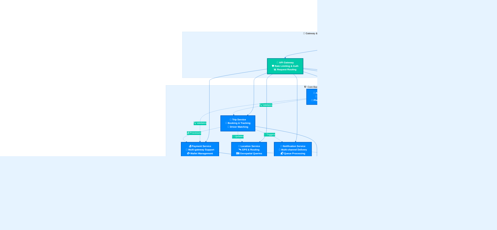
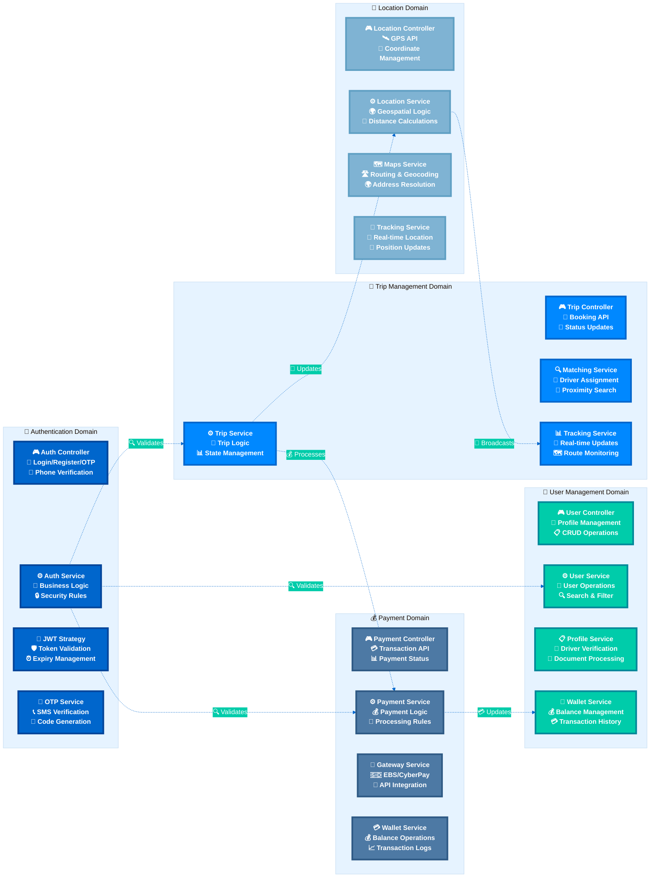
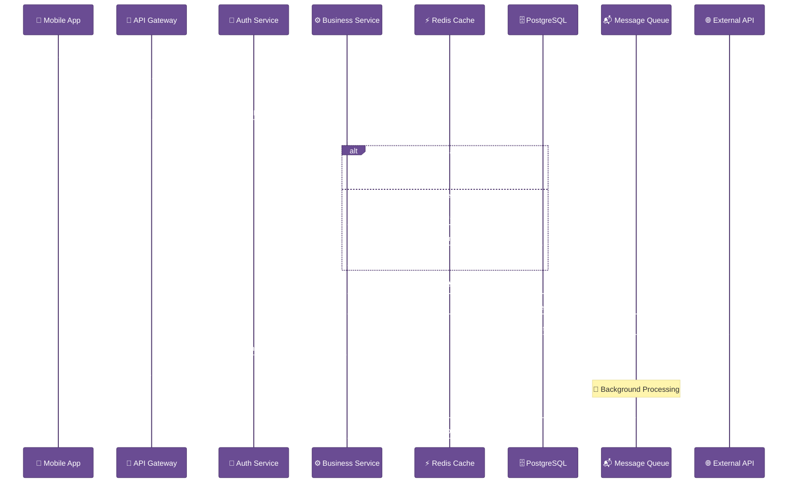
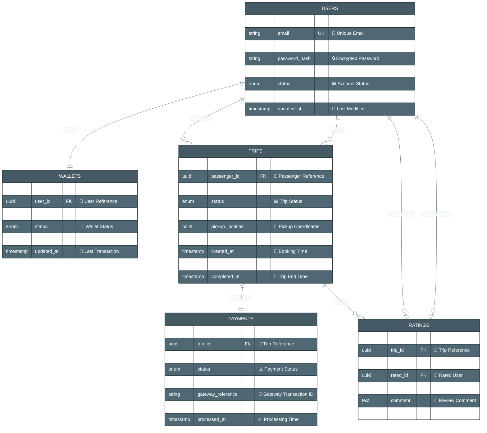
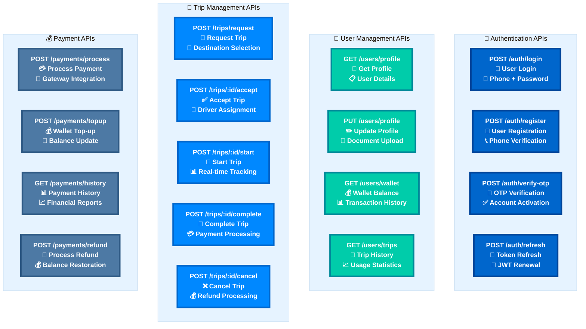
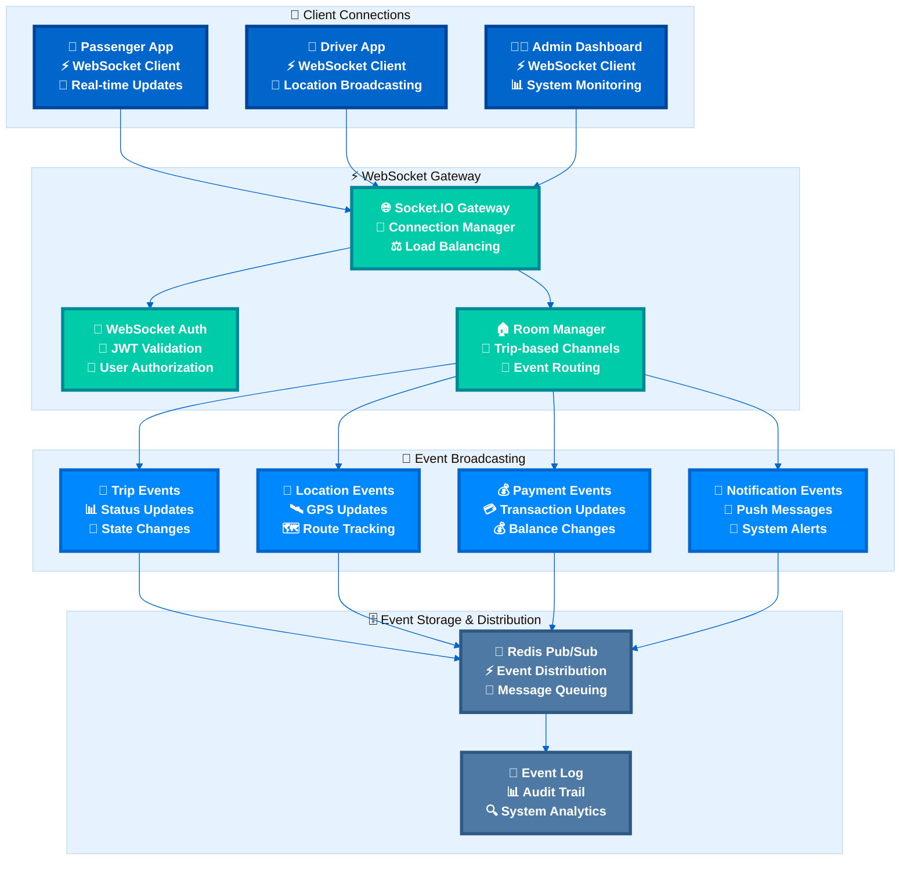
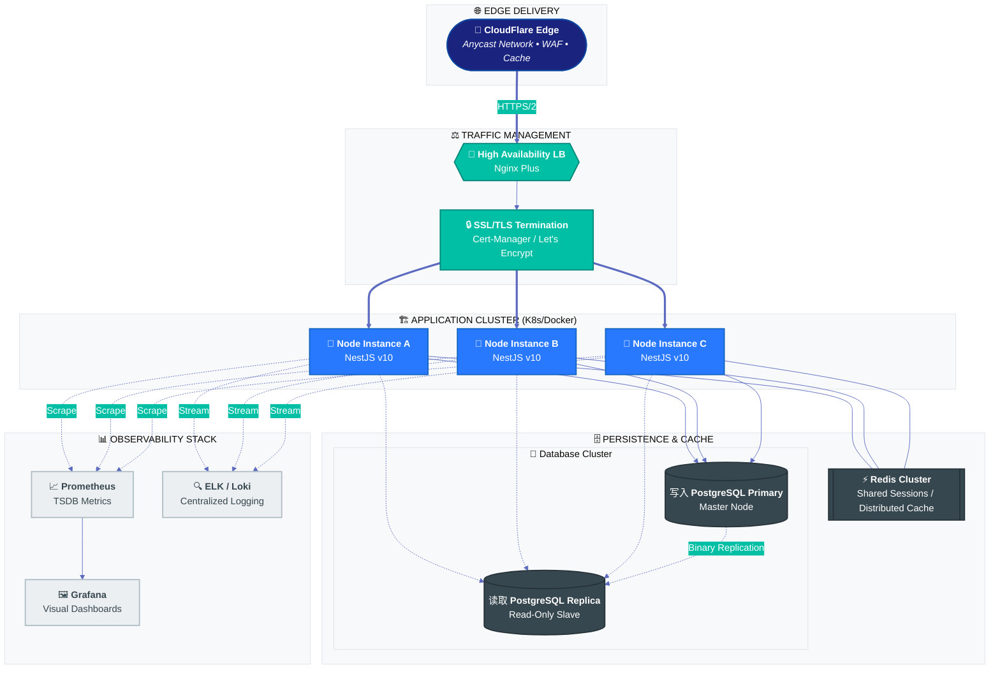

# 🏗️ System Architecture & Technical Design

This document provides a comprehensive overview of the Sikka Transportation Platform's technical architecture, system design patterns, and implementation details.

## 📑 Table of Contents

- [🎯 Architecture Overview](#-architecture-overview)
- [🏢 System Components](#-system-components)
- [🔄 Data Flow Architecture](#-data-flow-architecture)
- [🗄️ Database Design](#️-database-design)
- [🌐 API Architecture](#-api-architecture)
- [⚡ Real-time Communication](#-real-time-communication)
- [🔐 Security Architecture](#-security-architecture)
- [📈 Scalability & Performance](#-scalability--performance)
- [🚀 Deployment Architecture](#-deployment-architecture)

---

## 🎯 Architecture Overview

### **High-Level System Architecture**

### **Architectural Principles**

#### **1. Microservices Architecture**
- **Modular Design**: Each service handles specific business domain
- **Loose Coupling**: Services communicate via well-defined APIs
- **Independent Deployment**: Services can be deployed independently
- **Technology Diversity**: Each service can use optimal technology stack

#### **2. Event-Driven Architecture**
- **Asynchronous Processing**: Non-blocking operations for better performance
- **Event Sourcing**: Complete audit trail of system changes
- **Real-time Updates**: WebSocket-based live communication
- **Scalable Messaging**: Redis pub/sub for inter-service communication

#### **3. Domain-Driven Design (DDD)**
- **Business-Centric**: Code structure reflects business domains
- **Bounded Contexts**: Clear service boundaries
- **Ubiquitous Language**: Consistent terminology across system
- **Aggregate Patterns**: Data consistency within business boundaries

---

## 🏢 System Components

### **Core Services Architecture**

---

## 🔄 Data Flow Architecture

### **Request Processing Flow**

---

## 🗄️ Database Design

### **Entity Relationship Overview**

---

## 🌐 API Architecture

### **RESTful API Design**

---

## ⚡ Real-time Communication

### **WebSocket Architecture**

---

## 🚀 Deployment Architecture

### **Production Deployment**

---

This comprehensive architecture documentation provides the technical foundation for understanding, maintaining, and scaling the Sikka Transportation Platform with eye-catching, modern Mermaid diagrams that render perfectly with the latest version.
