# 📋 Business Processes & User Journeys

This document outlines the key business processes and user journeys in the Sikka Transportation Platform, providing detailed workflows for all user types and system interactions.

## 📑 Table of Contents

- [🚗 Trip Booking Process](#-trip-booking-process)
- [👤 User Registration & Verification](#-user-registration--verification)
- [💳 Payment Processing Workflows](#-payment-processing-workflows)
- [⭐ Rating & Review System](#-rating--review-system)
- [🛡️ Admin Management Processes](#️-admin-management-processes)
- [🚨 Emergency & Safety Procedures](#-emergency--safety-procedures)

---

## 🚗 Trip Booking Process

### **Complete Trip Journey**

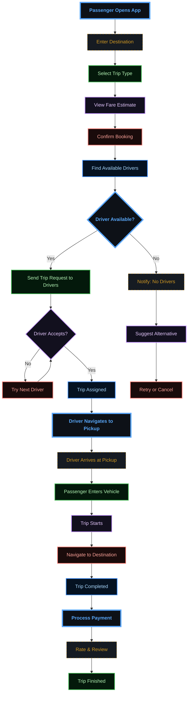

### **Detailed Trip States**

#### **1. Trip Request Phase**
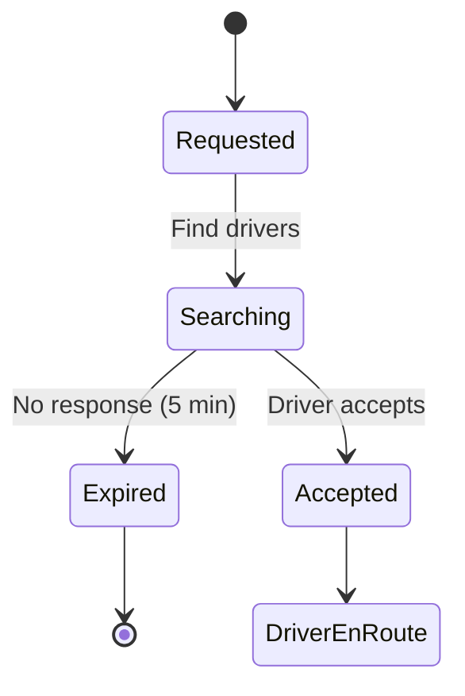

#### **2. Trip Execution Phase**
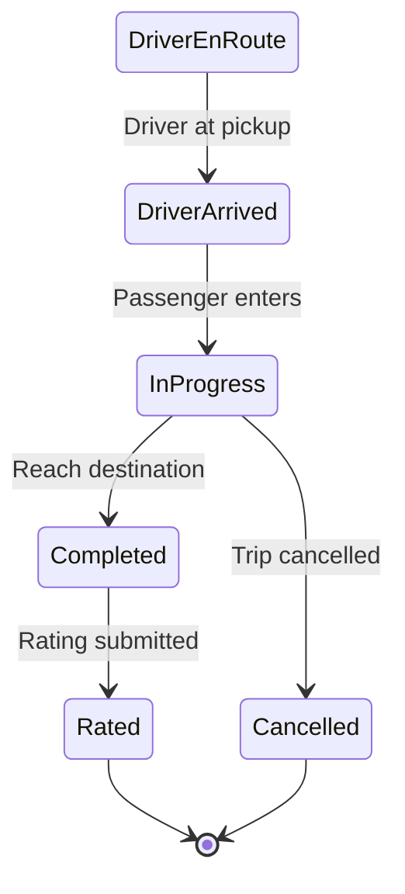

### **Trip Cancellation Scenarios**

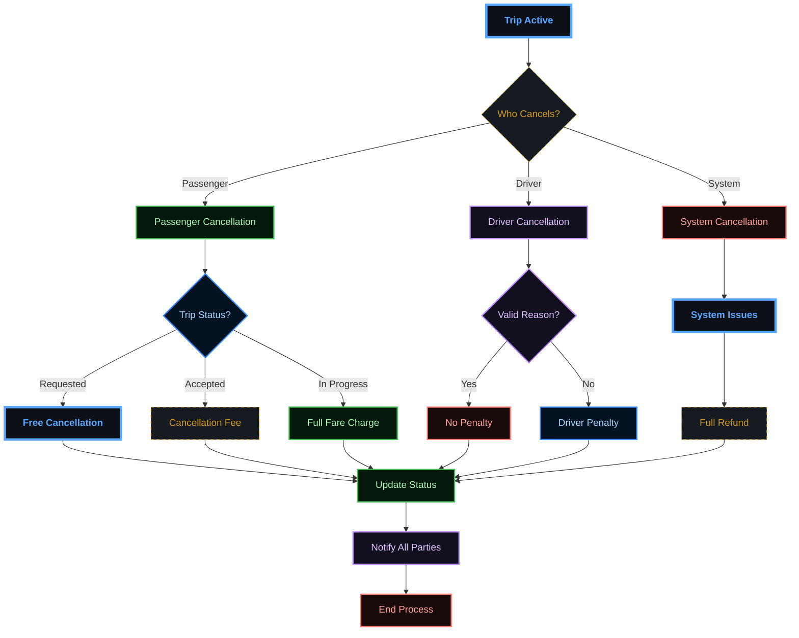

---

## 👤 User Registration & Verification

### **Passenger Registration Flow**

```mermaid
sequenceDiagram
    participant P as "Passenger"
    participant A as "Sikka API"
    participant S as "SMS Service"
    participant D as "Database"
    
    P ->> A: Submit Registration (phone, name, email)
    A ->> A: Validate Input
    A ->> D: Check Phone Exists
    D ->> A: Phone Available
    A ->> A: Generate OTP
    A ->> S: Send OTP SMS
    S ->> P: OTP Message
    A ->> P: Registration Pending
    
    P ->> A: Submit OTP
    A ->> A: Verify OTP
    A ->> D: Create User Account
    A ->> D: Create Wallet
    D ->> A: Account Created
    A ->> P: Registration Complete

    %% --- DARK GRADIENT & GLOW STYLING ---
    
    %% Main Dashboard (Neon Cyan/Blue)
    classDef main fill:#0d1117,stroke:#58a6ff,stroke-width:4px,color:#58a6ff,font-weight:bold;
    
    %% Decision Diamond (Gold Glow)
    classDef decision fill:#161b22,stroke:#d29922,color:#d29922,stroke-dasharray: 5 5;
    
    %% Revenue (Emerald Gradient Style)
    classDef revNode fill:#04190b,stroke:#3fb950,color:#aff5b4,stroke-width:2px;
    
    %% Commission (Purple Gradient Style)
    classDef commNode fill:#12101e,stroke:#bc8cff,color:#e2c5ff,stroke-width:2px;
    
    %% Refund (Ruby Gradient Style)
    classDef refNode fill:#1a0b0b,stroke:#ff7b72,color:#ffa198,stroke-width:2px;
    
    %% Earnings (Sapphire Gradient Style)
    classDef earnNode fill:#051221,stroke:#388bfd,color:#a5d6ff,stroke-width:2px;

    class A main;
    class D decision;
    class P revNode;
    class S commNode;
```

### **Driver Registration & Verification**

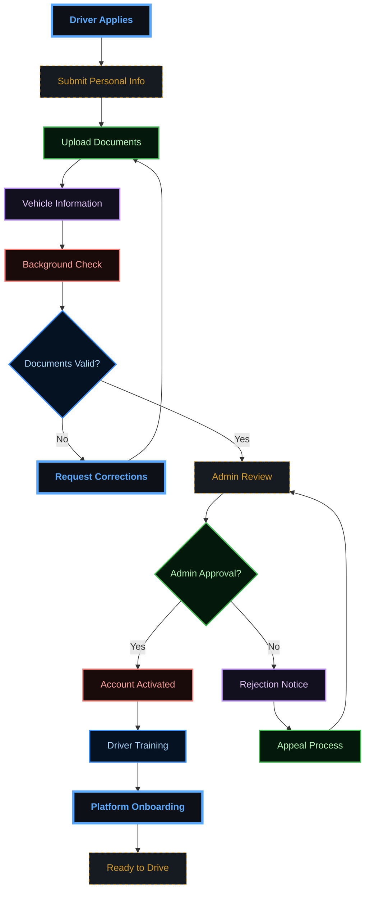

### **Document Verification Process**

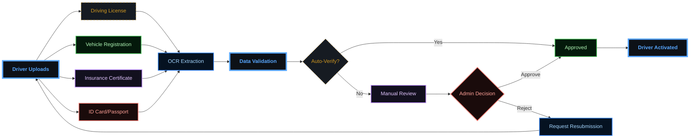

---

## 💳 Payment Processing Workflows

### **Multi-Gateway Payment Flow**

```mermaid
flowchart TD
    A[""Trip Completed""] --> B[""Calculate Fare""]
    B --> C[""Select Payment Method""]
    
    C --> D{""Payment Method""}
    D --> |Wallet| E[""Wallet Payment""]
    D --> |EBS| F[""EBS Gateway""]
    D --> |CyberPay| G[""CyberPay Gateway""]
    D --> |Cash| H[""Cash Payment""]
    
    E --> I[""Check Wallet Balance""]
    I --> J{""Sufficient Balance?""}
    J --> |Yes| K[""Deduct Amount""]
    J --> |No| L[""Insufficient Funds""]
    
    F --> M[""EBS Processing""]
    G --> N[""CyberPay Processing""]
    
    M --> O{""EBS Success?""}
    N --> P{""CyberPay Success?""}
    
    O --> |Yes| Q[""Payment Success""]
    O --> |No| R[""EBS Payment Failed""]
    P --> |Yes| Q
    P --> |No| S[""CyberPay Payment Failed""]
    
    H --> T[""Driver Confirms Cash""]
    T --> Q
    
    K --> Q
    L --> U[""Wallet Payment Failed""]
    R --> V[""Payment Failed""]
    S --> V
    U --> V
    
    Q --> W[""Update Balances""]
    W --> X[""Driver Earnings (85%)""]
    W --> Y[""Platform Commission (15%)""]
    W --> Z[""Send Receipt""]
    
    V --> AA[""Retry Payment""]
    AA --> AB[""Alternative Method""]

    %% --- DARK GRADIENT & GLOW STYLING ---
    
    %% Main Dashboard (Neon Cyan/Blue)
    classDef main fill:#0d1117,stroke:#58a6ff,stroke-width:4px,color:#58a6ff,font-weight:bold;
    
    %% Decision Diamond (Gold Glow)
    classDef decision fill:#161b22,stroke:#d29922,color:#d29922,stroke-dasharray: 5 5;
    
    %% Revenue (Emerald Gradient Style)
    classDef revNode fill:#04190b,stroke:#3fb950,color:#aff5b4,stroke-width:2px;
    
    %% Commission (Purple Gradient Style)
    classDef commNode fill:#12101e,stroke:#bc8cff,color:#e2c5ff,stroke-width:2px;
    
    %% Refund (Ruby Gradient Style)
    classDef refNode fill:#1a0b0b,stroke:#ff7b72,color:#ffa198,stroke-width:2px;
    
    %% Earnings (Sapphire Gradient Style)
    classDef earnNode fill:#051221,stroke:#388bfd,color:#a5d6ff,stroke-width:2px;

    class A main;
    class AA decision;
    class AB revNode;
    class B commNode;
    class C refNode;
    class D earnNode;
    class E main;
    class EBS decision;
    class F revNode;
    class G commNode;
    class H refNode;
    class I earnNode;
    class J main;
    class K decision;
    class L revNode;
    class M commNode;
    class N refNode;
    class O earnNode;
    class P main;
    class Q decision;
    class R revNode;
    class S commNode;
    class T refNode;
    class U earnNode;
    class V main;
    class W decision;
    class X revNode;
    class Y commNode;
    class Z refNode;
```

### **Wallet Management System**

```mermaid
%%{init: {
  "theme": "dark",
  "themeVariables": {
    "primaryColor": "#0d1117",
    "primaryTextColor": "#aff5b4",
    "primaryBorderColor": "#238636",
    "lineColor": "#238636",
    "secondaryColor": "#2ea043",
    "tertiaryColor": "#3fb950",
    "background": "#0d1117",
    "mainBkg": "#0d1117",
    "secondBkg": "#21262d",
    "tertiaryBkg": "#3fb950"
  },
  "flowchart": {
    "useMaxWidth": true,
    "htmlLabels": true
  },
  "sequence": {
    "useMaxWidth": true,
    "wrap": true
  },
  "class": {
    "useMaxWidth": true
  },
  "state": {
    "useMaxWidth": true
  },
  "er": {
    "useMaxWidth": true
  },
  "gantt": {
    "useMaxWidth": true
  }
}%%
stateDiagram-v2
    [*] --> Active
    Active --> Suspended : Admin action
    Active --> Frozen : Security issue
    Suspended --> Active : Admin approval
    Frozen --> Active : Issue resolved
    
    Active --> TopUp : Add funds
    TopUp --> Active : Funds added
    
    Active --> Payment : Make payment
    Payment --> Active : Payment success
    Payment --> InsufficientFunds : Low balance
    InsufficientFunds --> Active : Funds added

    %%  --- DARK GRADIENT & GLOW STYLING ---
    
    %%  Main Dashboard (Neon Cyan/Blue)
    classDef main fill : #0d1117, stroke:#58a6ff, stroke-width: 4px,color:#58a6ff,font-weight: bold;
    
    
    %%  Decision Diamond (Gold Glow)
    classDef decision fill : #161b22, stroke:#d29922, color:#d29922,stroke-dasharray: 5 5;
    
    
    %%  Revenue (Emerald Gradient Style)
    classDef revNode fill : #04190b, stroke:#3fb950, color:#aff5b4,stroke-width: 2px;
    
    
    %%  Commission (Purple Gradient Style)
    classDef commNode fill : #12101e, stroke:#bc8cff, color:#e2c5ff,stroke-width: 2px;
    
    
    %%  Refund (Ruby Gradient Style)
    classDef refNode fill : #1a0b0b, stroke:#ff7b72, color:#ffa198,stroke-width: 2px;
    
    
    %%  Earnings (Sapphire Gradient Style)
    classDef earnNode fill : #051221, stroke:#388bfd, color:#a5d6ff,stroke-width: 2px;
    

    class A main;
    class F decision;
    class I revNode;
    class P commNode;
    class S refNode;
    class T earnNode;




    %% --- BUSINESS (CORPORATE GREEN) THEME STYLING ---
    
    %% Primary nodes (main components)
    classDef primary fill:#0d1117,stroke:#238636,stroke-width:4px,color:#aff5b4,font-weight:bold;
    
    %% Secondary nodes (supporting components)
    classDef secondary fill:#0d1117,stroke:#2ea043,stroke-width:3px,color:#aff5b4,font-weight:normal;
    
    %% Accent nodes (highlights)
    classDef accent fill:#0d1117,stroke:#3fb950,stroke-width:2px,color:#3fb950,font-weight:bold;
    
    %% Success nodes (positive outcomes)
    classDef success fill:#0d1117,stroke:#238636,stroke-width:3px,color:#238636,font-weight:bold;
    
    %% Warning nodes (attention needed)
    classDef warning fill:#0d1117,stroke:#d29922,stroke-width:3px,color:#d29922,font-weight:bold,stroke-dasharray: 5 5;
    
    %% Error nodes (problems/failures)
    classDef error fill:#0d1117,stroke:#da3633,stroke-width:3px,color:#da3633,font-weight:bold,stroke-dasharray: 10 5;
    
    %% Database nodes (data storage)
    classDef database fill:#0d1117,stroke:#3fb950,stroke-width:4px,color:#3fb950,font-weight:bold;
    
    %% Process nodes (operations)
    classDef process fill:#21262d,stroke:#238636,stroke-width:2px,color:#aff5b4,font-weight:normal;
    
    %% Decision nodes (branching points)
    classDef decision fill:#0d1117,stroke:#d29922,stroke-width:3px,color:#d29922,font-weight:bold,stroke-dasharray: 8 4;
    
    %% External nodes (third-party services)
    classDef external fill:#0d1117,stroke:#2ea043,stroke-width:2px,color:#2ea043,font-weight:normal,stroke-dasharray: 3 3;


```

### **Refund Processing**

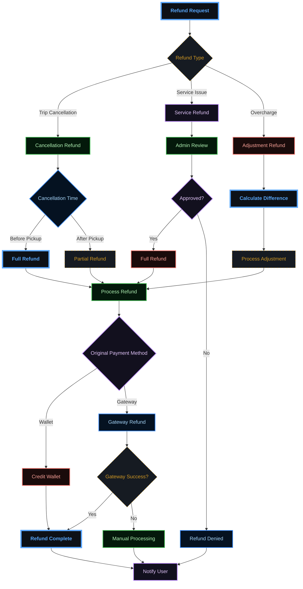

---

## ⭐ Rating & Review System

### **Post-Trip Rating Flow**

```mermaid
sequenceDiagram
    participant P as "Passenger"
    participant D as "Driver"
    participant A as "API"
    participant N as "Notification"
    
    Note over P,D: Trip Completed
    
    A ->> P: Request Rating
    A ->> D: Request Rating
    
    P ->> A: Submit Rating (1-5 stars + comment)
    A ->> A: Validate Rating
    A ->> A: Update Driver Average
    A ->> N: Notify Driver of Rating
    
    D ->> A: Submit Rating (1-5 stars + comment)
    A ->> A: Validate Rating
    A ->> A: Update Passenger Average
    A ->> N: Notify Passenger of Rating
    
    A ->> A: Check for Issues
    A ->> A: Update User Profiles

    %% --- DARK GRADIENT & GLOW STYLING ---
    
    %% Main Dashboard (Neon Cyan/Blue)
    classDef main fill:#0d1117,stroke:#58a6ff,stroke-width:4px,color:#58a6ff,font-weight:bold;
    
    %% Decision Diamond (Gold Glow)
    classDef decision fill:#161b22,stroke:#d29922,color:#d29922,stroke-dasharray: 5 5;
    
    %% Revenue (Emerald Gradient Style)
    classDef revNode fill:#04190b,stroke:#3fb950,color:#aff5b4,stroke-width:2px;
    
    %% Commission (Purple Gradient Style)
    classDef commNode fill:#12101e,stroke:#bc8cff,color:#e2c5ff,stroke-width:2px;
    
    %% Refund (Ruby Gradient Style)
    classDef refNode fill:#1a0b0b,stroke:#ff7b72,color:#ffa198,stroke-width:2px;
    
    %% Earnings (Sapphire Gradient Style)
    classDef earnNode fill:#051221,stroke:#388bfd,color:#a5d6ff,stroke-width:2px;

    class A main;
    class D decision;
    class N revNode;
    class P commNode;
```

### **Rating Impact System**

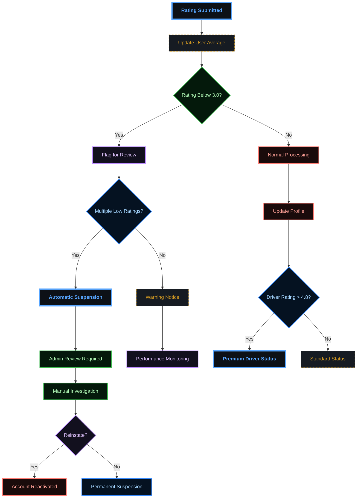

---

## 🛡️ Admin Management Processes

### **User Management Workflow**

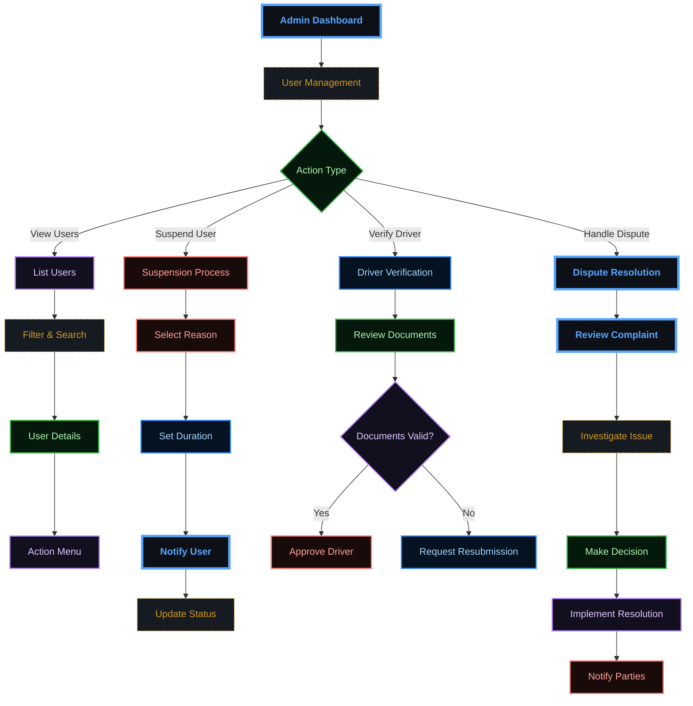

### **Financial Management**

```mermaid
%%{init: {'theme':'base', 'themeVariables': {'primaryColor':'#ff6b6b','primaryTextColor':'#fff','primaryBorderColor':'#ff6b6b','lineColor':'#ffa726','sectionBkgColor':'#ff6b6b','altSectionBkgColor':'#fff','gridColor':'#fff','secondaryColor':'#006100','tertiaryColor':'#fff'}}}%%
flowchart TD
    %% Node Definitions
    A[""Financial Dashboard""] --> B{""Report Type""}
    
    B --> |Revenue| C[""Revenue Analysis""]
    B --> |Commissions| D[""Commission Tracking""]
    B --> |Refunds| E[""Refund Management""]
    B --> |Driver Earnings| F[""Earnings Reports""]
    
    subgraph "RevenueFlow"["" ""]
        direction TB
        C --> G[""Select Period""]
        G --> H[""Visualizations""]
        H --> I[""Export CSV""]
    end
    
    subgraph "CommissionFlow"["" ""]
        direction TB
        D --> J[""Platform (15%)""]
        J --> K[""Driver (85%)""]
        K --> L[""Fee Logic""]
    end
    
    subgraph "RefundFlow"["" ""]
        direction TB
        E --> M[""Review""]
        M --> N[""Process""]
        N --> O[""Sync Logs""]
    end
    
    subgraph "EarningsFlow"["" ""]
        direction TB
        F --> P[""Top Earners""]
        P --> Q[""Metrics""]
        Q --> R[""Incentives""]
    end

    %% --- DARK GRADIENT & GLOW STYLING ---
    
    %% Main Dashboard (Neon Cyan/Blue)
    classDef main fill:#0d1117,stroke:#58a6ff,stroke-width:4px,color:#58a6ff,font-weight:bold;
    
    %% Decision Diamond (Gold Glow)
    classDef decision fill:#161b22,stroke:#d29922,color:#d29922,stroke-dasharray: 5 5;
    
    %% Revenue (Emerald Gradient Style)
    classDef revNode fill:#04190b,stroke:#3fb950,color:#aff5b4,stroke-width:2px;
    
    %% Commission (Purple Gradient Style)
    classDef commNode fill:#12101e,stroke:#bc8cff,color:#e2c5ff,stroke-width:2px;
    
    %% Refund (Ruby Gradient Style)
    classDef refNode fill:#1a0b0b,stroke:#ff7b72,color:#ffa198,stroke-width:2px;
    
    %% Earnings (Sapphire Gradient Style)
    classDef earnNode fill:#051221,stroke:#388bfd,color:#a5d6ff,stroke-width:2px;

    %% Applying Classes
    class A main;
    class B decision;
    class C,G,H,I revNode;
    class D,J,K,L commNode;
    class E,M,N,O refNode;
    class F,P,Q,R earnNode;

    %% Subgraph Blending
    style RevenueFlow fill:#0d1117,stroke:#3fb950,stroke-width:1px,stroke-dasharray: 2
    style CommissionFlow fill:#0d1117,stroke:#bc8cff,stroke-width:1px,stroke-dasharray: 2
    style RefundFlow fill:#0d1117,stroke:#ff7b72,stroke-width:1px,stroke-dasharray: 2
    style EarningsFlow fill:#0d1117,stroke:#388bfd,stroke-width:1px,stroke-dasharray: 2
```

### **System Monitoring**

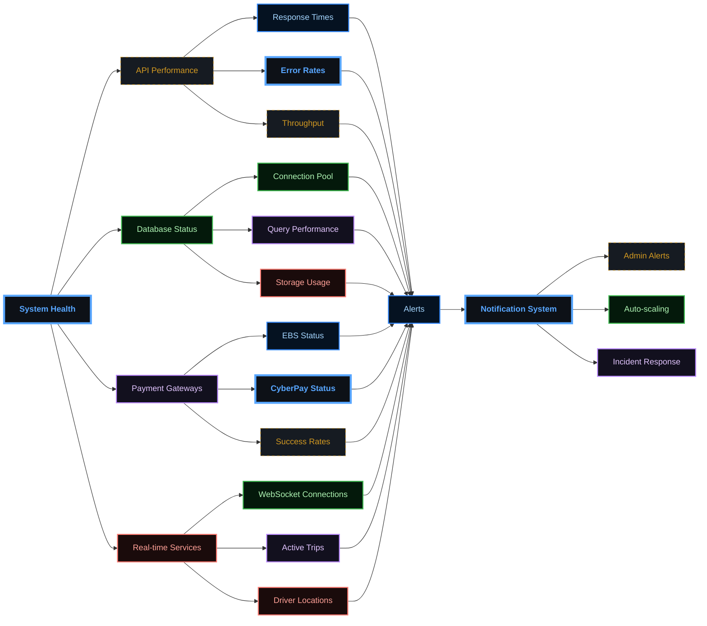

---

## 🚨 Emergency & Safety Procedures

### **Emergency Response System**

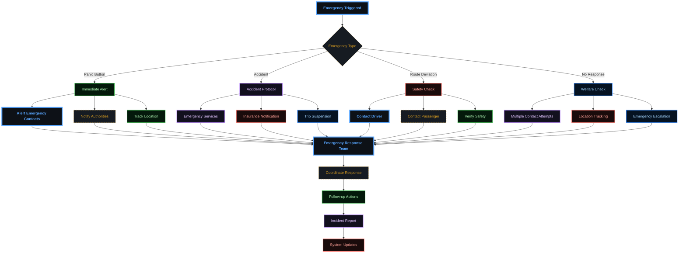

### **Safety Verification Process**

```mermaid
sequenceDiagram
    participant S as "System"
    participant D as "Driver"
    participant P as "Passenger"
    participant E as "Emergency Team"
    
    S ->> S: Monitor Trip Progress
    S ->> S: Detect Anomaly
    
    alt Route Deviation
        S ->> D: Route Verification Request
        D ->> S: Explanation/Confirmation
        S ->> P: Safety Check Notification
        P ->> S: Confirm Safety
    else No Response
        S ->> D: Welfare Check
        S ->> P: Welfare Check
        Note over S: Wait 2 minutes
        S ->> E: Escalate to Emergency Team
        E ->> S: Take Control
    else Panic Button
        S ->> E: Immediate Alert
        E ->> S: Emergency Response
        S ->> D: Emergency Notification
        S ->> P: Emergency Notification
    end
    
    S ->> S: Log Incident
    S ->> S: Update Safety Protocols

    %% --- DARK GRADIENT & GLOW STYLING ---
    
    %% Main Dashboard (Neon Cyan/Blue)
    classDef main fill:#0d1117,stroke:#58a6ff,stroke-width:4px,color:#58a6ff,font-weight:bold;
    
    %% Decision Diamond (Gold Glow)
    classDef decision fill:#161b22,stroke:#d29922,color:#d29922,stroke-dasharray: 5 5;
    
    %% Revenue (Emerald Gradient Style)
    classDef revNode fill:#04190b,stroke:#3fb950,color:#aff5b4,stroke-width:2px;
    
    %% Commission (Purple Gradient Style)
    classDef commNode fill:#12101e,stroke:#bc8cff,color:#e2c5ff,stroke-width:2px;
    
    %% Refund (Ruby Gradient Style)
    classDef refNode fill:#1a0b0b,stroke:#ff7b72,color:#ffa198,stroke-width:2px;
    
    %% Earnings (Sapphire Gradient Style)
    classDef earnNode fill:#051221,stroke:#388bfd,color:#a5d6ff,stroke-width:2px;

    class D main;
    class E decision;
    class P revNode;
    class S commNode;
```

---

## 📊 Key Performance Indicators (KPIs)

### **Business Metrics**
- **Trip Completion Rate**: Target 95%+
- **Average Response Time**: < 3 minutes
- **Customer Satisfaction**: 4.5+ stars average
- **Driver Utilization**: 70%+ active hours
- **Payment Success Rate**: 98%+

### **Operational Metrics**
- **App Crash Rate**: < 0.1%
- **API Response Time**: < 200ms average
- **System Uptime**: 99.9%+
- **Real-time Update Latency**: < 2 seconds
- **Support Resolution Time**: < 24 hours

### **Financial Metrics**
- **Revenue Growth**: Month-over-month tracking
- **Commission Collection**: 15% platform fee
- **Refund Rate**: < 2% of total transactions
- **Payment Gateway Fees**: Optimized routing
- **Driver Earnings**: 85% of trip fare

---

This comprehensive business process documentation ensures all stakeholders understand the complete user journeys and system workflows within the Sikka Transportation Platform.

