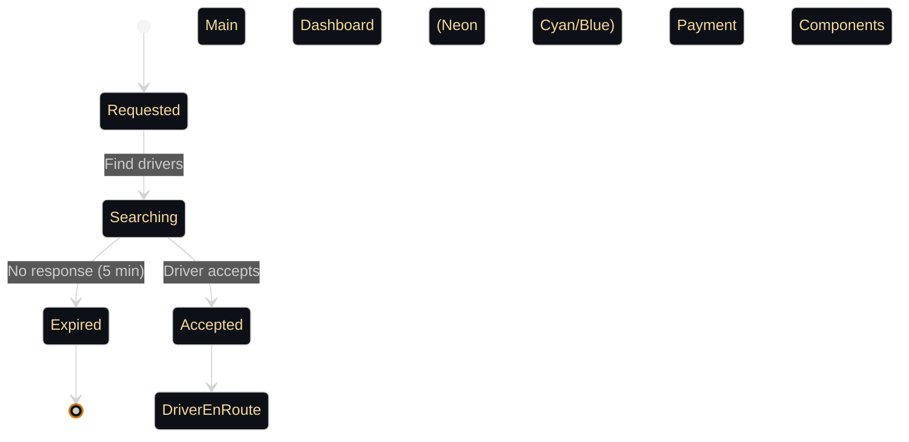
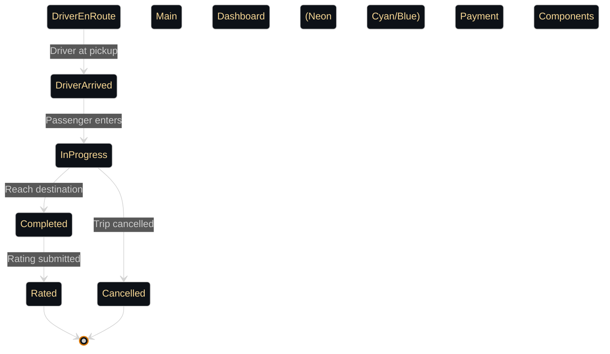
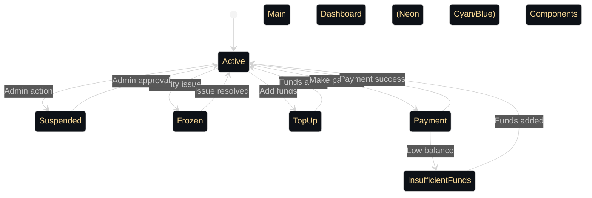

# 📋 Business Processes & User Journeys

This document outlines the key business processes and user journeys in the Sikka Transportation Platform, providing detailed workflows for all user types and system interactions.

## 📑 Table of Contents

- [🚗 Trip Booking Process](#-trip-booking-process)
- [👤 User Registration & Verification](#-user-registration--verification)
- [💳 Payment Processing Workflows](#-payment-processing-workflows)
- [⭐ Rating & Review System](#-rating--review-system)
- [🛡️ Admin Management Processes](#️-admin-management-processes)
- [🚨 Emergency & Safety Procedures](#-emergency--safety-procedures)

---

## 🚗 Trip Booking Process

### **Complete Trip Journey**

```mermaid
%%{init: {
  "theme": "dark",
  "themeVariables": {
    "primaryColor": "#0d1117",
    "primaryTextColor": "#f7d794",
    "primaryBorderColor": "#d97706",
    "lineColor": "#d97706",
    "secondaryColor": "#f59e0b",
    "tertiaryColor": "#fbbf24",
    "background": "#0d1117",
    "mainBkg": "#0d1117",
    "secondBkg": "#21262d"
  },
  "flowchart": {
    "useMaxWidth": true,
    "htmlLabels": true
  },
  "sequence": {
    "useMaxWidth": true,
    "wrap": true
  }
}}%%
flowchart TD
     Payment Components

    %% Financial Services

    %% Transaction Processing

    %% External Payment Gateways

    %% Success Transactions

    %% Decision Points

    %% Database Systems

    %% Node Classifications
    %% --- FINANCIAL GOLD THEME STYLING ---
    classDef payment fill:#0d1117,stroke:#d97706,stroke-width:4px,color:#f7d794,font-weight:bold;
    classDef financial fill:#0d1117,stroke:#f59e0b,stroke-width:3px,color:#f7d794,font-weight:normal;
    classDef transaction fill:#21262d,stroke:#d97706,stroke-width:2px,color:#f7d794,font-weight:normal;
    classDef gateway fill:#0d1117,stroke:#fbbf24,stroke-width:2px,color:#fbbf24,font-weight:normal,stroke-dasharray: 3 3;
    classDef success fill:#0d1117,stroke:#3fb950,stroke-width:3px,color:#3fb950,font-weight:bold;
    classDef decision fill:#0d1117,stroke:#d29922,stroke-width:3px,color:#d29922,font-weight:bold,stroke-dasharray: 8 4;
    classDef database fill:#0d1117,stroke:#fbbf24,stroke-width:4px,color:#fbbf24,font-weight:bold;
```

### **Detailed Trip States**

#### **1. Trip Request Phase**


#### **2. Trip Execution Phase**


### **Trip Cancellation Scenarios**

```mermaid
%%{init: {
  "theme": "dark",
  "themeVariables": {
    "primaryColor": "#0d1117",
    "primaryTextColor": "#aff5b4",
    "primaryBorderColor": "#238636",
    "lineColor": "#238636",
    "secondaryColor": "#2ea043",
    "tertiaryColor": "#3fb950",
    "background": "#0d1117",
    "mainBkg": "#0d1117",
    "secondBkg": "#21262d"
  },
  "flowchart": {
    "useMaxWidth": true,
    "htmlLabels": true
  },
  "sequence": {
    "useMaxWidth": true,
    "wrap": true
  }
}}%%
flowchart TD
    A["Trip Active"] --> B{"Who Cancels?"}

    B -->|Passenger| C["Passenger Cancellation"]
    B -->|Driver| D["Driver Cancellation"]
    B -->|System| E["System Cancellation"]

    C --> F{"Trip Status?"}
    F -->|Requested| G["Free Cancellation"]
    F -->|Accepted| H["Cancellation Fee"]
    F -->|In Progress| I["Full Fare Charge"]

    D --> J{"Valid Reason?"}
    J -->|Yes| K["No Penalty"]
    J -->|No| L["Driver Penalty"]

    E --> M["System Issues"]
    M --> N["Full Refund"]

    G --> O["Update Status"]
    H --> O
    I --> O
    K --> O
    L --> O
    N --> O
    O --> P["Notify All Parties"]
    P --> Q["End Process"]

    classDef primary fill:#0d1117,stroke:#238636,stroke-width:4px,color:#aff5b4,font-weight:bold
    classDef secondary fill:#0d1117,stroke:#2ea043,stroke-width:3px,color:#aff5b4,font-weight:normal
    classDef accent fill:#0d1117,stroke:#3fb950,stroke-width:2px,color:#3fb950,font-weight:bold
    classDef success fill:#0d1117,stroke:#238636,stroke-width:3px,color:#238636,font-weight:bold
    classDef warning fill:#0d1117,stroke:#d29922,stroke-width:3px,color:#d29922,font-weight:bold,stroke-dasharray:5 5
    classDef error fill:#0d1117,stroke:#da3633,stroke-width:3px,color:#da3633,font-weight:bold,stroke-dasharray:10 5
    classDef database fill:#0d1117,stroke:#3fb950,stroke-width:4px,color:#3fb950,font-weight:bold
    classDef process fill:#21262d,stroke:#238636,stroke-width:2px,color:#aff5b4,font-weight:normal
    classDef decision fill:#0d1117,stroke:#d29922,stroke-width:3px,color:#d29922,font-weight:bold,stroke-dasharray:8 4
    classDef external fill:#0d1117,stroke:#2ea043,stroke-width:2px,color:#2ea043,font-weight:normal,stroke-dasharray:3 3

    class A accent
    class B decision
    class C accent
    class D accent
    class E accent
    class F decision
    class G accent
    class H accent
    class I accent
    class J decision
    class K accent
    class L accent
    class M error
    class N accent
    class O process
    class P process
    class Q success

     Primary nodes (main components)

     Primary Business Components

    %% Secondary Business Components

    %% Process Steps

    %% Decision Points

    %% Success States

    %% External Systems

    %% Database Systems

    %% Node Classifications
    %% --- CORPORATE GREEN THEME STYLING ---
    classDef primary fill:#0d1117,stroke:#238636,stroke-width:4px,color:#aff5b4,font-weight:bold;
    classDef secondary fill:#0d1117,stroke:#2ea043,stroke-width:3px,color:#aff5b4,font-weight:normal;
    classDef process fill:#21262d,stroke:#238636,stroke-width:2px,color:#aff5b4,font-weight:normal;
    classDef decision fill:#0d1117,stroke:#d29922,stroke-width:3px,color:#d29922,font-weight:bold,stroke-dasharray: 8 4;
    classDef success fill:#0d1117,stroke:#238636,stroke-width:3px,color:#238636,font-weight:bold;
    classDef external fill:#0d1117,stroke:#2ea043,stroke-width:2px,color:#2ea043,font-weight:normal,stroke-dasharray: 3 3;
    classDef database fill:#0d1117,stroke:#3fb950,stroke-width:4px,color:#3fb950,font-weight:bold;
    %% Node Classifications
    class A,C,D,E,G,H,I,K,L,M,N,O,P,Q process;

```

---

## 👤 User Registration & Verification

### **Passenger Registration Flow**

```mermaid
%%{init: {
  "theme": "dark",
  "themeVariables": {
    "primaryColor": "#0d1117",
    "primaryTextColor": "#aff5b4",
    "primaryBorderColor": "#238636",
    "lineColor": "#238636",
    "secondaryColor": "#2ea043",
    "tertiaryColor": "#3fb950",
    "background": "#0d1117",
    "mainBkg": "#0d1117",
    "secondBkg": "#21262d"
  },
  "flowchart": {
    "useMaxWidth": true,
    "htmlLabels": true
  },
  "sequence": {
    "useMaxWidth": true,
    "wrap": true
  }
}}%%
graph TD
     Primary Business Components

    %% Secondary Business Components

    %% Process Steps

    %% Decision Points

    %% Success States

    %% External Systems

    %% Database Systems
    %% --- CORPORATE GREEN THEME STYLING ---
    classDef primary fill:#0d1117,stroke:#238636,stroke-width:4px,color:#aff5b4,font-weight:bold;
    classDef secondary fill:#0d1117,stroke:#2ea043,stroke-width:3px,color:#aff5b4,font-weight:normal;
    classDef process fill:#21262d,stroke:#238636,stroke-width:2px,color:#aff5b4,font-weight:normal;
    classDef decision fill:#0d1117,stroke:#d29922,stroke-width:3px,color:#d29922,font-weight:bold,stroke-dasharray: 8 4;
    classDef success fill:#0d1117,stroke:#238636,stroke-width:3px,color:#238636,font-weight:bold;
    classDef external fill:#0d1117,stroke:#2ea043,stroke-width:2px,color:#2ea043,font-weight:normal,stroke-dasharray: 3 3;
    classDef database fill:#0d1117,stroke:#3fb950,stroke-width:4px,color:#3fb950,font-weight:bold;
```

### **Driver Registration & Verification**

```mermaid
%%{init: {
  "theme": "dark",
  "themeVariables": {
    "primaryColor": "#0d1117",
    "primaryTextColor": "#aff5b4",
    "primaryBorderColor": "#238636",
    "lineColor": "#238636",
    "secondaryColor": "#2ea043",
    "tertiaryColor": "#3fb950",
    "background": "#0d1117",
    "mainBkg": "#0d1117",
    "secondBkg": "#21262d"
  },
  "flowchart": {
    "useMaxWidth": true,
    "htmlLabels": true
  },
  "sequence": {
    "useMaxWidth": true,
    "wrap": true
  }
}}%%
flowchart TD
    A["Driver Application"] --> B["Submit Personal Info"]
    B --> C["Upload Documents"]
    C --> D["Vehicle Information"]
    D --> E["Background Check"]
    E --> F{"Documents Valid?"}
    F -->|No| G["Request Corrections"]
    G --> C
    F -->|Yes| H["Admin Review"]
    H --> I{"Admin Approval?"}
    I -->|No| J["Rejection Notice"]
    J --> O["Appeal Process"]
    O --> H
    I -->|Yes| K["Account Activated"]
    K --> L["Driver Training"]
    L --> M["Platform Onboarding"]
    M --> N["Ready to Drive"]

    classDef decision fill:#0d1117,stroke:#d29922,stroke-width:3px,color:#d29922,font-weight:bold,stroke-dasharray:8 4
    classDef process fill:#21262d,stroke:#238636,stroke-width:2px,color:#aff5b4,font-weight:normal

    class A,F,I decision
    class B,C,D,E,G,H,J,K,L,M,N,O process

     Primary nodes (main components)

     Primary Business Components

    %% Secondary Business Components

    %% Process Steps

    %% Decision Points

    %% Success States

    %% External Systems

    %% Database Systems

    %% Node Classifications
    %% --- CORPORATE GREEN THEME STYLING ---
    classDef primary fill:#0d1117,stroke:#238636,stroke-width:4px,color:#aff5b4,font-weight:bold;
    classDef secondary fill:#0d1117,stroke:#2ea043,stroke-width:3px,color:#aff5b4,font-weight:normal;
    classDef process fill:#21262d,stroke:#238636,stroke-width:2px,color:#aff5b4,font-weight:normal;
    classDef decision fill:#0d1117,stroke:#d29922,stroke-width:3px,color:#d29922,font-weight:bold,stroke-dasharray: 8 4;
    classDef success fill:#0d1117,stroke:#238636,stroke-width:3px,color:#238636,font-weight:bold;
    classDef external fill:#0d1117,stroke:#2ea043,stroke-width:2px,color:#2ea043,font-weight:normal,stroke-dasharray: 3 3;
    classDef database fill:#0d1117,stroke:#3fb950,stroke-width:4px,color:#3fb950,font-weight:bold;
    %% Node Classifications
    class A,O primary;
    class B,C,D,E,G,H,J,K,L,M,N process;

```

### **Document Verification Process**

```mermaid
%%{init: {
  "theme": "dark",
  "themeVariables": {
    "primaryColor": "#0d1117",
    "primaryTextColor": "#aff5b4",
    "primaryBorderColor": "#238636",
    "lineColor": "#238636",
    "secondaryColor": "#2ea043",
    "tertiaryColor": "#3fb950",
    "background": "#0d1117",
    "mainBkg": "#0d1117",
    "secondBkg": "#21262d"
  },
  "flowchart": {
    "useMaxWidth": true,
    "htmlLabels": true
  },
  "sequence": {
    "useMaxWidth": true,
    "wrap": true
  }
}}%%
flowchart LR
    A["Driver Uploads"] --> B["Driving License"]
    A --> C["Vehicle Registration"]
    A --> D["Insurance Certificate"]
    A --> E["ID Card/Passport"]
    
    B --> F["OCR Extraction"]
    C --> F
    D --> F
    E --> F
    
    F --> G["Data Validation"]
    G --> H{"Auto-Verify?"}
    
    H -->|Yes| I["Approved"]
    H -->|No| J["Manual Review"]
    
    J --> K{"Admin Decision"}
    K -->|Approve| I
    K -->|Reject| L["Request Resubmission"]
    
    I --> M["Driver Activated"]
    L --> A

     --- CORPORATE GREEN THEME STYLING ---
    
     Primary Business Components

    %% Secondary Business Components

    %% Process Steps

    %% Decision Points

    %% Success States

    %% External Systems

    %% Database Systems

    %% Node Classifications
    %% --- CORPORATE GREEN THEME STYLING ---
    classDef primary fill:#0d1117,stroke:#238636,stroke-width:4px,color:#aff5b4,font-weight:bold;
    classDef secondary fill:#0d1117,stroke:#2ea043,stroke-width:3px,color:#aff5b4,font-weight:normal;
    classDef process fill:#21262d,stroke:#238636,stroke-width:2px,color:#aff5b4,font-weight:normal;
    classDef decision fill:#0d1117,stroke:#d29922,stroke-width:3px,color:#d29922,font-weight:bold,stroke-dasharray: 8 4;
    classDef success fill:#0d1117,stroke:#238636,stroke-width:3px,color:#238636,font-weight:bold;
    classDef external fill:#0d1117,stroke:#2ea043,stroke-width:2px,color:#2ea043,font-weight:normal,stroke-dasharray: 3 3;
    classDef database fill:#0d1117,stroke:#3fb950,stroke-width:4px,color:#3fb950,font-weight:bold;
    %% Node Classifications
    class A,B,C,D,E,F,G,J,L,M process;
    class I primary;

```

---

## 💳 Payment Processing Workflows

### **Multi-Gateway Payment Flow**

```mermaid
%%{init: {
  "theme": "dark",
  "themeVariables": {
    "primaryColor": "#0d1117",
    "primaryTextColor": "#f7d794",
    "primaryBorderColor": "#d97706",
    "lineColor": "#d97706",
    "secondaryColor": "#f59e0b",
    "tertiaryColor": "#fbbf24",
    "background": "#0d1117",
    "mainBkg": "#0d1117",
    "secondBkg": "#21262d"
  },
  "flowchart": {
    "useMaxWidth": true,
    "htmlLabels": true
  },
  "sequence": {
    "useMaxWidth": true,
    "wrap": true
  }
}}%%
flowchart TD
    subgraph Initialization ["🏁 Trip Conclusion"]
        A["Trip Completed"] --> B["Calculate Fare"]
        B --> C["Select Payment Method"]
    end

    C --> D{"Payment Type"}

    subgraph Internal ["🏦 Internal Wallet"]
        D ---->|Wallet| E["Wallet Payment"]
        E --> I["Check Balance"]
        I --> J{"Sufficient?"}
        J -->|No| L["Insufficient Funds"]
        J -->|Yes| K["Deduct Amount"]
    end

    subgraph External ["🌐 External Gateways"]
        D ---->|EBS| F["EBS Gateway"]
        D ---->|CyberPay| G["CyberPay Gateway"]
        F --> M["EBS Processing"]
        G --> N["CyberPay Processing"]
        M --> O{"EBS Success?"}
        N --> P{"CyberPay Success?"}
    end

    subgraph Manual ["💵 Manual"]
        D ---->|Cash| H["Cash Payment"]
        H --> T["Driver Confirms"]
    end

     Payment Components

    %% Financial Services

    %% Transaction Processing

    %% External Payment Gateways

    %% Success Transactions

    %% Decision Points

    %% Database Systems

    %% Node Classifications
    %% --- FINANCIAL GOLD THEME STYLING ---
    classDef payment fill:#0d1117,stroke:#d97706,stroke-width:4px,color:#f7d794,font-weight:bold;
    classDef financial fill:#0d1117,stroke:#f59e0b,stroke-width:3px,color:#f7d794,font-weight:normal;
    classDef transaction fill:#21262d,stroke:#d97706,stroke-width:2px,color:#f7d794,font-weight:normal;
    classDef gateway fill:#0d1117,stroke:#fbbf24,stroke-width:2px,color:#fbbf24,font-weight:normal,stroke-dasharray: 3 3;
    classDef success fill:#0d1117,stroke:#3fb950,stroke-width:3px,color:#3fb950,font-weight:bold;
    classDef decision fill:#0d1117,stroke:#d29922,stroke-width:3px,color:#d29922,font-weight:bold,stroke-dasharray: 8 4;
    classDef database fill:#0d1117,stroke:#fbbf24,stroke-width:4px,color:#fbbf24,font-weight:bold;
    %% Node Classifications
    class A,B,I,L,K,T process;
    class C,E,H payment;
    class F,G,M,N gateway;

```

### **Wallet Management System**



### **Refund Processing**

```mermaid
%%{init: {
  "theme": "dark",
  "themeVariables": {
    "primaryColor": "#0d1117",
    "primaryTextColor": "#f7d794",
    "primaryBorderColor": "#d97706",
    "lineColor": "#d97706",
    "secondaryColor": "#f59e0b",
    "tertiaryColor": "#fbbf24",
    "background": "#0d1117",
    "mainBkg": "#0d1117",
    "secondBkg": "#21262d"
  },
  "flowchart": {
    "useMaxWidth": true,
    "htmlLabels": true
  },
  "sequence": {
    "useMaxWidth": true,
    "wrap": true
  }
}}%%
flowchart TD
     Primary nodes (main components)

     Payment Components

    %% Financial Services

    %% Transaction Processing

    %% External Payment Gateways

    %% Success Transactions

    %% Decision Points

    %% Database Systems

    %% Node Classifications
    %% --- FINANCIAL GOLD THEME STYLING ---
    classDef payment fill:#0d1117,stroke:#d97706,stroke-width:4px,color:#f7d794,font-weight:bold;
    classDef financial fill:#0d1117,stroke:#f59e0b,stroke-width:3px,color:#f7d794,font-weight:normal;
    classDef transaction fill:#21262d,stroke:#d97706,stroke-width:2px,color:#f7d794,font-weight:normal;
    classDef gateway fill:#0d1117,stroke:#fbbf24,stroke-width:2px,color:#fbbf24,font-weight:normal,stroke-dasharray: 3 3;
    classDef success fill:#0d1117,stroke:#3fb950,stroke-width:3px,color:#3fb950,font-weight:bold;
    classDef decision fill:#0d1117,stroke:#d29922,stroke-width:3px,color:#d29922,font-weight:bold,stroke-dasharray: 8 4;
    classDef database fill:#0d1117,stroke:#fbbf24,stroke-width:4px,color:#fbbf24,font-weight:bold;
```

---

## ⭐ Rating & Review System

### **Post-Trip Rating Flow**

```mermaid
%%{init: {
  "theme": "dark",
  "themeVariables": {
    "primaryColor": "#0d1117",
    "primaryTextColor": "#f7d794",
    "primaryBorderColor": "#d97706",
    "lineColor": "#d97706",
    "secondaryColor": "#f59e0b",
    "tertiaryColor": "#fbbf24",
    "background": "#0d1117",
    "mainBkg": "#0d1117",
    "secondBkg": "#21262d"
  },
  "flowchart": {
    "useMaxWidth": true,
    "htmlLabels": true
  },
  "sequence": {
    "useMaxWidth": true,
    "wrap": true
  }
}}%%
sequenceDiagram
    participant P as "Passenger"
    participant D as "Driver"
    participant A as "API"
    participant N as "Notification"
    
    Note over P,D: Trip Completed
    
    A->>P: Request Rating
    A->>D: Request Rating
    
    P->>A: Submit Rating (1-5 stars + comment)
    A->>A: Validate Rating
    A->>A: Update Driver Average
    A->>N: Notify Driver of Rating
    
    D->>A: Submit Rating (1-5 stars + comment)
    A->>A: Validate Rating
    A->>A: Update Passenger Average
    A->>N: Notify Passenger of Rating
    
    A->>A: Check for Issues
    A->>A: Update User Profiles

      Main Dashboard (Neon Cyan/Blue)

     Payment Components

    %% Financial Services

    %% Transaction Processing

    %% External Payment Gateways

    %% Success Transactions

    %% Decision Points

    %% Database Systems
    %% --- FINANCIAL GOLD THEME STYLING ---
    classDef payment fill:#0d1117,stroke:#d97706,stroke-width:4px,color:#f7d794,font-weight:bold;
    classDef financial fill:#0d1117,stroke:#f59e0b,stroke-width:3px,color:#f7d794,font-weight:normal;
    classDef transaction fill:#21262d,stroke:#d97706,stroke-width:2px,color:#f7d794,font-weight:normal;
    classDef gateway fill:#0d1117,stroke:#fbbf24,stroke-width:2px,color:#fbbf24,font-weight:normal,stroke-dasharray: 3 3;
    classDef success fill:#0d1117,stroke:#3fb950,stroke-width:3px,color:#3fb950,font-weight:bold;
    classDef decision fill:#0d1117,stroke:#d29922,stroke-width:3px,color:#d29922,font-weight:bold,stroke-dasharray: 8 4;
    classDef database fill:#0d1117,stroke:#fbbf24,stroke-width:4px,color:#fbbf24,font-weight:bold;
```

### **Rating Impact System**

```mermaid
%%{init: {
  "theme": "dark",
  "themeVariables": {
    "primaryColor": "#0d1117",
    "primaryTextColor": "#f7d794",
    "primaryBorderColor": "#d97706",
    "lineColor": "#d97706",
    "secondaryColor": "#f59e0b",
    "tertiaryColor": "#fbbf24",
    "background": "#0d1117",
    "mainBkg": "#0d1117",
    "secondBkg": "#21262d"
  },
  "flowchart": {
    "useMaxWidth": true,
    "htmlLabels": true
  },
  "sequence": {
    "useMaxWidth": true,
    "wrap": true
  }
}}%%
flowchart TD
    A["Rating Submitted"] --> B["Update User Average"]
    B --> C {"Rating Below 3.0?"}
    
    C --> |Yes| D["Flag for Review"]
    C --> |No| E["Normal Processing"]
    
    D --> F {"Multiple Low Ratings?"}
    F --> |Yes| G["Automatic Suspension"]
    F --> |No| H["Warning Notice"]
    
    G --> I["Admin Review Required"]
    H --> J["Performance Monitoring"]
    
    E --> K["Update Profile"]
    K --> L {"Driver Rating > 4.8?"}
    L --> |Yes| M["Premium Driver Status"]
    L --> |No| N["Standard Status"]
    
    I --> O["Manual Investigation"]
    O --> P {"Reinstate?"}
    P --> |Yes| Q["Account Reactivated"]
    P --> |No| R["Permanent Suspension"]

      Main Dashboard (Neon Cyan/Blue)

     Payment Components

    %% Financial Services

    %% Transaction Processing

    %% External Payment Gateways

    %% Success Transactions

    %% Decision Points

    %% Database Systems

    %% Node Classifications
    %% --- FINANCIAL GOLD THEME STYLING ---
    classDef payment fill:#0d1117,stroke:#d97706,stroke-width:4px,color:#f7d794,font-weight:bold;
    classDef financial fill:#0d1117,stroke:#f59e0b,stroke-width:3px,color:#f7d794,font-weight:normal;
    classDef transaction fill:#21262d,stroke:#d97706,stroke-width:2px,color:#f7d794,font-weight:normal;
    classDef gateway fill:#0d1117,stroke:#fbbf24,stroke-width:2px,color:#fbbf24,font-weight:normal,stroke-dasharray: 3 3;
    classDef success fill:#0d1117,stroke:#3fb950,stroke-width:3px,color:#3fb950,font-weight:bold;
    classDef decision fill:#0d1117,stroke:#d29922,stroke-width:3px,color:#d29922,font-weight:bold,stroke-dasharray: 8 4;
    classDef database fill:#0d1117,stroke:#fbbf24,stroke-width:4px,color:#fbbf24,font-weight:bold;
    %% Node Classifications
    class A,D,E,G,H,I,J,K,M,N,O,Q,R process;
    class B secondary;

```

---

## 🛡️ Admin Management Processes

### **User Management Workflow**

```mermaid
%%{init: {
  "theme": "dark",
  "themeVariables": {
    "primaryColor": "#0d1117",
    "primaryTextColor": "#aff5b4",
    "primaryBorderColor": "#238636",
    "lineColor": "#238636",
    "secondaryColor": "#2ea043",
    "tertiaryColor": "#3fb950",
    "background": "#0d1117",
    "mainBkg": "#0d1117",
    "secondBkg": "#21262d"
  },
  "flowchart": {
    "useMaxWidth": true,
    "htmlLabels": true
  },
  "sequence": {
    "useMaxWidth": true,
    "wrap": true
  }
}}%%
flowchart TD
     Primary Business Components

    %% Secondary Business Components

    %% Process Steps

    %% Decision Points

    %% Success States

    %% External Systems

    %% Database Systems

    %% Node Classifications
    %% --- CORPORATE GREEN THEME STYLING ---
    classDef primary fill:#0d1117,stroke:#238636,stroke-width:4px,color:#aff5b4,font-weight:bold;
    classDef secondary fill:#0d1117,stroke:#2ea043,stroke-width:3px,color:#aff5b4,font-weight:normal;
    classDef process fill:#21262d,stroke:#238636,stroke-width:2px,color:#aff5b4,font-weight:normal;
    classDef decision fill:#0d1117,stroke:#d29922,stroke-width:3px,color:#d29922,font-weight:bold,stroke-dasharray: 8 4;
    classDef success fill:#0d1117,stroke:#238636,stroke-width:3px,color:#238636,font-weight:bold;
    classDef external fill:#0d1117,stroke:#2ea043,stroke-width:2px,color:#2ea043,font-weight:normal,stroke-dasharray: 3 3;
    classDef database fill:#0d1117,stroke:#3fb950,stroke-width:4px,color:#3fb950,font-weight:bold;
```

### **Financial Management**

```mermaid
%%{init: {
  "theme": "dark",
  "themeVariables": {
    "primaryColor": "#0d1117",
    "primaryTextColor": "#f7d794",
    "primaryBorderColor": "#d97706",
    "lineColor": "#d97706",
    "secondaryColor": "#f59e0b",
    "tertiaryColor": "#fbbf24",
    "background": "#0d1117",
    "mainBkg": "#0d1117",
    "secondBkg": "#21262d"
  },
  "flowchart": {
    "useMaxWidth": true,
    "htmlLabels": true
  },
  "sequence": {
    "useMaxWidth": true,
    "wrap": true
  }
}}%%
flowchart TD
     Payment Components

    %% Financial Services

    %% Transaction Processing

    %% External Payment Gateways

    %% Success Transactions

    %% Decision Points

    %% Database Systems

    %% Node Classifications
    %% --- FINANCIAL GOLD THEME STYLING ---
    classDef payment fill:#0d1117,stroke:#d97706,stroke-width:4px,color:#f7d794,font-weight:bold;
    classDef financial fill:#0d1117,stroke:#f59e0b,stroke-width:3px,color:#f7d794,font-weight:normal;
    classDef transaction fill:#21262d,stroke:#d97706,stroke-width:2px,color:#f7d794,font-weight:normal;
    classDef gateway fill:#0d1117,stroke:#fbbf24,stroke-width:2px,color:#fbbf24,font-weight:normal,stroke-dasharray: 3 3;
    classDef success fill:#0d1117,stroke:#3fb950,stroke-width:3px,color:#3fb950,font-weight:bold;
    classDef decision fill:#0d1117,stroke:#d29922,stroke-width:3px,color:#d29922,font-weight:bold,stroke-dasharray: 8 4;
    classDef database fill:#0d1117,stroke:#fbbf24,stroke-width:4px,color:#fbbf24,font-weight:bold;
```

### **System Monitoring**

```mermaid
%%{init: {
  "theme": "dark",
  "themeVariables": {
    "primaryColor": "#0d1117",
    "primaryTextColor": "#f7d794",
    "primaryBorderColor": "#d97706",
    "lineColor": "#d97706",
    "secondaryColor": "#f59e0b",
    "tertiaryColor": "#fbbf24",
    "background": "#0d1117",
    "mainBkg": "#0d1117",
    "secondBkg": "#21262d"
  },
  "flowchart": {
    "useMaxWidth": true,
    "htmlLabels": true
  },
  "sequence": {
    "useMaxWidth": true,
    "wrap": true
  }
}}%%
flowchart LR
    A["System Health"] --> B["API Performance"]
    A --> C["Database Status"]
    A --> D["Payment Gateways"]
    A --> E["Real-time Services"]
    
    B --> F["Response Times"]
    B --> G["Error Rates"]
    B --> H["Throughput"]
    
    C --> I["Connection Pool"]
    C --> J["Query Performance"]
    C --> K["Storage Usage"]
    
    D --> L["EBS Status"]
    D --> M["CyberPay Status"]
    D --> N["Success Rates"]
    
    E --> O["WebSocket Connections"]
    E --> P["Active Trips"]
    E --> Q["Driver Locations"]
    
    F --> R["Alerts"]
    G --> R
    H --> R
    I --> R
    J --> R
    K --> R
    L --> R
    M --> R
    N --> R
    O --> R
    P --> R
    Q --> R
    
    R --> S["Notification System"]
    S --> T["Admin Alerts"]
    S --> U["Auto-scaling"]
    S --> V["Incident Response"]

      Main Dashboard (Neon Cyan/Blue)

     Payment Components

    %% Financial Services

    %% Transaction Processing

    %% External Payment Gateways

    %% Success Transactions

    %% Decision Points

    %% Database Systems

    %% Node Classifications
    %% --- FINANCIAL GOLD THEME STYLING ---
    classDef payment fill:#0d1117,stroke:#d97706,stroke-width:4px,color:#f7d794,font-weight:bold;
    classDef financial fill:#0d1117,stroke:#f59e0b,stroke-width:3px,color:#f7d794,font-weight:normal;
    classDef transaction fill:#21262d,stroke:#d97706,stroke-width:2px,color:#f7d794,font-weight:normal;
    classDef gateway fill:#0d1117,stroke:#fbbf24,stroke-width:2px,color:#fbbf24,font-weight:normal,stroke-dasharray: 3 3;
    classDef success fill:#0d1117,stroke:#3fb950,stroke-width:3px,color:#3fb950,font-weight:bold;
    classDef decision fill:#0d1117,stroke:#d29922,stroke-width:3px,color:#d29922,font-weight:bold,stroke-dasharray: 8 4;
    classDef database fill:#0d1117,stroke:#fbbf24,stroke-width:4px,color:#fbbf24,font-weight:bold;
    %% Node Classifications
    class A,B,F,G,H,I,J,K,N,P,Q,R,S,T,U,V process;
    class C database;
    class D payment;
    class E secondary;
    class L,M,O gateway;

```

---

## 🚨 Emergency & Safety Procedures

### **Emergency Response System**

```mermaid
%%{init: {
  "theme": "dark",
  "themeVariables": {
    "primaryColor": "#0d1117",
    "primaryTextColor": "#aff5b4",
    "primaryBorderColor": "#238636",
    "lineColor": "#238636",
    "secondaryColor": "#2ea043",
    "tertiaryColor": "#3fb950",
    "background": "#0d1117",
    "mainBkg": "#0d1117",
    "secondBkg": "#21262d"
  },
  "flowchart": {
    "useMaxWidth": true,
    "htmlLabels": true
  },
  "sequence": {
    "useMaxWidth": true,
    "wrap": true
  }
}}%%
flowchart TD
    A([🚨 Emergency Triggered]) --> B{Categorize Type}
    
    B -- Panic Button --> C[[⚡ Immediate Alert]]
    B -- Crash Detected --> D[[🚑 Accident Protocol]]
    B -- Off-Route --> E[[📍 Safety Check]]
    B -- Silent --> F[[🔍 Welfare Check]]
    
    C --> G[Notify Emergency Contacts]
    C --> H[Dispatch Authorities]
    C --> I[Real-time GPS Tracking]
    
    D --> J[First Responders]
    D --> K[Insurance Notification]
    D --> L[Trip Suspension]
    
    E --> M[Driver Verification]
    E --> N[Passenger Verification]
    
    F --> P[Contact Attempts]
    F --> R[Emergency Escalation]
    
    G & H & I & J & K & L & M & N & P & R --> S[🛡️ Emergency Response Team]
    
    S --> T[Coordinate Response]
    T --> U[Incident Forensics]
    U --> V[Final Incident Report]
    V --> W[(System Optimization)]

    classDef critical fill:#da3633,stroke:#f85149,stroke-width:2px,color:#ffffff
    classDef warning fill:#d29922,stroke:#e3b341,stroke-width:2px,color:#0d1117
    classDef action fill:#238636,stroke:#3fb950,stroke-width:2px,color:#ffffff
    classDef trigger fill:#1f6feb,stroke:#58a6ff,stroke-width:4px,color:#ffffff

    class A trigger
    class B warning
    class C,D,G,H,J critical
    class S,T,U,V action

     Primary nodes (main components)

     Primary Business Components

    %% Secondary Business Components

    %% Process Steps

    %% Decision Points

    %% Success States

    %% External Systems

    %% Database Systems
    %% --- CORPORATE GREEN THEME STYLING ---
    classDef primary fill:#0d1117,stroke:#238636,stroke-width:4px,color:#aff5b4,font-weight:bold;
    classDef secondary fill:#0d1117,stroke:#2ea043,stroke-width:3px,color:#aff5b4,font-weight:normal;
    classDef process fill:#21262d,stroke:#238636,stroke-width:2px,color:#aff5b4,font-weight:normal;
    classDef decision fill:#0d1117,stroke:#d29922,stroke-width:3px,color:#d29922,font-weight:bold,stroke-dasharray: 8 4;
    classDef success fill:#0d1117,stroke:#238636,stroke-width:3px,color:#238636,font-weight:bold;
    classDef external fill:#0d1117,stroke:#2ea043,stroke-width:2px,color:#2ea043,font-weight:normal,stroke-dasharray: 3 3;
    classDef database fill:#0d1117,stroke:#3fb950,stroke-width:4px,color:#3fb950,font-weight:bold;
```

### **Safety Verification Process**

```mermaid
%%{init: {
  "theme": "dark",
  "themeVariables": {
    "primaryColor": "#0d1117",
    "primaryTextColor": "#aff5b4",
    "primaryBorderColor": "#238636",
    "lineColor": "#238636",
    "secondaryColor": "#2ea043",
    "tertiaryColor": "#3fb950",
    "background": "#0d1117",
    "mainBkg": "#0d1117",
    "secondBkg": "#21262d"
  },
  "flowchart": {
    "useMaxWidth": true,
    "htmlLabels": true
  },
  "sequence": {
    "useMaxWidth": true,
    "wrap": true
  }
}}%%
sequenceDiagram
    autonumber
    participant S as 🤖 SYSTEM
    participant D as 🚗 DRIVER
    participant P as 📱 PASSENGER
    participant E as 🛡️ EMERGENCY TEAM

    Note over S: 🛰️ Continuous Trip Telemetry
    S->>S: Anomaly Detected

    alt 📍 Route Deviation (Minor)
        S->>D: Verification Request
        D-->>S: Confirmation/Explanation
        S->>P: "Are you safe?" Notification
        P-->>S: Safe Confirmation
    else ⏳ No Response (High Priority)
        rect rgb(40, 35, 10)
            Note right of S: Escalation Protocol Alpha
            S->>D: Welfare Check Call
            S->>P: Welfare Check Call
            Note over S: ⏱️ 120s Grace Period
            S->>E: ⚠️ SIGNAL LOSS: Escalate
            E->>S: Deploy Remote Monitoring
        end
    else 🚨 Panic Button (Immediate Action)
        rect rgb(60, 10, 10)
            Note right of S: Critical Protocol Omega
            S->>E: 🔥 EMERGENCY ALERT
            E->>S: Handover: Remote Control
            S->>D: Law Enforcement Notified
            S->>P: Help is En-Route
        end
    end

    S->>S: 💾 Immutable Incident Log
    S->>S: 🔄 Update Safety Neural Weights

     Primary nodes (main components)

     Primary Business Components

    %% Secondary Business Components

    %% Process Steps

    %% Decision Points

    %% Success States

    %% External Systems

    %% Database Systems
    %% --- CORPORATE GREEN THEME STYLING ---
    classDef primary fill:#0d1117,stroke:#238636,stroke-width:4px,color:#aff5b4,font-weight:bold;
    classDef secondary fill:#0d1117,stroke:#2ea043,stroke-width:3px,color:#aff5b4,font-weight:normal;
    classDef process fill:#21262d,stroke:#238636,stroke-width:2px,color:#aff5b4,font-weight:normal;
    classDef decision fill:#0d1117,stroke:#d29922,stroke-width:3px,color:#d29922,font-weight:bold,stroke-dasharray: 8 4;
    classDef success fill:#0d1117,stroke:#238636,stroke-width:3px,color:#238636,font-weight:bold;
    classDef external fill:#0d1117,stroke:#2ea043,stroke-width:2px,color:#2ea043,font-weight:normal,stroke-dasharray: 3 3;
    classDef database fill:#0d1117,stroke:#3fb950,stroke-width:4px,color:#3fb950,font-weight:bold;
```

---

## 📊 Key Performance Indicators (KPIs)

### **Business Metrics**
- **Trip Completion Rate**: Target 95%+
- **Average Response Time**: < 3 minutes
- **Customer Satisfaction**: 4.5+ stars average
- **Driver Utilization**: 70%+ active hours
- **Payment Success Rate**: 98%+

### **Operational Metrics**
- **App Crash Rate**: < 0.1%
- **API Response Time**: < 200ms average
- **System Uptime**: 99.9%+
- **Real-time Update Latency**: < 2 seconds
- **Support Resolution Time**: < 24 hours

### **Financial Metrics**
- **Revenue Growth**: Month-over-month tracking
- **Commission Collection**: 15% platform fee
- **Refund Rate**: < 2% of total transactions
- **Payment Gateway Fees**: Optimized routing
- **Driver Earnings**: 85% of trip fare

---

This comprehensive business process documentation ensures all stakeholders understand the complete user journeys and system workflows within the Sikka Transportation Platform.

