# 📋 Business Processes & User Journeys

This document outlines the key business processes and user journeys in the Sikka Transportation Platform, providing detailed workflows for all user types and system interactions.

## 📑 Table of Contents

- [🚗 Trip Booking Process](#-trip-booking-process)
- [👤 User Registration & Verification](#-user-registration--verification)
- [💳 Payment Processing Workflows](#-payment-processing-workflows)
- [⭐ Rating & Review System](#-rating--review-system)
- [🛡️ Admin Management Processes](#️-admin-management-processes)
- [🚨 Emergency & Safety Procedures](#-emergency--safety-procedures)

---

## 🚗 Trip Booking Process

### **Complete Trip Journey**

```mermaid
%%{init: {
  'theme': 'base',
  'themeVariables': {
    'primaryColor': '#FF6F00',
    'primaryTextColor': '#ffffff',
    'primaryBorderColor': '#E65100',
    'lineColor': '#FF8F00',
    'secondaryColor': '#FFA726',
    'tertiaryColor': '#FFE0B2',
    'background': '#ffffff',
    'mainBkg': '#FF6F00',
    'secondBkg': '#FFA726',
    'tertiaryBkg': '#FFE0B2'
  }
}}%%

flowchart TD
    %% Phase 1: Setup
    subgraph "📱 Trip Setup"
        A[📱 Passenger Opens App<br/>🔐 Location Permission]
        B[📍 Enter Destination<br/>🗺️ Address/Map Selection]
        C[🚗 Select Trip Type<br/>⭐ Standard/Premium/Shared]
    end

    %% Phase 2: Booking
    subgraph "💰 Booking & Pricing"
        D[💵 View Fare Estimate<br/>📏 Distance + Time Calculation]
        E[✅ Confirm Booking<br/>💳 Payment Method Selection]
        F[🔍 Find Available Drivers<br/>📡 Radius-based Search]
        G{🚗 Driver Available?<br/>📍 Within 5km Radius}
    end

    %% Phase 3: Matching
    subgraph "🎯 Driver Matching"
        I[📤 Send Trip Request<br/>🔔 Push Notification to Driver]
        J{✋ Driver Accepts?<br/>⏰ 30 Second Timeout}
        K[⏭️ Try Next Driver<br/>🔄 Closest Available]
        L[🎉 Trip Assigned<br/>👤 Driver Details Shared]
    end

    %% Phase 4: Transit
    subgraph "🚗 Trip Execution"
        M[🧭 Driver Navigates to Pickup<br/>🛣️ GPS Navigation Active]
        N[📍 Driver Arrives<br/>📱 Passenger Notification]
        O[🚪 Passenger Enters Vehicle<br/>✅ Trip Verification]
        P[🚀 Trip Starts<br/>📊 Real-time Tracking]
        Q[🗺️ Navigate to Destination<br/>⚡ Optimal Route]
    end

    %% Phase 5: Conclusion
    subgraph "✅ Trip Completion"
        R[🏁 Trip Completed<br/>📍 Arrival Confirmation]
        S[💳 Process Payment<br/>🔄 Automatic Deduction]
        T[⭐ Rate & Review<br/>📝 5-Star Rating System]
        U[🎊 Trip Finished<br/>📧 Receipt Generated]
    end

    %% Error Handling
    H[❌ Notify: No Drivers<br/>💡 Suggest Alternative Times]

    %% Connections
    A --> B --> C --> D --> E --> F --> G
    G -->|✅ Yes| I
    G -->|❌ No| H
    I --> J
    J -->|❌ No| K --> J
    J -->|✅ Yes| L --> M --> N --> O --> P --> Q --> R --> S --> T --> U

    %% Eye-catching Business Process Styling
    classDef setupPhase fill:#FF6F00,stroke:#E65100,stroke-width:4px,color:#ffffff,font-weight:bold
    classDef bookingPhase fill:#FFA726,stroke:#FF8F00,stroke-width:4px,color:#ffffff,font-weight:bold
    classDef matchingPhase fill:#FFB74D,stroke:#FF9800,stroke-width:4px,color:#ffffff,font-weight:bold
    classDef transitPhase fill:#FFCC02,stroke:#FFC107,stroke-width:4px,color:#ffffff,font-weight:bold
    classDef completionPhase fill:#4CAF50,stroke:#388E3C,stroke-width:4px,color:#ffffff,font-weight:bold
    classDef decisionNode fill:#2196F3,stroke:#1976D2,stroke-width:5px,color:#ffffff,font-weight:bold,stroke-dasharray: 8 4
    classDef errorNode fill:#F44336,stroke:#D32F2F,stroke-width:3px,color:#ffffff,font-weight:bold

    class A,B,C setupPhase
    class D,E,F bookingPhase
    class I,K,L matchingPhase
    class M,N,O,P,Q transitPhase
    class R,S,T,U completionPhase
    class G,J decisionNode
    class H errorNode
```



### **Detailed Trip States**

#### **1. Trip Request Phase**

```mermaid
%%{init: {
  'theme': 'base',
  'themeVariables': {
    'primaryColor': '#FF6F00',
    'primaryTextColor': '#ffffff',
    'primaryBorderColor': '#E65100',
    'lineColor': '#FF8F00',
    'secondaryColor': '#FFA726',
    'tertiaryColor': '#FFE0B2',
    'background': '#ffffff',
    'mainBkg': '#FF6F00',
    'secondBkg': '#FFA726',
    'tertiaryBkg': '#FFE0B2'
  }
}}%%

stateDiagram-v2
    [*] --> Requested : 📱 Trip Request Submitted
    Requested --> Searching : 🔍 Finding Available Drivers
    Searching --> Expired : ⏰ No Response (5 min timeout)
    Searching --> Accepted : ✅ Driver Accepts Request
    Expired --> [*] : ❌ Request Cancelled
    Accepted --> DriverEnRoute : 🚗 Driver Heading to Pickup
    DriverEnRoute --> DriverArrived : 📍 Driver at Pickup Location
    DriverArrived --> TripStarted : 🚀 Passenger Enters Vehicle
    TripStarted --> TripCompleted : 🏁 Arrived at Destination
    TripCompleted --> [*] : ✅ Trip Successfully Completed

    %% Eye-catching Business Process State Styling
    classDef activeState fill:#FF6F00,stroke:#E65100,stroke-width:4px,color:#ffffff,font-weight:bold
    classDef waitingState fill:#FFA726,stroke:#FF8F00,stroke-width:3px,color:#ffffff,font-weight:bold
    classDef errorState fill:#F44336,stroke:#D32F2F,stroke-width:3px,color:#ffffff,font-weight:bold
    classDef finalState fill:#4CAF50,stroke:#388E3C,stroke-width:4px,color:#ffffff,font-weight:bold

    class Requested,Accepted,TripStarted activeState
    class Searching,DriverEnRoute,DriverArrived waitingState
    class Expired errorState
    class TripCompleted finalState
    classDef success fill:#0d1117,stroke:#238636,stroke-width:3px,color:#238636,font-weight:bold;
    
    %% Warning nodes (attention needed)
    classDef warning fill:#0d1117,stroke:#d29922,stroke-width:3px,color:#d29922,font-weight:bold,stroke-dasharray: 5 5;
    
    %% Error nodes (problems/failures)
    classDef error fill:#0d1117,stroke:#da3633,stroke-width:3px,color:#da3633,font-weight:bold,stroke-dasharray: 10 5;
    
    %% Database nodes (data storage)
    classDef database fill:#0d1117,stroke:#3fb950,stroke-width:4px,color:#3fb950,font-weight:bold;
    
    %% Process nodes (operations)
    classDef process fill:#21262d,stroke:#238636,stroke-width:2px,color:#aff5b4,font-weight:normal;
    
    %% Decision nodes (branching points)
    classDef decision fill:#0d1117,stroke:#d29922,stroke-width:3px,color:#d29922,font-weight:bold,stroke-dasharray: 8 4;
    
    %% External nodes (third-party services)
    classDef external fill:#0d1117,stroke:#2ea043,stroke-width:2px,color:#2ea043,font-weight:normal,stroke-dasharray: 3 3;


```


#### **2. Trip Execution Phase**


### **Trip Cancellation Scenarios**


---

## 👤 User Registration & Verification

### **Complete User Registration Flow**

```mermaid
%%{init: {
  'theme': 'base',
  'themeVariables': {
    'primaryColor': '#FF6F00',
    'primaryTextColor': '#ffffff',
    'primaryBorderColor': '#E65100',
    'lineColor': '#FF8F00',
    'secondaryColor': '#FFA726',
    'tertiaryColor': '#FFE0B2',
    'background': '#ffffff',
    'mainBkg': '#FF6F00',
    'secondBkg': '#FFA726',
    'tertiaryBkg': '#FFE0B2'
  }
}}%%

sequenceDiagram
    participant User as 👤 New User
    participant App as 📱 Mobile App
    participant API as 🚪 API Gateway
    participant Auth as 🔐 Auth Service
    participant SMS as 📱 SMS Service
    participant DB as 🗄️ Database
    participant Wallet as 💰 Wallet Service

    User->>App: 📝 Enter Registration Details
    App->>API: POST /auth/register
    API->>Auth: Validate Registration Data
    
    alt Valid Registration Data
        Auth->>DB: Check Phone/Email Uniqueness
        DB-->>Auth: ✅ Unique Credentials
        
        Auth->>DB: Create User Record (Pending)
        DB-->>Auth: 👤 User Created (ID: 123)
        
        Auth->>SMS: 📤 Send OTP Code
        SMS-->>Auth: ✅ OTP Sent Successfully
        
        Auth-->>API: 🎉 Registration Initiated
        API-->>App: 201 Created {userId, otpRequired}
        App-->>User: 📱 Enter OTP Code
        
        User->>App: 🔢 Input OTP Code
        App->>API: POST /auth/verify-otp
        API->>Auth: Verify OTP Code
        
        alt Valid OTP
            Auth->>DB: Activate User Account
            Auth->>Wallet: Create User Wallet
            Wallet->>DB: Initialize Wallet (0 SDG)
            
            Auth->>DB: Generate JWT Tokens
            DB-->>Auth: 🔑 Tokens Generated
            
            Auth-->>API: ✅ Verification Complete
            API-->>App: 200 OK {accessToken, refreshToken}
            App-->>User: 🎊 Welcome to Sikka!
            
        else Invalid OTP
            Auth-->>API: ❌ Invalid OTP
            API-->>App: 400 Bad Request
            App-->>User: ⚠️ Invalid Code, Try Again
        end
        
    else Invalid Registration Data
        Auth-->>API: ❌ Validation Failed
        API-->>App: 400 Bad Request
        App-->>User: ⚠️ Please Check Your Details
    end

    Note over User,Wallet: 🎯 User Successfully Registered & Verified
```



### **Driver Verification Process**

```mermaid
%%{init: {
  'theme': 'base',
  'themeVariables': {
    'primaryColor': '#FF6F00',
    'primaryTextColor': '#ffffff',
    'primaryBorderColor': '#E65100',
    'lineColor': '#FF8F00',
    'secondaryColor': '#FFA726',
    'tertiaryColor': '#FFE0B2',
    'background': '#ffffff',
    'mainBkg': '#FF6F00',
    'secondBkg': '#FFA726',
    'tertiaryBkg': '#FFE0B2'
  }
}}%%

flowchart TD
    subgraph "📋 Document Submission"
        A[📄 Upload Driving License<br/>📷 Clear Photo Required]
        B[🚗 Upload Vehicle Registration<br/>📋 Valid Registration Certificate]
        C[🛡️ Upload Insurance Certificate<br/>📜 Valid Insurance Policy]
        D[📸 Upload Profile Photo<br/>👤 Clear Face Visible]
    end
    
    subgraph "🔍 Verification Process"
        E[🤖 Automated Document Check<br/>🔍 OCR & AI Validation]
        F{📋 Documents Valid?<br/>⚡ Automated Verification}
        G[👨‍💼 Manual Review<br/>🔎 Admin Verification]
        H{✅ Admin Approval?<br/>🎯 Final Decision}
    end
    
    subgraph "🎯 Account Activation"
        I[🎉 Driver Account Activated<br/>🚗 Ready to Accept Trips]
        J[📧 Welcome Email Sent<br/>📖 Driver Guidelines]
        K[📱 Push Notification<br/>✅ Account Approved]
    end
    
    subgraph "❌ Rejection Process"
        L[❌ Documents Rejected<br/>📝 Reason Provided]
        M[📧 Rejection Email<br/>🔄 Resubmission Instructions]
        N[🔄 Resubmission Allowed<br/>🔢 Up to 3 Attempts]
    end

    %% Flow Connections
    A --> E
    B --> E
    C --> E
    D --> E
    
    E --> F
    F -->|✅ Pass| I
    F -->|❌ Fail| G
    
    G --> H
    H -->|✅ Approve| I
    H -->|❌ Reject| L
    
    I --> J
    I --> K
    
    L --> M
    M --> N
    N --> A

    %% Eye-catching Business Process Styling
    classDef docSubmission fill:#FF6F00,stroke:#E65100,stroke-width:4px,color:#ffffff,font-weight:bold
    classDef verificationProcess fill:#FFA726,stroke:#FF8F00,stroke-width:4px,color:#ffffff,font-weight:bold
    classDef accountActivation fill:#4CAF50,stroke:#388E3C,stroke-width:4px,color:#ffffff,font-weight:bold
    classDef rejectionProcess fill:#F44336,stroke:#D32F2F,stroke-width:3px,color:#ffffff,font-weight:bold
    classDef decisionNode fill:#2196F3,stroke:#1976D2,stroke-width:5px,color:#ffffff,font-weight:bold,stroke-dasharray: 8 4

    class A,B,C,D docSubmission
    class E,G verificationProcess
    class I,J,K accountActivation
    class L,M,N rejectionProcess
    class F,H decisionNode
```



### **Passenger Registration Flow**


### **Driver Registration & Verification**


### **Document Verification Process**


---

## 💳 Payment Processing Workflows

### **Multi-Gateway Payment Flow**


### **Wallet Management System**


### **Refund Processing**


---

## ⭐ Rating & Review System
```mermaid
%%{init: {
  "theme": "dark",
  "themeVariables": {
    "primaryColor": "#0d1117",
    "primaryTextColor": "#aff5b4",
    "primaryBorderColor": "#238636",
    "lineColor": "#58a6ff",
    "background": "#0d1117",
    "tertiaryColor": "#161b22"
  }
}%%
flowchart TB

    %% --- HEADER ---
    Title[<center><b>🚀 MASTER RATING ECOSYSTEM: END-TO-END DATA FLOW</b><br/>Integrated Numerical Validation & Account Lifecycle</center>]
    Title --- System_Container

    subgraph System_Container [" "]
        direction TB

        %% --- SECTION 1: INTERACTION LAYER ---
        subgraph Interaction_Layer ["📱 PHASE 1: REAL-TIME FEEDBACK HANDSHAKE"]
            direction LR
            P_App[<b>Passenger App</b><br/>1-5 Star Input]
            D_App[<b>Driver App</b><br/>1-5 Star Input]
            API{<b>Edge Gateway</b><br/>Validation}
            
            P_App & D_App -- "Numerical Submission" --> API
            API -- "Sync Notification" --> Push[Push Service]
            Push -.-> |Update UI| P_App & D_App
        end

        %% --- SECTION 2: LOGIC LAYER ---
        subgraph Logic_Layer ["⚙️ PHASE 2: THRESHOLD & IMPACT ENGINE"]
            direction TB
            Calc[<b>Weighted Mean</b><br/>Last 100 Trips]
            Filter{Star Value?}
            
            API --> Calc --> Filter

            %% Penalty Path
            Filter -- "Low (1.0 - 2.5)" --> Freq{Freq Check<br/>> 5%?}
            Freq -- "Yes" --> Susp_Action[<b>TRIGGER SUSPENSION</b>]
            Freq -- "No" --> Warn_Action[Warning Notice]

            %% Reward Path
            Filter -- "High (4.8 - 5.0)" --> Elite_Check{Trip Vol<br/>> 500?}
            Elite_Check -- "Yes" --> VIP_Action[Grant Premium]
            
            %% Standard Path
            Filter -- "2.6 - 4.7" --> Std_Action[Standard Maintenance]
        end

        %% --- SECTION 3: PERSISTENCE LAYER ---
        subgraph State_Layer ["📊 PHASE 3: USER PROFILE STATE MACHINE"]
            direction LR
            DB[(PostgreSQL Cluster)]
            
            State_Active((ACTIVE))
            State_Premium((PREMIUM))
            State_Suspended((SUSPENDED))

            VIP_Action --> State_Premium
            Susp_Action --> State_Suspended
            Std_Action & Warn_Action --> State_Active
            
            State_Premium -- "Avg Drop" --> State_Active
            State_Suspended -- "Manual Appeal" --> State_Active
        end
    end

    %% --- CROSS-LAYER CONNECTIONS ---
    Logic_Layer --> DB
    DB -.-> |State Sync| Interaction_Layer

    %% --- DISTINGUISHED STYLING ---
    classDef interaction fill:#0d1117,stroke:#58a6ff,stroke-width:3px,color:#58a6ff;
    classDef logic fill:#161b22,stroke:#d29922,stroke-width:3px,color:#d29922;
    classDef data fill:#04190b,stroke:#3fb950,stroke-width:3px,color:#aff5b4;
    classDef critical fill:#1a0b0b,stroke:#f85149,stroke-width:4px,color:#f85149,font-weight:bold;
    classDef titleNode fill:none,stroke:none,color:#aff5b4,font-size:22px;

    class P_App,D_App,API,Push interaction;
    class Calc,Filter,Freq,Elite_Check logic;
    class DB,State_Active,State_Premium data;
    class Susp_Action,State_Suspended critical;
    class Title titleNode;
  ```
---

## 🛡️ Admin Management Processes

### **User Management Workflow**

```mermaid
%%{init: {
  "theme": "dark",
  "themeVariables": {
    "darkMode": true,
    "background": "#0d1117",
    "primaryColor": "#58a6ff",
    "mainBkg": "#0d1117",
    "fontFamily": "Inter, Segoe UI, sans-serif"
  }
}}%%
flowchart TD
    %% Root
    A[("🛡️ Admin Dashboard")] --> B("User Management Center")
    B --> C{"Select Action"}

    %% Lane 1: Operations
    subgraph ViewLane ["🔍 BROWSE & DISCOVERY"]
        C -->|View| D["Global User List"]
        D --> H["Filter & Search"]
        H --> I["User Profile View"]
        I --> J["Interaction Menu"]
    end

    %% Lane 2: Moderation
    subgraph ModLane ["⚖️ MODERATION"]
        C -->|Suspend| E["Suspension Protocol"]
        E --> K["Select Policy Violation"]
        K --> L["Define Ban Duration"]
        L --> M["Dispatch Notice"]
        M --> N["Update Account State"]
    end

    %% Lane 3: Compliance
    subgraph TrustLane ["✅ TRUST & SAFETY"]
        C -->|Verify| F["Driver KYB/KYC"]
        F --> O["Document Audit"]
        O --> P{"Validated?"}
        P -->|Yes| Q["Grant Active Status"]
        P -->|No| R["Request Re-upload"]
    end

    %% Lane 4: Support
    subgraph DisputeLane ["🤝 RESOLUTION"]
        C -->|Dispute| G["Conflict Queue"]
        G --> S["Review Complaint"]
        S --> T["Evidence Gathering"]
        T --> U{"Verdict?"}
        U --> V["Apply Fix/Refund"]
        V --> W["Notify All Parties"]
    end

    %% --- CUSTOM STYLING ---
    classDef root fill:#161b22,stroke:#58a6ff,stroke-width:4px,color:#58a6ff,font-size:20px
    classDef hub fill:#0d1117,stroke:#c9d1d9,color:#c9d1d9,stroke-width:2px
    classDef decision stroke:#d29922,fill:#0d1117,color:#d29922,stroke-dasharray: 5 5
    
    classDef view fill:#051221,stroke:#388bfd,color:#a5d6ff
    classDef mod fill:#1a0b0b,stroke:#f85149,color:#ff7b72
    classDef trust fill:#04190b,stroke:#3fb950,color:#aff5b4
    classDef dispute fill:#12101e,stroke:#a371f7,color:#d2a8ff

    %% Apply Classes
    class A root
    class B,D,H,I,J hub
    class C,P,U decision
    
    class D,H,I,J view
    class E,K,L,M,N mod
    class F,O,Q,R trust
    class G,S,T,V,W dispute

    %% Subgraph Styling
    style ViewLane fill:#0d1117,stroke:#388bfd,stroke-dasharray: 3
    style ModLane fill:#0d1117,stroke:#f85149,stroke-dasharray: 3
    style TrustLane fill:#0d1117,stroke:#3fb950,stroke-dasharray: 3
    style DisputeLane fill:#0d1117,stroke:#a371f7,stroke-dasharray: 3
```

### **Financial Management**


### **System Monitoring**


---

## 🚨 Emergency & Safety Procedures

### **Emergency Response System**


### **Safety Verification Process**

```mermaid
%%{init: {
  "theme": "dark",
  "themeVariables": {
    "primaryColor": "#0d1117",
    "primaryTextColor": "#aff5b4",
    "primaryBorderColor": "#238636",
    "lineColor": "#8b949e",
    "secondaryColor": "#2ea043",
    "tertiaryColor": "#da3633",
    "mainBkg": "#0d1117"
  }
}%%
sequenceDiagram
    autonumber
    participant S as 🤖 SYSTEM
    participant D as 🚗 DRIVER
    participant P as 📱 PASSENGER
    participant E as 🛡️ EMERGENCY TEAM

    Note over S: 🛰️ Continuous Trip Telemetry
    S->>S: Anomaly Detected

    alt 📍 Route Deviation (Minor)
        S->>D: Verification Request
        D-->>S: Confirmation/Explanation
        S->>P: "Are you safe?" Notification
        P-->>S: Safe Confirmation
    else ⏳ No Response (High Priority)
        rect rgb(40, 35, 10)
            Note right of S: Escalation Protocol Alpha
            S->>D: Welfare Check Call
            S->>P: Welfare Check Call
            Note over S: ⏱️ 120s Grace Period
            S->>E: ⚠️ SIGNAL LOSS: Escalate
            E->>S: Deploy Remote Monitoring
        end
    else 🚨 Panic Button (Immediate Action)
        rect rgb(60, 10, 10)
            Note right of S: Critical Protocol Omega
            S->>E: 🔥 EMERGENCY ALERT
            E->>S: Handover: Remote Control
            S->>D: Law Enforcement Notified
            S->>P: Help is En-Route
        end
    end

    S->>S: 💾 Immutable Incident Log
    S->>S: 🔄 Update Safety Neural Weights


```



---

## 📊 Key Performance Indicators (KPIs)

### **Business Metrics**
- **Trip Completion Rate**: Target 95%+
- **Average Response Time**: < 3 minutes
- **Customer Satisfaction**: 4.5+ stars average
- **Driver Utilization**: 70%+ active hours
- **Payment Success Rate**: 98%+

### **Operational Metrics**
- **App Crash Rate**: < 0.1%
- **API Response Time**: < 200ms average
- **System Uptime**: 99.9%+
- **Real-time Update Latency**: < 2 seconds
- **Support Resolution Time**: < 24 hours

### **Financial Metrics**
- **Revenue Growth**: Month-over-month tracking
- **Commission Collection**: 15% platform fee
- **Refund Rate**: < 2% of total transactions
- **Payment Gateway Fees**: Optimized routing
- **Driver Earnings**: 85% of trip fare

---

This comprehensive business process documentation ensures all stakeholders understand the complete user journeys and system workflows within the Sikka Transportation Platform.
