# 📋 Business Processes & User Journeys

This document outlines the key business processes and user journeys in the Sikka Transportation Platform, providing detailed workflows for all user types and system interactions.

## 📑 Table of Contents

- [🚗 Trip Booking Process](#-trip-booking-process)
- [👤 User Registration & Verification](#-user-registration--verification)
- [💳 Payment Processing Workflows](#-payment-processing-workflows)
- [⭐ Rating & Review System](#-rating--review-system)
- [🛡️ Admin Management Processes](#️-admin-management-processes)
- [🚨 Emergency & Safety Procedures](#-emergency--safety-procedures)

---

## 🚗 Trip Booking Process

### **Complete Trip Journey**


### **Detailed Trip States**

#### **1. Trip Request Phase**


#### **2. Trip Execution Phase**


### **Trip Cancellation Scenarios**


---

## 👤 User Registration & Verification

### **Passenger Registration Flow**


### **Driver Registration & Verification**


### **Document Verification Process**


---

## 💳 Payment Processing Workflows

### **Multi-Gateway Payment Flow**


### **Wallet Management System**


### **Refund Processing**


---

## ⭐ Rating & Review System

### **Post-Trip Rating Flow**

```mermaid
%%{init: {
  "theme": "dark",
  "themeVariables": {
    "primaryColor": "#0d1117",
    "primaryTextColor": "#aff5b4",
    "primaryBorderColor": "#238636",
    "lineColor": "#238636",
    "secondaryColor": "#2ea043",
    "tertiaryColor": "#3fb950",
    "background": "#0d1117",
    "mainBkg": "#0d1117",
    "secondBkg": "#21262d",
    "tertiaryBkg": "#3fb950"
  },
  "flowchart": {
    "useMaxWidth": true,
    "htmlLabels": true
  },
  "sequence": {
    "useMaxWidth": true,
    "wrap": true
  },
  "class": {
    "useMaxWidth": true
  },
  "state": {
    "useMaxWidth": true
  },
  "er": {
    "useMaxWidth": true
  },
  "gantt": {
    "useMaxWidth": true
  }
}%%
sequenceDiagram
    participant P as "Passenger"
    participant D as "Driver"
    participant A as "API"
    participant N as "Notification"
    
    Note over P,D: Trip Completed
    
    A->>P: Request Rating
    A->>D: Request Rating
    
    P->>A: Submit Rating (1-5 stars + comment)
    A->>A: Validate Rating
    A->>A: Update Driver Average
    A->>N: Notify Driver of Rating
    
    D->>A: Submit Rating (1-5 stars + comment)
    A->>A: Validate Rating
    A->>A: Update Passenger Average
    A->>N: Notify Passenger of Rating
    
    A->>A: Check for Issues
    A->>A: Update User Profiles

    %%  --- DARK GRADIENT & GLOW STYLING ---
    
    %%  Main Dashboard (Neon Cyan/Blue)
    classDef main fill : #0d1117, stroke:#58a6ff, stroke-width: 4px,color:#58a6ff,font-weight: bold;
    
    
    %%  Decision Diamond (Gold Glow)
    classDef decision fill : #161b22, stroke:#d29922, color:#d29922,stroke-dasharray: 5 5;
    
    
    %%  Revenue (Emerald Gradient Style)
    classDef revNode fill : #04190b, stroke:#3fb950, color:#aff5b4,stroke-width: 2px;
    
    
    %%  Commission (Purple Gradient Style)
    classDef commNode fill : #12101e, stroke:#bc8cff, color:#e2c5ff,stroke-width: 2px;
    
    
    %%  Refund (Ruby Gradient Style)
    classDef refNode fill : #1a0b0b, stroke:#ff7b72, color:#ffa198,stroke-width: 2px;
    
    
    %%  Earnings (Sapphire Gradient Style)
    classDef earnNode fill : #051221, stroke:#388bfd, color:#a5d6ff,stroke-width: 2px;
    

    class A main;
    class D decision;
    class N revNode;
    class P commNode;


    %% --- BUSINESS (CORPORATE GREEN) THEME STYLING ---
    
    %% Primary nodes (main components)
    classDef primary fill:#0d1117,stroke:#238636,stroke-width:4px,color:#aff5b4,font-weight:bold;
    
    %% Secondary nodes (supporting components)
    classDef secondary fill:#0d1117,stroke:#2ea043,stroke-width:3px,color:#aff5b4,font-weight:normal;
    
    %% Accent nodes (highlights)
    classDef accent fill:#0d1117,stroke:#3fb950,stroke-width:2px,color:#3fb950,font-weight:bold;
    
    %% Success nodes (positive outcomes)
    classDef success fill:#0d1117,stroke:#238636,stroke-width:3px,color:#238636,font-weight:bold;
    
    %% Warning nodes (attention needed)
    classDef warning fill:#0d1117,stroke:#d29922,stroke-width:3px,color:#d29922,font-weight:bold,stroke-dasharray: 5 5;
    
    %% Error nodes (problems/failures)
    classDef error fill:#0d1117,stroke:#da3633,stroke-width:3px,color:#da3633,font-weight:bold,stroke-dasharray: 10 5;
    
    %% Database nodes (data storage)
    classDef database fill:#0d1117,stroke:#3fb950,stroke-width:4px,color:#3fb950,font-weight:bold;
    
    %% Process nodes (operations)
    classDef process fill:#21262d,stroke:#238636,stroke-width:2px,color:#aff5b4,font-weight:normal;
    
    %% Decision nodes (branching points)
    classDef decision fill:#0d1117,stroke:#d29922,stroke-width:3px,color:#d29922,font-weight:bold,stroke-dasharray: 8 4;
    
    %% External nodes (third-party services)
    classDef external fill:#0d1117,stroke:#2ea043,stroke-width:2px,color:#2ea043,font-weight:normal,stroke-dasharray: 3 3;


```

### **Rating Impact System**

```mermaid
%%{init: {
  "theme": "dark",
  "themeVariables": {
    "primaryColor": "#0d1117",
    "primaryTextColor": "#aff5b4",
    "primaryBorderColor": "#238636",
    "lineColor": "#238636",
    "secondaryColor": "#2ea043",
    "tertiaryColor": "#3fb950",
    "background": "#0d1117",
    "mainBkg": "#0d1117",
    "secondBkg": "#21262d",
    "tertiaryBkg": "#3fb950"
  },
  "flowchart": {
    "useMaxWidth": true,
    "htmlLabels": true
  },
  "sequence": {
    "useMaxWidth": true,
    "wrap": true
  },
  "class": {
    "useMaxWidth": true
  },
  "state": {
    "useMaxWidth": true
  },
  "er": {
    "useMaxWidth": true
  },
  "gantt": {
    "useMaxWidth": true
  }
}%%
flowchart TD
    A["Rating Submitted"] --> B["Update User Average"]
    B --> C {"Rating Below 3.0?"}
    
    C --> |Yes| D["Flag for Review"]
    C --> |No| E["Normal Processing"]
    
    D --> F {"Multiple Low Ratings?"}
    F --> |Yes| G["Automatic Suspension"]
    F --> |No| H["Warning Notice"]
    
    G --> I["Admin Review Required"]
    H --> J["Performance Monitoring"]
    
    E --> K["Update Profile"]
    K --> L {"Driver Rating > 4.8?"}
    L --> |Yes| M["Premium Driver Status"]
    L --> |No| N["Standard Status"]
    
    I --> O["Manual Investigation"]
    O --> P {"Reinstate?"}
    P --> |Yes| Q["Account Reactivated"]
    P --> |No| R["Permanent Suspension"]

    %%  --- DARK GRADIENT & GLOW STYLING ---
    
    %%  Main Dashboard (Neon Cyan/Blue)
    classDef main fill : #0d1117, stroke:#58a6ff, stroke-width: 4px,color:#58a6ff,font-weight: bold;
    
    
    %%  Decision Diamond (Gold Glow)
    classDef decision fill : #161b22, stroke:#d29922, color:#d29922,stroke-dasharray: 5 5;
    
    
    %%  Revenue (Emerald Gradient Style)
    classDef revNode fill : #04190b, stroke:#3fb950, color:#aff5b4,stroke-width: 2px;
    
    
    %%  Commission (Purple Gradient Style)
    classDef commNode fill : #12101e, stroke:#bc8cff, color:#e2c5ff,stroke-width: 2px;
    
    
    %%  Refund (Ruby Gradient Style)
    classDef refNode fill : #1a0b0b, stroke:#ff7b72, color:#ffa198,stroke-width: 2px;
    
    
    %%  Earnings (Sapphire Gradient Style)
    classDef earnNode fill : #051221, stroke:#388bfd, color:#a5d6ff,stroke-width: 2px;
    

    class A main;
    class B decision;
    class C revNode;
    class D commNode;
    class E refNode;
    class F earnNode;
    class G main;
    class H decision;
    class I revNode;
    class J commNode;
    class K refNode;
    class L earnNode;
    class M main;
    class N decision;
    class O revNode;
    class P commNode;
    class Q refNode;
    class R earnNode;
    class Y main;


    %% --- BUSINESS (CORPORATE GREEN) THEME STYLING ---
    
    %% Primary nodes (main components)
    classDef primary fill:#0d1117,stroke:#238636,stroke-width:4px,color:#aff5b4,font-weight:bold;
    
    %% Secondary nodes (supporting components)
    classDef secondary fill:#0d1117,stroke:#2ea043,stroke-width:3px,color:#aff5b4,font-weight:normal;
    
    %% Accent nodes (highlights)
    classDef accent fill:#0d1117,stroke:#3fb950,stroke-width:2px,color:#3fb950,font-weight:bold;
    
    %% Success nodes (positive outcomes)
    classDef success fill:#0d1117,stroke:#238636,stroke-width:3px,color:#238636,font-weight:bold;
    
    %% Warning nodes (attention needed)
    classDef warning fill:#0d1117,stroke:#d29922,stroke-width:3px,color:#d29922,font-weight:bold,stroke-dasharray: 5 5;
    
    %% Error nodes (problems/failures)
    classDef error fill:#0d1117,stroke:#da3633,stroke-width:3px,color:#da3633,font-weight:bold,stroke-dasharray: 10 5;
    
    %% Database nodes (data storage)
    classDef database fill:#0d1117,stroke:#3fb950,stroke-width:4px,color:#3fb950,font-weight:bold;
    
    %% Process nodes (operations)
    classDef process fill:#21262d,stroke:#238636,stroke-width:2px,color:#aff5b4,font-weight:normal;
    
    %% Decision nodes (branching points)
    classDef decision fill:#0d1117,stroke:#d29922,stroke-width:3px,color:#d29922,font-weight:bold,stroke-dasharray: 8 4;
    
    %% External nodes (third-party services)
    classDef external fill:#0d1117,stroke:#2ea043,stroke-width:2px,color:#2ea043,font-weight:normal,stroke-dasharray: 3 3;

    class A accent;
    class B accent;
    class D accent;
    class E process;
    class G accent;
    class H warning;
    class I accent;
    class J accent;
    class K accent;
    class M accent;
    class N accent;
    class O accent;
    class Q accent;
    class R accent;
```

---

## 🛡️ Admin Management Processes

### **User Management Workflow**

```mermaid
%%{init: {
  "theme": "dark",
  "themeVariables": {
    "darkMode": true,
    "background": "#0d1117",
    "primaryColor": "#58a6ff",
    "mainBkg": "#0d1117",
    "fontFamily": "Inter, Segoe UI, sans-serif"
  }
}}%%
flowchart TD
    %% Root
    A[("🛡️ Admin Dashboard")] --> B("User Management Center")
    B --> C{"Select Action"}

    %% Lane 1: Operations
    subgraph ViewLane ["🔍 BROWSE & DISCOVERY"]
        C -->|View| D["Global User List"]
        D --> H["Filter & Search"]
        H --> I["User Profile View"]
        I --> J["Interaction Menu"]
    end

    %% Lane 2: Moderation
    subgraph ModLane ["⚖️ MODERATION"]
        C -->|Suspend| E["Suspension Protocol"]
        E --> K["Select Policy Violation"]
        K --> L["Define Ban Duration"]
        L --> M["Dispatch Notice"]
        M --> N["Update Account State"]
    end

    %% Lane 3: Compliance
    subgraph TrustLane ["✅ TRUST & SAFETY"]
        C -->|Verify| F["Driver KYB/KYC"]
        F --> O["Document Audit"]
        O --> P{"Validated?"}
        P -->|Yes| Q["Grant Active Status"]
        P -->|No| R["Request Re-upload"]
    end

    %% Lane 4: Support
    subgraph DisputeLane ["🤝 RESOLUTION"]
        C -->|Dispute| G["Conflict Queue"]
        G --> S["Review Complaint"]
        S --> T["Evidence Gathering"]
        T --> U{"Verdict?"}
        U --> V["Apply Fix/Refund"]
        V --> W["Notify All Parties"]
    end

    %% --- CUSTOM STYLING ---
    classDef root fill:#161b22,stroke:#58a6ff,stroke-width:4px,color:#58a6ff,font-size:20px
    classDef hub fill:#0d1117,stroke:#c9d1d9,color:#c9d1d9,stroke-width:2px
    classDef decision stroke:#d29922,fill:#0d1117,color:#d29922,stroke-dasharray: 5 5
    
    classDef view fill:#051221,stroke:#388bfd,color:#a5d6ff
    classDef mod fill:#1a0b0b,stroke:#f85149,color:#ff7b72
    classDef trust fill:#04190b,stroke:#3fb950,color:#aff5b4
    classDef dispute fill:#12101e,stroke:#a371f7,color:#d2a8ff

    %% Apply Classes
    class A root
    class B,D,H,I,J hub
    class C,P,U decision
    
    class D,H,I,J view
    class E,K,L,M,N mod
    class F,O,Q,R trust
    class G,S,T,V,W dispute

    %% Subgraph Styling
    style ViewLane fill:#0d1117,stroke:#388bfd,stroke-dasharray: 3
    style ModLane fill:#0d1117,stroke:#f85149,stroke-dasharray: 3
    style TrustLane fill:#0d1117,stroke:#3fb950,stroke-dasharray: 3
    style DisputeLane fill:#0d1117,stroke:#a371f7,stroke-dasharray: 3
```



### **Financial Management**

```mermaid
%%{init: {
  "theme": "dark",
  "themeVariables": {
    "darkMode": true,
    "background": "#0d1117",
    "primaryColor": "#58a6ff",
    "mainBkg": "#0d1117",
    "fontFamily": "Inter, system-ui, sans-serif"
  }
}}%%
flowchart TD
    %% Main Entry
    A[("📊 Financial Dashboard")] --> B{"System Report"}
    
    %% Categories
    B --> |Revenue| C["Revenue Analysis"]
    B --> |Commissions| D["Commission Tracking"]
    B --> |Refunds| E["Refund Management"]
    B --> |Earnings| F["Earnings Reports"]
    
    %% Subgraphs with Vivid Color Borders
    subgraph RevenueFlow ["💹 REVENUE METRICS"]
        direction TB
        C --> G["Time Interval"]
        G --> H["Data Visualization"]
        H --> I["Download CSV/PDF"]
    end
    
    subgraph CommissionFlow ["📈 SETTLEMENT LOGIC"]
        direction TB
        D --> J["Platform Take (15%)"]
        J --> K["Provider Share (85%)"]
        K --> L["Tax & Fee Validation"]
    end
    
    subgraph RefundFlow ["🛑 RISK & REFUNDS"]
        direction TB
        E --> M["Incident Review"]
        M --> N["Authorize Payout"]
        N --> O["Update Ledger"]
    end
    
    subgraph EarningsFlow ["👤 PERFORMANCE"]
        direction TB
        F --> P["High-Velocity Drivers"]
        P --> Q["KPI Metrics"]
        Q --> R["Bonus Incentives"]
    end
    
    %% Advanced Styling Classes
    classDef header fill:#161b22,stroke:#58a6ff,stroke-width:3px,color:#58a6ff,font-size:18px
    classDef choice fill:#0d1117,stroke:#d29922,color:#d29922,stroke-dasharray: 8 4
    
    classDef rev fill:#04190b,stroke:#2ea043,color:#7ee787,stroke-width:2px
    classDef comm fill:#12101e,stroke:#a371f7,color:#d2a8ff,stroke-width:2px
    classDef ref fill:#1a0b0b,stroke:#f85149,color:#ff7b72,stroke-width:2px
    classDef earn fill:#051221,stroke:#388bfd,color:#a5d6ff,stroke-width:2px

    %% Applying Classes
    class A header
    class B choice
    class C,G,H,I rev
    class D,J,K,L comm
    class E,M,N,O ref
    class F,P,Q,R earn

    %% Subgraph Box Styling
    style RevenueFlow fill:#0d1117,stroke:#2ea043,stroke-width:2px,stroke-dasharray: 5
    style CommissionFlow fill:#0d1117,stroke:#a371f7,stroke-width:2px,stroke-dasharray: 5
    style RefundFlow fill:#0d1117,stroke:#f85149,stroke-width:2px,stroke-dasharray: 5
    style EarningsFlow fill:#0d1117,stroke:#388bfd,stroke-width:2px,stroke-dasharray: 5

    


```



### **System Monitoring**


---

## 🚨 Emergency & Safety Procedures

### **Emergency Response System**

```mermaid
%%{init: {
  "theme": "dark",
  "themeVariables": {
    "primaryColor": "#0d1117",
    "primaryTextColor": "#aff5b4",
    "primaryBorderColor": "#238636",
    "lineColor": "#238636",
    "secondaryColor": "#2ea043",
    "tertiaryColor": "#3fb950",
    "background": "#0d1117",
    "mainBkg": "#0d1117",
    "secondBkg": "#21262d",
    "tertiaryBkg": "#3fb950"
  },
  "flowchart": {
    "useMaxWidth": true,
    "htmlLabels": true
  },
  "sequence": {
    "useMaxWidth": true,
    "wrap": true
  },
  "class": {
    "useMaxWidth": true
  },
  "state": {
    "useMaxWidth": true
  },
  "er": {
    "useMaxWidth": true
  },
  "gantt": {
    "useMaxWidth": true
  }
}%%
flowchart TD
    A["Emergency Triggered"] --> B {"Emergency Type"}
    
    B --> |Panic Button| C["Immediate Alert"]
    B --> |Accident| D["Accident Protocol"]
    B --> |Route Deviation| E["Safety Check"]
    B --> |No Response| F["Welfare Check"]
    
    C --> G["Alert Emergency Contacts"]
    C --> H["Notify Authorities"]
    C --> I["Track Location"]
    
    D --> J["Emergency Services"]
    D --> K["Insurance Notification"]
    D --> L["Trip Suspension"]
    
    E --> M["Contact Driver"]
    E --> N["Contact Passenger"]
    E --> O["Verify Safety"]
    
    F --> P["Multiple Contact Attempts"]
    F --> Q["Location Tracking"]
    F --> R["Emergency Escalation"]
    
    G --> S["Emergency Response Team"]
    H --> S
    I --> S
    J --> S
    K --> S
    L --> S
    M --> S
    N --> S
    O --> S
    P --> S
    Q --> S
    R --> S
    
    S --> T["Coordinate Response"]
    T --> U["Follow-up Actions"]
    U --> V["Incident Report"]
    V --> W["System Updates"]

    %%  --- DARK GRADIENT & GLOW STYLING ---
    
    %%  Main Dashboard (Neon Cyan/Blue)
    classDef main fill : #0d1117, stroke:#58a6ff, stroke-width: 4px,color:#58a6ff,font-weight: bold;
    
    
    %%  Decision Diamond (Gold Glow)
    classDef decision fill : #161b22, stroke:#d29922, color:#d29922,stroke-dasharray: 5 5;
    
    
    %%  Revenue (Emerald Gradient Style)
    classDef revNode fill : #04190b, stroke:#3fb950, color:#aff5b4,stroke-width: 2px;
    
    
    %%  Commission (Purple Gradient Style)
    classDef commNode fill : #12101e, stroke:#bc8cff, color:#e2c5ff,stroke-width: 2px;
    
    
    %%  Refund (Ruby Gradient Style)
    classDef refNode fill : #1a0b0b, stroke:#ff7b72, color:#ffa198,stroke-width: 2px;
    
    
    %%  Earnings (Sapphire Gradient Style)
    classDef earnNode fill : #051221, stroke:#388bfd, color:#a5d6ff,stroke-width: 2px;
    

    class A main;
    class B decision;
    class C revNode;
    class D commNode;
    class E refNode;
    class F earnNode;
    class G main;
    class H decision;
    class I revNode;
    class J commNode;
    class K refNode;
    class L earnNode;
    class M main;
    class N decision;
    class O revNode;
    class P commNode;
    class Q refNode;
    class R earnNode;
    class S main;
    class T decision;
    class U revNode;
    class V commNode;
    class W refNode;


    %% --- BUSINESS (CORPORATE GREEN) THEME STYLING ---
    
    %% Primary nodes (main components)
    classDef primary fill:#0d1117,stroke:#238636,stroke-width:4px,color:#aff5b4,font-weight:bold;
    
    %% Secondary nodes (supporting components)
    classDef secondary fill:#0d1117,stroke:#2ea043,stroke-width:3px,color:#aff5b4,font-weight:normal;
    
    %% Accent nodes (highlights)
    classDef accent fill:#0d1117,stroke:#3fb950,stroke-width:2px,color:#3fb950,font-weight:bold;
    
    %% Success nodes (positive outcomes)
    classDef success fill:#0d1117,stroke:#238636,stroke-width:3px,color:#238636,font-weight:bold;
    
    %% Warning nodes (attention needed)
    classDef warning fill:#0d1117,stroke:#d29922,stroke-width:3px,color:#d29922,font-weight:bold,stroke-dasharray: 5 5;
    
    %% Error nodes (problems/failures)
    classDef error fill:#0d1117,stroke:#da3633,stroke-width:3px,color:#da3633,font-weight:bold,stroke-dasharray: 10 5;
    
    %% Database nodes (data storage)
    classDef database fill:#0d1117,stroke:#3fb950,stroke-width:4px,color:#3fb950,font-weight:bold;
    
    %% Process nodes (operations)
    classDef process fill:#21262d,stroke:#238636,stroke-width:2px,color:#aff5b4,font-weight:normal;
    
    %% Decision nodes (branching points)
    classDef decision fill:#0d1117,stroke:#d29922,stroke-width:3px,color:#d29922,font-weight:bold,stroke-dasharray: 8 4;
    
    %% External nodes (third-party services)
    classDef external fill:#0d1117,stroke:#2ea043,stroke-width:2px,color:#2ea043,font-weight:normal,stroke-dasharray: 3 3;

    class A accent;
    class C warning;
    class D accent;
    class E accent;
    class F accent;
    class G warning;
    class H decision;
    class I accent;
    class J primary;
    class K decision;
    class L accent;
    class M accent;
    class N accent;
    class O decision;
    class P accent;
    class Q accent;
    class R accent;
    class S accent;
    class T accent;
    class U process;
    class V accent;
    class W accent;
```

### **Safety Verification Process**

```mermaid
%%{init: {
  "theme": "dark",
  "themeVariables": {
    "primaryColor": "#0d1117",
    "primaryTextColor": "#aff5b4",
    "primaryBorderColor": "#238636",
    "lineColor": "#238636",
    "secondaryColor": "#2ea043",
    "tertiaryColor": "#3fb950",
    "background": "#0d1117",
    "mainBkg": "#0d1117",
    "secondBkg": "#21262d",
    "tertiaryBkg": "#3fb950"
  },
  "flowchart": {
    "useMaxWidth": true,
    "htmlLabels": true
  },
  "sequence": {
    "useMaxWidth": true,
    "wrap": true
  },
  "class": {
    "useMaxWidth": true
  },
  "state": {
    "useMaxWidth": true
  },
  "er": {
    "useMaxWidth": true
  },
  "gantt": {
    "useMaxWidth": true
  }
}%%
sequenceDiagram
    participant S as "System"
    participant D as "Driver"
    participant P as "Passenger"
    participant E as "Emergency Team"
    
    S->>S: Monitor Trip Progress
    S->>S: Detect Anomaly
    
    alt Route Deviation
        S->>D: Route Verification Request
        D->>S: Explanation/Confirmation
        S->>P: Safety Check Notification
        P->>S: Confirm Safety
    else No Response
        S->>D: Welfare Check
        S->>P: Welfare Check
        Note over S: Wait 2 minutes
        S->>E: Escalate to Emergency Team
        E->>S: Take Control
    else Panic Button
        S->>E: Immediate Alert
        E->>S: Emergency Response
        S->>D: Emergency Notification
        S->>P: Emergency Notification
    end
    
    S->>S: Log Incident
    S->>S: Update Safety Protocols

    %%  --- DARK GRADIENT & GLOW STYLING ---
    
    %%  Main Dashboard (Neon Cyan/Blue)
    classDef main fill : #0d1117, stroke:#58a6ff, stroke-width: 4px,color:#58a6ff,font-weight: bold;
    
    
    %%  Decision Diamond (Gold Glow)
    classDef decision fill : #161b22, stroke:#d29922, color:#d29922,stroke-dasharray: 5 5;
    
    
    %%  Revenue (Emerald Gradient Style)
    classDef revNode fill : #04190b, stroke:#3fb950, color:#aff5b4,stroke-width: 2px;
    
    
    %%  Commission (Purple Gradient Style)
    classDef commNode fill : #12101e, stroke:#bc8cff, color:#e2c5ff,stroke-width: 2px;
    
    
    %%  Refund (Ruby Gradient Style)
    classDef refNode fill : #1a0b0b, stroke:#ff7b72, color:#ffa198,stroke-width: 2px;
    
    
    %%  Earnings (Sapphire Gradient Style)
    classDef earnNode fill : #051221, stroke:#388bfd, color:#a5d6ff,stroke-width: 2px;
    

    class D main;
    class E decision;
    class P revNode;
    class S commNode;


    %% --- BUSINESS (CORPORATE GREEN) THEME STYLING ---
    
    %% Primary nodes (main components)
    classDef primary fill:#0d1117,stroke:#238636,stroke-width:4px,color:#aff5b4,font-weight:bold;
    
    %% Secondary nodes (supporting components)
    classDef secondary fill:#0d1117,stroke:#2ea043,stroke-width:3px,color:#aff5b4,font-weight:normal;
    
    %% Accent nodes (highlights)
    classDef accent fill:#0d1117,stroke:#3fb950,stroke-width:2px,color:#3fb950,font-weight:bold;
    
    %% Success nodes (positive outcomes)
    classDef success fill:#0d1117,stroke:#238636,stroke-width:3px,color:#238636,font-weight:bold;
    
    %% Warning nodes (attention needed)
    classDef warning fill:#0d1117,stroke:#d29922,stroke-width:3px,color:#d29922,font-weight:bold,stroke-dasharray: 5 5;
    
    %% Error nodes (problems/failures)
    classDef error fill:#0d1117,stroke:#da3633,stroke-width:3px,color:#da3633,font-weight:bold,stroke-dasharray: 10 5;
    
    %% Database nodes (data storage)
    classDef database fill:#0d1117,stroke:#3fb950,stroke-width:4px,color:#3fb950,font-weight:bold;
    
    %% Process nodes (operations)
    classDef process fill:#21262d,stroke:#238636,stroke-width:2px,color:#aff5b4,font-weight:normal;
    
    %% Decision nodes (branching points)
    classDef decision fill:#0d1117,stroke:#d29922,stroke-width:3px,color:#d29922,font-weight:bold,stroke-dasharray: 8 4;
    
    %% External nodes (third-party services)
    classDef external fill:#0d1117,stroke:#2ea043,stroke-width:2px,color:#2ea043,font-weight:normal,stroke-dasharray: 3 3;


```

---

## 📊 Key Performance Indicators (KPIs)

### **Business Metrics**
- **Trip Completion Rate**: Target 95%+
- **Average Response Time**: < 3 minutes
- **Customer Satisfaction**: 4.5+ stars average
- **Driver Utilization**: 70%+ active hours
- **Payment Success Rate**: 98%+

### **Operational Metrics**
- **App Crash Rate**: < 0.1%
- **API Response Time**: < 200ms average
- **System Uptime**: 99.9%+
- **Real-time Update Latency**: < 2 seconds
- **Support Resolution Time**: < 24 hours

### **Financial Metrics**
- **Revenue Growth**: Month-over-month tracking
- **Commission Collection**: 15% platform fee
- **Refund Rate**: < 2% of total transactions
- **Payment Gateway Fees**: Optimized routing
- **Driver Earnings**: 85% of trip fare

---

This comprehensive business process documentation ensures all stakeholders understand the complete user journeys and system workflows within the Sikka Transportation Platform.

