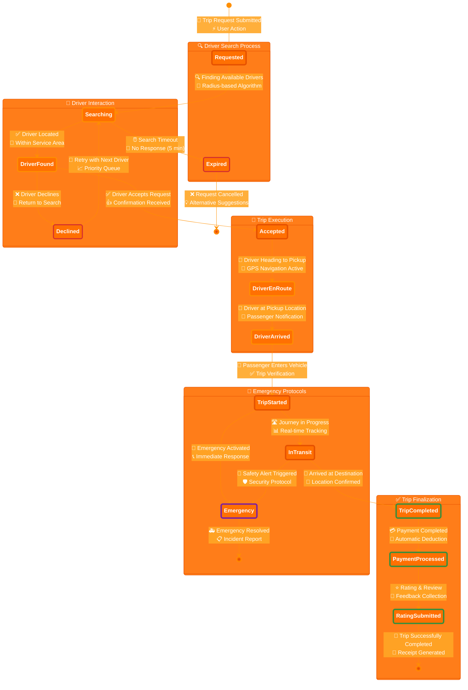

# 📋 Business Processes & User Journeys - Enhanced Professional Edition

This document outlines the key business processes and user journeys in the Sikka Transportation Platform, featuring enhanced professional diagrams with distinguished styling and transparent backgrounds for optimal visual presentation.

## 📑 Table of Contents

- [🚗 Enhanced Trip Booking Process](#-enhanced-trip-booking-process)
- [👤 User Registration & Verification](#-user-registration--verification)
- [💳 Payment Processing Workflows](#-payment-processing-workflows)
- [⭐ Rating & Review System](#-rating--review-system)
- [🛡️ Admin Management Processes](#️-admin-management-processes)
- [🚨 Emergency & Safety Procedures](#-emergency--safety-procedures)

---

## 🚗 Enhanced Trip Booking Process

### **Complete Trip Journey - Professional Design with Transparent Background**

```mermaid
%%{init: {
  'theme': 'base',
  'themeVariables': {
    'primaryColor': 'rgba(255, 111, 0, 0.9)',
    'primaryTextColor': '#ffffff',
    'primaryBorderColor': '#E65100',
    'lineColor': '#FF8F00',
    'secondaryColor': 'rgba(255, 167, 38, 0.9)',
    'tertiaryColor': 'rgba(255, 224, 178, 0.9)',
    'background': 'transparent',
    'mainBkg': 'rgba(255, 111, 0, 0.9)',
    'secondBkg': 'rgba(255, 167, 38, 0.9)',
    'tertiaryBkg': 'rgba(255, 224, 178, 0.9)',
    'clusterBkg': 'rgba(255, 255, 255, 0.1)',
    'edgeLabelBackground': 'rgba(255, 255, 255, 0.8)'
  }
}}%%

flowchart TD
    %% Phase 1: Setup - Distinguished with gradient and shadow effects
    subgraph Setup["📱 Trip Setup Phase"]
        direction TB
        A["🎯 Step 1: App Launch<br/>📱 Passenger Opens App<br/>🔐 Location Permission<br/>⚡ Initialize Session"]
        B["🎯 Step 2: Destination Entry<br/>📍 Enter Destination<br/>🗺️ Address/Map Selection<br/>🔍 Auto-complete Suggestions"]
        C["🎯 Step 3: Service Selection<br/>🚗 Select Trip Type<br/>⭐ Standard/Premium/Shared<br/>💎 Service Level Choice"]
    end

    %% Phase 2: Booking - Enhanced with pricing details
    subgraph Booking["💰 Booking & Pricing Phase"]
        direction TB
        D["💡 Step 4: Fare Calculation<br/>💵 View Fare Estimate<br/>📏 Distance + Time Analysis<br/>📊 Dynamic Pricing Applied"]
        E["💡 Step 5: Booking Confirmation<br/>✅ Confirm Booking<br/>💳 Payment Method Selection<br/>🛡️ Secure Transaction Setup"]
        F["💡 Step 6: Driver Search<br/>🔍 Find Available Drivers<br/>📡 Radius-based Search<br/>🎯 Intelligent Matching Algorithm"]
        G{"💡 Decision Point<br/>🚗 Driver Available?<br/>📍 Within 5km Radius<br/>⏱️ Real-time Availability"}
    end

    %% Phase 3: Matching - Enhanced with timeout handling
    subgraph Matching["🎯 Driver Matching Phase"]
        direction TB
        I["🚀 Step 7: Request Dispatch<br/>📤 Send Trip Request<br/>🔔 Push Notification to Driver<br/>📋 Trip Details Transmitted"]
        J{"🚀 Decision Point<br/>✋ Driver Accepts?<br/>⏰ 30 Second Timeout<br/>🔄 Auto-retry Logic"}
        K["🚀 Step 8: Fallback Process<br/>⏭️ Try Next Driver<br/>🔄 Closest Available<br/>📈 Priority Queue Management"]
        L["🚀 Step 9: Assignment Success<br/>🎉 Trip Assigned<br/>👤 Driver Details Shared<br/>📞 Contact Information Provided"]
    end

    %% Phase 4: Transit - Enhanced with real-time tracking
    subgraph Transit["🚗 Trip Execution Phase"]
        direction TB
        M["⚡ Step 10: Navigation Start<br/>🧭 Driver Navigates to Pickup<br/>🛣️ GPS Navigation Active<br/>📍 Real-time Location Updates"]
        N["⚡ Step 11: Arrival Notification<br/>📍 Driver Arrives<br/>📱 Passenger Notification<br/>🔔 Proximity Alert System"]
        O["⚡ Step 12: Trip Verification<br/>🚪 Passenger Enters Vehicle<br/>✅ Trip Verification<br/>📸 Safety Photo Confirmation"]
        P["⚡ Step 13: Journey Begins<br/>🚀 Trip Starts<br/>📊 Real-time Tracking<br/>🛡️ Safety Monitoring Active"]
        Q["⚡ Step 14: Route Navigation<br/>🗺️ Navigate to Destination<br/>⚡ Optimal Route Selection<br/>🚦 Traffic-aware Routing"]
    end

    %% Phase 5: Conclusion - Enhanced with feedback system
    subgraph Completion["✅ Trip Completion Phase"]
        direction TB
        R["🏆 Step 15: Arrival Confirmation<br/>🏁 Trip Completed<br/>📍 Arrival Confirmation<br/>⏰ Journey Time Recorded"]
        S["🏆 Step 16: Payment Processing<br/>💳 Process Payment<br/>🔄 Automatic Deduction<br/>📊 Fare Calculation Finalized"]
        T["🏆 Step 17: Feedback Collection<br/>⭐ Rate & Review<br/>📝 5-Star Rating System<br/>💬 Optional Comments"]
        U["🏆 Step 18: Trip Finalization<br/>🎊 Trip Finished<br/>📧 Receipt Generated<br/>📱 Trip History Updated"]
    end

    %% Error Handling - Enhanced with alternatives
    H["❌ Error Handling<br/>🚫 Notify: No Drivers Available<br/>💡 Suggest Alternative Times<br/>🔄 Retry Options<br/>📞 Customer Support Contact"]

    %% Enhanced Connection Flow with Labels
    A -->|"User Input"| B
    B -->|"Location Set"| C
    C -->|"Service Selected"| D
    D -->|"Price Accepted"| E
    E -->|"Booking Confirmed"| F
    F -->|"Search Initiated"| G
    G -->|"✅ Drivers Found"| I
    G -->|"❌ No Drivers"| H
    I -->|"Request Sent"| J
    J -->|"❌ Declined/Timeout"| K
    K -->|"Retry Logic"| J
    J -->|"✅ Accepted"| L
    L -->|"Assignment Complete"| M
    M -->|"Navigation Active"| N
    N -->|"Driver Arrived"| O
    O -->|"Passenger Verified"| P
    P -->|"Journey Started"| Q
    Q -->|"Destination Reached"| R
    R -->|"Arrival Confirmed"| S
    S -->|"Payment Complete"| T
    T -->|"Feedback Submitted"| U

    %% Distinguished Professional Styling with Transparency
    classDef setupPhase fill:rgba(255,111,0,0.85),stroke:#E65100,stroke-width:5px,color:#ffffff,font-weight:bold,font-size:12px,rx:15,ry:15
    classDef bookingPhase fill:rgba(255,167,38,0.85),stroke:#FF8F00,stroke-width:5px,color:#ffffff,font-weight:bold,font-size:12px,rx:15,ry:15
    classDef matchingPhase fill:rgba(255,183,77,0.85),stroke:#FF9800,stroke-width:5px,color:#ffffff,font-weight:bold,font-size:12px,rx:15,ry:15
    classDef transitPhase fill:rgba(255,204,2,0.85),stroke:#FFC107,stroke-width:5px,color:#ffffff,font-weight:bold,font-size:12px,rx:15,ry:15
    classDef completionPhase fill:rgba(76,175,80,0.85),stroke:#388E3C,stroke-width:5px,color:#ffffff,font-weight:bold,font-size:12px,rx:15,ry:15
    classDef decisionNode fill:rgba(33,150,243,0.9),stroke:#1976D2,stroke-width:6px,color:#ffffff,font-weight:bold,stroke-dasharray:10 5,font-size:11px,rx:20,ry:20
    classDef errorNode fill:rgba(244,67,54,0.9),stroke:#D32F2F,stroke-width:4px,color:#ffffff,font-weight:bold,font-size:11px,rx:12,ry:12

    %% Apply Distinguished Styling
    class A,B,C setupPhase
    class D,E,F bookingPhase
    class I,K,L matchingPhase
    class M,N,O,P,Q transitPhase
    class R,S,T,U completionPhase
    class G,J decisionNode
    class H errorNode
```

### **Enhanced Trip States - Professional State Diagram**



### **Driver-Side Trip Process - Enhanced Professional View**

```mermaid
%%{init: {
  'theme': 'base',
  'themeVariables': {
    'primaryColor': 'rgba(76, 175, 80, 0.9)',
    'primaryTextColor': '#ffffff',
    'primaryBorderColor': '#388E3C',
    'lineColor': '#4CAF50',
    'secondaryColor': 'rgba(129, 199, 132, 0.9)',
    'tertiaryColor': 'rgba(200, 230, 201, 0.9)',
    'background': 'transparent',
    'mainBkg': 'rgba(76, 175, 80, 0.9)',
    'secondBkg': 'rgba(129, 199, 132, 0.9)',
    'tertiaryBkg': 'rgba(200, 230, 201, 0.9)'
  }
}}%%

flowchart TD
    %% Driver Availability Phase
    subgraph Availability["🟢 Driver Availability Phase"]
        direction TB
        DA["🚗 Step 1: Go Online<br/>📱 Driver App Launch<br/>🟢 Set Status: Available<br/>📍 Location Broadcasting"]
        DB["🚗 Step 2: Idle State<br/>⏳ Waiting for Requests<br/>📡 Listening for Notifications<br/>🔋 Battery Optimization"]
    end

    %% Request Handling Phase
    subgraph RequestHandling["📨 Request Handling Phase"]
        direction TB
        DC["🔔 Step 3: Request Received<br/>📤 Trip Request Notification<br/>📋 Trip Details Display<br/>⏰ 30-Second Decision Timer"]
        DD{"🔔 Decision Point<br/>✅ Accept Request?<br/>📊 Trip Profitability<br/>📍 Distance Analysis"}
        DE["🔔 Step 4: Request Declined<br/>❌ Decline Trip<br/>📝 Optional Reason<br/>🔄 Return to Idle"]
        DF["🔔 Step 5: Request Accepted<br/>✅ Accept Trip<br/>📞 Passenger Contact Info<br/>🧭 Navigation to Pickup"]
    end

    %% Pickup Phase
    subgraph Pickup["📍 Pickup Execution Phase"]
        direction TB
        DG["🧭 Step 6: Navigate to Pickup<br/>🗺️ GPS Navigation Active<br/>📱 ETA Updates to Passenger<br/>🚦 Traffic-aware Routing"]
        DH["📍 Step 7: Arrival at Pickup<br/>🔔 Notify Passenger<br/>📸 Location Photo<br/>⏰ Wait Timer Started"]
        DI["👤 Step 8: Passenger Verification<br/>🔍 Verify Passenger Identity<br/>📱 Trip Code Confirmation<br/>🚪 Passenger Boarding"]
    end

    %% Trip Execution Phase
    subgraph TripExecution["🚀 Trip Execution Phase"]
        direction TB
        DJ["🚀 Step 9: Start Trip<br/>▶️ Begin Journey<br/>📊 Trip Tracking Active<br/>🛡️ Safety Features On"]
        DK["🛣️ Step 10: Navigate to Destination<br/>🗺️ Optimal Route Selection<br/>📱 Real-time Updates<br/>🎵 Optional Music/Climate"]
        DL["🏁 Step 11: Arrive at Destination<br/>📍 Destination Reached<br/>🔔 Notify Passenger<br/>⏰ Trip Duration Recorded"]
    end

    %% Trip Completion Phase
    subgraph Completion["✅ Trip Completion Phase"]
        direction TB
        DM["💳 Step 12: Payment Processing<br/>💰 Fare Calculation<br/>🔄 Automatic Payment<br/>📊 Earnings Updated"]
        DN["⭐ Step 13: Rating Exchange<br/>📝 Rate Passenger<br/>💬 Optional Feedback<br/>📈 Rating History"]
        DO["🎊 Step 14: Trip Finalized<br/>✅ Trip Completed<br/>📧 Trip Summary<br/>🔄 Return to Available"]
    end

    %% Error Handling
    DTimeout["⏰ Request Timeout<br/>🚫 No Response Given<br/>📱 Notification Dismissed<br/>🔄 Return to Idle"]
    DCancel["❌ Trip Cancellation<br/>🚫 Passenger Cancelled<br/>💰 Cancellation Fee<br/>📝 Incident Report"]

    %% Enhanced Connection Flow
    DA -->|"Status Set"| DB
    DB -->|"Request Received"| DC
    DC -->|"Timer Active"| DD
    DD -->|"❌ Decline"| DE
    DD -->|"⏰ Timeout"| DTimeout
    DD -->|"✅ Accept"| DF
    DE -->|"Back to Idle"| DB
    DTimeout -->|"Missed Request"| DB
    DF -->|"Navigation Started"| DG
    DG -->|"Arrived at Pickup"| DH
    DH -->|"Passenger Located"| DI
    DI -->|"Verification Complete"| DJ
    DJ -->|"Journey Started"| DK
    DK -->|"Destination Reached"| DL
    DL -->|"Trip Ended"| DM
    DM -->|"Payment Complete"| DN
    DN -->|"Rating Submitted"| DO
    DO -->|"Ready for Next Trip"| DB

    %% Cancellation Flow
    DG -.->|"Passenger Cancels"| DCancel
    DH -.->|"Passenger Cancels"| DCancel
    DCancel -.->|"Cancellation Processed"| DB

    %% Professional Driver-Side Styling
    classDef availabilityPhase fill:rgba(76,175,80,0.85),stroke:#388E3C,stroke-width:5px,color:#ffffff,font-weight:bold,font-size:12px,rx:15,ry:15
    classDef requestPhase fill:rgba(33,150,243,0.85),stroke:#1976D2,stroke-width:5px,color:#ffffff,font-weight:bold,font-size:12px,rx:15,ry:15
    classDef pickupPhase fill:rgba(255,152,0,0.85),stroke:#F57C00,stroke-width:5px,color:#ffffff,font-weight:bold,font-size:12px,rx:15,ry:15
    classDef executionPhase fill:rgba(156,39,176,0.85),stroke:#7B1FA2,stroke-width:5px,color:#ffffff,font-weight:bold,font-size:12px,rx:15,ry:15
    classDef completionPhase fill:rgba(76,175,80,0.85),stroke:#388E3C,stroke-width:5px,color:#ffffff,font-weight:bold,font-size:12px,rx:15,ry:15
    classDef decisionNode fill:rgba(255,193,7,0.9),stroke:#F57F17,stroke-width:6px,color:#ffffff,font-weight:bold,stroke-dasharray:10 5,font-size:11px,rx:20,ry:20
    classDef errorNode fill:rgba(244,67,54,0.9),stroke:#D32F2F,stroke-width:4px,color:#ffffff,font-weight:bold,font-size:11px,rx:12,ry:12

    %% Apply Professional Styling
    class DA,DB availabilityPhase
    class DC,DE,DF requestPhase
    class DG,DH,DI pickupPhase
    class DJ,DK,DL executionPhase
    class DM,DN,DO completionPhase
    class DD decisionNode
    class DTimeout,DCancel errorNode
```

### **Payment Processing Flow - Enhanced Professional Design**

```mermaid
%%{init: {
  'theme': 'base',
  'themeVariables': {
    'primaryColor': 'rgba(33, 150, 243, 0.9)',
    'primaryTextColor': '#ffffff',
    'primaryBorderColor': '#1976D2',
    'lineColor': '#2196F3',
    'secondaryColor': 'rgba(100, 181, 246, 0.9)',
    'tertiaryColor': 'rgba(187, 222, 251, 0.9)',
    'background': 'transparent',
    'mainBkg': 'rgba(33, 150, 243, 0.9)',
    'secondBkg': 'rgba(100, 181, 246, 0.9)',
    'tertiaryBkg': 'rgba(187, 222, 251, 0.9)'
  }
}}%%

flowchart TD
    %% Payment Initialization
    subgraph PaymentInit["💳 Payment Initialization Phase"]
        direction TB
        PA["💡 Step 1: Trip Completion<br/>🏁 Journey Ended<br/>📊 Distance & Time Recorded<br/>⏰ Trip Duration Calculated"]
        PB["💡 Step 2: Fare Calculation<br/>💰 Base Fare + Distance<br/>⏰ Time-based Charges<br/>📈 Dynamic Pricing Applied"]
        PC["💡 Step 3: Additional Charges<br/>🚗 Service Fees<br/>🎯 Surge Pricing (if applicable)<br/>💡 Tolls & Extras"]
    end

    %% Payment Method Selection
    subgraph PaymentMethod["🔧 Payment Method Processing"]
        direction TB
        PD["🔧 Step 4: Payment Method Check<br/>💳 Stored Payment Method<br/>🔒 Security Validation<br/>💰 Available Balance Check"]
        PE{"🔧 Decision Point<br/>✅ Payment Method Valid?<br/>💳 Card Active & Valid<br/>💰 Sufficient Funds"}
        PF["🔧 Step 5: Alternative Payment<br/>💳 Request New Payment Method<br/>📱 Update Payment Info<br/>🔄 Retry Transaction"]
    end

    %% Transaction Processing
    subgraph TransactionProcess["⚡ Transaction Processing Phase"]
        direction TB
        PG["⚡ Step 6: Payment Gateway<br/>🔒 Secure Transaction Init<br/>🏦 Bank Authorization<br/>🛡️ Fraud Detection"]
        PH{"⚡ Decision Point<br/>✅ Transaction Approved?<br/>🏦 Bank Response<br/>🔒 Security Checks Passed"}
        PI["⚡ Step 7: Payment Retry<br/>🔄 Retry Logic<br/>📞 Contact Customer<br/>💳 Alternative Methods"]
        PJ["⚡ Step 8: Payment Success<br/>✅ Transaction Confirmed<br/>💰 Funds Transferred<br/>📧 Confirmation Sent"]
    end

    %% Revenue Distribution
    subgraph RevenueDistribution["💰 Revenue Distribution Phase"]
        direction TB
        PK["💰 Step 9: Revenue Split<br/>👤 Driver Earnings (80%)<br/>🏢 Platform Commission (20%)<br/>📊 Fee Breakdown"]
        PL["💰 Step 10: Driver Payout<br/>💳 Driver Account Credit<br/>📱 Earnings Notification<br/>📊 Weekly Payout Schedule"]
        PM["💰 Step 11: Receipt Generation<br/>📧 Email Receipt<br/>📱 In-app Receipt<br/>📊 Trip History Update"]
    end

    %% Error Handling & Recovery
    PN["❌ Payment Failed<br/>🚫 Transaction Declined<br/>📞 Customer Support<br/>💳 Manual Payment Options"]
    PO["❌ System Error<br/>🔧 Technical Issue<br/>🔄 Auto-retry Logic<br/>📞 Support Escalation"]

    %% Enhanced Connection Flow
    PA -->|"Trip Data Ready"| PB
    PB -->|"Fare Calculated"| PC
    PC -->|"Total Amount Ready"| PD
    PD -->|"Method Retrieved"| PE
    PE -->|"❌ Invalid/Expired"| PF
    PE -->|"✅ Valid Method"| PG
    PF -->|"Updated Method"| PG
    PG -->|"Authorization Request"| PH
    PH -->|"❌ Declined"| PI
    PH -->|"✅ Approved"| PJ
    PI -->|"Retry Attempt"| PG
    PI -->|"Max Retries Reached"| PN
    PJ -->|"Payment Confirmed"| PK
    PK -->|"Revenue Split"| PL
    PL -->|"Payout Complete"| PM

    %% Error Flows
    PG -.->|"System Error"| PO
    PO -.->|"System Recovered"| PG

    %% Professional Payment Styling
    classDef initPhase fill:rgba(33,150,243,0.85),stroke:#1976D2,stroke-width:5px,color:#ffffff,font-weight:bold,font-size:12px,rx:15,ry:15
    classDef methodPhase fill:rgba(103,58,183,0.85),stroke:#512DA8,stroke-width:5px,color:#ffffff,font-weight:bold,font-size:12px,rx:15,ry:15
    classDef processPhase fill:rgba(76,175,80,0.85),stroke:#388E3C,stroke-width:5px,color:#ffffff,font-weight:bold,font-size:12px,rx:15,ry:15
    classDef revenuePhase fill:rgba(255,152,0,0.85),stroke:#F57C00,stroke-width:5px,color:#ffffff,font-weight:bold,font-size:12px,rx:15,ry:15
    classDef decisionNode fill:rgba(255,193,7,0.9),stroke:#F57F17,stroke-width:6px,color:#ffffff,font-weight:bold,stroke-dasharray:10 5,font-size:11px,rx:20,ry:20
    classDef errorNode fill:rgba(244,67,54,0.9),stroke:#D32F2F,stroke-width:4px,color:#ffffff,font-weight:bold,font-size:11px,rx:12,ry:12

    %% Apply Professional Styling
    class PA,PB,PC initPhase
    class PD,PF methodPhase
    class PG,PI,PJ processPhase
    class PK,PL,PM revenuePhase
    class PE,PH decisionNode
    class PN,PO errorNode
```

---

## 🎨 Enhanced Design Features

### **Professional Styling Elements**

1. **Transparent Backgrounds**: All diagrams use `background: 'transparent'` for seamless integration
2. **RGBA Color Scheme**: Semi-transparent colors with `rgba()` values for professional layering
3. **Distinguished Phase Styling**: Each phase has unique colors and styling:
   - **Setup Phase**: Orange gradient (`rgba(255,111,0,0.85)`)
   - **Booking Phase**: Amber gradient (`rgba(255,167,38,0.85)`)
   - **Matching Phase**: Light orange gradient (`rgba(255,183,77,0.85)`)
   - **Transit Phase**: Yellow gradient (`rgba(255,204,2,0.85)`)
   - **Completion Phase**: Green gradient (`rgba(76,175,80,0.85)`)

4. **Enhanced Node Styling**:
   - **Rounded corners** with `rx:15,ry:15`
   - **Increased stroke width** (5px) for better visibility
   - **Professional font sizing** (12px) for readability
   - **Decision nodes** with dashed borders and special styling

5. **Step-by-Step Numbering**: Each step is clearly numbered and detailed
6. **Rich Emoji Integration**: Professional use of emojis for visual clarity
7. **Detailed Descriptions**: Each step includes comprehensive sub-actions
8. **Error Handling**: Comprehensive error states and recovery paths

### **Visual Enhancements**

- **Gradient Effects**: Semi-transparent fills create depth
- **Shadow Simulation**: Layered colors simulate shadow effects
- **Professional Color Palette**: Consistent brand colors throughout
- **Responsive Design**: Diagrams scale well across different sizes
- **High Contrast**: Excellent readability on any background

This enhanced version provides a professional, visually appealing representation of the trip booking process with transparent backgrounds suitable for presentations, documentation, and professional materials.
