# 📋 Business Processes & User Journeys - Enhanced Professional Edition

This document outlines the key business processes and user journeys in the Sikka Transportation Platform, featuring enhanced professional diagrams with distinguished styling and transparent backgrounds for optimal visual presentation.

## 📑 Table of Contents

- [🚗 Enhanced Trip Booking Process](#-enhanced-trip-booking-process)
- [👤 User Registration & Verification](#-user-registration--verification)
- [💳 Payment Processing Workflows](#-payment-processing-workflows)
- [⭐ Rating & Review System](#-rating--review-system)
- [🛡️ Admin Management Processes](#️-admin-management-processes)
- [🚨 Emergency & Safety Procedures](#-emergency--safety-procedures)

---

## 🚗 Enhanced Trip Booking Process

### **Complete Trip Journey - Professional Design with Transparent Background**

```mermaid
%%{init: {
  'theme': 'base',
  'themeVariables': {
    'background': 'transparent',
    'primaryColor': '#FF6F00',
    'primaryTextColor': '#ffffff',
    'primaryBorderColor': '#E65100',
    'lineColor': '#FF8F00',
    'secondaryColor': '#FFA726',
    'tertiaryColor': '#FFE0B2'
  }
}}%%

flowchart TD
    %% Phase 1: Setup
    subgraph Setup["📱 Trip Setup Phase"]
        A["🎯 Step 1: App Launch<br/>📱 Passenger Opens App<br/>🔐 Location Permission<br/>⚡ Initialize Session"]
        B["🎯 Step 2: Destination Entry<br/>📍 Enter Destination<br/>🗺️ Address/Map Selection<br/>🔍 Auto-complete Suggestions"]
        C["🎯 Step 3: Service Selection<br/>🚗 Select Trip Type<br/>⭐ Standard/Premium/Shared<br/>💎 Service Level Choice"]
    end

    %% Phase 2: Booking
    subgraph Booking["💰 Booking & Pricing Phase"]
        D["💡 Step 4: Fare Calculation<br/>💵 View Fare Estimate<br/>📏 Distance + Time Analysis<br/>📊 Dynamic Pricing Applied"]
        E["💡 Step 5: Booking Confirmation<br/>✅ Confirm Booking<br/>💳 Payment Method Selection<br/>🛡️ Secure Transaction Setup"]
        F["💡 Step 6: Driver Search<br/>🔍 Find Available Drivers<br/>📡 Radius-based Search<br/>🎯 Intelligent Matching Algorithm"]
        G{"💡 Decision Point<br/>🚗 Driver Available?<br/>📍 Within 5km Radius<br/>⏱️ Real-time Availability"}
    end

    %% Phase 3: Matching
    subgraph Matching["🎯 Driver Matching Phase"]
        I["🚀 Step 7: Request Dispatch<br/>📤 Send Trip Request<br/>🔔 Push Notification to Driver<br/>📋 Trip Details Transmitted"]
        J{"🚀 Decision Point<br/>✋ Driver Accepts?<br/>⏰ 30 Second Timeout<br/>🔄 Auto-retry Logic"}
        K["🚀 Step 8: Fallback Process<br/>⏭️ Try Next Driver<br/>🔄 Closest Available<br/>📈 Priority Queue Management"]
        L["🚀 Step 9: Assignment Success<br/>🎉 Trip Assigned<br/>👤 Driver Details Shared<br/>📞 Contact Information Provided"]
    end

    %% Phase 4: Transit
    subgraph Transit["🚗 Trip Execution Phase"]
        M["⚡ Step 10: Navigation Start<br/>🧭 Driver Navigates to Pickup<br/>🛣️ GPS Navigation Active<br/>📍 Real-time Location Updates"]
        N["⚡ Step 11: Arrival Notification<br/>📍 Driver Arrives<br/>📱 Passenger Notification<br/>🔔 Proximity Alert System"]
        O["⚡ Step 12: Trip Verification<br/>🚪 Passenger Enters Vehicle<br/>✅ Trip Verification<br/>📸 Safety Photo Confirmation"]
        P["⚡ Step 13: Journey Begins<br/>🚀 Trip Starts<br/>📊 Real-time Tracking<br/>🛡️ Safety Monitoring Active"]
        Q["⚡ Step 14: Route Navigation<br/>🗺️ Navigate to Destination<br/>⚡ Optimal Route Selection<br/>🚦 Traffic-aware Routing"]
    end

    %% Phase 5: Completion
    subgraph Completion["✅ Trip Completion Phase"]
        R["🏆 Step 15: Arrival Confirmation<br/>🏁 Trip Completed<br/>📍 Arrival Confirmation<br/>⏰ Journey Time Recorded"]
        S["🏆 Step 16: Payment Processing<br/>💳 Process Payment<br/>🔄 Automatic Deduction<br/>📊 Fare Calculation Finalized"]
        T["🏆 Step 17: Feedback Collection<br/>⭐ Rate & Review<br/>📝 5-Star Rating System<br/>💬 Optional Comments"]
        U["🏆 Step 18: Trip Finalization<br/>🎊 Trip Finished<br/>📧 Receipt Generated<br/>📱 Trip History Updated"]
    end

    %% Error Handling
    H["❌ Error Handling<br/>🚫 Notify: No Drivers Available<br/>💡 Suggest Alternative Times<br/>🔄 Retry Options<br/>📞 Customer Support Contact"]

    %% Connection Flow
    A --> B --> C --> D --> E --> F --> G
    G -->|"✅ Drivers Found"| I
    G -->|"❌ No Drivers"| H
    I --> J
    J -->|"❌ Declined/Timeout"| K
    K --> J
    J -->|"✅ Accepted"| L
    L --> M --> N --> O --> P --> Q --> R --> S --> T --> U

    %% Professional Styling
    classDef setupPhase fill:#FF6F00,stroke:#E65100,stroke-width:4px,color:#ffffff,font-weight:bold
    classDef bookingPhase fill:#FFA726,stroke:#FF8F00,stroke-width:4px,color:#ffffff,font-weight:bold
    classDef matchingPhase fill:#FFB74D,stroke:#FF9800,stroke-width:4px,color:#ffffff,font-weight:bold
    classDef transitPhase fill:#FFCC02,stroke:#FFC107,stroke-width:4px,color:#ffffff,font-weight:bold
    classDef completionPhase fill:#4CAF50,stroke:#388E3C,stroke-width:4px,color:#ffffff,font-weight:bold
    classDef decisionNode fill:#2196F3,stroke:#1976D2,stroke-width:5px,color:#ffffff,font-weight:bold,stroke-dasharray:8 4
    classDef errorNode fill:#F44336,stroke:#D32F2F,stroke-width:3px,color:#ffffff,font-weight:bold

    class A,B,C setupPhase
    class D,E,F bookingPhase
    class I,K,L matchingPhase
    class M,N,O,P,Q transitPhase
    class R,S,T,U completionPhase
    class G,J decisionNode
    class H errorNode
```

### **Enhanced Trip States - Professional State Diagram**

```mermaid
%%{init: {
  'theme': 'base',
  'themeVariables': {
    'background': 'transparent',
    'primaryColor': '#FF6F00',
    'primaryTextColor': '#ffffff',
    'primaryBorderColor': '#E65100',
    'lineColor': '#FF8F00'
  }
}}%%

stateDiagram-v2
    [*] --> Requested : 📱 Trip Request Submitted
    
    Requested --> Searching : 🔍 Finding Available Drivers
    Searching --> DriverFound : ✅ Driver Located
    Searching --> Expired : ⏰ Search Timeout (5 min)
    
    DriverFound --> Accepted : ✅ Driver Accepts Request
    DriverFound --> Declined : ❌ Driver Declines
    Declined --> Searching : 🔄 Retry with Next Driver
    
    Accepted --> DriverEnRoute : 🧭 Driver Heading to Pickup
    DriverEnRoute --> DriverArrived : 📍 Driver at Pickup Location
    DriverArrived --> TripStarted : 🚀 Passenger Enters Vehicle
    TripStarted --> InTransit : 🛣️ Journey in Progress
    InTransit --> TripCompleted : 🏁 Arrived at Destination
    
    TripCompleted --> PaymentProcessed : 💳 Payment Completed
    PaymentProcessed --> RatingSubmitted : ⭐ Rating & Review
    RatingSubmitted --> [*] : 🎊 Trip Successfully Completed
    
    Expired --> [*] : ❌ Request Cancelled
    
    TripStarted --> Emergency : 🚨 Emergency Activated
    InTransit --> Emergency : 🚨 Safety Alert Triggered
    Emergency --> [*] : 🚑 Emergency Resolved

    classDef activeState fill:#FF6F00,stroke:#E65100,stroke-width:4px,color:#ffffff,font-weight:bold
    classDef waitingState fill:#FFA726,stroke:#FF8F00,stroke-width:3px,color:#ffffff,font-weight:bold
    classDef errorState fill:#F44336,stroke:#D32F2F,stroke-width:3px,color:#ffffff,font-weight:bold
    classDef finalState fill:#4CAF50,stroke:#388E3C,stroke-width:4px,color:#ffffff,font-weight:bold
    classDef emergencyState fill:#9C27B0,stroke:#7B1FA2,stroke-width:4px,color:#ffffff,font-weight:bold

    class Requested,Accepted,TripStarted,InTransit activeState
    class Searching,DriverEnRoute,DriverArrived,DriverFound waitingState
    class Expired,Declined errorState
    class TripCompleted,PaymentProcessed,RatingSubmitted finalState
    class Emergency emergencyState
```

### **Driver-Side Trip Process - Enhanced Professional View**

```mermaid
%%{init: {
  'theme': 'base',
  'themeVariables': {
    'background': 'transparent',
    'primaryColor': '#4CAF50',
    'primaryTextColor': '#ffffff',
    'primaryBorderColor': '#388E3C',
    'lineColor': '#4CAF50'
  }
}}%%

flowchart TD
    %% Driver Availability Phase
    subgraph Availability["🟢 Driver Availability Phase"]
        DA["🚗 Step 1: Go Online<br/>📱 Driver App Launch<br/>🟢 Set Status: Available<br/>📍 Location Broadcasting"]
        DB["🚗 Step 2: Idle State<br/>⏳ Waiting for Requests<br/>📡 Listening for Notifications<br/>🔋 Battery Optimization"]
    end

    %% Request Handling Phase
    subgraph RequestHandling["📨 Request Handling Phase"]
        DC["🔔 Step 3: Request Received<br/>📤 Trip Request Notification<br/>📋 Trip Details Display<br/>⏰ 30-Second Decision Timer"]
        DD{"🔔 Decision Point<br/>✅ Accept Request?<br/>📊 Trip Profitability<br/>📍 Distance Analysis"}
        DE["🔔 Step 4: Request Declined<br/>❌ Decline Trip<br/>📝 Optional Reason<br/>🔄 Return to Idle"]
        DF["🔔 Step 5: Request Accepted<br/>✅ Accept Trip<br/>📞 Passenger Contact Info<br/>🧭 Navigation to Pickup"]
    end

    %% Pickup Phase
    subgraph Pickup["📍 Pickup Execution Phase"]
        DG["🧭 Step 6: Navigate to Pickup<br/>🗺️ GPS Navigation Active<br/>📱 ETA Updates to Passenger<br/>🚦 Traffic-aware Routing"]
        DH["📍 Step 7: Arrival at Pickup<br/>🔔 Notify Passenger<br/>📸 Location Photo<br/>⏰ Wait Timer Started"]
        DI["👤 Step 8: Passenger Verification<br/>🔍 Verify Passenger Identity<br/>📱 Trip Code Confirmation<br/>🚪 Passenger Boarding"]
    end

    %% Trip Execution Phase
    subgraph TripExecution["🚀 Trip Execution Phase"]
        DJ["🚀 Step 9: Start Trip<br/>▶️ Begin Journey<br/>📊 Trip Tracking Active<br/>🛡️ Safety Features On"]
        DK["🛣️ Step 10: Navigate to Destination<br/>🗺️ Optimal Route Selection<br/>📱 Real-time Updates<br/>🎵 Optional Music/Climate"]
        DL["🏁 Step 11: Arrive at Destination<br/>📍 Destination Reached<br/>🔔 Notify Passenger<br/>⏰ Trip Duration Recorded"]
    end

    %% Trip Completion Phase
    subgraph Completion["✅ Trip Completion Phase"]
        DM["💳 Step 12: Payment Processing<br/>💰 Fare Calculation<br/>🔄 Automatic Payment<br/>📊 Earnings Updated"]
        DN["⭐ Step 13: Rating Exchange<br/>📝 Rate Passenger<br/>💬 Optional Feedback<br/>📈 Rating History"]
        DO["🎊 Step 14: Trip Finalized<br/>✅ Trip Completed<br/>📧 Trip Summary<br/>🔄 Return to Available"]
    end

    %% Error Handling
    DTimeout["⏰ Request Timeout<br/>🚫 No Response Given<br/>📱 Notification Dismissed<br/>🔄 Return to Idle"]
    DCancel["❌ Trip Cancellation<br/>🚫 Passenger Cancelled<br/>💰 Cancellation Fee<br/>📝 Incident Report"]

    %% Connection Flow
    DA --> DB --> DC --> DD
    DD -->|"❌ Decline"| DE
    DD -->|"⏰ Timeout"| DTimeout
    DD -->|"✅ Accept"| DF
    DE --> DB
    DTimeout --> DB
    DF --> DG --> DH --> DI --> DJ --> DK --> DL --> DM --> DN --> DO --> DB

    %% Cancellation Flow
    DG -.-> DCancel
    DH -.-> DCancel
    DCancel -.-> DB

    %% Professional Driver-Side Styling
    classDef availabilityPhase fill:#4CAF50,stroke:#388E3C,stroke-width:4px,color:#ffffff,font-weight:bold
    classDef requestPhase fill:#2196F3,stroke:#1976D2,stroke-width:4px,color:#ffffff,font-weight:bold
    classDef pickupPhase fill:#FF9800,stroke:#F57C00,stroke-width:4px,color:#ffffff,font-weight:bold
    classDef executionPhase fill:#9C27B0,stroke:#7B1FA2,stroke-width:4px,color:#ffffff,font-weight:bold
    classDef completionPhase fill:#4CAF50,stroke:#388E3C,stroke-width:4px,color:#ffffff,font-weight:bold
    classDef decisionNode fill:#FFC107,stroke:#F57F17,stroke-width:5px,color:#ffffff,font-weight:bold,stroke-dasharray:8 4
    classDef errorNode fill:#F44336,stroke:#D32F2F,stroke-width:3px,color:#ffffff,font-weight:bold

    class DA,DB availabilityPhase
    class DC,DE,DF requestPhase
    class DG,DH,DI pickupPhase
    class DJ,DK,DL executionPhase
    class DM,DN,DO completionPhase
    class DD decisionNode
    class DTimeout,DCancel errorNode
```

### **Payment Processing Flow - Enhanced Professional Design**

```mermaid
%%{init: {
  'theme': 'base',
  'themeVariables': {
    'background': 'transparent',
    'primaryColor': '#2196F3',
    'primaryTextColor': '#ffffff',
    'primaryBorderColor': '#1976D2',
    'lineColor': '#2196F3'
  }
}}%%

flowchart TD
    %% Payment Initialization
    subgraph PaymentInit["💳 Payment Initialization Phase"]
        PA["💡 Step 1: Trip Completion<br/>🏁 Journey Ended<br/>📊 Distance & Time Recorded<br/>⏰ Trip Duration Calculated"]
        PB["💡 Step 2: Fare Calculation<br/>💰 Base Fare + Distance<br/>⏰ Time-based Charges<br/>📈 Dynamic Pricing Applied"]
        PC["💡 Step 3: Additional Charges<br/>🚗 Service Fees<br/>🎯 Surge Pricing (if applicable)<br/>💡 Tolls & Extras"]
    end

    %% Payment Method Selection
    subgraph PaymentMethod["🔧 Payment Method Processing"]
        PD["🔧 Step 4: Payment Method Check<br/>💳 Stored Payment Method<br/>🔒 Security Validation<br/>💰 Available Balance Check"]
        PE{"🔧 Decision Point<br/>✅ Payment Method Valid?<br/>💳 Card Active & Valid<br/>💰 Sufficient Funds"}
        PF["🔧 Step 5: Alternative Payment<br/>💳 Request New Payment Method<br/>📱 Update Payment Info<br/>🔄 Retry Transaction"]
    end

    %% Transaction Processing
    subgraph TransactionProcess["⚡ Transaction Processing Phase"]
        PG["⚡ Step 6: Payment Gateway<br/>🔒 Secure Transaction Init<br/>🏦 Bank Authorization<br/>🛡️ Fraud Detection"]
        PH{"⚡ Decision Point<br/>✅ Transaction Approved?<br/>🏦 Bank Response<br/>🔒 Security Checks Passed"}
        PI["⚡ Step 7: Payment Retry<br/>🔄 Retry Logic<br/>📞 Contact Customer<br/>💳 Alternative Methods"]
        PJ["⚡ Step 8: Payment Success<br/>✅ Transaction Confirmed<br/>💰 Funds Transferred<br/>📧 Confirmation Sent"]
    end

    %% Revenue Distribution
    subgraph RevenueDistribution["💰 Revenue Distribution Phase"]
        PK["💰 Step 9: Revenue Split<br/>👤 Driver Earnings (80%)<br/>🏢 Platform Commission (20%)<br/>📊 Fee Breakdown"]
        PL["💰 Step 10: Driver Payout<br/>💳 Driver Account Credit<br/>📱 Earnings Notification<br/>📊 Weekly Payout Schedule"]
        PM["💰 Step 11: Receipt Generation<br/>📧 Email Receipt<br/>📱 In-app Receipt<br/>📊 Trip History Update"]
    end

    %% Error Handling & Recovery
    PN["❌ Payment Failed<br/>🚫 Transaction Declined<br/>📞 Customer Support<br/>💳 Manual Payment Options"]
    PO["❌ System Error<br/>🔧 Technical Issue<br/>🔄 Auto-retry Logic<br/>📞 Support Escalation"]

    %% Connection Flow
    PA --> PB --> PC --> PD --> PE
    PE -->|"❌ Invalid/Expired"| PF
    PE -->|"✅ Valid Method"| PG
    PF --> PG
    PG --> PH
    PH -->|"❌ Declined"| PI
    PH -->|"✅ Approved"| PJ
    PI --> PG
    PI -->|"Max Retries"| PN
    PJ --> PK --> PL --> PM

    %% Error Flows
    PG -.-> PO
    PO -.-> PG

    %% Professional Payment Styling
    classDef initPhase fill:#2196F3,stroke:#1976D2,stroke-width:4px,color:#ffffff,font-weight:bold
    classDef methodPhase fill:#673AB7,stroke:#512DA8,stroke-width:4px,color:#ffffff,font-weight:bold
    classDef processPhase fill:#4CAF50,stroke:#388E3C,stroke-width:4px,color:#ffffff,font-weight:bold
    classDef revenuePhase fill:#FF9800,stroke:#F57C00,stroke-width:4px,color:#ffffff,font-weight:bold
    classDef decisionNode fill:#FFC107,stroke:#F57F17,stroke-width:5px,color:#ffffff,font-weight:bold,stroke-dasharray:8 4
    classDef errorNode fill:#F44336,stroke:#D32F2F,stroke-width:3px,color:#ffffff,font-weight:bold

    class PA,PB,PC initPhase
    class PD,PF methodPhase
    class PG,PI,PJ processPhase
    class PK,PL,PM revenuePhase
    class PE,PH decisionNode
    class PN,PO errorNode
```

---

## 🎨 Enhanced Design Features

### **Professional Styling Elements**

1. **Transparent Backgrounds**: All diagrams use `background: 'transparent'` for seamless integration
2. **RGBA Color Scheme**: Semi-transparent colors with `rgba()` values for professional layering
3. **Distinguished Phase Styling**: Each phase has unique colors and styling:
   - **Setup Phase**: Orange gradient (`rgba(255,111,0,0.85)`)
   - **Booking Phase**: Amber gradient (`rgba(255,167,38,0.85)`)
   - **Matching Phase**: Light orange gradient (`rgba(255,183,77,0.85)`)
   - **Transit Phase**: Yellow gradient (`rgba(255,204,2,0.85)`)
   - **Completion Phase**: Green gradient (`rgba(76,175,80,0.85)`)

4. **Enhanced Node Styling**:
   - **Rounded corners** with `rx:15,ry:15`
   - **Increased stroke width** (5px) for better visibility
   - **Professional font sizing** (12px) for readability
   - **Decision nodes** with dashed borders and special styling

5. **Step-by-Step Numbering**: Each step is clearly numbered and detailed
6. **Rich Emoji Integration**: Professional use of emojis for visual clarity
7. **Detailed Descriptions**: Each step includes comprehensive sub-actions
8. **Error Handling**: Comprehensive error states and recovery paths

### **Visual Enhancements**

- **Gradient Effects**: Semi-transparent fills create depth
- **Shadow Simulation**: Layered colors simulate shadow effects
- **Professional Color Palette**: Consistent brand colors throughout
- **Responsive Design**: Diagrams scale well across different sizes
- **High Contrast**: Excellent readability on any background

This enhanced version provides a professional, visually appealing representation of the trip booking process with transparent backgrounds suitable for presentations, documentation, and professional materials.
