# 🗄️ Database Schema & Entity Relationships

This document provides a comprehensive overview of the Sikka Transportation Platform's database schema, entity relationships, and data management strategies.

## 📑 Table of Contents

- [📊 Database Overview](#-database-overview)
- [🏗️ Entity Relationship Diagram](#️-entity-relationship-diagram)
- [📋 Entity Definitions](#-entity-definitions)
- [🔗 Relationship Mappings](#-relationship-mappings)
- [📈 Indexing Strategy](#-indexing-strategy)
- [🔄 Migration Management](#-migration-management)
- [📊 Data Analytics Views](#-data-analytics-views)

---

## 📊 Database Overview

### **Database Technology Stack**
- **Primary Database**: PostgreSQL 15+
- **ORM**: TypeORM with TypeScript
- **Connection Pooling**: Built-in TypeORM connection pooling
- **Caching Layer**: Redis for query result caching
- **Backup Strategy**: Automated daily backups with point-in-time recovery

### **Database Configuration**
```typescript
// database.config.ts
export const databaseConfig: TypeOrmModuleOptions = {
  type: 'postgres',
  host: process.env.DATABASE_HOST || 'localhost',
  port: parseInt(process.env.DATABASE_PORT) || 5432,
  username: process.env.DATABASE_USERNAME,
  password: process.env.DATABASE_PASSWORD,
  database: process.env.DATABASE_NAME,
  entities: [__dirname + '/../entities/*.entity{.ts,.js}'],
  migrations: [__dirname + '/../migrations/*{.ts,.js}'],
  synchronize: false, // Always use migrations in production
  logging: process.env.NODE_ENV === 'development',
  ssl: process.env.NODE_ENV === 'production' ? { rejectUnauthorized: false } : false,
  extra: {
    connectionLimit: 20,
    acquireTimeout: 60000,
    timeout: 60000,
  },
};
```

---

## 🏗️ Entity Relationship Diagram

### **Complete Database Schema**

```mermaid
%%{init: {
  "theme": "dark",
  "themeVariables": {
    "primaryColor": "#0d1117",
    "primaryTextColor": "#f7d794",
    "primaryBorderColor": "#d97706",
    "lineColor": "#d97706",
    "secondaryColor": "#f59e0b",
    "tertiaryColor": "#fbbf24",
    "background": "#0d1117",
    "mainBkg": "#0d1117",
    "secondBkg": "#21262d"
  },
  "flowchart": {
    "useMaxWidth": true,
    "htmlLabels": true
  },
  "sequence": {
    "useMaxWidth": true,
    "wrap": true
  }
}}%%
erDiagram
    USER {
        uuid id PK
        string phone UK "Sudan format +249"
        string name
        string email UK
        string password "bcrypt hashed"
        enum role "passenger|driver|admin"
        enum status "active|inactive|suspended|pending_verification"
        boolean phoneVerified
        string profilePicture
        decimal rating "0.0-5.0"
        integer totalTrips
        boolean isOnline
        boolean isAvailable
        enum vehicleType "sedan|suv|hatchback|motorcycle|truck"
        string vehicleModel
        string vehiclePlateNumber
        string vehicleColor
        string drivingLicenseNumber
        string vehicleRegistrationNumber
        decimal currentLatitude
        decimal currentLongitude
        string currentAddress
        string otpCode
        timestamp otpExpiresAt
        integer otpAttempts
        string refreshToken
        timestamp createdAt
        timestamp updatedAt
        timestamp lastLoginAt
    }

    WALLET {
        uuid id PK
        uuid userId FK
        decimal balance "Current balance"
        decimal totalEarnings "Lifetime earnings"
        decimal totalSpent "Lifetime spending"
        decimal totalTopups "Total top-ups"
        decimal totalWithdrawals "Total withdrawals"
        decimal pendingAmount "Pending transactions"
        decimal reservedAmount "Reserved for trips"
        enum status "active|suspended|frozen"
        decimal dailySpendLimit
        decimal monthlySpendLimit
        decimal dailySpentAmount
        decimal monthlySpentAmount
        timestamp lastSpendResetDate
        string pin "Hashed PIN"
        boolean pinEnabled
        integer failedPinAttempts
        timestamp pinLockedUntil
        timestamp createdAt
        timestamp updatedAt
        timestamp lastTransactionAt
    }

    TRIP {
        uuid id PK
        enum status "requested|accepted|driver_arrived|in_progress|completed|cancelled"
        enum type "standard|premium|shared|delivery"
        uuid passengerId FK
        uuid driverId FK "Nullable until accepted"
        decimal pickupLatitude
        decimal pickupLongitude
        string pickupAddress
        decimal dropoffLatitude
        decimal dropoffLongitude
        string dropoffAddress
        decimal estimatedFare
        decimal actualFare
        decimal estimatedDistance
        decimal actualDistance
        integer estimatedDuration "minutes"
        integer actualDuration "minutes"
        string passengerNotes
        string driverNotes
        enum cancellationReason
        string cancelledBy "User ID"
        string cancellationNotes
        timestamp cancelledAt
        timestamp driverAcceptedAt
        timestamp driverArrivedAt
        timestamp tripStartedAt
        timestamp tripCompletedAt
        timestamp estimatedArrivalTime
        string promoCode
        decimal discountAmount
        timestamp createdAt
        timestamp updatedAt
    }

    PAYMENT {
        uuid id PK
        enum type "trip_payment|wallet_topup|refund|commission|penalty"
        enum method "wallet|ebs|cyberpay|cash|card"
        enum status "pending|processing|completed|failed|cancelled|refunded|partially_refunded"
        decimal amount
        decimal platformCommission "15%"
        decimal driverEarnings "85%"
        decimal processingFee
        decimal taxAmount
        decimal discountAmount
        string gatewayTransactionId
        string gatewayReference
        string gatewayResponse
        string gatewayStatus
        decimal refundedAmount
        string refundReason
        timestamp refundedAt
        string refundTransactionId
        string description
        json metadata
        string failureReason
        string failureCode
        integer retryCount
        timestamp lastRetryAt
        timestamp processedAt
        timestamp completedAt
        timestamp failedAt
        uuid tripId FK "Nullable"
        uuid userId FK
        uuid driverId FK "Nullable"
        timestamp createdAt
        timestamp updatedAt
    }

    TRANSACTION {
        uuid id PK
        enum type "credit|debit|topup|trip_payment|trip_earning|refund|commission|penalty|withdrawal|bonus|cashback"
        enum status "pending|processing|completed|failed|cancelled|reversed"
        decimal amount
        decimal fee
        decimal balanceBefore
        decimal balanceAfter
        string description
        string reference "External reference"
        string externalTransactionId
        json metadata
        string failureReason
        string failureCode
        timestamp processedAt
        timestamp completedAt
        timestamp failedAt
        timestamp reversedAt
        string reversalReason
        string reversalTransactionId
        uuid walletId FK
        uuid userId FK
        uuid tripId FK "Nullable"
        uuid fromUserId FK "For transfers"
        uuid toUserId FK "For transfers"
        timestamp createdAt
        timestamp updatedAt
    }

    RATING {
        uuid id PK
        enum type "passenger_to_driver|driver_to_passenger"
        decimal rating "1.0-5.0"
        string comment "Max 500 chars"
        decimal punctualityRating "1.0-5.0"
        decimal cleanlinessRating "1.0-5.0"
        decimal safetyRating "1.0-5.0"
        decimal communicationRating "1.0-5.0"
        decimal vehicleConditionRating "1.0-5.0"
        boolean isFlagged
        string flagReason
        timestamp flaggedAt
        string flaggedBy "Admin user ID"
        string response "Response from rated user"
        timestamp respondedAt
        uuid tripId FK
        uuid ratedById FK
        uuid ratedUserId FK
        timestamp createdAt
        timestamp updatedAt
    }

    LOCATION {
        uuid id PK
        enum type "driver_location|trip_pickup|trip_dropoff|trip_route|user_favorite"
        decimal latitude
        decimal longitude
        string address
        string city
        string state
        string country
        string postalCode
        string placeName "Home, Office, etc."
        string placeId "Google Places ID"
        decimal heading "0-360 degrees"
        decimal speed "km/h"
        decimal accuracy "GPS accuracy in meters"
        decimal altitude "meters"
        integer routeIndex "Order in route"
        integer distanceFromPrevious "meters"
        integer timeFromPrevious "seconds"
        json metadata
        uuid userId FK "Nullable"
        uuid tripId FK "Nullable"
        timestamp createdAt
        timestamp updatedAt
    }

    USER ||--|| WALLET : "owns"
    USER ||--o{ TRIP : "passenger_trips"
    USER ||--o{ TRIP : "driver_trips"
    USER ||--o{ RATING : "ratings_given"
    USER ||--o{ RATING : "ratings_received"
    USER ||--o{ LOCATION : "user_locations"
    USER ||--o{ PAYMENT : "user_payments"
    USER ||--o{ PAYMENT : "driver_payments"
    USER ||--o{ TRANSACTION : "user_transactions"

    WALLET ||--o{ TRANSACTION : "wallet_transactions"

    TRIP ||--|| PAYMENT : "trip_payment"
    TRIP ||--o{ RATING : "trip_ratings"
    TRIP ||--o{ LOCATION : "trip_locations"
    TRIP ||--o{ TRANSACTION : "trip_transactions"

    PAYMENT ||--o{ TRANSACTION : "payment_transactions"

    RATING }o--|| TRIP : "rated_trip"
    RATING }o--|| USER : "rated_by"
    RATING }o--|| USER : "rated_user"

    LOCATION }o--|| USER : "location_user"
    LOCATION }o--|| TRIP : "location_trip"
     Payment Components

    %% Financial Services

    %% Transaction Processing

    %% External Payment Gateways

    %% Success Transactions

    %% Decision Points

    %% Database Systems
    %% --- FINANCIAL GOLD THEME STYLING ---
    classDef payment fill:#0d1117,stroke:#d97706,stroke-width:4px,color:#f7d794,font-weight:bold;
    classDef financial fill:#0d1117,stroke:#f59e0b,stroke-width:3px,color:#f7d794,font-weight:normal;
    classDef transaction fill:#21262d,stroke:#d97706,stroke-width:2px,color:#f7d794,font-weight:normal;
    classDef gateway fill:#0d1117,stroke:#fbbf24,stroke-width:2px,color:#fbbf24,font-weight:normal,stroke-dasharray: 3 3;
    classDef success fill:#0d1117,stroke:#3fb950,stroke-width:3px,color:#3fb950,font-weight:bold;
    classDef decision fill:#0d1117,stroke:#d29922,stroke-width:3px,color:#d29922,font-weight:bold,stroke-dasharray: 8 4;
    classDef database fill:#0d1117,stroke:#fbbf24,stroke-width:4px,color:#fbbf24,font-weight:bold;
```



---

## 📋 Entity Definitions

### **User Entity**
The central entity representing all platform users (passengers, drivers, admins).

```typescript
@Entity('users')
export class User {
  @PrimaryGeneratedColumn('uuid')
  id: string;

  @Column({ unique: true })
  @Index('idx_users_phone')
  phone: string; // Sudan format: +249XXXXXXXXX

  @Column({ nullable: true })
  name: string;

  @Column({ nullable: true, unique: true })
  @Index('idx_users_email')
  email: string;

  @Column({ nullable: true })
  password: string; // bcrypt hashed

  @Column({ type: 'enum', enum: UserRole, default: UserRole.PASSENGER })
  @Index('idx_users_role')
  role: UserRole;

  @Column({ type: 'enum', enum: UserStatus, default: UserStatus.PENDING_VERIFICATION })
  @Index('idx_users_status')
  status: UserStatus;

  // ... additional fields
}
```

### **Trip Entity**
Core business entity representing transportation requests and journeys.

```typescript
@Entity('trips')
export class Trip {
  @PrimaryGeneratedColumn('uuid')
  id: string;

  @Column({ type: 'enum', enum: TripStatus, default: TripStatus.REQUESTED })
  @Index('idx_trips_status')
  status: TripStatus;

  @Column({ type: 'enum', enum: TripType, default: TripType.STANDARD })
  type: TripType;

  @ManyToOne(() => User, user => user.passengerTrips, { nullable: false })
  @Index('idx_trips_passenger')
  passenger: User;

  @ManyToOne(() => User, user => user.driverTrips, { nullable: true })
  @Index('idx_trips_driver')
  driver: User;

  // Geospatial indexes for location-based queries
  @Index('idx_trips_pickup_location')
  @Column({ type: 'decimal', precision: 10, scale: 8 })
  pickupLatitude: number;

  @Column({ type: 'decimal', precision: 11, scale: 8 })
  pickupLongitude: number;

  // ... additional fields
}
```

### **Payment Entity**
Financial transaction entity supporting multiple payment methods and gateways.

```typescript
@Entity('payments')
export class Payment {
  @PrimaryGeneratedColumn('uuid')
  id: string;

  @Column({ type: 'enum', enum: PaymentType, default: PaymentType.TRIP_PAYMENT })
  type: PaymentType;

  @Column({ type: 'enum', enum: PaymentMethod })
  method: PaymentMethod;

  @Column({ type: 'enum', enum: PaymentStatus, default: PaymentStatus.PENDING })
  @Index('idx_payments_status')
  status: PaymentStatus;

  @Column({ type: 'decimal', precision: 10, scale: 2 })
  amount: number;

  @Column({ type: 'decimal', precision: 10, scale: 2, default: 0 })
  platformCommission: number; // 15% of trip fare

  @Column({ type: 'decimal', precision: 10, scale: 2, default: 0 })
  driverEarnings: number; // 85% of trip fare

  // ... additional fields
}
```

### **Wallet Entity**
Digital wallet system for managing user balances and spending limits.

```typescript
@Entity('wallets')
export class Wallet {
  @PrimaryGeneratedColumn('uuid')
  id: string;

  @OneToOne(() => User, user => user.wallet, { nullable: false })
  @JoinColumn({ name: 'userId' })
  user: User;

  @Column({ type: 'decimal', precision: 12, scale: 2, default: 0 })
  balance: number;

  @Column({ type: 'decimal', precision: 12, scale: 2, default: 0 })
  totalEarnings: number; // For drivers

  @Column({ type: 'decimal', precision: 12, scale: 2, default: 0 })
  totalSpent: number;

  @Column({ type: 'decimal', precision: 12, scale: 2, default: 10000 })
  dailySpendLimit: number; // SDG 10,000 default

  @Column({ type: 'decimal', precision: 12, scale: 2, default: 50000 })
  monthlySpendLimit: number; // SDG 50,000 default

  // ... additional fields
}
```

---

## 🔗 Relationship Mappings

### **One-to-One Relationships**
```typescript
// User ↔ Wallet (One-to-One)
@Entity('users')
export class User {
  @OneToOne(() => Wallet, wallet => wallet.user, { cascade: true })
  @JoinColumn()
  wallet: Wallet;
}

@Entity('wallets')
export class Wallet {
  @OneToOne(() => User, user => user.wallet, { nullable: false })
  @JoinColumn({ name: 'userId' })
  user: User;
}

// Trip ↔ Payment (One-to-One)
@Entity('trips')
export class Trip {
  @OneToOne(() => Payment, payment => payment.trip, { cascade: true })
  payment: Payment;
}

@Entity('payments')
export class Payment {
  @OneToOne(() => Trip, trip => trip.payment, { nullable: true })
  @JoinColumn({ name: 'tripId' })
  trip: Trip;
}
```

### **One-to-Many Relationships**
```typescript
// User → Trips (One-to-Many as Passenger)
@Entity('users')
export class User {
  @OneToMany(() => Trip, trip => trip.passenger)
  passengerTrips: Trip[];

  @OneToMany(() => Trip, trip => trip.driver)
  driverTrips: Trip[];
}

// Wallet → Transactions (One-to-Many)
@Entity('wallets')
export class Wallet {
  @OneToMany(() => Transaction, transaction => transaction.wallet)
  transactions: Transaction[];
}

// Trip → Ratings (One-to-Many)
@Entity('trips')
export class Trip {
  @OneToMany(() => Rating, rating => rating.trip)
  ratings: Rating[];
}
```

### **Many-to-One Relationships**
```typescript
// Transaction → User (Many-to-One)
@Entity('transactions')
export class Transaction {
  @ManyToOne(() => User, { nullable: false })
  @JoinColumn({ name: 'userId' })
  user: User;

  @Column()
  userId: string;
}

// Rating → User (Many-to-One for both rater and rated)
@Entity('ratings')
export class Rating {
  @ManyToOne(() => User, user => user.ratingsGiven, { nullable: false })
  @JoinColumn({ name: 'ratedById' })
  ratedBy: User;

  @ManyToOne(() => User, user => user.ratingsReceived, { nullable: false })
  @JoinColumn({ name: 'ratedUserId' })
  ratedUser: User;
}
```

---

## 📈 Indexing Strategy

### **Primary Indexes**
```sql
-- Unique constraints and primary keys
ALTER TABLE users ADD CONSTRAINT pk_users PRIMARY KEY (id);
ALTER TABLE users ADD CONSTRAINT uk_users_phone UNIQUE (phone);
ALTER TABLE users ADD CONSTRAINT uk_users_email UNIQUE (email);

ALTER TABLE trips ADD CONSTRAINT pk_trips PRIMARY KEY (id);
ALTER TABLE payments ADD CONSTRAINT pk_payments PRIMARY KEY (id);
ALTER TABLE wallets ADD CONSTRAINT pk_wallets PRIMARY KEY (id);
ALTER TABLE transactions ADD CONSTRAINT pk_transactions PRIMARY KEY (id);
ALTER TABLE ratings ADD CONSTRAINT pk_ratings PRIMARY KEY (id);
ALTER TABLE locations ADD CONSTRAINT pk_locations PRIMARY KEY (id);
```

### **Performance Indexes**
```sql
-- User-related indexes
CREATE INDEX idx_users_role_status ON users(role, status);
CREATE INDEX idx_users_online_available ON users(isOnline, isAvailable) WHERE role = 'driver';
CREATE INDEX idx_users_location ON users(currentLatitude, currentLongitude) WHERE role = 'driver';
CREATE INDEX idx_users_created_at ON users(createdAt);

-- Trip-related indexes
CREATE INDEX idx_trips_passenger_status ON trips(passengerId, status);
CREATE INDEX idx_trips_driver_status ON trips(driverId, status);
CREATE INDEX idx_trips_status_created ON trips(status, createdAt);
CREATE INDEX idx_trips_pickup_location ON trips(pickupLatitude, pickupLongitude);
CREATE INDEX idx_trips_dropoff_location ON trips(dropoffLatitude, dropoffLongitude);

-- Payment-related indexes
CREATE INDEX idx_payments_user_status ON payments(userId, status);
CREATE INDEX idx_payments_trip_status ON payments(tripId, status);
CREATE INDEX idx_payments_method_status ON payments(method, status);
CREATE INDEX idx_payments_created_at ON payments(createdAt);
CREATE INDEX idx_payments_gateway_transaction ON payments(gatewayTransactionId);

-- Transaction-related indexes
CREATE INDEX idx_transactions_wallet_type ON transactions(walletId, type);
CREATE INDEX idx_transactions_user_status ON transactions(userId, status);
CREATE INDEX idx_transactions_created_at ON transactions(createdAt);
CREATE INDEX idx_transactions_reference ON transactions(reference);

-- Location-related indexes (for geospatial queries)
CREATE INDEX idx_locations_coordinates ON locations USING GIST(ll_to_earth(latitude, longitude));
CREATE INDEX idx_locations_user_type ON locations(userId, type);
CREATE INDEX idx_locations_trip_type ON locations(tripId, type);
CREATE INDEX idx_locations_created_at ON locations(createdAt);

-- Rating-related indexes
CREATE INDEX idx_ratings_trip ON ratings(tripId);
CREATE INDEX idx_ratings_rated_user ON ratings(ratedUserId);
CREATE INDEX idx_ratings_created_at ON ratings(createdAt);
```

### **Composite Indexes for Complex Queries**
```sql
-- Driver availability queries
CREATE INDEX idx_drivers_available ON users(role, status, isOnline, isAvailable, currentLatitude, currentLongitude)
WHERE role = 'driver' AND status = 'active';

-- Trip history queries
CREATE INDEX idx_trip_history ON trips(passengerId, status, createdAt DESC);
CREATE INDEX idx_driver_trip_history ON trips(driverId, status, createdAt DESC);

-- Financial reporting queries
CREATE INDEX idx_payments_financial_reports ON payments(status, createdAt, amount, platformCommission)
WHERE status = 'completed';

-- Analytics queries
CREATE INDEX idx_user_analytics ON users(role, status, createdAt);
CREATE INDEX idx_trip_analytics ON trips(status, type, createdAt, actualFare);
```

---

## 🔄 Migration Management

### **Migration Structure**
```typescript
// migrations/001_create_users_table.ts
import { MigrationInterface, QueryRunner, Table } from 'typeorm';

export class CreateUsersTable1640000000001 implements MigrationInterface {
  public async up(queryRunner: QueryRunner): Promise<void> {
    await queryRunner.createTable(
      new Table({
        name: 'users',
        columns: [
          {
            name: 'id',
            type: 'uuid',
            isPrimary: true,
            generationStrategy: 'uuid',
            default: 'uuid_generate_v4()',
          },
          {
            name: 'phone',
            type: 'varchar',
            length: '20',
            isUnique: true,
          },
          {
            name: 'name',
            type: 'varchar',
            length: '255',
            isNullable: true,
          },
          // ... additional columns
        ],
        indices: [
          {
            name: 'idx_users_phone',
            columnNames: ['phone'],
          },
          {
            name: 'idx_users_role_status',
            columnNames: ['role', 'status'],
          },
        ],
      }),
      true,
    );
  }

  public async down(queryRunner: QueryRunner): Promise<void> {
    await queryRunner.dropTable('users');
  }
}
```

### **Migration Commands**
```bash
# Generate new migration
npm run migration:generate -- --name CreateUsersTable

# Run migrations
npm run migration:run

# Revert last migration
npm run migration:revert

# Show migration status
npm run migration:show
```

### **Data Seeding**
```typescript
// seeds/001_admin_user.ts
import { Factory, Seeder } from 'typeorm-seeding';
import { Connection } from 'typeorm';
import { User, UserRole, UserStatus } from '../entities/user.entity';
import * as bcrypt from 'bcrypt';

export default class CreateAdminUser implements Seeder {
  public async run(factory: Factory, connection: Connection): Promise<any> {
    const userRepository = connection.getRepository(User);
    
    const adminUser = userRepository.create({
      phone: '+249123456789',
      name: 'System Administrator',
      email: 'admin@sikka.sd',
      password: await bcrypt.hash('admin123', 10),
      role: UserRole.ADMIN,
      status: UserStatus.ACTIVE,
      phoneVerified: true,
    });

    await userRepository.save(adminUser);
  }
}
```

---

## 📊 Data Analytics Views

### **Materialized Views for Performance**
```sql
-- Driver performance analytics
CREATE MATERIALIZED VIEW driver_performance_stats AS
SELECT 
    u.id as driver_id,
    u.name as driver_name,
    u.phone as driver_phone,
    COUNT(t.id) as total_trips,
    COUNT(CASE WHEN t.status = 'completed' THEN 1 END) as completed_trips,
    COUNT(CASE WHEN t.status = 'cancelled' THEN 1 END) as cancelled_trips,
    ROUND(AVG(r.rating), 2) as average_rating,
    SUM(CASE WHEN t.status = 'completed' THEN t.actualFare ELSE 0 END) as total_earnings,
    SUM(CASE WHEN t.status = 'completed' THEN p.driverEarnings ELSE 0 END) as net_earnings
FROM users u
LEFT JOIN trips t ON u.id = t.driverId
LEFT JOIN payments p ON t.id = p.tripId
LEFT JOIN ratings r ON t.id = r.tripId AND r.ratedUserId = u.id
WHERE u.role = 'driver'
GROUP BY u.id, u.name, u.phone;

-- Revenue analytics by date
CREATE MATERIALIZED VIEW daily_revenue_stats AS
SELECT 
    DATE(p.completedAt) as date,
    COUNT(p.id) as total_transactions,
    SUM(p.amount) as total_revenue,
    SUM(p.platformCommission) as platform_commission,
    SUM(p.driverEarnings) as driver_earnings,
    AVG(p.amount) as average_transaction_amount
FROM payments p
WHERE p.status = 'completed'
GROUP BY DATE(p.completedAt)
ORDER BY date DESC;

-- Trip analytics by location
CREATE MATERIALIZED VIEW location_analytics AS
SELECT 
    t.pickupAddress as pickup_location,
    t.dropoffAddress as dropoff_location,
    COUNT(*) as trip_count,
    AVG(t.actualFare) as average_fare,
    AVG(t.actualDistance) as average_distance,
    AVG(t.actualDuration) as average_duration
FROM trips t
WHERE t.status = 'completed'
GROUP BY t.pickupAddress, t.dropoffAddress
HAVING COUNT(*) >= 5
ORDER BY trip_count DESC;
```

### **Refresh Strategy for Materialized Views**
```sql
-- Refresh materialized views (run via cron job)
REFRESH MATERIALIZED VIEW CONCURRENTLY driver_performance_stats;
REFRESH MATERIALIZED VIEW CONCURRENTLY daily_revenue_stats;
REFRESH MATERIALIZED VIEW CONCURRENTLY location_analytics;
```

### **Database Functions for Complex Calculations**
```sql
-- Calculate distance between two points (Haversine formula)
CREATE OR REPLACE FUNCTION calculate_distance(
    lat1 DECIMAL, lon1 DECIMAL, 
    lat2 DECIMAL, lon2 DECIMAL
) RETURNS DECIMAL AS $$
DECLARE
    R DECIMAL := 6371; -- Earth's radius in kilometers
    dLat DECIMAL;
    dLon DECIMAL;
    a DECIMAL;
    c DECIMAL;
BEGIN
    dLat := RADIANS(lat2 - lat1);
    dLon := RADIANS(lon2 - lon1);
    
    a := SIN(dLat/2) * SIN(dLat/2) + 
         COS(RADIANS(lat1)) * COS(RADIANS(lat2)) * 
         SIN(dLon/2) * SIN(dLon/2);
    
    c := 2 * ATAN2(SQRT(a), SQRT(1-a));
    
    RETURN R * c;
END;
$$ LANGUAGE plpgsql;

-- Calculate fare based on distance and time
CREATE OR REPLACE FUNCTION calculate_fare(
    distance_km DECIMAL,
    duration_minutes INTEGER,
    trip_type VARCHAR DEFAULT 'standard'
) RETURNS DECIMAL AS $$
DECLARE
    base_fare DECIMAL := 5.00; -- SDG 5 base fare
    per_km_rate DECIMAL := 2.50; -- SDG 2.50 per km
    per_minute_rate DECIMAL := 0.50; -- SDG 0.50 per minute
    multiplier DECIMAL := 1.0;
BEGIN
    -- Apply multiplier based on trip type
    CASE trip_type
        WHEN 'premium' THEN multiplier := 1.5;
        WHEN 'shared' THEN multiplier := 0.8;
        WHEN 'delivery' THEN multiplier := 1.2;
        ELSE multiplier := 1.0;
    END CASE;
    
    RETURN (base_fare + (distance_km * per_km_rate) + (duration_minutes * per_minute_rate)) * multiplier;
END;
$$ LANGUAGE plpgsql;
```

---

## 🔍 Query Optimization Examples

### **Efficient Driver Matching Query**
```sql
-- Find available drivers within 5km radius
SELECT 
    u.id,
    u.name,
    u.phone,
    u.rating,
    u.vehicleType,
    calculate_distance(u.currentLatitude, u.currentLongitude, $1, $2) as distance
FROM users u
WHERE u.role = 'driver'
    AND u.status = 'active'
    AND u.isOnline = true
    AND u.isAvailable = true
    AND calculate_distance(u.currentLatitude, u.currentLongitude, $1, $2) <= 5
ORDER BY distance ASC, u.rating DESC
LIMIT 10;
```

### **Trip History with Pagination**
```sql
-- Get user trip history with efficient pagination
SELECT 
    t.id,
    t.status,
    t.type,
    t.pickupAddress,
    t.dropoffAddress,
    t.actualFare,
    t.createdAt,
    d.name as driver_name,
    p.status as payment_status
FROM trips t
LEFT JOIN users d ON t.driverId = d.id
LEFT JOIN payments p ON t.id = p.tripId
WHERE t.passengerId = $1
ORDER BY t.createdAt DESC
LIMIT $2 OFFSET $3;
```

### **Financial Reporting Query**
```sql
-- Generate financial report for date range
SELECT 
    DATE(p.completedAt) as date,
    COUNT(p.id) as transaction_count,
    SUM(p.amount) as total_revenue,
    SUM(p.platformCommission) as commission_earned,
    SUM(p.driverEarnings) as driver_payouts,
    AVG(p.amount) as avg_transaction_value
FROM payments p
WHERE p.status = 'completed'
    AND p.completedAt BETWEEN $1 AND $2
GROUP BY DATE(p.completedAt)
ORDER BY date DESC;
```

---

This comprehensive database schema documentation provides the foundation for understanding, maintaining, and optimizing the Sikka Transportation Platform's data layer.

