# Multi-Cloud Scaling Architecture Documentation

## 🌟 Overview

The Sikka Transportation Platform implements a sophisticated multi-cloud scaling architecture that provides intelligent cloud provider selection, cost optimization, and seamless infrastructure management across AWS and Linode. This system delivers 20-30% cost savings while maintaining high performance and reliability.

## 🏗️ Architecture Components

### 🚀 Multi-Cloud Intelligence Architecture - Eye-Catching Design

```mermaid
%%{init: {
  'theme': 'base',
  'themeVariables': {
    'background': 'transparent',
    'primaryColor': '#FF6B6B',
    'primaryTextColor': '#ffffff',
    'primaryBorderColor': '#E55555',
    'lineColor': '#4ECDC4',
    'secondaryColor': '#45B7D1',
    'tertiaryColor': '#96CEB4'
  }
}}%%
graph TB
    subgraph APILayer["🌐 Smart API Gateway"]
        SC["🎯 Scaling Brain<br/>⚡ Auto-Decision"]
        CPC["☁️ Cloud Commander<br/>🎛️ Multi-Provider"]
    end
    
    subgraph ServiceLayer["🧠 Intelligence Engine"]
        SS["📊 Scale Master<br/>🚀 Performance"]
        CPMS["🔧 Provider Wizard<br/>⚖️ Load Balance"]
        CCS["💎 Cost Optimizer<br/>💰 Save Money"]
    end
    
    subgraph ProviderLayer["☁️ Cloud Powerhouse"]
        AWS["🔥 AWS Engine<br/>🌟 Enterprise"]
        LIN["⚡ Linode Turbo<br/>💚 Cost-Effective"]
    end
    
    subgraph InfrastructureLayer["🏗️ Auto-Deploy Foundation"]
        INFRA["🚀 Smart Templates<br/>📋 Zero-Config Deploy"]
    end
    
    %% Eye-catching connections
    APILayer ==> ServiceLayer
    ServiceLayer ==> ProviderLayer
    ProviderLayer ==> InfrastructureLayer
    
    SC -.->|"🎯 Controls"| SS
    CPC -.->|"⚡ Manages"| CPMS
    SS -.->|"💎 Optimizes"| CCS
    CPMS -.->|"🔥"| AWS
    CPMS -.->|"⚡"| LIN

    %% Distinguished Eye-catching Styling
    classDef api fill:#FF6B6B,stroke:#E55555,stroke-width:8px,color:#ffffff,font-weight:bold,font-size:14px
    classDef service fill:#45B7D1,stroke:#3A9BC1,stroke-width:8px,color:#ffffff,font-weight:bold,font-size:14px
    classDef provider fill:#96CEB4,stroke:#7FB069,stroke-width:8px,color:#ffffff,font-weight:bold,font-size:14px
    classDef infrastructure fill:#9B59B6,stroke:#8E44AD,stroke-width:8px,color:#ffffff,font-weight:bold,font-size:14px

    class SC,CPC api
    class SS,CPMS,CCS service
    class AWS,LIN provider
    class INFRA infrastructure
```



## 🎯 Key Features

### 1. Intelligent Provider Selection
- **Scoring Algorithm**: Evaluates providers based on cost (40%), performance (30%), regions (20%), and features (10%)
- **Automatic Optimization**: Selects optimal provider based on scaling phase and requirements
- **Migration Planning**: Generates step-by-step migration plans with cost impact analysis

### 2. Cost Optimization Engine
- **Real-time Cost Comparison**: Detailed breakdown by service (compute, database, cache, etc.)
- **ROI Analysis**: Migration cost analysis with payback periods
- **TCO Calculations**: 3-year total cost of ownership projections
- **Optimization Suggestions**: AI-driven recommendations with effort/impact scoring

### 3. Infrastructure as Code
- **Production-ready Templates**: Complete Terraform templates for both providers
- **Multi-AZ Deployment**: High availability configurations
- **Auto-scaling**: Dynamic scaling based on demand
- **Security Best Practices**: Encryption, firewalls, and access controls

## 📊 Cost Savings Analysis

### Validated Savings by Phase

| Scaling Phase | AWS Monthly | Linode Monthly | Savings | Percentage |
|---------------|------------|----------------|---------|-----------|
| **Launch** | $104 | $83 | **$21** | **20%** |
| **Growth** | $461 | $344 | **$117** | **25%** |
| **Scale** | $2,903 | $2,050 | **$853** | **29%** |

### 3-Year TCO Comparison
- **Total AWS Cost**: $62,472
- **Total Linode Cost**: $49,620
- **Total Savings**: **$12,852** (21-29% reduction)
- **Payback Period**: Under 6 months for migrations

## 🔧 API Endpoints

### Cloud Provider Management

#### Get Available Providers
```http
GET /api/cloud-providers/available
```

**Response:**
```json
{
  "providers": ["aws", "linode"],
  "total": 2
}
```

#### Get Provider Regions
```http
GET /api/cloud-providers/{provider}/regions
```

**Response:**
```json
{
  "provider": "aws",
  "regions": [
    {
      "id": "us-east-1",
      "name": "US East (N. Virginia)",
      "location": "Virginia, USA",
      "latency": 50,
      "available": true,
      "features": ["vpc", "auto-scaling", "managed-database"]
    }
  ],
  "total": 25
}
```

#### Compare Provider Costs
```http
POST /api/cloud-providers/compare
```

**Request Body:**
```json
{
  "scalingPhase": "growth",
  "region": "us-east-1",
  "config": {
    "compute": {
      "instanceType": "c5.large",
      "instanceCount": 2
    },
    "database": {
      "engine": "postgresql",
      "instanceClass": "db.t3.medium",
      "storage": 50
    }
  },
  "includeProjections": true,
  "includeMigrationAnalysis": true,
  "currentProvider": "aws"
}
```

**Response:**
```json
{
  "success": true,
  "data": {
    "summary": {
      "recommendedProvider": "linode",
      "potentialMonthlySavings": 117,
      "potentialAnnualSavings": 1404,
      "confidenceLevel": "high"
    },
    "detailedComparison": {
      "scalingPhase": "growth",
      "region": "us-east-1",
      "providers": {
        "aws": {
          "totalMonthlyCost": 461,
          "breakdown": {
            "compute": 124.20,
            "database": 81.00,
            "cache": 90.00,
            "loadBalancer": 16.20,
            "storage": 10.00,
            "networking": 64.80,
            "monitoring": 15.00
          }
        },
        "linode": {
          "totalMonthlyCost": 344,
          "breakdown": {
            "compute": 96.00,
            "database": 60.00,
            "cache": 48.00,
            "loadBalancer": 10.00,
            "storage": 8.70,
            "networking": 6.30,
            "monitoring": 0.00
          }
        }
      },
      "totalSavings": 117,
      "totalSavingsPercentage": 25.4
    }
  }
}
```

#### Get Optimal Provider
```http
GET /api/cloud-providers/optimal?scalingPhase=growth&region=us-east-1&costOptimization=true
```

#### Generate Infrastructure Template
```http
POST /api/cloud-providers/{provider}/template
```

#### Generate Migration Plan
```http
POST /api/cloud-providers/migration-plan
```

#### Get Cost Trends
```http
GET /api/cloud-providers/cost-trends/{provider}?scalingPhase=growth
```

#### Get TCO Comparison
```http
GET /api/cloud-providers/tco-comparison?scalingPhase=growth&timeHorizonYears=3
```

### Enhanced Scaling Endpoints

#### Get Scaling Status (with Multi-Cloud Analysis)
```http
GET /api/scaling/status
```

**Response includes new `multiCloud` section:**
```json
{
  "currentPhase": "growth",
  "nextPhase": "scale",
  "multiCloud": {
    "currentProvider": "aws",
    "recommendedProvider": "linode",
    "costComparison": {
      "currentCost": 461,
      "recommendedCost": 344,
      "potentialSavings": 117,
      "savingsPercentage": 25.4
    },
    "migrationPlan": {
      "steps": [
        "1. Backup all data from aws infrastructure",
        "2. Provision new infrastructure on linode",
        "3. Set up data replication between providers",
        "4. Update DNS records to point to linode load balancer",
        "5. Migrate application data and configurations"
      ],
      "estimatedDowntime": "4-6 hours",
      "estimatedCost": 5000
    }
  }
}
```

## 🏭 Provider Implementations

### AWS Provider Service

**Key Features:**
- Complete CloudProviderInterface implementation
- Terraform template generation for all scaling phases
- Cost calculation with detailed service breakdown
- Service recommendations based on scaling phase
- Environment variables and monitoring configuration

**Services Supported:**
- **Compute**: EC2 with Auto Scaling Groups
- **Database**: RDS PostgreSQL with Multi-AZ and read replicas
- **Cache**: ElastiCache Redis with replication
- **Load Balancer**: Application Load Balancer with health checks
- **Storage**: S3 with versioning and lifecycle policies
- **Networking**: VPC, subnets, NAT gateways, security groups
- **Monitoring**: CloudWatch with custom metrics and alarms

### Linode Provider Service

**Key Features:**
- Cost-optimized implementation with 20-30% savings
- Self-managed Redis for 40-50% cache cost reduction
- NodeBalancer at flat $10/month vs AWS ALB $16/month
- Managed PostgreSQL database with high availability
- Object storage with S3-compatible API
- Longview monitoring integration

**Services Supported:**
- **Compute**: Linode instances with VPC networking
- **Database**: Managed PostgreSQL/MySQL with backups
- **Cache**: Self-managed Redis on dedicated instances
- **Load Balancer**: NodeBalancer with health checks
- **Storage**: Object Storage with lifecycle management
- **Networking**: VPC, private VLANs, Cloud Firewall
- **Monitoring**: Longview (free tier available)

## 🔄 Migration Process

### Automated Migration Planning

The system generates comprehensive migration plans including:

1. **Pre-migration Assessment**
   - Current infrastructure analysis
   - Cost impact calculation
   - Risk assessment

2. **Migration Steps**
   - Data backup and replication setup
   - Infrastructure provisioning
   - DNS and traffic switching
   - Validation and testing

3. **Post-migration Optimization**
   - Performance monitoring
   - Cost validation
   - Resource optimization

### Migration Cost Analysis

```typescript
interface MigrationAnalysis {
  migrationSteps: string[];
  estimatedDowntime: string;
  costImpact: {
    from: CostEstimate;
    to: CostEstimate;
    savings: number;
  };
  paybackPeriodMonths: number;
  threeYearROI: number;
  recommendation: 'switch' | 'stay' | 'evaluate';
}
```

## 📈 Cost Optimization Features

### 1. Real-time Cost Analysis
- Service-by-service cost breakdown
- Provider comparison with detailed metrics
- Savings opportunity identification

### 2. Optimization Suggestions
```typescript
interface CostOptimizationSuggestion {
  category: 'compute' | 'database' | 'cache' | 'storage' | 'networking' | 'monitoring';
  suggestion: string;
  potentialSavings: number;
  effort: 'low' | 'medium' | 'high';
  impact: 'low' | 'medium' | 'high';
  provider: CloudProviderType;
}
```

### 3. TCO Calculations
- 3-year total cost of ownership analysis
- Infrastructure, operational, and migration costs
- Year-by-year breakdown with cumulative savings

## 🛡️ Security & Compliance

### Security Features
- **Encryption**: Data encryption at rest and in transit
- **Network Security**: VPC isolation, security groups, firewalls
- **Access Control**: IAM roles and policies
- **Audit Logging**: Comprehensive activity logging
- **Secret Management**: Secure credential handling

### Compliance Support
- **AWS**: GDPR, HIPAA, SOC2, PCI-DSS, ISO27001
- **Linode**: GDPR, SOC2 compliance
- **Data Residency**: Regional data placement options
- **Backup & Recovery**: Automated backup strategies

## 🔧 Configuration Management

### Environment Variables
```typescript
// AWS Configuration
AWS_REGION=us-east-1
CLOUD_PROVIDER=aws
DATABASE_TYPE=rds
CACHE_TYPE=elasticache
LOAD_BALANCER_TYPE=alb

// Linode Configuration
LINODE_REGION=us-east
CLOUD_PROVIDER=linode
DATABASE_TYPE=managed-database
CACHE_TYPE=redis-instance
LOAD_BALANCER_TYPE=nodebalancer
```

### Scaling Phase Configuration
```typescript
interface ScalingPhaseConfig {
  phase: 'launch' | 'growth' | 'scale';
  cloudProvider?: {
    preferred: 'aws' | 'linode' | 'auto';
    fallback?: 'aws' | 'linode';
    costOptimization: boolean;
    regionPreferences: string[];
    deploymentStrategy: 'single-cloud' | 'multi-cloud' | 'hybrid';
  };
}
```

## 📊 Monitoring & Observability

### Metrics Collection
- **Infrastructure Metrics**: CPU, memory, disk, network
- **Application Metrics**: Response times, error rates, throughput
- **Cost Metrics**: Real-time cost tracking and alerts
- **Performance Metrics**: Latency, availability, scalability

### Alerting
- **Cost Alerts**: Budget thresholds and anomaly detection
- **Performance Alerts**: SLA violation notifications
- **Infrastructure Alerts**: Resource utilization warnings
- **Security Alerts**: Suspicious activity detection

## 🚀 Deployment Guide

### Prerequisites
- Node.js 18+
- NestJS CLI
- Terraform 1.0+
- Cloud provider credentials (AWS/Linode)

### Installation
```bash
# Install dependencies
npm install

# Configure environment variables
cp .env.example .env

# Start the application
npm run start:dev
```

### Infrastructure Deployment
```bash
# Generate Terraform template
curl -X POST http://localhost:3000/api/cloud-providers/aws/template \
  -H "Content-Type: application/json" \
  -d '{
    "scalingPhase": "launch",
    "region": "us-east-1",
    "config": {...}
  }'

# Apply infrastructure
terraform init
terraform plan
terraform apply
```

## 🧪 Testing

### Unit Tests
```bash
npm run test
```

### Integration Tests
```bash
npm run test:e2e
```

### Cost Validation Tests
```bash
npm run test:cost-validation
```

## 📚 Additional Resources

- [AWS Provider Configuration](../sikka-backend/src/config/aws-provider.config.ts)
- [Linode Provider Configuration](../sikka-backend/src/config/linode-provider.config.ts)
- [Terraform Templates](../sikka-backend/src/cloud-providers/)
- [API Documentation](./API_DOCUMENTATION.md)
- [Cost Optimization Guide](./COST_OPTIMIZATION.md)

## 🤝 Contributing

1. Fork the repository
2. Create a feature branch
3. Implement changes with tests
4. Submit a pull request
5. Ensure all checks pass

## 📄 License

This project is licensed under the MIT License - see the [LICENSE](../LICENSE) file for details.

---

**Built with ❤️ for the Sikka Transportation Platform**

*Delivering intelligent multi-cloud scaling with significant cost optimization and enterprise-grade reliability.*
