# 🚀 Scaling Architecture Documentation

## 📑 Table of Contents

- [🎯 Overview](#-overview)
- [🏗️ Three-Phase Architecture](#️-three-phase-architecture)
- [📊 Phase Transition Flow](#-phase-transition-flow)
- [🔄 Scaling Infrastructure](#-scaling-infrastructure)
- [📡 API Endpoints](#-api-endpoints)
- [📈 Capacity Planning](#-capacity-planning)
- [🛠️ Deployment Configurations](#️-deployment-configurations)

---

## 🎯 Overview

The Sikka Transportation Platform implements a **three-phase scaling architecture** designed to handle growth from launch to enterprise scale. The system automatically adapts infrastructure configuration based on user load and provides real-time monitoring and phase transition capabilities.

### **Key Capabilities**
- **Real-time Capacity Monitoring**: ~5,700 concurrent users
- **Automated Phase Transitions**: Launch → Growth → Scale
- **Dynamic Configuration**: Database, Redis, WebSocket, Nginx
- **Deployment Automation**: Docker, Nginx, Kubernetes manifests

---

## 🏗️ Three-Phase Architecture

### **Phase Overview Diagram**

```mermaid
%%{init: {
  'theme': 'base',
  'themeVariables': {
    'primaryColor': '#22c55e',
    'primaryTextColor': '#ffffff',
    'primaryBorderColor': '#16a34a',
    'lineColor': '#22c55e',
    'secondaryColor': '#f59e0b',
    'tertiaryColor': '#ef4444',
    'background': '#ffffff',
    'mainBkg': '#22c55e',
    'secondBkg': '#f59e0b',
    'tertiaryBkg': '#ef4444'
  }
}}%%
graph LR
    A["🚀 Phase 1: Launch<br/>1,000-2,000 Users<br/>Basic Infrastructure"] --> B["📈 Phase 2: Growth<br/>3,000-5,000 Users<br/>High Availability"] --> C["⚡ Phase 3: Scale<br/>10,000+ Users<br/>Horizontal Scaling"]
    
    A --> A1["Single PostgreSQL<br/>Standard Redis<br/>Direct WebSocket"]
    B --> B1["Read Replicas<br/>Redis Sentinel<br/>Load Balancing"]
    C --> C1["Sharded Database<br/>Redis Cluster<br/>Auto-scaling"]
    
    classDef phase1 fill:#dcfce7,stroke:#22c55e,stroke-width:3px,color:#166534
    classDef phase2 fill:#fef3c7,stroke:#f59e0b,stroke-width:3px,color:#92400e
    classDef phase3 fill:#fee2e2,stroke:#ef4444,stroke-width:3px,color:#991b1b
    classDef config fill:#f8fafc,stroke:#64748b,stroke-width:2px,color:#334155
    
    class A phase1
    class B phase2
    class C phase3
    class A1,B1,C1 config
```



### **Phase 1: Launch (1,000-2,000 Users)**

**Infrastructure Configuration:**
- **Database**: Single PostgreSQL instance with 20 connections
- **Redis**: Standard Redis instance (256MB memory)
- **WebSocket**: Direct connections, 500 max concurrent
- **Nginx**: Basic reverse proxy (1024 worker connections)

**Monitoring Thresholds:**
- CPU: < 60%
- Memory: < 70%
- Database connections: < 80%

### **Phase 2: Growth (3,000-5,000 Users)**

**Infrastructure Configuration:**
- **Database**: PostgreSQL with read replicas + PgBouncer (100 connections)
- **Redis**: Redis Sentinel for high availability (2GB memory)
- **WebSocket**: Load-balanced connections, 2,000 max concurrent
- **Nginx**: Enhanced load balancing (2048 worker connections)

**Monitoring Thresholds:**
- CPU: < 70%
- Memory: < 75%
- Database connections: < 85%

### **Phase 3: Scale (10,000+ Users)**

**Infrastructure Configuration:**
- **Database**: Sharded PostgreSQL with multiple read replicas (200+ connections)
- **Redis**: Redis Cluster for distributed caching (64GB+ memory)
- **WebSocket**: Horizontally scaled with sticky sessions, 10,000+ concurrent
- **Nginx**: Advanced load balancing with auto-scaling

**Monitoring Thresholds:**
- CPU: < 70% (with auto-scaling)
- Memory: < 80% (with auto-scaling)
- Auto-scaling triggers at 70% CPU, 80% memory

---

## 📊 Phase Transition Flow

### **Transition Decision Matrix**

```mermaid
%%{init: {
  'theme': 'base',
  'themeVariables': {
    'primaryColor': '#3b82f6',
    'primaryTextColor': '#ffffff',
    'primaryBorderColor': '#2563eb',
    'lineColor': '#3b82f6',
    'secondaryColor': '#10b981',
    'tertiaryColor': '#f59e0b',
    'background': '#ffffff',
    'mainBkg': '#3b82f6',
    'secondBkg': '#10b981',
    'tertiaryBkg': '#f59e0b'
  }
}}%%
flowchart TD
    A["🔍 Monitor System Metrics"] --> B{"CPU > 60%<br/>Memory > 70%<br/>Connections > 80%"}
    
    B -->|Yes| C{"Current Phase?"}
    B -->|No| A
    
    C -->|Launch| D["📈 Prepare Growth Phase"]
    C -->|Growth| E["⚡ Prepare Scale Phase"]
    C -->|Scale| F["🔧 Optimize Current Phase"]
    
    D --> D1["✅ Deploy Read Replicas<br/>✅ Setup PgBouncer<br/>✅ Configure Redis Sentinel"]
    E --> E1["✅ Deploy Redis Cluster<br/>✅ Setup Horizontal Scaling<br/>✅ Configure Auto-scaling"]
    F --> F1["✅ Optimize Queries<br/>✅ Tune Configuration<br/>✅ Add More Resources"]
    
    D1 --> G["🚀 Execute Phase Transition"]
    E1 --> G
    F1 --> G
    
    G --> H["📊 Validate New Phase"]
    H --> I{"Transition Successful?"}
    
    I -->|Yes| J["✅ Update Phase Status<br/>📝 Log Transition<br/>🔔 Notify Team"]
    I -->|No| K["❌ Rollback Changes<br/>📝 Log Error<br/>🚨 Alert Team"]
    
    J --> A
    K --> A
    
    classDef monitor fill:#dbeafe,stroke:#3b82f6,stroke-width:2px,color:#1e40af
    classDef decision fill:#fef3c7,stroke:#f59e0b,stroke-width:2px,color:#92400e
    classDef action fill:#dcfce7,stroke:#10b981,stroke-width:2px,color:#065f46
    classDef success fill:#d1fae5,stroke:#10b981,stroke-width:3px,color:#065f46
    classDef error fill:#fee2e2,stroke:#ef4444,stroke-width:3px,color:#991b1b
    
    class A monitor
    class B,C,I decision
    class D,E,F,D1,E1,F1,G,H action
    class J success
    class K error
```



### **Transition Timeline**

| Phase Transition | Preparation Time | Execution Time | Validation Time | Total Time |
|------------------|------------------|----------------|-----------------|------------|
| Launch → Growth | 2-3 weeks | 2-4 hours | 1-2 days | 3-4 weeks |
| Growth → Scale | 4-6 weeks | 4-8 hours | 3-5 days | 6-8 weeks |

---

## 🔄 Scaling Infrastructure

### **Infrastructure Component Diagram**


---

## 📡 API Endpoints

### **Scaling Management API**

All endpoints require JWT authentication and are prefixed with `/api/scaling`.

#### **GET /scaling/status**
Retrieve comprehensive scaling status and recommendations.

**Response:**
```json
{
  "message": "Scaling status retrieved successfully",
  "status": {
    "currentPhase": "launch",
    "nextPhase": "growth",
    "currentCapacity": {
      "maxConcurrentUsers": 2000,
      "maxConcurrentTrips": 500,
      "utilizationPercentage": 65.5
    },
    "phaseProgress": {
      "completedActions": ["Basic monitoring enabled", "Performance optimization configured"],
      "pendingActions": ["Increase database connection pool", "Optimize query performance"],
      "criticalActions": ["Implement comprehensive monitoring"],
      "progressPercentage": 75
    },
    "recommendations": {
      "immediate": ["Monitor CPU usage closely", "Prepare for growth phase"],
      "shortTerm": ["Deploy read replicas", "Implement PgBouncer"],
      "longTerm": ["Plan for Redis Sentinel", "Prepare horizontal scaling"]
    },
    "infrastructure": {
      "database": { "maxConnections": 20, "currentConnections": 13 },
      "redis": { "maxMemory": "256MB", "currentMemory": "180MB" },
      "websocket": { "maxConnections": 500, "currentConnections": 327 },
      "nginx": { "workerConnections": 1024, "workerProcesses": 2 }
    },
    "timeline": {
      "estimatedTimeToNextPhase": "2-3 months",
      "milestones": [
        {
          "name": "Database Optimization",
          "description": "Increase connection pool and optimize queries",
          "targetDate": "2024-02-15",
          "status": "in-progress"
        }
      ]
    }
  }
}
```

#### **POST /scaling/transition/:phase**
Execute phase transition to specified phase (`launch`, `growth`, or `scale`).

**Parameters:**
- `phase` (path): Target phase name

**Response:**
```json
{
  "message": "Phase transition initiated successfully",
  "result": {
    "success": true,
    "message": "Successfully prepared transition to growth phase",
    "actions": [
      "Updated 15 environment variables",
      "Generated database optimization recommendations",
      "Generated Redis configuration for new phase",
      "Prepared read replica configuration",
      "Generated PgBouncer configuration",
      "Configured Redis Sentinel setup"
    ],
    "nextSteps": [
      "Deploy read replicas",
      "Implement PgBouncer connection pooling",
      "Set up Redis Sentinel for high availability"
    ]
  }
}
```

#### **GET /scaling/deployment-configs**
Generate deployment configurations for current phase.

**Response:**
```json
{
  "message": "Deployment configurations generated successfully",
  "configs": {
    "dockerCompose": "# Docker Compose YAML content...",
    "environmentVariables": {
      "SCALING_PHASE": "growth",
      "DB_MAX_CONNECTIONS": "100",
      "REDIS_MAX_CONNECTIONS": "200"
    },
    "nginxConfig": "# Nginx configuration content...",
    "kubernetesManifests": "# Kubernetes YAML content (scale phase only)..."
  }
}
```

#### **GET /scaling/phase-summary**
Get concise phase summary with critical information.

**Response:**
```json
{
  "message": "Phase summary retrieved successfully",
  "summary": {
    "currentPhase": "launch",
    "nextPhase": "growth",
    "capacity": {
      "maxConcurrentUsers": 2000,
      "maxConcurrentTrips": 500,
      "utilizationPercentage": 65.5
    },
    "progress": 75,
    "criticalActions": ["Implement comprehensive monitoring"],
    "timeline": "2-3 months"
  }
}
```

---

## 📈 Capacity Planning

### **Capacity Metrics by Phase**

| Metric | Launch | Growth | Scale |
|--------|--------|--------|-------|
| **Concurrent Users** | 1,000-2,000 | 3,000-5,000 | 10,000+ |
| **Concurrent Trips** | 200-500 | 600-1,200 | 2,000+ |
| **Database Connections** | 20 | 100 | 200+ |
| **Redis Memory** | 256MB | 2GB | 64GB+ |
| **WebSocket Connections** | 500 | 2,000 | 10,000+ |
| **Nginx Worker Connections** | 1,024 | 2,048 | 4,096+ |

### **Performance Thresholds**

```mermaid
%%{init: {
  'theme': 'base',
  'themeVariables': {
    'primaryColor': '#10b981',
    'lineColor': '#64748b',
    'fontSize': '14px'
  }
}}%%
graph LR
    %% DISTINCT NODES
    A[/"🟢 <b>OPTIMAL</b><hr/>CPU: < 60%"/] 
    B("(🟡 <b>WARNING</b><hr/>CPU: 60-80%)")
    C[["🔴 <b>CRITICAL</b><hr/>CPU: > 80%"]]

    %% ESCALATION (Heavy, Forward)
    A ===>|Load Increases| B
    B ===>|Threshold Breach| C

    %% RECOVERY (Smooth, Dotted Backwards)
    C -.->|Cooldown/Scale Up| B
    B -.->|System Stabilized| A

    %% ACTIONS
    B --> D{{"📊 MONITOR"}}
    C ==> E{{"🚨 SCALE NOW"}}

    %% STYLE CLASSES
    classDef optimal fill:#f0fdf4,stroke:#22c55e,stroke-width:1px,color:#166534
    classDef warning fill:#fffbeb,stroke:#f59e0b,stroke-width:3px,color:#92400e
    classDef critical fill:#fef2f2,stroke:#ef4444,stroke-width:6px,color:#991b1b
    classDef action fill:#eff6ff,stroke:#3b82f6,stroke-width:2px,color:#1e40af,stroke-dasharray: 5 5

    class A optimal
    class B warning
    class C critical
    class D,E action
```



---

## 🛠️ Deployment Configurations

### **Docker Compose Generation**

The scaling service automatically generates Docker Compose configurations optimized for each phase:

**Phase 1 (Launch):**
- Single PostgreSQL container
- Standard Redis container
- Basic Nginx configuration
- Application container with minimal resources

**Phase 2 (Growth):**
- PostgreSQL with read replica containers
- Redis Sentinel configuration
- Enhanced Nginx with load balancing
- Application containers with increased resources

**Phase 3 (Scale):**
- Multiple PostgreSQL containers (primary + replicas)
- Redis Cluster configuration
- Advanced Nginx with auto-scaling support
- Kubernetes manifests with HPA (Horizontal Pod Autoscaler)

### **Environment Variables**

The system automatically manages environment variables for each phase:

```bash
# Phase-specific variables
SCALING_PHASE=growth
DB_MAX_CONNECTIONS=100
REDIS_MAX_CONNECTIONS=200
WEBSOCKET_MAX_CONNECTIONS=2000

# Infrastructure configuration
NGINX_WORKER_CONNECTIONS=2048
NGINX_WORKER_PROCESSES=4
ENABLE_READ_REPLICAS=true
ENABLE_REDIS_SENTINEL=true
```

---

## 🔍 Monitoring and Alerting

### **Real-time Metrics**

The ConcurrencyAnalysisService provides real-time monitoring of:

- **System Utilization**: CPU, memory, disk I/O
- **Database Performance**: Connection pool usage, query performance
- **Redis Performance**: Memory usage, hit/miss ratios
- **WebSocket Connections**: Active connections, message throughput
- **Application Metrics**: Request rates, response times, error rates

### **Automated Alerts**

- **Warning Level**: 60-80% utilization
- **Critical Level**: 80%+ utilization
- **Phase Transition Recommendations**: Based on sustained high utilization
- **Infrastructure Health**: Component failures, performance degradation

---

*This documentation is automatically maintained and updated as the scaling infrastructure evolves.*

