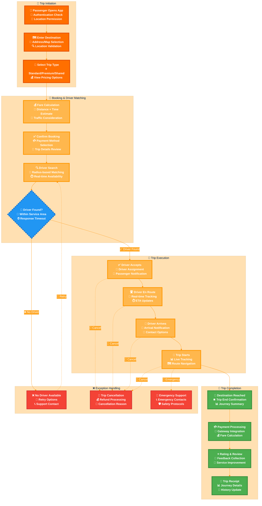
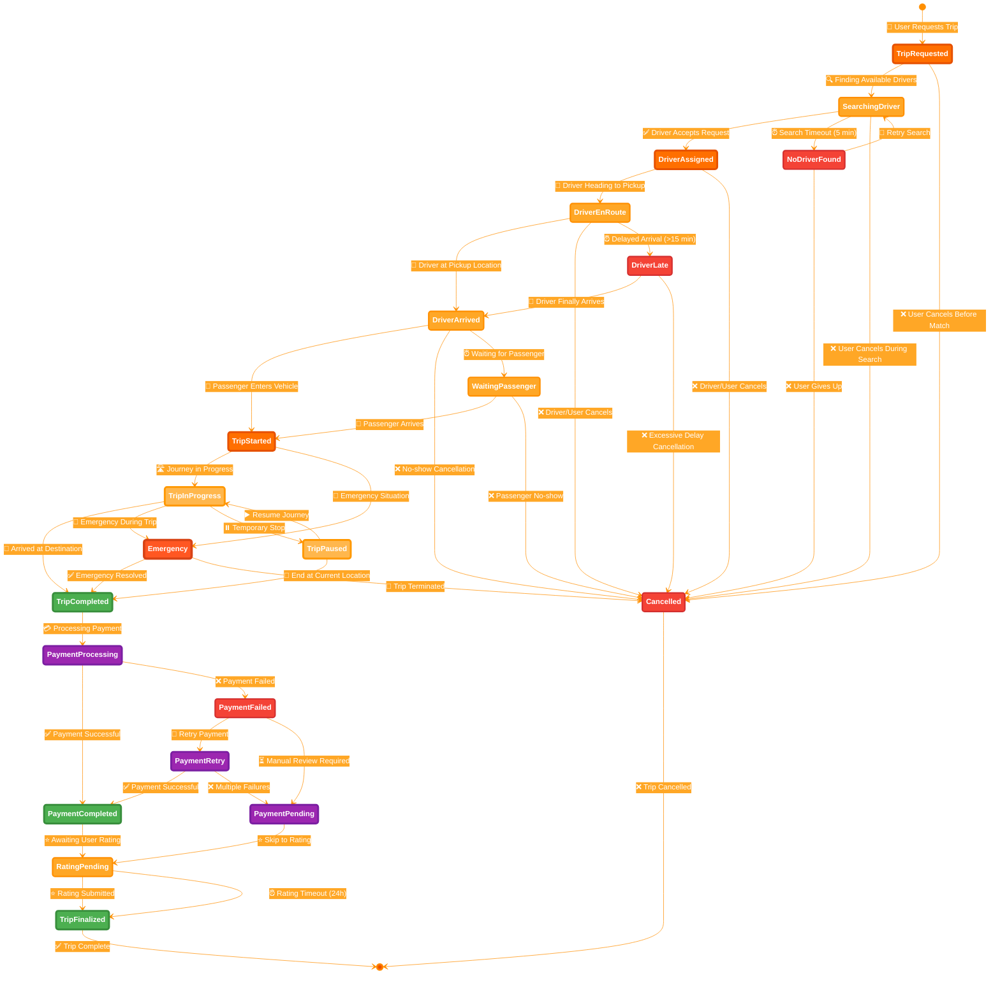
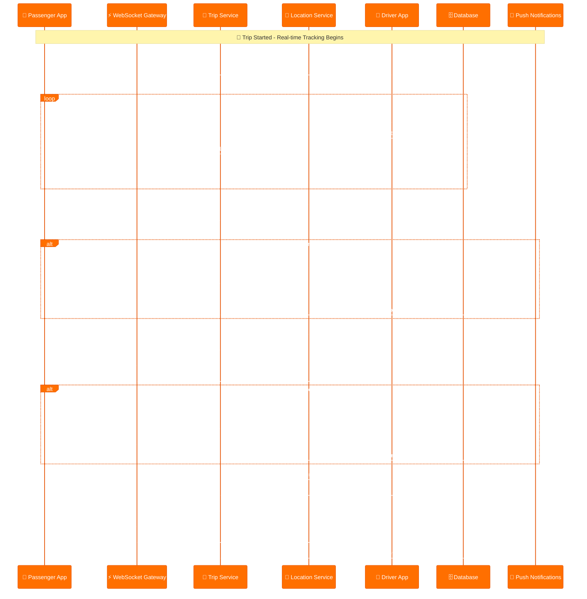
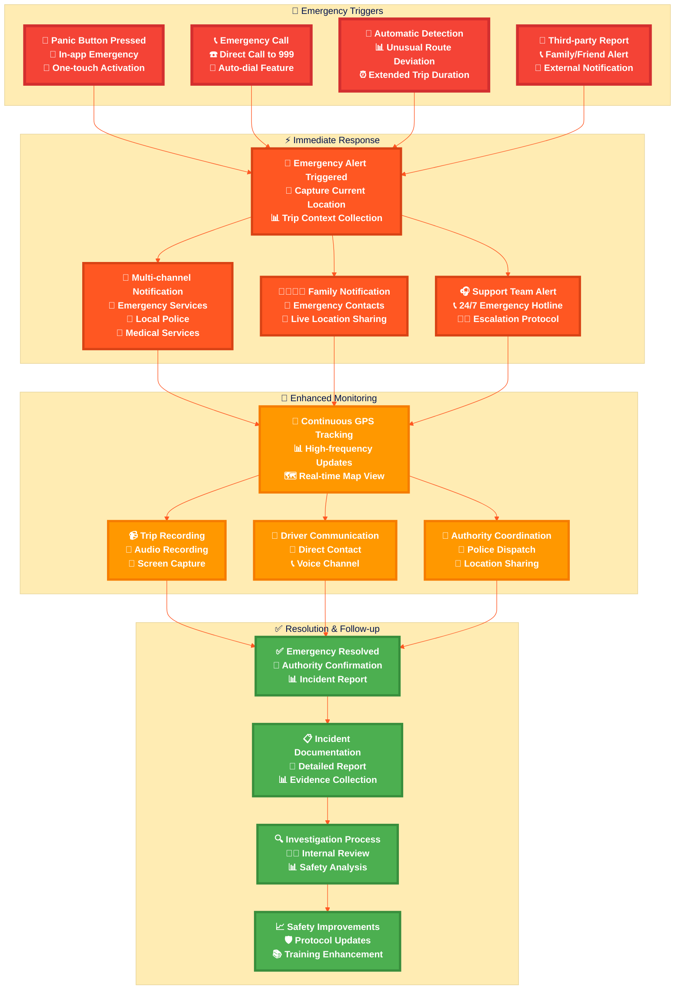

# 🚗 Trip Purpose Diagrams

This document contains comprehensive trip-related diagrams with eye-catching distinguished styling according to the Mermaid styling guide.

## 🎯 Trip Lifecycle Overview

### **Complete Trip Journey Flow**



## 🔄 Trip State Management

### **Comprehensive Trip State Diagram**



## 🎯 Driver Matching Algorithm

### **Smart Driver Assignment Process**

```mermaid
%%{init: {
  'theme': 'base',
  'themeVariables': {
    'primaryColor': '#FF6F00',
    'primaryTextColor': '#ffffff',
    'primaryBorderColor': '#E65100',
    'lineColor': '#FF8F00',
    'secondaryColor': '#FFA726',
    'tertiaryColor': '#FFE0B2',
    'background': '#ffffff',
    'mainBkg': '#FF6F00',
    'secondBkg': '#FFA726',
    'tertiaryBkg': '#FFE0B2'
  }
}}%%

flowchart TD
    %% Input Parameters
    subgraph "📍 Trip Parameters"
        A[📍 Pickup Location<br/>🎯 Destination<br/>⏰ Requested Time]
        B[🚗 Trip Type<br/>💰 Fare Estimate<br/>👥 Passenger Count]
    end

    %% Driver Discovery
    subgraph "🔍 Driver Discovery"
        C[📡 Geospatial Query<br/>📏 Radius Search (5km)<br/>🗺️ PostGIS Integration]
        D[✅ Filter Available Drivers<br/>📊 Status: Online & Available<br/>🚗 Vehicle Type Match]
        E[📊 Driver Scoring<br/>⭐ Rating Weight (40%)<br/>📏 Distance Weight (35%)<br/>⏰ Response Time (25%)]
    end

    %% Matching Logic
    subgraph "🎯 Smart Matching"
        F[📈 Calculate Match Score<br/>🧮 Weighted Algorithm<br/>📊 Real-time Metrics]
        G[📋 Rank Drivers<br/>🥇 Best Match First<br/>📊 Score Descending]
        H{🎯 Top Driver Available?<br/>📱 Online Status<br/>⏰ Response Window}
    end

    %% Assignment Process
    subgraph "✅ Assignment Process"
        I[📱 Send Trip Request<br/>🔔 Push Notification<br/>⏰ 30-second Window]
        J{📱 Driver Response?<br/>✅ Accept/❌ Decline<br/>⏰ Timeout Check}
        K[✅ Assignment Confirmed<br/>🔗 Create Trip Connection<br/>📊 Update Driver Status]
    end

    %% Fallback Handling
    subgraph "🔄 Fallback Strategy"
        L[📋 Next Best Driver<br/>🔄 Iterate Through List<br/>📊 Score Threshold Check]
        M[📡 Expand Search Radius<br/>📏 Increase to 10km<br/>🔍 Broader Discovery]
        N[❌ No Driver Available<br/>📞 Suggest Alternatives<br/>⏰ Schedule for Later]
    end

    %% Flow Connections
    A --> C
    B --> C
    C --> D
    D --> E
    E --> F
    F --> G
    G --> H
    
    H -->|✅ Available| I
    H -->|❌ Unavailable| L
    
    I --> J
    J -->|✅ Accepts| K
    J -->|❌ Declines/Timeout| L
    
    L --> H
    L -->|🔄 No More Drivers| M
    M --> C
    M -->|🔄 Still No Drivers| N

    %% Eye-catching Business Process Styling
    classDef tripParameters fill:#FF6F00,stroke:#E65100,stroke-width:4px,color:#ffffff,font-weight:bold
    classDef driverDiscovery fill:#FFA726,stroke:#FF8F00,stroke-width:4px,color:#ffffff,font-weight:bold
    classDef smartMatching fill:#FFB74D,stroke:#FF9800,stroke-width:4px,color:#ffffff,font-weight:bold
    classDef assignmentProcess fill:#4CAF50,stroke:#388E3C,stroke-width:4px,color:#ffffff,font-weight:bold
    classDef fallbackStrategy fill:#FF9800,stroke:#F57C00,stroke-width:3px,color:#ffffff,font-weight:bold
    classDef decisionNode fill:#2196F3,stroke:#1976D2,stroke-width:5px,color:#ffffff,font-weight:bold,stroke-dasharray: 8 4
    classDef errorNode fill:#F44336,stroke:#D32F2F,stroke-width:3px,color:#ffffff,font-weight:bold

    class A,B tripParameters
    class C,D,E driverDiscovery
    class F,G smartMatching
    class I,K assignmentProcess
    class L,M fallbackStrategy
    class H,J decisionNode
    class N errorNode
```

## 💰 Trip Pricing Engine

### **Dynamic Fare Calculation System**

```mermaid
%%{init: {
  'theme': 'base',
  'themeVariables': {
    'primaryColor': '#FF6F00',
    'primaryTextColor': '#ffffff',
    'primaryBorderColor': '#E65100',
    'lineColor': '#FF8F00',
    'secondaryColor': '#FFA726',
    'tertiaryColor': '#FFE0B2',
    'background': '#ffffff',
    'mainBkg': '#FF6F00',
    'secondBkg': '#FFA726',
    'tertiaryBkg': '#FFE0B2'
  }
}}%%

flowchart TD
    %% Base Calculation
    subgraph "📊 Base Fare Calculation"
        A[📏 Distance Calculation<br/>🗺️ Route Optimization<br/>📍 Pickup to Destination]
        B[⏰ Time Estimation<br/>🚦 Traffic Analysis<br/>📊 Historical Data]
        C[💰 Base Rate Application<br/>💵 Per KM Rate: 2.5 SDG<br/>⏱️ Per Minute Rate: 0.5 SDG]
    end

    %% Dynamic Factors
    subgraph "📈 Dynamic Pricing Factors"
        D[🌡️ Demand Analysis<br/>📊 Real-time Requests<br/>📈 Supply vs Demand]
        E[⏰ Time-based Multiplier<br/>🌅 Peak Hours (7-9 AM)<br/>🌆 Evening Rush (5-7 PM)]
        F[🌦️ Weather Conditions<br/>☔ Rain Surge: +20%<br/>🌪️ Storm Surge: +50%]
        G[🎉 Special Events<br/>🏟️ Stadium Events<br/>🎊 Holidays & Festivals]
    end

    %% Calculation Engine
    subgraph "🧮 Pricing Engine"
        H[💰 Calculate Base Fare<br/>📏 Distance × Rate<br/>⏰ Time × Rate]
        I[📊 Apply Surge Multiplier<br/>📈 Demand Factor<br/>⏰ Time Factor]
        J[🌦️ Weather Adjustment<br/>☔ Condition Multiplier<br/>📊 Safety Premium]
        K[🎉 Event Surcharge<br/>🏟️ Location-based<br/>📅 Date-based Premium]
    end

    %% Final Processing
    subgraph "✅ Final Fare Processing"
        L[💰 Total Fare Calculation<br/>🧮 Sum All Components<br/>📊 Minimum Fare Check]
        M[🎯 Fare Optimization<br/>💰 Competitive Analysis<br/>📊 Market Rate Check]
        N[💳 Payment Breakdown<br/>💰 Trip Fare<br/>💸 Platform Fee<br/>⭐ Driver Earnings]
        O[📱 Display to User<br/>💰 Transparent Pricing<br/>📊 Fare Breakdown]
    end

    %% Flow Connections
    A --> H
    B --> H
    C --> H
    
    D --> I
    E --> I
    F --> J
    G --> K
    
    H --> I
    I --> J
    J --> K
    K --> L
    L --> M
    M --> N
    N --> O

    %% Eye-catching Business Process Styling
    classDef baseFare fill:#FF6F00,stroke:#E65100,stroke-width:4px,color:#ffffff,font-weight:bold
    classDef dynamicFactors fill:#FFA726,stroke:#FF8F00,stroke-width:4px,color:#ffffff,font-weight:bold
    classDef pricingEngine fill:#FFB74D,stroke:#FF9800,stroke-width:4px,color:#ffffff,font-weight:bold
    classDef finalProcessing fill:#4CAF50,stroke:#388E3C,stroke-width:4px,color:#ffffff,font-weight:bold

    class A,B,C baseFare
    class D,E,F,G dynamicFactors
    class H,I,J,K pricingEngine
    class L,M,N,O finalProcessing
```

## 📍 Real-time Trip Tracking

### **Live Location & Status Updates**



## 🚨 Emergency & Safety Protocols

### **Emergency Response System**



---

## 📊 Summary

These comprehensive trip purpose diagrams provide:

- **🎯 Complete Trip Lifecycle**: From initiation to completion with all possible states
- **🔄 State Management**: Detailed state transitions with error handling
- **🎯 Smart Matching**: Advanced driver assignment algorithm
- **💰 Dynamic Pricing**: Comprehensive fare calculation system
- **📍 Real-time Tracking**: Live location and status updates
- **🚨 Emergency Protocols**: Complete safety and emergency response system

All diagrams follow the **eye-catching distinguished styling** with:
- **Warm orange business process theme** for user-friendly workflows
- **Professional visual hierarchy** with proper stroke widths and fonts
- **Enhanced emoji communication** for quick visual reference
- **Mermaid v11+ compatibility** for optimal rendering

