# 🗄️ Sikka Transportation Platform - Database Schema

> Comprehensive database design with entity relationships, constraints, and optimization strategies

## 📋 Table of Contents

- [🎯 Database Overview](#-database-overview)
- [📊 Entity Relationship Diagram](#-entity-relationship-diagram)
- [🏗️ Entity Specifications](#️-entity-specifications)
- [🔗 Relationship Details](#-relationship-details)
- [📈 Indexing Strategy](#-indexing-strategy)
- [🔒 Security & Constraints](#-security--constraints)
- [⚡ Performance Optimization](#-performance-optimization)

## 🎯 Database Overview

The Sikka Transportation Platform uses **PostgreSQL** as the primary database with **TypeORM** for object-relational mapping. The schema is designed for:

- **🚀 High Performance**: Optimized indexes and query patterns
- **🔒 Data Integrity**: Comprehensive constraints and validation
- **📈 Scalability**: Efficient relationships and normalization
- **🌍 Geospatial Support**: PostGIS for location-based operations
- **💰 Financial Accuracy**: Decimal precision for monetary values

### **📊 Database Statistics**
- **Total Entities**: 7 core entities
- **Relationships**: 15+ foreign key relationships
- **Indexes**: 25+ optimized indexes (including geospatial)
- **Constraints**: 40+ validation rules
- **Storage Engine**: PostgreSQL 13+ with PostGIS extension

## 📊 Entity Relationship Diagram


## 🏗️ Entity Specifications

### **👤 User Entity**

```typescript
@Entity('users')
export class User {
  @PrimaryGeneratedColumn('uuid')
  id: string;

  @Column({ length: 100 })
  firstName: string;

  @Column({ length: 100 })
  name: string;

  @Column({ unique: true, length: 20 })
  phone: string;

  @Column({ type: 'enum', enum: UserRole, default: UserRole.PASSENGER })
  role: UserRole;

  @Column({ type: 'enum', enum: UserStatus, default: UserStatus.ACTIVE })
  status: UserStatus;

  @Column({ type: 'decimal', precision: 3, scale: 2, default: 0 })
  averageRating: number;

  @Column({ default: 0 })
  totalTrips: number;

  @Column({ type: 'decimal', precision: 12, scale: 2, default: 0 })
  totalEarnings: number;

  @Column({ default: false })
  isAvailable: boolean;

  @Column({ nullable: true })
  lastSeen: Date;

  @Column({ type: 'json', nullable: true })
  metadata: Record<string, any>;

  @CreateDateColumn()
  createdAt: Date;

  @UpdateDateColumn()
  updatedAt: Date;
}
```

**🔍 Key Features:**
- **UUID Primary Key**: Globally unique identifiers
- **Phone Uniqueness**: Enforced unique constraint for authentication
- **Role-Based**: Passenger, Driver, Admin roles
- **Rating System**: Decimal precision for accurate ratings
- **Availability Tracking**: Real-time status for drivers
- **Metadata Support**: Flexible JSON storage for additional data

### **💰 Wallet Entity**

```typescript
@Entity('wallets')
export class Wallet {
  @PrimaryGeneratedColumn('uuid')
  id: string;

  @Column()
  userId: string;

  @Column({ type: 'decimal', precision: 12, scale: 2, default: 0 })
  balance: number;

  @Column({ type: 'decimal', precision: 12, scale: 2, default: 1000 })
  dailySpendingLimit: number;

  @Column({ type: 'decimal', precision: 12, scale: 2, default: 30000 })
  monthlySpendingLimit: number;

  @Column({ type: 'decimal', precision: 12, scale: 2, default: 0 })
  dailySpent: number;

  @Column({ type: 'decimal', precision: 12, scale: 2, default: 0 })
  monthlySpent: number;

  @Column({ default: true })
  isActive: boolean;

  @Column({ nullable: true })
  pin: string;

  @Column({ nullable: true })
  lastTransactionAt: Date;
}
```

**💡 Key Features:**
- **Decimal Precision**: Accurate monetary calculations
- **Spending Limits**: Daily and monthly transaction limits
- **PIN Security**: Optional PIN protection for transactions
- **Activity Tracking**: Last transaction timestamp
- **Balance Management**: Real-time balance updates

### **🚗 Trip Entity**

```typescript
@Entity('trips')
export class Trip {
  @PrimaryGeneratedColumn('uuid')
  id: string;

  @Column({ type: 'enum', enum: TripType, default: TripType.STANDARD })
  type: TripType;

  @Column({ type: 'enum', enum: TripStatus, default: TripStatus.REQUESTED })
  status: TripStatus;

  @Column()
  passengerId: string;

  @Column({ nullable: true })
  driverId: string;

  // Location fields with geospatial support
  @Column({ type: 'decimal', precision: 10, scale: 8 })
  pickupLatitude: number;

  @Column({ type: 'decimal', precision: 11, scale: 8 })
  pickupLongitude: number;

  @Column({ type: 'decimal', precision: 10, scale: 8 })
  dropoffLatitude: number;

  @Column({ type: 'decimal', precision: 11, scale: 8 })
  dropoffLongitude: number;

  // Fare and distance
  @Column({ type: 'decimal', precision: 8, scale: 2, nullable: true })
  estimatedFare: number;

  @Column({ type: 'decimal', precision: 8, scale: 2, nullable: true })
  actualFare: number;

  @Column({ type: 'decimal', precision: 8, scale: 3, nullable: true })
  distance: number; // in kilometers

  // Payment information
  @Column({ type: 'enum', enum: PaymentMethod, nullable: true })
  paymentMethod: PaymentMethod;

  @Column({ type: 'enum', enum: PaymentStatus, default: PaymentStatus.PENDING })
  paymentStatus: PaymentStatus;
}
```

**🎯 Key Features:**
- **Geospatial Precision**: High-precision coordinates for accurate location
- **Trip Lifecycle**: Complete status tracking from request to completion
- **Payment Integration**: Multiple payment methods and status tracking
- **Fare Calculation**: Estimated vs actual fare comparison
- **Distance Tracking**: Precise distance measurement in kilometers

### **💳 Transaction Entity**

```typescript
@Entity('transactions')
export class Transaction {
  @PrimaryGeneratedColumn('uuid')
  id: string;

  @Column({ type: 'enum', enum: TransactionType })
  type: TransactionType;

  @Column({ type: 'enum', enum: TransactionStatus, default: TransactionStatus.PENDING })
  status: TransactionStatus;

  @Column({ type: 'decimal', precision: 12, scale: 2 })
  amount: number;

  @Column({ type: 'decimal', precision: 12, scale: 2, default: 0 })
  fee: number;

  @Column({ type: 'decimal', precision: 12, scale: 2 })
  balanceBefore: number;

  @Column({ type: 'decimal', precision: 12, scale: 2 })
  balanceAfter: number;

  @Column({ nullable: true })
  externalTransactionId: string;

  @Column({ type: 'json', nullable: true })
  metadata: Record<string, any>;

  // Failure handling
  @Column({ nullable: true })
  failureReason: string;

  @Column({ nullable: true })
  failureCode: string;

  // Reversal support
  @Column({ nullable: true })
  reversalReason: string;

  @Column({ nullable: true })
  reversalTransactionId: string;
}
```

**💰 Key Features:**
- **Comprehensive Audit Trail**: Complete transaction history
- **Balance Tracking**: Before and after balance snapshots
- **External Integration**: Support for payment gateway transaction IDs
- **Failure Handling**: Detailed error tracking and resolution
- **Reversal Support**: Transaction reversal and refund capabilities

## 🔗 Relationship Details

### **🔄 One-to-One Relationships**

```mermaid
%%{init: {'theme':'base', 'themeVariables': {'primaryColor':'#ff6b6b','primaryTextColor':'#fff','primaryBorderColor':'#ff6b6b','lineColor':'#ffa726','sectionBkgColor':'#ff6b6b','altSectionBkgColor':'#fff','gridColor':'#fff','secondaryColor':'#006100','tertiaryColor':'#fff'}}}%%
graph LR
    USER[👤 User] ---|1:1| WALLET[💰 Wallet]
    USER ---|1:1| DRIVER[🚗 Driver Profile]
    
    classDef entity fill:#e3f2fd,stroke:#1976d2,stroke-width:2px
    class USER,WALLET,DRIVER entity
```


### **🔄 One-to-Many Relationships**

```mermaid
%%{init: {'theme':'base', 'themeVariables': {'primaryColor':'#ff6b6b','primaryTextColor':'#fff','primaryBorderColor':'#ff6b6b','lineColor':'#ffa726','sectionBkgColor':'#ff6b6b','altSectionBkgColor':'#fff','gridColor':'#fff','secondaryColor':'#006100','tertiaryColor':'#fff'}}}%%
graph TB
    USER[👤 User] ---|1:N| TRIP_P[🚗 Trips as Passenger]
    USER ---|1:N| TRIP_D[🚗 Trips as Driver]
    USER ---|1:N| RATING_G[⭐ Ratings Given]
    USER ---|1:N| RATING_R[⭐ Ratings Received]
    USER ---|1:N| TRANS[💳 Transactions]
    
    WALLET[💰 Wallet] ---|1:N| TRANS
    TRIP[🚗 Trip] ---|1:N| RATING[⭐ Ratings]
    TRIP ---|1:N| TRANS
    
    classDef entity fill:#e8f5e8,stroke:#388e3c,stroke-width:2px
    class USER,WALLET,TRIP entity
```


### **🔄 Many-to-Many Relationships**


## 📈 Indexing Strategy

### **🚀 Primary Indexes**
```sql
-- Primary Keys (Automatic)
CREATE UNIQUE INDEX idx_users_pkey ON users(id);
CREATE UNIQUE INDEX idx_wallets_pkey ON wallets(id);
CREATE UNIQUE INDEX idx_trips_pkey ON trips(id);
CREATE UNIQUE INDEX idx_transactions_pkey ON transactions(id);
CREATE UNIQUE INDEX idx_ratings_pkey ON ratings(id);
CREATE UNIQUE INDEX idx_driver_profiles_pkey ON driver_profiles(id);
CREATE UNIQUE INDEX idx_admin_users_pkey ON admin_users(id);
```

### **🔍 Unique Constraints**
```sql
-- Business Logic Constraints
CREATE UNIQUE INDEX idx_users_phone ON users(phone);
CREATE UNIQUE INDEX idx_wallets_user_id ON wallets(user_id);
CREATE UNIQUE INDEX idx_driver_profiles_user_id ON driver_profiles(user_id);
CREATE UNIQUE INDEX idx_admin_users_username ON admin_users(username);
CREATE UNIQUE INDEX idx_admin_users_email ON admin_users(email);
```

### **⚡ Performance Indexes**
```sql
-- Trip Queries
CREATE INDEX idx_trips_passenger_id ON trips(passenger_id);
CREATE INDEX idx_trips_driver_id ON trips(driver_id);
CREATE INDEX idx_trips_status ON trips(status);
CREATE INDEX idx_trips_created_at ON trips(created_at);
CREATE INDEX idx_trips_passenger_status ON trips(passenger_id, status);
CREATE INDEX idx_trips_driver_status ON trips(driver_id, status);

-- Transaction Queries
CREATE INDEX idx_transactions_wallet_id ON transactions(wallet_id);
CREATE INDEX idx_transactions_user_id ON transactions(user_id);
CREATE INDEX idx_transactions_trip_id ON transactions(trip_id);
CREATE INDEX idx_transactions_type ON transactions(type);
CREATE INDEX idx_transactions_status ON transactions(status);
CREATE INDEX idx_transactions_created_at ON transactions(created_at);

-- Rating Queries
CREATE INDEX idx_ratings_trip_id ON ratings(trip_id);
CREATE INDEX idx_ratings_rated_by_id ON ratings(rated_by_id);
CREATE INDEX idx_ratings_rated_user_id ON ratings(rated_user_id);
CREATE INDEX idx_ratings_type ON ratings(type);

-- User Queries
CREATE INDEX idx_users_role ON users(role);
CREATE INDEX idx_users_status ON users(status);
CREATE INDEX idx_users_is_available ON users(is_available);
CREATE INDEX idx_users_created_at ON users(created_at);
```

### **🌍 Geospatial Indexes**
```sql
-- Location-based queries (PostGIS)
CREATE INDEX idx_trips_pickup_location ON trips 
USING GIST (ST_Point(pickup_longitude, pickup_latitude));

CREATE INDEX idx_trips_dropoff_location ON trips 
USING GIST (ST_Point(dropoff_longitude, dropoff_latitude));

CREATE INDEX idx_driver_profiles_current_location ON driver_profiles 
USING GIST (ST_Point(current_longitude, current_latitude));

-- Composite geospatial indexes
CREATE INDEX idx_driver_profiles_location_available ON driver_profiles 
USING GIST (ST_Point(current_longitude, current_latitude)) 
WHERE is_available = true AND is_online = true;
```

### **📊 Composite Indexes**
```sql
-- Complex query optimization
CREATE INDEX idx_trips_passenger_status_created ON trips(passenger_id, status, created_at);
CREATE INDEX idx_transactions_user_type_created ON transactions(user_id, type, created_at);
CREATE INDEX idx_ratings_user_type_rating ON ratings(rated_user_id, type, rating);
CREATE INDEX idx_wallets_user_active_balance ON wallets(user_id, is_active, balance);
```

## 🔒 Security & Constraints

### **✅ Data Validation Constraints**
```sql
-- User constraints
ALTER TABLE users ADD CONSTRAINT chk_users_phone_format 
CHECK (phone ~ '^\+249[0-9]{9}$');

ALTER TABLE users ADD CONSTRAINT chk_users_rating_range 
CHECK (average_rating >= 0 AND average_rating <= 5);

-- Wallet constraints
ALTER TABLE wallets ADD CONSTRAINT chk_wallets_balance_positive 
CHECK (balance >= 0);

ALTER TABLE wallets ADD CONSTRAINT chk_wallets_limits_positive 
CHECK (daily_spending_limit > 0 AND monthly_spending_limit > 0);

-- Trip constraints
ALTER TABLE trips ADD CONSTRAINT chk_trips_coordinates_valid 
CHECK (pickup_latitude BETWEEN -90 AND 90 
   AND pickup_longitude BETWEEN -180 AND 180
   AND dropoff_latitude BETWEEN -90 AND 90 
   AND dropoff_longitude BETWEEN -180 AND 180);

ALTER TABLE trips ADD CONSTRAINT chk_trips_fare_positive 
CHECK (estimated_fare >= 0 AND actual_fare >= 0);

-- Transaction constraints
ALTER TABLE transactions ADD CONSTRAINT chk_transactions_amount_not_zero 
CHECK (amount != 0);

-- Rating constraints
ALTER TABLE ratings ADD CONSTRAINT chk_ratings_rating_range 
CHECK (rating >= 1 AND rating <= 5);
```

### **🔐 Foreign Key Constraints**
```sql
-- User relationships
ALTER TABLE wallets ADD CONSTRAINT fk_wallets_user_id 
FOREIGN KEY (user_id) REFERENCES users(id) ON DELETE CASCADE;

ALTER TABLE driver_profiles ADD CONSTRAINT fk_driver_profiles_user_id 
FOREIGN KEY (user_id) REFERENCES users(id) ON DELETE CASCADE;

-- Trip relationships
ALTER TABLE trips ADD CONSTRAINT fk_trips_passenger_id 
FOREIGN KEY (passenger_id) REFERENCES users(id);

ALTER TABLE trips ADD CONSTRAINT fk_trips_driver_id 
FOREIGN KEY (driver_id) REFERENCES users(id);

-- Transaction relationships
ALTER TABLE transactions ADD CONSTRAINT fk_transactions_wallet_id 
FOREIGN KEY (wallet_id) REFERENCES wallets(id);

ALTER TABLE transactions ADD CONSTRAINT fk_transactions_user_id 
FOREIGN KEY (user_id) REFERENCES users(id);

ALTER TABLE transactions ADD CONSTRAINT fk_transactions_trip_id 
FOREIGN KEY (trip_id) REFERENCES trips(id);

-- Rating relationships
ALTER TABLE ratings ADD CONSTRAINT fk_ratings_trip_id 
FOREIGN KEY (trip_id) REFERENCES trips(id);

ALTER TABLE ratings ADD CONSTRAINT fk_ratings_rated_by_id 
FOREIGN KEY (rated_by_id) REFERENCES users(id);

ALTER TABLE ratings ADD CONSTRAINT fk_ratings_rated_user_id 
FOREIGN KEY (rated_user_id) REFERENCES users(id);
```

## ⚡ Performance Optimization

### **📊 Query Optimization Strategies**

#### **🔍 Efficient Trip Queries**
```sql
-- Find nearby available drivers (optimized with geospatial index)
SELECT dp.*, u.name, u.average_rating
FROM driver_profiles dp
JOIN users u ON dp.user_id = u.id
WHERE dp.is_available = true 
  AND dp.is_online = true
  AND ST_DWithin(
    ST_Point(dp.current_longitude, dp.current_latitude),
    ST_Point($pickup_longitude, $pickup_latitude),
    $radius_in_meters
  )
ORDER BY ST_Distance(
  ST_Point(dp.current_longitude, dp.current_latitude),
  ST_Point($pickup_longitude, $pickup_latitude)
)
LIMIT 10;
```

#### **💰 Wallet Balance Queries**
```sql
-- Get wallet balance with spending limits (single query)
SELECT 
  w.balance,
  w.daily_spending_limit - w.daily_spent as daily_remaining,
  w.monthly_spending_limit - w.monthly_spent as monthly_remaining,
  w.is_active
FROM wallets w
WHERE w.user_id = $user_id AND w.is_active = true;
```

#### **📈 User Analytics Queries**
```sql
-- User trip statistics (optimized with composite index)
SELECT 
  COUNT(*) as total_trips,
  AVG(actual_fare) as average_fare,
  SUM(actual_fare) as total_spent,
  AVG(r.rating) as average_rating_given
FROM trips t
LEFT JOIN ratings r ON t.id = r.trip_id AND r.rated_by_id = t.passenger_id
WHERE t.passenger_id = $user_id 
  AND t.status = 'completed'
  AND t.created_at >= $date_from;
```

### **🚀 Caching Strategy**

#### **⚡ Redis Caching Patterns**
```typescript
// Driver location caching (TTL: 30 seconds)
await redis.setex(
  `driver:location:${driverId}`,
  30,
  JSON.stringify({
    latitude,
    longitude,
    heading,
    speed,
    timestamp: new Date()
  })
);

// User session caching (TTL: 24 hours)
await redis.setex(
  `user:session:${userId}`,
  86400,
  JSON.stringify({
    role,
    status,
    walletId,
    isAvailable
  })
);

// Trip status caching (TTL: 5 minutes)
await redis.setex(
  `trip:status:${tripId}`,
  300,
  JSON.stringify({
    status,
    driverId,
    passengerId,
    estimatedArrival
  })
);
```

### **📊 Database Monitoring**

#### **🔍 Performance Metrics**
```sql
-- Query performance monitoring
SELECT 
  query,
  calls,
  total_time,
  mean_time,
  rows
FROM pg_stat_statements
WHERE query LIKE '%trips%' OR query LIKE '%users%'
ORDER BY total_time DESC
LIMIT 10;

-- Index usage statistics
SELECT 
  schemaname,
  tablename,
  indexname,
  idx_scan,
  idx_tup_read,
  idx_tup_fetch
FROM pg_stat_user_indexes
ORDER BY idx_scan DESC;

-- Table size monitoring
SELECT 
  schemaname,
  tablename,
  pg_size_pretty(pg_total_relation_size(schemaname||'.'||tablename)) as size
FROM pg_tables
WHERE schemaname = 'public'
ORDER BY pg_total_relation_size(schemaname||'.'||tablename) DESC;
```

---

## 🎯 Schema Evolution

### **📈 Migration Strategy**
- **Versioned Migrations**: All schema changes tracked with TypeORM migrations
- **Backward Compatibility**: New columns added as nullable initially
- **Data Migration**: Separate data migration scripts for complex changes
- **Rollback Support**: All migrations include down() methods
- **Testing**: Migration testing in staging environment before production

### **🔄 Future Enhancements**
- **Partitioning**: Table partitioning for large transaction tables
- **Archiving**: Historical data archiving strategy
- **Sharding**: Horizontal sharding for extreme scale
- **Read Replicas**: Additional read replicas for analytics workloads

---

<div align="center">

**🗄️ Designed for Performance, Security, and Scale**

[⭐ Star this repo](https://github.com/abdoElHodaky/transportapp) | [📋 View Schema](../database/) | [🔧 Migration Guide](../deployment/migrations.md)

</div>

