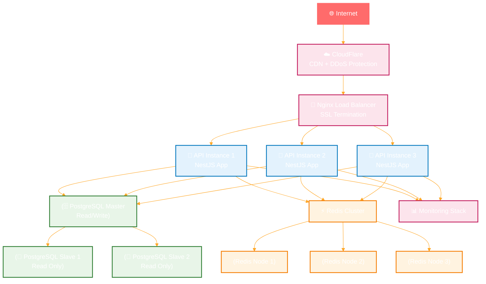
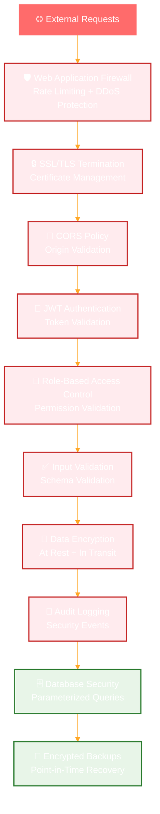
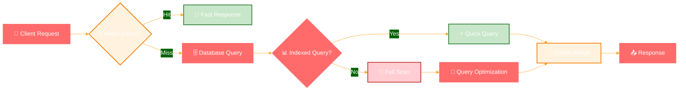

# 🏗️ Sikka Transportation Platform - System Architecture

> Comprehensive system architecture overview with detailed component interactions and data flows

## 📋 Table of Contents

- [🎯 Architecture Overview](#-architecture-overview)
- [🏗️ High-Level System Design](#️-high-level-system-design)
- [🔧 Core Components](#-core-components)
- [📊 Data Flow Architecture](#-data-flow-architecture)
- [🌐 Network Architecture](#-network-architecture)
- [🔒 Security Architecture](#-security-architecture)
- [📈 Scalability Design](#-scalability-design)

## 🎯 Architecture Overview

The Sikka Transportation Platform follows a **microservices-inspired modular architecture** built on NestJS, designed for scalability, maintainability, and real-time performance. The system supports multiple user types (Passengers, Drivers, Admins) with comprehensive trip management, payment processing, and real-time communication.

### **🎨 Architecture Principles**
- **Modular Design**: Clear separation of concerns with dedicated modules
- **Real-time First**: WebSocket-based live updates and communication
- **Payment-Centric**: Multi-gateway payment processing with wallet system
- **Security-First**: JWT authentication, input validation, role-based access
- **Scalable**: Designed for horizontal scaling and high availability

## 🏗️ High-Level System Design

```mermaid
%%{init: {'theme':'base', 'themeVariables': {'primaryColor':'#ff6b6b','primaryTextColor':'#fff','primaryBorderColor':'#ff6b6b','lineColor':'#ffa726','sectionBkgColor':'#ff6b6b','altSectionBkgColor':'#fff','gridColor':'#fff','secondaryColor':'#006100','tertiaryColor':'#fff'}}}%%
graph TB
    %% External Clients
    PA["📱 Passenger App<br/>React Native/Flutter"] --> LB["🔄 Load Balancer<br/>Nginx"]
    DA["🚗 Driver App<br/>React Native/Flutter"] --> LB
    AD["💻 Admin Dashboard<br/>React/Vue.js"] --> LB
    
    %% Load Balancer to API Gateway
    LB --> AG["🚪 API Gateway<br/>NestJS Main App"]
    
    %% Core Services
    AG --> AS["🔐 Authentication Service<br/>JWT + OTP Verification"]
    AG --> TS["🚗 Trip Management Service<br/>Booking + Matching"]
    AG --> PS["💳 Payment Service<br/>Multi-Gateway Processing"]
    AG --> US["👥 User Service<br/>Profile Management"]
    AG --> LS["📍 Location Service<br/>GPS + Geospatial"]
    AG --> RS["⭐ Rating Service<br/>Feedback System"]
    AG --> WS["🌐 WebSocket Gateway<br/>Real-time Communication"]
    
    %% Database Layer
    AS --> DB["(🗄️ PostgreSQL<br/>Primary Database)"]
    TS --> DB
    PS --> DB
    US --> DB
    LS --> DB
    RS --> DB
    
    %% Caching Layer
    AS --> REDIS["(⚡ Redis<br/>Session + Cache)"]
    LS --> REDIS
    WS --> REDIS
    
    %% External Services
    PS --> EBS["🏦 EBS Gateway<br/>Bank Payments"]
    PS --> CP["💰 CyberPay Gateway<br/>Digital Payments"]
    AS --> SMS["📱 SMS Service<br/>OTP Delivery"]
    LS --> MAPS["🗺️ Maps API<br/>Geocoding + Routing"]
    
    %% Monitoring & Logging
    AG --> MON["📊 Monitoring<br/>Prometheus + Grafana"]
    AG --> LOG["📝 Logging<br/>Winston + ELK Stack"]
    
    %% Styling
    classDef client fill:#e1f5fe,stroke:#01579b,stroke-width:2px;
    classDef service fill:#f3e5f5,stroke:#4a148c,stroke-width:2px;
    classDef database fill:#e8f5e8,stroke:#1b5e20,stroke-width:2px;
    classDef external fill:#fff3e0,stroke:#e65100,stroke-width:2px;
    classDef monitoring fill:#fce4ec,stroke:#880e4f,stroke-width:2px;
    
    class PA,DA,AD client;
    class AS,TS,PS,US,LS,RS,WS service;
    class DB,REDIS database;
    class EBS,CP,SMS,MAPS external;
    class MON,LOG monitoring;
```



## 🔧 Core Components

### **🔐 Authentication Service**
- **Purpose**: User authentication, authorization, and session management
- **Features**: 
  - OTP-based phone verification
  - JWT token generation with refresh token rotation
  - Role-based access control (Passenger, Driver, Admin)
  - Automatic wallet creation on registration
- **Dependencies**: PostgreSQL, Redis, SMS Service

### **🚗 Trip Management Service**
- **Purpose**: Complete trip lifecycle management
- **Features**:
  - Trip request and booking
  - Intelligent driver-passenger matching
  - Dynamic fare calculation
  - Trip status tracking and updates
  - Trip completion and rating integration
- **Dependencies**: PostgreSQL, Location Service, Payment Service

### **💳 Payment Service**
- **Purpose**: Multi-gateway payment processing and wallet management
- **Features**:
  - EBS and CyberPay gateway integration
  - Digital wallet with spending limits
  - Commission distribution (15% platform, 85% driver)
  - Refund processing and transaction history
  - Cash payment handling
- **Dependencies**: PostgreSQL, External Payment Gateways

### **📍 Location Service**
- **Purpose**: GPS tracking and geospatial operations
- **Features**:
  - Real-time driver location tracking
  - Nearby driver queries with Redis geospatial indexing
  - Route calculation and optimization
  - Geofencing and area management
- **Dependencies**: PostgreSQL, Redis, Maps API

### **🌐 WebSocket Gateway**
- **Purpose**: Real-time communication and live updates
- **Features**:
  - Live trip status updates
  - Driver location streaming
  - In-app messaging
  - Push notifications
  - Connection management and heartbeat
- **Dependencies**: Redis, Socket.IO

### **⭐ Rating Service**
- **Purpose**: User feedback and reputation management
- **Features**:
  - Trip rating system (1-5 stars)
  - Comment and feedback collection
  - User reputation calculation
  - Rating analytics and reporting
- **Dependencies**: PostgreSQL

## 📊 Data Flow Architecture

### **🚗 Trip Booking Flow**

```mermaid
sequenceDiagram
    participant P as "📱 Passenger App"
    participant AG as "🚪 API Gateway"
    participant TS as "🚗 Trip Service"
    participant LS as "📍 Location Service"
    participant WS as "🌐 WebSocket Gateway"
    participant D as "🚗 Driver App"
    participant PS as "💳 Payment Service"
    
    P->>AG: Request Trip
    AG->>TS: Create Trip Request
    TS->>LS: Find Nearby Drivers
    LS->>TS: Return Driver List
    TS->>WS: Broadcast Trip to Drivers
    WS->>D: New Trip Notification
    
    D->>AG: Accept Trip
    AG->>TS: Update Trip Status
    TS->>WS: Notify Passenger
    WS->>P: Driver Assigned
    
    D->>WS: Location Updates
    WS->>P: Live Driver Location
    
    D->>AG: Complete Trip
    AG->>TS: Mark Trip Complete
    TS->>PS: Process Payment
    PS->>TS: Payment Confirmed
    TS->>WS: Trip Completed
    WS->>P: Trip Finished
    WS->>D: Payment Processed

    %% --- DARK GRADIENT & GLOW STYLING ---
    
    %% Main Dashboard (Neon Cyan/Blue)
    classDef main fill:#0d1117,stroke:#58a6ff,stroke-width:4px,color:#58a6ff,font-weight:bold;
    
    %% Decision Diamond (Gold Glow)
    classDef decision fill:#161b22,stroke:#d29922,color:#d29922,stroke-dasharray: 5 5;
    
    %% Revenue (Emerald Gradient Style)
    classDef revNode fill:#04190b,stroke:#3fb950,color:#aff5b4,stroke-width:2px;
    
    %% Commission (Purple Gradient Style)
    classDef commNode fill:#12101e,stroke:#bc8cff,color:#e2c5ff,stroke-width:2px;
    
    %% Refund (Ruby Gradient Style)
    classDef refNode fill:#1a0b0b,stroke:#ff7b72,color:#ffa198,stroke-width:2px;
    
    %% Earnings (Sapphire Gradient Style)
    classDef earnNode fill:#051221,stroke:#388bfd,color:#a5d6ff,stroke-width:2px;

    class AG main;
    class D decision;
    class LS revNode;
    class P commNode;
    class PS refNode;
    class TS earnNode;
    class WS main;
```

### **💳 Payment Processing Flow**

```mermaid
sequenceDiagram
    participant U as "👤 User"
    participant PS as "💳 Payment Service"
    participant W as "💰 Wallet Service"
    participant EBS as "🏦 EBS Gateway"
    participant DB as "🗄️ Database"
    
    U->>PS: Initiate Payment
    PS->>DB: Create Transaction Record
    
    alt Wallet Payment
        PS->>W: Check Balance
        W->>PS: Balance Available
        PS->>W: Deduct Amount
        PS->>DB: Update Transaction (Completed)
    else Gateway Payment
        PS->>EBS: Process Payment
        EBS->>PS: Payment Response
        PS->>DB: Update Transaction Status
        PS->>W: Credit Wallet (if topup)
    end
    
    PS->>PS: Calculate Commission
    PS->>W: Transfer Driver Earnings (85%)
    PS->>W: Collect Platform Fee (15%)
    PS->>U: Payment Confirmation

    %% --- DARK GRADIENT & GLOW STYLING ---
    
    %% Main Dashboard (Neon Cyan/Blue)
    classDef main fill:#0d1117,stroke:#58a6ff,stroke-width:4px,color:#58a6ff,font-weight:bold;
    
    %% Decision Diamond (Gold Glow)
    classDef decision fill:#161b22,stroke:#d29922,color:#d29922,stroke-dasharray: 5 5;
    
    %% Revenue (Emerald Gradient Style)
    classDef revNode fill:#04190b,stroke:#3fb950,color:#aff5b4,stroke-width:2px;
    
    %% Commission (Purple Gradient Style)
    classDef commNode fill:#12101e,stroke:#bc8cff,color:#e2c5ff,stroke-width:2px;
    
    %% Refund (Ruby Gradient Style)
    classDef refNode fill:#1a0b0b,stroke:#ff7b72,color:#ffa198,stroke-width:2px;
    
    %% Earnings (Sapphire Gradient Style)
    classDef earnNode fill:#051221,stroke:#388bfd,color:#a5d6ff,stroke-width:2px;

    class DB main;
    class EBS decision;
    class PS revNode;
    class U commNode;
    class W refNode;
```

## 🌐 Network Architecture

### **🔄 Load Balancing & Scaling**



## 🔒 Security Architecture

### **🛡️ Multi-Layer Security**



### **🔐 Authentication Flow**

```mermaid
sequenceDiagram
    participant U as "👤 User"
    participant APP as "📱 Mobile App"
    participant AG as "🚪 API Gateway"
    participant AS as "🔐 Auth Service"
    participant SMS as "📱 SMS Service"
    participant DB as "🗄️ Database"
    participant REDIS as "⚡ Redis"
    
    U->>APP: Enter Phone Number
    APP->>AG: Register/Login Request
    AG->>AS: Validate Phone Format
    AS->>SMS: Send OTP
    SMS->>U: OTP Message
    
    U->>APP: Enter OTP
    APP->>AG: Verify OTP
    AG->>AS: Validate OTP
    AS->>REDIS: Check OTP Cache
    REDIS->>AS: OTP Valid
    
    AS->>DB: Create/Update User
    AS->>AS: Generate JWT Tokens
    AS->>REDIS: Store Refresh Token
    AS->>AG: Return Tokens
    AG->>APP: Authentication Success
    
    Note over APP,REDIS: Subsequent requests use JWT
    APP->>AG: API Request + JWT
    AG->>AS: Validate JWT
    AS->>AG: Token Valid
    AG->>APP: API Response

    %% --- DARK GRADIENT & GLOW STYLING ---
    
    %% Main Dashboard (Neon Cyan/Blue)
    classDef main fill:#0d1117,stroke:#58a6ff,stroke-width:4px,color:#58a6ff,font-weight:bold;
    
    %% Decision Diamond (Gold Glow)
    classDef decision fill:#161b22,stroke:#d29922,color:#d29922,stroke-dasharray: 5 5;
    
    %% Revenue (Emerald Gradient Style)
    classDef revNode fill:#04190b,stroke:#3fb950,color:#aff5b4,stroke-width:2px;
    
    %% Commission (Purple Gradient Style)
    classDef commNode fill:#12101e,stroke:#bc8cff,color:#e2c5ff,stroke-width:2px;
    
    %% Refund (Ruby Gradient Style)
    classDef refNode fill:#1a0b0b,stroke:#ff7b72,color:#ffa198,stroke-width:2px;
    
    %% Earnings (Sapphire Gradient Style)
    classDef earnNode fill:#051221,stroke:#388bfd,color:#a5d6ff,stroke-width:2px;

    class AG main;
    class APP decision;
    class AS revNode;
    class DB commNode;
    class SMS refNode;
    class U earnNode;
```

## 📈 Scalability Design

### **🚀 Horizontal Scaling Strategy**

| **Component** | **Scaling Method** | **Considerations** |
|---------------|-------------------|-------------------|
| **API Gateway** | Horizontal (Load Balanced) | Stateless design, session in Redis |
| **WebSocket Gateway** | Horizontal (Sticky Sessions) | Redis pub/sub for cross-instance communication |
| **Database** | Master-Slave Replication | Read replicas for query distribution |
| **Redis** | Cluster Mode | Sharding for high availability |
| **File Storage** | CDN + Object Storage | Static assets and user uploads |

### **📊 Performance Optimization**



### **🔄 Auto-Scaling Configuration**

```yaml
# Kubernetes HPA Configuration
apiVersion: autoscaling/v2
kind: HorizontalPodAutoscaler
metadata:
  name: sikka-api-hpa
spec:
  scaleTargetRef:
    apiVersion: apps/v1
    kind: Deployment
    name: sikka-api
  minReplicas: 3
  maxReplicas: 20
  metrics:
  - type: Resource
    resource:
      name: cpu
      target:
        type: Utilization
        averageUtilization: 70
  - type: Resource
    resource:
      name: memory
      target:
        type: Utilization
        averageUtilization: 80
```

## 🎯 Architecture Benefits

### **✅ Advantages**
- **🚀 High Performance**: Redis caching, database indexing, optimized queries
- **📈 Scalable**: Horizontal scaling support, microservices-ready architecture
- **🔒 Secure**: Multi-layer security, JWT authentication, input validation
- **🌐 Real-time**: WebSocket-based live updates and communication
- **💰 Payment-Ready**: Multi-gateway support with comprehensive wallet system
- **📊 Observable**: Comprehensive logging, monitoring, and analytics
- **🔧 Maintainable**: Modular design, clear separation of concerns
- **🧪 Testable**: Dependency injection, service isolation

### **⚠️ Considerations**
- **Complexity**: Multiple services require coordination and monitoring
- **Network Latency**: Service-to-service communication overhead
- **Data Consistency**: Eventual consistency in distributed scenarios
- **Deployment**: Container orchestration and service discovery needed

---

## 📞 Next Steps

This architecture provides a solid foundation for the Sikka Transportation Platform. For detailed implementation guides, see:

- [📊 Database Schema Design](database-schema.md)
- [🔌 API Flow Documentation](api-flows.md)
- [🌐 WebSocket Event Specification](websocket-events.md)
- [👥 User Journey Flows](../user-journeys/)
- [🚀 Deployment Guide](../deployment/)

---

<div align="center">

**🏗️ Built for Scale, Security, and Performance**

[⭐ Star this repo](https://github.com/abdoElHodaky/transportapp) | [📋 View Issues](https://github.com/abdoElHodaky/transportapp/issues) | [💡 Suggest Features](https://github.com/abdoElHodaky/transportapp/discussions)

</div>

