# 🏗️ Sikka Transportation Platform - System Architecture

> Comprehensive system architecture overview with detailed component interactions and data flows

## 📋 Table of Contents

- [🎯 Architecture Overview](#-architecture-overview)
- [🏗️ High-Level System Design](#️-high-level-system-design)
- [🔧 Core Components](#-core-components)
- [📊 Data Flow Architecture](#-data-flow-architecture)
- [🌐 Network Architecture](#-network-architecture)
- [🔒 Security Architecture](#-security-architecture)
- [📈 Scalability Design](#-scalability-design)

## 🎯 Architecture Overview

The Sikka Transportation Platform follows a **microservices-inspired modular architecture** built on NestJS, designed for scalability, maintainability, and real-time performance. The system supports multiple user types (Passengers, Drivers, Admins) with comprehensive trip management, payment processing, and real-time communication.

### **🎨 Architecture Principles**
- **Modular Design**: Clear separation of concerns with dedicated modules
- **Real-time First**: WebSocket-based live updates and communication
- **Payment-Centric**: Multi-gateway payment processing with wallet system
- **Security-First**: JWT authentication, input validation, role-based access
- **Scalable**: Designed for horizontal scaling and high availability

## 🏗️ High-Level System Design

```mermaid
%% {init : {'theme':'base', 'themeVariables': {'primaryColor':'#ff6b6b', 'primaryTextColor':'#fff','primaryBorderColor':'#ff6b6b','lineColor':'#ffa726','sectionBkgColor':'#ff6b6b','altSectionBkgColor':'#fff','gridColor':'#fff','secondaryColor':'#006100','tertiaryColor':'#fff'}}}%% 
%%{init: {
  "theme": "dark",
  "themeVariables": {
    "primaryColor": "#0d1117",
    "primaryTextColor": "#c9d1d9",
    "primaryBorderColor": "#1f6feb",
    "lineColor": "#1f6feb",
    "secondaryColor": "#388bfd",
    "tertiaryColor": "#79c0ff",
    "background": "#0d1117",
    "mainBkg": "#0d1117",
    "secondBkg": "#30363d",
    "tertiaryBkg": "#79c0ff"
  },
  "flowchart": {
    "useMaxWidth": true,
    "htmlLabels": true
  },
  "sequence": {
    "useMaxWidth": true,
    "wrap": true
  },
  "class": {
    "useMaxWidth": true
  },
  "state": {
    "useMaxWidth": true
  },
  "er": {
    "useMaxWidth": true
  },
  "gantt": {
    "useMaxWidth": true
  }
}%%
graph TB
    %%  External Clients
    PA["📱 Passenger App&lt;br/&gt;React Native/Flutter"] --> LB["🔄 Load Balancer&lt;br/&gt;Nginx"]
    DA["🚗 Driver App&lt;br/&gt;React Native/Flutter"] --> LB
    AD["💻 Admin Dashboard&lt;br/&gt;React/Vue.js"] --> LB
    
    %%  Load Balancer to API Gateway
    LB --> AG["🚪 API Gateway&lt;br/&gt;NestJS Main App"]
    
    %%  Core Services
    AG --> AS["🔐 Authentication Service&lt;br/&gt;JWT + OTP Verification"]
    AG --> TS["🚗 Trip Management Service&lt;br/&gt;Booking + Matching"]
    AG --> PS["💳 Payment Service&lt;br/&gt;Multi-Gateway Processing"]
    AG --> US["👥 User Service&lt;br/&gt;Profile Management"]
    AG --> LS["📍 Location Service&lt;br/&gt;GPS + Geospatial"]
    AG --> RS["⭐ Rating Service&lt;br/&gt;Feedback System"]
    AG --> WS["🌐 WebSocket Gateway&lt;br/&gt;Real-time Communication"]
    
    %%  Database Layer
    AS --> DB["(🗄️ PostgreSQL&lt;br/&gt;Primary Database)"]
    TS --> DB
    PS --> DB
    US --> DB
    LS --> DB
    RS --> DB
    
    %%  Caching Layer
    AS --> REDIS["(⚡ Redis&lt;br/&gt;Session + Cache)"]
    LS --> REDIS
    WS --> REDIS
    
    %%  External Services
    PS --> EBS["🏦 EBS Gateway&lt;br/&gt;Bank Payments"]
    PS --> CP["💰 CyberPay Gateway&lt;br/&gt;Digital Payments"]
    AS --> SMS["📱 SMS Service&lt;br/&gt;OTP Delivery"]
    LS --> MAPS["🗺️ Maps API&lt;br/&gt;Geocoding + Routing"]
    
    %%  Monitoring & Logging
    AG --> MON["📊 Monitoring&lt;br/&gt;Prometheus + Grafana"]
    AG --> LOG["📝 Logging&lt;br/&gt;Winston + ELK Stack"]
    
    %%  Styling
    classDef client fill : #e1f5fe, stroke:#01579b, stroke-width: 2px;
    
    classDef service fill : #f3e5f5, stroke:#4a148c, stroke-width: 2px;
    
    classDef database fill : #e8f5e8, stroke:#1b5e20, stroke-width: 2px;
    
    classDef external fill : #fff3e0, stroke:#e65100, stroke-width: 2px;
    
    classDef monitoring fill : #fce4ec, stroke:#880e4f, stroke-width: 2px;
    
    
    class PA,DA,AD client;
    class AS,TS,PS,US,LS,RS,WS service;
    class DB,REDIS database;
    class EBS,CP,SMS,MAPS external;
    class MON,LOG monitoring;




    %% --- ARCHITECTURE (TECH BLUE) THEME STYLING ---
    
    %% Primary nodes (main components)
    classDef primary fill:#0d1117,stroke:#1f6feb,stroke-width:4px,color:#c9d1d9,font-weight:bold;
    
    %% Secondary nodes (supporting components)
    classDef secondary fill:#0d1117,stroke:#388bfd,stroke-width:3px,color:#c9d1d9,font-weight:normal;
    
    %% Accent nodes (highlights)
    classDef accent fill:#0d1117,stroke:#79c0ff,stroke-width:2px,color:#79c0ff,font-weight:bold;
    
    %% Success nodes (positive outcomes)
    classDef success fill:#0d1117,stroke:#238636,stroke-width:3px,color:#238636,font-weight:bold;
    
    %% Warning nodes (attention needed)
    classDef warning fill:#0d1117,stroke:#d29922,stroke-width:3px,color:#d29922,font-weight:bold,stroke-dasharray: 5 5;
    
    %% Error nodes (problems/failures)
    classDef error fill:#0d1117,stroke:#da3633,stroke-width:3px,color:#da3633,font-weight:bold,stroke-dasharray: 10 5;
    
    %% Database nodes (data storage)
    classDef database fill:#0d1117,stroke:#79c0ff,stroke-width:4px,color:#79c0ff,font-weight:bold;
    
    %% Process nodes (operations)
    classDef process fill:#30363d,stroke:#1f6feb,stroke-width:2px,color:#c9d1d9,font-weight:normal;
    
    %% Decision nodes (branching points)
    classDef decision fill:#0d1117,stroke:#d29922,stroke-width:3px,color:#d29922,font-weight:bold,stroke-dasharray: 8 4;
    
    %% External nodes (third-party services)
    classDef external fill:#0d1117,stroke:#388bfd,stroke-width:2px,color:#388bfd,font-weight:normal,stroke-dasharray: 3 3;

    class PA secondary;
    class LB accent;
    class DA secondary;
    class AD accent;
    class AG primary;
    class AS primary;
    class TS primary;
    class PS primary;
    class US primary;
    class LS primary;
    class RS primary;
    class WS primary;
    class DB database;
    class REDIS database;
    class EBS primary;
    class CP primary;
    class SMS primary;
    class MAPS primary;
    class MON accent;
    class LOG accent;
```



## 🔧 Core Components

### **🔐 Authentication Service**
- **Purpose**: User authentication, authorization, and session management
- **Features**: 
  - OTP-based phone verification
  - JWT token generation with refresh token rotation
  - Role-based access control (Passenger, Driver, Admin)
  - Automatic wallet creation on registration
- **Dependencies**: PostgreSQL, Redis, SMS Service

### **🚗 Trip Management Service**
- **Purpose**: Complete trip lifecycle management
- **Features**:
  - Trip request and booking
  - Intelligent driver-passenger matching
  - Dynamic fare calculation
  - Trip status tracking and updates
  - Trip completion and rating integration
- **Dependencies**: PostgreSQL, Location Service, Payment Service

### **💳 Payment Service**
- **Purpose**: Multi-gateway payment processing and wallet management
- **Features**:
  - EBS and CyberPay gateway integration
  - Digital wallet with spending limits
  - Commission distribution (15% platform, 85% driver)
  - Refund processing and transaction history
  - Cash payment handling
- **Dependencies**: PostgreSQL, External Payment Gateways

### **📍 Location Service**
- **Purpose**: GPS tracking and geospatial operations
- **Features**:
  - Real-time driver location tracking
  - Nearby driver queries with Redis geospatial indexing
  - Route calculation and optimization
  - Geofencing and area management
- **Dependencies**: PostgreSQL, Redis, Maps API

### **🌐 WebSocket Gateway**
- **Purpose**: Real-time communication and live updates
- **Features**:
  - Live trip status updates
  - Driver location streaming
  - In-app messaging
  - Push notifications
  - Connection management and heartbeat
- **Dependencies**: Redis, Socket.IO

### **⭐ Rating Service**
- **Purpose**: User feedback and reputation management
- **Features**:
  - Trip rating system (1-5 stars)
  - Comment and feedback collection
  - User reputation calculation
  - Rating analytics and reporting
- **Dependencies**: PostgreSQL

## 📊 Data Flow Architecture

### **🚗 Trip Booking Flow**

```mermaid
%%{init: {
  "theme": "dark",
  "themeVariables": {
    "primaryColor": "#0d1117",
    "primaryTextColor": "#c9d1d9",
    "primaryBorderColor": "#1f6feb",
    "lineColor": "#1f6feb",
    "secondaryColor": "#388bfd",
    "tertiaryColor": "#79c0ff",
    "background": "#0d1117",
    "mainBkg": "#0d1117",
    "secondBkg": "#30363d",
    "tertiaryBkg": "#79c0ff"
  },
  "flowchart": {
    "useMaxWidth": true,
    "htmlLabels": true
  },
  "sequence": {
    "useMaxWidth": true,
    "wrap": true
  },
  "class": {
    "useMaxWidth": true
  },
  "state": {
    "useMaxWidth": true
  },
  "er": {
    "useMaxWidth": true
  },
  "gantt": {
    "useMaxWidth": true
  }
}%%
sequenceDiagram
    participant P as "📱 Passenger App"
    participant AG as "🚪 API Gateway"
    participant TS as "🚗 Trip Service"
    participant LS as "📍 Location Service"
    participant WS as "🌐 WebSocket Gateway"
    participant D as "🚗 Driver App"
    participant PS as "💳 Payment Service"
    
    P->>AG: Request Trip
    AG->>TS: Create Trip Request
    TS->>LS: Find Nearby Drivers
    LS->>TS: Return Driver List
    TS->>WS: Broadcast Trip to Drivers
    WS->>D: New Trip Notification
    
    D->>AG: Accept Trip
    AG->>TS: Update Trip Status
    TS->>WS: Notify Passenger
    WS->>P: Driver Assigned
    
    D->>WS: Location Updates
    WS->>P: Live Driver Location
    
    D->>AG: Complete Trip
    AG->>TS: Mark Trip Complete
    TS->>PS: Process Payment
    PS->>TS: Payment Confirmed
    TS->>WS: Trip Completed
    WS->>P: Trip Finished
    WS->>D: Payment Processed

    %%  --- DARK GRADIENT & GLOW STYLING ---
    
    %%  Main Dashboard (Neon Cyan/Blue)
    classDef main fill : #0d1117, stroke:#58a6ff, stroke-width: 4px,color:#58a6ff,font-weight: bold;
    
    
    %%  Decision Diamond (Gold Glow)
    classDef decision fill : #161b22, stroke:#d29922, color:#d29922,stroke-dasharray: 5 5;
    
    
    %%  Revenue (Emerald Gradient Style)
    classDef revNode fill : #04190b, stroke:#3fb950, color:#aff5b4,stroke-width: 2px;
    
    
    %%  Commission (Purple Gradient Style)
    classDef commNode fill : #12101e, stroke:#bc8cff, color:#e2c5ff,stroke-width: 2px;
    
    
    %%  Refund (Ruby Gradient Style)
    classDef refNode fill : #1a0b0b, stroke:#ff7b72, color:#ffa198,stroke-width: 2px;
    
    
    %%  Earnings (Sapphire Gradient Style)
    classDef earnNode fill : #051221, stroke:#388bfd, color:#a5d6ff,stroke-width: 2px;
    

    class AG main;
    class D decision;
    class LS revNode;
    class P commNode;
    class PS refNode;
    class TS earnNode;
    class WS main;


    %% --- ARCHITECTURE (TECH BLUE) THEME STYLING ---
    
    %% Primary nodes (main components)
    classDef primary fill:#0d1117,stroke:#1f6feb,stroke-width:4px,color:#c9d1d9,font-weight:bold;
    
    %% Secondary nodes (supporting components)
    classDef secondary fill:#0d1117,stroke:#388bfd,stroke-width:3px,color:#c9d1d9,font-weight:normal;
    
    %% Accent nodes (highlights)
    classDef accent fill:#0d1117,stroke:#79c0ff,stroke-width:2px,color:#79c0ff,font-weight:bold;
    
    %% Success nodes (positive outcomes)
    classDef success fill:#0d1117,stroke:#238636,stroke-width:3px,color:#238636,font-weight:bold;
    
    %% Warning nodes (attention needed)
    classDef warning fill:#0d1117,stroke:#d29922,stroke-width:3px,color:#d29922,font-weight:bold,stroke-dasharray: 5 5;
    
    %% Error nodes (problems/failures)
    classDef error fill:#0d1117,stroke:#da3633,stroke-width:3px,color:#da3633,font-weight:bold,stroke-dasharray: 10 5;
    
    %% Database nodes (data storage)
    classDef database fill:#0d1117,stroke:#79c0ff,stroke-width:4px,color:#79c0ff,font-weight:bold;
    
    %% Process nodes (operations)
    classDef process fill:#30363d,stroke:#1f6feb,stroke-width:2px,color:#c9d1d9,font-weight:normal;
    
    %% Decision nodes (branching points)
    classDef decision fill:#0d1117,stroke:#d29922,stroke-width:3px,color:#d29922,font-weight:bold,stroke-dasharray: 8 4;
    
    %% External nodes (third-party services)
    classDef external fill:#0d1117,stroke:#388bfd,stroke-width:2px,color:#388bfd,font-weight:normal,stroke-dasharray: 3 3;


```

### **💳 Payment Processing Flow**

```mermaid
%%{init: {
  "theme": "dark",
  "themeVariables": {
    "primaryColor": "#0d1117",
    "primaryTextColor": "#c9d1d9",
    "primaryBorderColor": "#1f6feb",
    "lineColor": "#1f6feb",
    "secondaryColor": "#388bfd",
    "tertiaryColor": "#79c0ff",
    "background": "#0d1117",
    "mainBkg": "#0d1117",
    "secondBkg": "#30363d",
    "tertiaryBkg": "#79c0ff"
  },
  "flowchart": {
    "useMaxWidth": true,
    "htmlLabels": true
  },
  "sequence": {
    "useMaxWidth": true,
    "wrap": true
  },
  "class": {
    "useMaxWidth": true
  },
  "state": {
    "useMaxWidth": true
  },
  "er": {
    "useMaxWidth": true
  },
  "gantt": {
    "useMaxWidth": true
  }
}%%
sequenceDiagram
    participant U as "👤 User"
    participant PS as "💳 Payment Service"
    participant W as "💰 Wallet Service"
    participant EBS as "🏦 EBS Gateway"
    participant DB as "🗄️ Database"
    
    U->>PS: Initiate Payment
    PS->>DB: Create Transaction Record
    
    alt Wallet Payment
        PS->>W: Check Balance
        W->>PS: Balance Available
        PS->>W: Deduct Amount
        PS->>DB: Update Transaction (Completed)
    else Gateway Payment
        PS->>EBS: Process Payment
        EBS->>PS: Payment Response
        PS->>DB: Update Transaction Status
        PS->>W: Credit Wallet (if topup)
    end
    
    PS->>PS: Calculate Commission
    PS->>W: Transfer Driver Earnings (85%)
    PS->>W: Collect Platform Fee (15%)
    PS->>U: Payment Confirmation

    %%  --- DARK GRADIENT & GLOW STYLING ---
    
    %%  Main Dashboard (Neon Cyan/Blue)
    classDef main fill : #0d1117, stroke:#58a6ff, stroke-width: 4px,color:#58a6ff,font-weight: bold;
    
    
    %%  Decision Diamond (Gold Glow)
    classDef decision fill : #161b22, stroke:#d29922, color:#d29922,stroke-dasharray: 5 5;
    
    
    %%  Revenue (Emerald Gradient Style)
    classDef revNode fill : #04190b, stroke:#3fb950, color:#aff5b4,stroke-width: 2px;
    
    
    %%  Commission (Purple Gradient Style)
    classDef commNode fill : #12101e, stroke:#bc8cff, color:#e2c5ff,stroke-width: 2px;
    
    
    %%  Refund (Ruby Gradient Style)
    classDef refNode fill : #1a0b0b, stroke:#ff7b72, color:#ffa198,stroke-width: 2px;
    
    
    %%  Earnings (Sapphire Gradient Style)
    classDef earnNode fill : #051221, stroke:#388bfd, color:#a5d6ff,stroke-width: 2px;
    

    class DB main;
    class EBS decision;
    class PS revNode;
    class U commNode;
    class W refNode;


    %% --- ARCHITECTURE (TECH BLUE) THEME STYLING ---
    
    %% Primary nodes (main components)
    classDef primary fill:#0d1117,stroke:#1f6feb,stroke-width:4px,color:#c9d1d9,font-weight:bold;
    
    %% Secondary nodes (supporting components)
    classDef secondary fill:#0d1117,stroke:#388bfd,stroke-width:3px,color:#c9d1d9,font-weight:normal;
    
    %% Accent nodes (highlights)
    classDef accent fill:#0d1117,stroke:#79c0ff,stroke-width:2px,color:#79c0ff,font-weight:bold;
    
    %% Success nodes (positive outcomes)
    classDef success fill:#0d1117,stroke:#238636,stroke-width:3px,color:#238636,font-weight:bold;
    
    %% Warning nodes (attention needed)
    classDef warning fill:#0d1117,stroke:#d29922,stroke-width:3px,color:#d29922,font-weight:bold,stroke-dasharray: 5 5;
    
    %% Error nodes (problems/failures)
    classDef error fill:#0d1117,stroke:#da3633,stroke-width:3px,color:#da3633,font-weight:bold,stroke-dasharray: 10 5;
    
    %% Database nodes (data storage)
    classDef database fill:#0d1117,stroke:#79c0ff,stroke-width:4px,color:#79c0ff,font-weight:bold;
    
    %% Process nodes (operations)
    classDef process fill:#30363d,stroke:#1f6feb,stroke-width:2px,color:#c9d1d9,font-weight:normal;
    
    %% Decision nodes (branching points)
    classDef decision fill:#0d1117,stroke:#d29922,stroke-width:3px,color:#d29922,font-weight:bold,stroke-dasharray: 8 4;
    
    %% External nodes (third-party services)
    classDef external fill:#0d1117,stroke:#388bfd,stroke-width:2px,color:#388bfd,font-weight:normal,stroke-dasharray: 3 3;


```

## 🌐 Network Architecture

### **🔄 Load Balancing & Scaling**

```mermaid
%% {init : {'theme':'base', 'themeVariables': {'primaryColor':'#ff6b6b', 'primaryTextColor':'#fff','primaryBorderColor':'#ff6b6b','lineColor':'#ffa726','sectionBkgColor':'#ff6b6b','altSectionBkgColor':'#fff','gridColor':'#fff','secondaryColor':'#006100','tertiaryColor':'#fff'}}}%% 
%%{init: {
  "theme": "dark",
  "themeVariables": {
    "primaryColor": "#0d1117",
    "primaryTextColor": "#c9d1d9",
    "primaryBorderColor": "#1f6feb",
    "lineColor": "#1f6feb",
    "secondaryColor": "#388bfd",
    "tertiaryColor": "#79c0ff",
    "background": "#0d1117",
    "mainBkg": "#0d1117",
    "secondBkg": "#30363d",
    "tertiaryBkg": "#79c0ff"
  },
  "flowchart": {
    "useMaxWidth": true,
    "htmlLabels": true
  },
  "sequence": {
    "useMaxWidth": true,
    "wrap": true
  },
  "class": {
    "useMaxWidth": true
  },
  "state": {
    "useMaxWidth": true
  },
  "er": {
    "useMaxWidth": true
  },
  "gantt": {
    "useMaxWidth": true
  }
}%%
graph TB
    %%  Internet
    INT["🌐 Internet"] --> CF["☁️ CloudFlare&lt;br/&gt;CDN + DDoS Protection"]
    
    %%  Load Balancer
    CF --> LB["🔄 Nginx Load Balancer&lt;br/&gt;SSL Termination"]
    
    %%  Application Instances
    LB --> APP1["🚪 API Instance 1&lt;br/&gt;NestJS App"]
    LB --> APP2["🚪 API Instance 2&lt;br/&gt;NestJS App"]
    LB --> APP3["🚪 API Instance 3&lt;br/&gt;NestJS App"]
    
    %%  Database Cluster
    APP1 --> DBM["(🗄️ PostgreSQL Master&lt;br/&gt;Read/Write)"]
    APP2 --> DBM
    APP3 --> DBM
    
    DBM --> DBS1["(📖 PostgreSQL Slave 1&lt;br/&gt;Read Only)"]
    DBM --> DBS2["(📖 PostgreSQL Slave 2&lt;br/&gt;Read Only)"]
    
    %%  Redis Cluster
    APP1 --> RC["⚡ Redis Cluster"]
    APP2 --> RC
    APP3 --> RC
    
    RC --> R1["(Redis Node 1)"]
    RC --> R2["(Redis Node 2)"]
    RC --> R3["(Redis Node 3)"]
    
    %%  Monitoring
    APP1 --> MON["📊 Monitoring Stack"]
    APP2 --> MON
    APP3 --> MON
    
    classDef app fill : #e3f2fd, stroke:#0277bd, stroke-width: 2px;
    
    classDef db fill : #e8f5e8, stroke:#2e7d32, stroke-width: 2px;
    
    classDef cache fill : #fff3e0, stroke:#f57c00, stroke-width: 2px;
    
    classDef infra fill : #fce4ec, stroke:#c2185b, stroke-width: 2px;
    
    
    class APP1,APP2,APP3 app;
    class DBM,DBS1,DBS2 db;
    class RC,R1,R2,R3 cache;
    class CF,LB,MON infra;




    %% --- ARCHITECTURE (TECH BLUE) THEME STYLING ---
    
    %% Primary nodes (main components)
    classDef primary fill:#0d1117,stroke:#1f6feb,stroke-width:4px,color:#c9d1d9,font-weight:bold;
    
    %% Secondary nodes (supporting components)
    classDef secondary fill:#0d1117,stroke:#388bfd,stroke-width:3px,color:#c9d1d9,font-weight:normal;
    
    %% Accent nodes (highlights)
    classDef accent fill:#0d1117,stroke:#79c0ff,stroke-width:2px,color:#79c0ff,font-weight:bold;
    
    %% Success nodes (positive outcomes)
    classDef success fill:#0d1117,stroke:#238636,stroke-width:3px,color:#238636,font-weight:bold;
    
    %% Warning nodes (attention needed)
    classDef warning fill:#0d1117,stroke:#d29922,stroke-width:3px,color:#d29922,font-weight:bold,stroke-dasharray: 5 5;
    
    %% Error nodes (problems/failures)
    classDef error fill:#0d1117,stroke:#da3633,stroke-width:3px,color:#da3633,font-weight:bold,stroke-dasharray: 10 5;
    
    %% Database nodes (data storage)
    classDef database fill:#0d1117,stroke:#79c0ff,stroke-width:4px,color:#79c0ff,font-weight:bold;
    
    %% Process nodes (operations)
    classDef process fill:#30363d,stroke:#1f6feb,stroke-width:2px,color:#c9d1d9,font-weight:normal;
    
    %% Decision nodes (branching points)
    classDef decision fill:#0d1117,stroke:#d29922,stroke-width:3px,color:#d29922,font-weight:bold,stroke-dasharray: 8 4;
    
    %% External nodes (third-party services)
    classDef external fill:#0d1117,stroke:#388bfd,stroke-width:2px,color:#388bfd,font-weight:normal,stroke-dasharray: 3 3;

    class INT accent;
    class CF accent;
    class LB accent;
    class APP1 primary;
    class APP2 primary;
    class APP3 primary;
    class DBM database;
    class DBS1 database;
    class DBS2 database;
    class RC database;
    class R1 database;
    class R2 database;
    class R3 database;
    class MON accent;
```



## 🔒 Security Architecture

### **🛡️ Multi-Layer Security**

```mermaid
%% {init : {'theme':'base', 'themeVariables': {'primaryColor':'#ff6b6b', 'primaryTextColor':'#fff','primaryBorderColor':'#ff6b6b','lineColor':'#ffa726','sectionBkgColor':'#ff6b6b','altSectionBkgColor':'#fff','gridColor':'#fff','secondaryColor':'#006100','tertiaryColor':'#fff'}}}%% 
%%{init: {
  "theme": "dark",
  "themeVariables": {
    "primaryColor": "#0d1117",
    "primaryTextColor": "#c9d1d9",
    "primaryBorderColor": "#1f6feb",
    "lineColor": "#1f6feb",
    "secondaryColor": "#388bfd",
    "tertiaryColor": "#79c0ff",
    "background": "#0d1117",
    "mainBkg": "#0d1117",
    "secondBkg": "#30363d",
    "tertiaryBkg": "#79c0ff"
  },
  "flowchart": {
    "useMaxWidth": true,
    "htmlLabels": true
  },
  "sequence": {
    "useMaxWidth": true,
    "wrap": true
  },
  "class": {
    "useMaxWidth": true
  },
  "state": {
    "useMaxWidth": true
  },
  "er": {
    "useMaxWidth": true
  },
  "gantt": {
    "useMaxWidth": true
  }
}%%
graph TB
    %%  External Layer
    EXT["🌐 External Requests"] --> WAF["🛡️ Web Application Firewall&lt;br/&gt;Rate Limiting + DDoS Protection"]
    
    %%  Network Security
    WAF --> SSL["🔒 SSL/TLS Termination&lt;br/&gt;Certificate Management"]
    SSL --> CORS["🔐 CORS Policy&lt;br/&gt;Origin Validation"]
    
    %%  Application Security
    CORS --> AUTH["🔑 JWT Authentication&lt;br/&gt;Token Validation"]
    AUTH --> RBAC["👥 Role-Based Access Control&lt;br/&gt;Permission Validation"]
    RBAC --> VAL["✅ Input Validation&lt;br/&gt;Schema Validation"]
    
    %%  Data Security
    VAL --> ENC["🔐 Data Encryption&lt;br/&gt;At Rest + In Transit"]
    ENC --> AUDIT["📝 Audit Logging&lt;br/&gt;Security Events"]
    
    %%  Database Security
    AUDIT --> DBSEC["🗄️ Database Security&lt;br/&gt;Parameterized Queries"]
    DBSEC --> BACKUP["💾 Encrypted Backups&lt;br/&gt;Point-in-Time Recovery"]
    
    classDef security fill : #ffebee, stroke:#c62828, stroke-width: 2px;
    
    classDef data fill : #e8f5e8, stroke:#2e7d32, stroke-width: 2px;
    
    
    class WAF,SSL,CORS,AUTH,RBAC,VAL,ENC,AUDIT security;
    class DBSEC,BACKUP data;




    %% --- ARCHITECTURE (TECH BLUE) THEME STYLING ---
    
    %% Primary nodes (main components)
    classDef primary fill:#0d1117,stroke:#1f6feb,stroke-width:4px,color:#c9d1d9,font-weight:bold;
    
    %% Secondary nodes (supporting components)
    classDef secondary fill:#0d1117,stroke:#388bfd,stroke-width:3px,color:#c9d1d9,font-weight:normal;
    
    %% Accent nodes (highlights)
    classDef accent fill:#0d1117,stroke:#79c0ff,stroke-width:2px,color:#79c0ff,font-weight:bold;
    
    %% Success nodes (positive outcomes)
    classDef success fill:#0d1117,stroke:#238636,stroke-width:3px,color:#238636,font-weight:bold;
    
    %% Warning nodes (attention needed)
    classDef warning fill:#0d1117,stroke:#d29922,stroke-width:3px,color:#d29922,font-weight:bold,stroke-dasharray: 5 5;
    
    %% Error nodes (problems/failures)
    classDef error fill:#0d1117,stroke:#da3633,stroke-width:3px,color:#da3633,font-weight:bold,stroke-dasharray: 10 5;
    
    %% Database nodes (data storage)
    classDef database fill:#0d1117,stroke:#79c0ff,stroke-width:4px,color:#79c0ff,font-weight:bold;
    
    %% Process nodes (operations)
    classDef process fill:#30363d,stroke:#1f6feb,stroke-width:2px,color:#c9d1d9,font-weight:normal;
    
    %% Decision nodes (branching points)
    classDef decision fill:#0d1117,stroke:#d29922,stroke-width:3px,color:#d29922,font-weight:bold,stroke-dasharray: 8 4;
    
    %% External nodes (third-party services)
    classDef external fill:#0d1117,stroke:#388bfd,stroke-width:2px,color:#388bfd,font-weight:normal,stroke-dasharray: 3 3;

    class EXT external;
    class WAF secondary;
    class SSL decision;
    class CORS accent;
    class AUTH accent;
    class RBAC accent;
    class VAL accent;
    class ENC accent;
    class AUDIT accent;
    class DBSEC database;
    class BACKUP accent;
```



### **🔐 Authentication Flow**

```mermaid
%%{init: {
  "theme": "dark",
  "themeVariables": {
    "primaryColor": "#0d1117",
    "primaryTextColor": "#c9d1d9",
    "primaryBorderColor": "#1f6feb",
    "lineColor": "#1f6feb",
    "secondaryColor": "#388bfd",
    "tertiaryColor": "#79c0ff",
    "background": "#0d1117",
    "mainBkg": "#0d1117",
    "secondBkg": "#30363d",
    "tertiaryBkg": "#79c0ff"
  },
  "flowchart": {
    "useMaxWidth": true,
    "htmlLabels": true
  },
  "sequence": {
    "useMaxWidth": true,
    "wrap": true
  },
  "class": {
    "useMaxWidth": true
  },
  "state": {
    "useMaxWidth": true
  },
  "er": {
    "useMaxWidth": true
  },
  "gantt": {
    "useMaxWidth": true
  }
}%%
sequenceDiagram
    participant U as "👤 User"
    participant APP as "📱 Mobile App"
    participant AG as "🚪 API Gateway"
    participant AS as "🔐 Auth Service"
    participant SMS as "📱 SMS Service"
    participant DB as "🗄️ Database"
    participant REDIS as "⚡ Redis"
    
    U->>APP: Enter Phone Number
    APP->>AG: Register/Login Request
    AG->>AS: Validate Phone Format
    AS->>SMS: Send OTP
    SMS->>U: OTP Message
    
    U->>APP: Enter OTP
    APP->>AG: Verify OTP
    AG->>AS: Validate OTP
    AS->>REDIS: Check OTP Cache
    REDIS->>AS: OTP Valid
    
    AS->>DB: Create/Update User
    AS->>AS: Generate JWT Tokens
    AS->>REDIS: Store Refresh Token
    AS->>AG: Return Tokens
    AG->>APP: Authentication Success
    
    Note over APP,REDIS: Subsequent requests use JWT
    APP->>AG: API Request + JWT
    AG->>AS: Validate JWT
    AS->>AG: Token Valid
    AG->>APP: API Response

    %%  --- DARK GRADIENT & GLOW STYLING ---
    
    %%  Main Dashboard (Neon Cyan/Blue)
    classDef main fill : #0d1117, stroke:#58a6ff, stroke-width: 4px,color:#58a6ff,font-weight: bold;
    
    
    %%  Decision Diamond (Gold Glow)
    classDef decision fill : #161b22, stroke:#d29922, color:#d29922,stroke-dasharray: 5 5;
    
    
    %%  Revenue (Emerald Gradient Style)
    classDef revNode fill : #04190b, stroke:#3fb950, color:#aff5b4,stroke-width: 2px;
    
    
    %%  Commission (Purple Gradient Style)
    classDef commNode fill : #12101e, stroke:#bc8cff, color:#e2c5ff,stroke-width: 2px;
    
    
    %%  Refund (Ruby Gradient Style)
    classDef refNode fill : #1a0b0b, stroke:#ff7b72, color:#ffa198,stroke-width: 2px;
    
    
    %%  Earnings (Sapphire Gradient Style)
    classDef earnNode fill : #051221, stroke:#388bfd, color:#a5d6ff,stroke-width: 2px;
    

    class AG main;
    class APP decision;
    class AS revNode;
    class DB commNode;
    class SMS refNode;
    class U earnNode;


    %% --- ARCHITECTURE (TECH BLUE) THEME STYLING ---
    
    %% Primary nodes (main components)
    classDef primary fill:#0d1117,stroke:#1f6feb,stroke-width:4px,color:#c9d1d9,font-weight:bold;
    
    %% Secondary nodes (supporting components)
    classDef secondary fill:#0d1117,stroke:#388bfd,stroke-width:3px,color:#c9d1d9,font-weight:normal;
    
    %% Accent nodes (highlights)
    classDef accent fill:#0d1117,stroke:#79c0ff,stroke-width:2px,color:#79c0ff,font-weight:bold;
    
    %% Success nodes (positive outcomes)
    classDef success fill:#0d1117,stroke:#238636,stroke-width:3px,color:#238636,font-weight:bold;
    
    %% Warning nodes (attention needed)
    classDef warning fill:#0d1117,stroke:#d29922,stroke-width:3px,color:#d29922,font-weight:bold,stroke-dasharray: 5 5;
    
    %% Error nodes (problems/failures)
    classDef error fill:#0d1117,stroke:#da3633,stroke-width:3px,color:#da3633,font-weight:bold,stroke-dasharray: 10 5;
    
    %% Database nodes (data storage)
    classDef database fill:#0d1117,stroke:#79c0ff,stroke-width:4px,color:#79c0ff,font-weight:bold;
    
    %% Process nodes (operations)
    classDef process fill:#30363d,stroke:#1f6feb,stroke-width:2px,color:#c9d1d9,font-weight:normal;
    
    %% Decision nodes (branching points)
    classDef decision fill:#0d1117,stroke:#d29922,stroke-width:3px,color:#d29922,font-weight:bold,stroke-dasharray: 8 4;
    
    %% External nodes (third-party services)
    classDef external fill:#0d1117,stroke:#388bfd,stroke-width:2px,color:#388bfd,font-weight:normal,stroke-dasharray: 3 3;


```

## 📈 Scalability Design

### **🚀 Horizontal Scaling Strategy**

| **Component** | **Scaling Method** | **Considerations** |
|---------------|-------------------|-------------------|
| **API Gateway** | Horizontal (Load Balanced) | Stateless design, session in Redis |
| **WebSocket Gateway** | Horizontal (Sticky Sessions) | Redis pub/sub for cross-instance communication |
| **Database** | Master-Slave Replication | Read replicas for query distribution |
| **Redis** | Cluster Mode | Sharding for high availability |
| **File Storage** | CDN + Object Storage | Static assets and user uploads |

### **📊 Performance Optimization**

```mermaid
%% {init : {'theme':'base', 'themeVariables': {'primaryColor':'#ff6b6b', 'primaryTextColor':'#fff','primaryBorderColor':'#ff6b6b','lineColor':'#ffa726','sectionBkgColor':'#ff6b6b','altSectionBkgColor':'#fff','gridColor':'#fff','secondaryColor':'#006100','tertiaryColor':'#fff'}}}%% 
%%{init: {
  "theme": "dark",
  "themeVariables": {
    "primaryColor": "#0d1117",
    "primaryTextColor": "#c9d1d9",
    "primaryBorderColor": "#1f6feb",
    "lineColor": "#1f6feb",
    "secondaryColor": "#388bfd",
    "tertiaryColor": "#79c0ff",
    "background": "#0d1117",
    "mainBkg": "#0d1117",
    "secondBkg": "#30363d",
    "tertiaryBkg": "#79c0ff"
  },
  "flowchart": {
    "useMaxWidth": true,
    "htmlLabels": true
  },
  "sequence": {
    "useMaxWidth": true,
    "wrap": true
  },
  "class": {
    "useMaxWidth": true
  },
  "state": {
    "useMaxWidth": true
  },
  "er": {
    "useMaxWidth": true
  },
  "gantt": {
    "useMaxWidth": true
  }
}%%
graph LR
    %%  Request Flow
    REQ["📱 Client Request"] --> CACHE {"⚡ Redis Cache?"}
    CACHE --> |Hit| FAST["🚀 Fast Response"]
    CACHE --> |Miss| DB["🗄️ Database Query"]
    DB --> INDEX {"📊 Indexed Query?"}
    INDEX --> |Yes| QUICK["⚡ Quick Query"]
    INDEX --> |No| SLOW["🐌 Full Scan"]
    QUICK --> STORE["💾 Cache Result"]
    SLOW --> OPT["🔧 Query Optimization"]
    OPT --> STORE
    STORE --> RESP["📤 Response"]
    
    classDef fast fill : #c8e6c9, stroke:#2e7d32, stroke-width: 2px;
    
    classDef slow fill : #ffcdd2, stroke:#c62828, stroke-width: 2px;
    
    classDef cache fill : #fff3e0, stroke:#f57c00, stroke-width: 2px;
    
    
    class FAST,QUICK fast;
    class SLOW slow;
    class CACHE,STORE cache;


    %% --- ARCHITECTURE (TECH BLUE) THEME STYLING ---
    
    %% Primary nodes (main components)
    classDef primary fill:#0d1117,stroke:#1f6feb,stroke-width:4px,color:#c9d1d9,font-weight:bold;
    
    %% Secondary nodes (supporting components)
    classDef secondary fill:#0d1117,stroke:#388bfd,stroke-width:3px,color:#c9d1d9,font-weight:normal;
    
    %% Accent nodes (highlights)
    classDef accent fill:#0d1117,stroke:#79c0ff,stroke-width:2px,color:#79c0ff,font-weight:bold;
    
    %% Success nodes (positive outcomes)
    classDef success fill:#0d1117,stroke:#238636,stroke-width:3px,color:#238636,font-weight:bold;
    
    %% Warning nodes (attention needed)
    classDef warning fill:#0d1117,stroke:#d29922,stroke-width:3px,color:#d29922,font-weight:bold,stroke-dasharray: 5 5;
    
    %% Error nodes (problems/failures)
    classDef error fill:#0d1117,stroke:#da3633,stroke-width:3px,color:#da3633,font-weight:bold,stroke-dasharray: 10 5;
    
    %% Database nodes (data storage)
    classDef database fill:#0d1117,stroke:#79c0ff,stroke-width:4px,color:#79c0ff,font-weight:bold;
    
    %% Process nodes (operations)
    classDef process fill:#30363d,stroke:#1f6feb,stroke-width:2px,color:#c9d1d9,font-weight:normal;
    
    %% Decision nodes (branching points)
    classDef decision fill:#0d1117,stroke:#d29922,stroke-width:3px,color:#d29922,font-weight:bold,stroke-dasharray: 8 4;
    
    %% External nodes (third-party services)
    classDef external fill:#0d1117,stroke:#388bfd,stroke-width:2px,color:#388bfd,font-weight:normal,stroke-dasharray: 3 3;

    class REQ secondary;
    class FAST accent;
    class DB database;
    class QUICK accent;
    class SLOW accent;
    class STORE accent;
    class OPT accent;
    class RESP accent;
```

### **🔄 Auto-Scaling Configuration**

```yaml
# Kubernetes HPA Configuration
apiVersion: autoscaling/v2
kind: HorizontalPodAutoscaler
metadata:
  name: sikka-api-hpa
spec:
  scaleTargetRef:
    apiVersion: apps/v1
    kind: Deployment
    name: sikka-api
  minReplicas: 3
  maxReplicas: 20
  metrics:
  - type: Resource
    resource:
      name: cpu
      target:
        type: Utilization
        averageUtilization: 70
  - type: Resource
    resource:
      name: memory
      target:
        type: Utilization
        averageUtilization: 80
```

## 🎯 Architecture Benefits

### **✅ Advantages**
- **🚀 High Performance**: Redis caching, database indexing, optimized queries
- **📈 Scalable**: Horizontal scaling support, microservices-ready architecture
- **🔒 Secure**: Multi-layer security, JWT authentication, input validation
- **🌐 Real-time**: WebSocket-based live updates and communication
- **💰 Payment-Ready**: Multi-gateway support with comprehensive wallet system
- **📊 Observable**: Comprehensive logging, monitoring, and analytics
- **🔧 Maintainable**: Modular design, clear separation of concerns
- **🧪 Testable**: Dependency injection, service isolation

### **⚠️ Considerations**
- **Complexity**: Multiple services require coordination and monitoring
- **Network Latency**: Service-to-service communication overhead
- **Data Consistency**: Eventual consistency in distributed scenarios
- **Deployment**: Container orchestration and service discovery needed

---

## 📞 Next Steps

This architecture provides a solid foundation for the Sikka Transportation Platform. For detailed implementation guides, see:

- [📊 Database Schema Design](database-schema.md)
- [🔌 API Flow Documentation](api-flows.md)
- [🌐 WebSocket Event Specification](websocket-events.md)
- [👥 User Journey Flows](../user-journeys/)
- [🚀 Deployment Guide](../deployment/)

---

<div align="center">

**🏗️ Built for Scale, Security, and Performance**

[⭐ Star this repo](https://github.com/abdoElHodaky/transportapp) | [📋 View Issues](https://github.com/abdoElHodaky/transportapp/issues) | [💡 Suggest Features](https://github.com/abdoElHodaky/transportapp/discussions)

</div>

