# 🌐 Sikka Transportation Platform - WebSocket Events

> Comprehensive real-time communication specification with event flows and implementation details

## 📋 Table of Contents

- [🎯 WebSocket Overview](#-websocket-overview)
- [🔌 Connection Management](#-connection-management)
- [📡 Event Categories](#-event-categories)
- [🚗 Trip Events](#-trip-events)
- [📍 Location Events](#-location-events)
- [💳 Payment Events](#-payment-events)
- [👥 User Events](#-user-events)
- [🔔 Notification Events](#-notification-events)
- [⚡ Implementation Guide](#-implementation-guide)

## 🎯 WebSocket Overview

The Sikka Transportation Platform uses **Socket.IO** for real-time bidirectional communication between clients and the server. The WebSocket gateway handles:

- **🚗 Live Trip Updates**: Real-time trip status changes and notifications
- **📍 Location Streaming**: Continuous driver location updates
- **💬 In-App Messaging**: Driver-passenger communication
- **🔔 Push Notifications**: Instant alerts and updates
- **💳 Payment Confirmations**: Real-time payment status updates

### **🏗️ Architecture Overview**


## 🔌 Connection Management

### **🤝 Connection Lifecycle**

```mermaid
sequenceDiagram
    participant C as 📱 Client
    participant WS as 🌐 WebSocket Gateway
    participant AUTH as 🔐 Auth Service
    participant REDIS as ⚡ Redis
    
    C->>WS: Connect with JWT Token
    WS->>AUTH: Validate JWT Token
    AUTH->>WS: Token Valid + User Info
    WS->>REDIS: Store Connection Info
    WS->>C: Connection Established
    
    loop Heartbeat
        C->>WS: ping
        WS->>C: pong
    end
    
    C->>WS: Disconnect
    WS->>REDIS: Remove Connection Info
    WS->>WS: Leave All Rooms
```



### **🔐 Authentication Events**

#### **Client → Server**
```typescript
// Initial connection with JWT token
socket.auth = {
  token: 'jwt_token_here'
};

// Heartbeat to maintain connection
socket.emit('ping');
```

#### **Server → Client**
```typescript
// Connection successful
socket.emit('authenticated', {
  userId: 'user-uuid',
  role: 'passenger' | 'driver' | 'admin',
  connectionId: 'connection-uuid'
});

// Authentication failed
socket.emit('auth_error', {
  message: 'Invalid or expired token',
  code: 'AUTH_FAILED'
});

// Heartbeat response
socket.emit('pong');
```

### **🏠 Room Management**

```typescript
// Join trip-specific room
socket.emit('join_trip', {
  tripId: 'trip-uuid'
});

// Join driver location room
socket.emit('join_driver_location', {
  driverId: 'driver-uuid'
});

// Leave room
socket.emit('leave_room', {
  roomId: 'room-identifier'
});
```

## 📡 Event Categories

### **📊 Event Classification**

| **Category** | **Direction** | **Purpose** | **Frequency** |
|--------------|---------------|-------------|---------------|
| **🚗 Trip Events** | Bidirectional | Trip lifecycle management | On status change |
| **📍 Location Events** | Client → Server | Real-time location tracking | Every 5-10 seconds |
| **💳 Payment Events** | Server → Client | Payment confirmations | On transaction |
| **👥 User Events** | Bidirectional | User status updates | On status change |
| **🔔 Notifications** | Server → Client | Alerts and messages | As needed |
| **💬 Messaging** | Bidirectional | In-app communication | Real-time |

## 🚗 Trip Events

### **🎯 Trip Request Flow**

```mermaid
sequenceDiagram
    participant P as 📱 Passenger
    participant WS as 🌐 WebSocket
    participant TS as 🚗 Trip Service
    participant D as 🚗 Driver
    
    P->>WS: trip_request
    WS->>TS: Create Trip
    TS->>WS: Trip Created
    WS->>D: new_trip_available
    
    D->>WS: trip_accept
    WS->>TS: Accept Trip
    TS->>WS: Trip Accepted
    WS->>P: trip_accepted
    WS->>D: trip_assignment_confirmed
    
    D->>WS: driver_arrived
    WS->>TS: Update Status
    WS->>P: driver_arrived
    
    D->>WS: trip_started
    WS->>P: trip_started
    
    D->>WS: trip_completed
    WS->>P: trip_completed
```



### **📤 Client → Server Events**

#### **🚗 Trip Request (Passenger)**
```typescript
socket.emit('trip_request', {
  pickupAddress: 'Khartoum University, Khartoum',
  pickupLatitude: 15.5007,
  pickupLongitude: 32.5532,
  dropoffAddress: 'Blue Nile Bridge, Khartoum',
  dropoffLatitude: 15.5994,
  dropoffLongitude: 32.5344,
  tripType: 'standard', // 'standard' | 'premium' | 'shared' | 'delivery'
  paymentMethod: 'wallet', // 'wallet' | 'cash' | 'ebs' | 'cyberpay'
  notes: 'Please call when you arrive',
  estimatedFare: 25.50
});
```

#### **✅ Trip Accept (Driver)**
```typescript
socket.emit('trip_accept', {
  tripId: 'trip-uuid',
  estimatedArrival: 8, // minutes
  driverLocation: {
    latitude: 15.4950,
    longitude: 32.5500
  }
});
```

#### **🚫 Trip Reject (Driver)**
```typescript
socket.emit('trip_reject', {
  tripId: 'trip-uuid',
  reason: 'too_far' // 'too_far' | 'busy' | 'other'
});
```

#### **📍 Status Updates**
```typescript
// Driver arrived at pickup
socket.emit('driver_arrived', {
  tripId: 'trip-uuid',
  arrivalTime: new Date().toISOString()
});

// Trip started
socket.emit('trip_started', {
  tripId: 'trip-uuid',
  startTime: new Date().toISOString(),
  startLocation: {
    latitude: 15.5007,
    longitude: 32.5532
  }
});

// Trip completed
socket.emit('trip_completed', {
  tripId: 'trip-uuid',
  endTime: new Date().toISOString(),
  endLocation: {
    latitude: 15.5994,
    longitude: 32.5344
  },
  actualDistance: 12.5, // kilometers
  actualDuration: 25 // minutes
});
```

### **📥 Server → Client Events**

#### **🔔 New Trip Available (Driver)**
```typescript
socket.on('new_trip_available', (data) => {
  // data structure:
  {
    tripId: 'trip-uuid',
    passengerId: 'passenger-uuid',
    passengerName: 'Ahmed Mohamed',
    passengerRating: 4.8,
    pickupAddress: 'Khartoum University, Khartoum',
    pickupLocation: {
      latitude: 15.5007,
      longitude: 32.5532
    },
    dropoffAddress: 'Blue Nile Bridge, Khartoum',
    dropoffLocation: {
      latitude: 15.5994,
      longitude: 32.5344
    },
    estimatedFare: 25.50,
    estimatedDistance: 12.5,
    estimatedDuration: 25,
    tripType: 'standard',
    paymentMethod: 'wallet',
    requestTime: '2024-01-15T10:30:00Z',
    expiresAt: '2024-01-15T10:32:00Z' // 2 minutes to accept
  }
});
```

#### **✅ Trip Accepted (Passenger)**
```typescript
socket.on('trip_accepted', (data) => {
  // data structure:
  {
    tripId: 'trip-uuid',
    driverId: 'driver-uuid',
    driverName: 'Mohamed Ali',
    driverRating: 4.9,
    driverPhone: '+249123456789',
    vehicleInfo: {
      make: 'Toyota',
      model: 'Corolla',
      year: 2020,
      color: 'White',
      plateNumber: 'KRT-1234'
    },
    driverLocation: {
      latitude: 15.4950,
      longitude: 32.5500
    },
    estimatedArrival: 8, // minutes
    acceptedAt: '2024-01-15T10:31:00Z'
  }
});
```

#### **📍 Trip Status Updates**
```typescript
// Driver arrived
socket.on('driver_arrived', (data) => {
  {
    tripId: 'trip-uuid',
    status: 'driver_arrived',
    message: 'Your driver has arrived',
    arrivedAt: '2024-01-15T10:39:00Z'
  }
});

// Trip started
socket.on('trip_started', (data) => {
  {
    tripId: 'trip-uuid',
    status: 'in_progress',
    message: 'Trip has started',
    startedAt: '2024-01-15T10:42:00Z',
    estimatedArrival: '2024-01-15T11:07:00Z'
  }
});

// Trip completed
socket.on('trip_completed', (data) => {
  {
    tripId: 'trip-uuid',
    status: 'completed',
    message: 'Trip completed successfully',
    completedAt: '2024-01-15T11:05:00Z',
    actualFare: 27.50,
    actualDistance: 13.2,
    actualDuration: 23,
    paymentStatus: 'completed'
  }
});
```

## 📍 Location Events

### **🗺️ Real-time Location Tracking**

```mermaid
sequenceDiagram
    participant D as 🚗 Driver App
    participant WS as 🌐 WebSocket
    participant LS as 📍 Location Service
    participant REDIS as ⚡ Redis
    participant P as 📱 Passenger App
    
    loop Every 5-10 seconds
        D->>WS: driver_location_update
        WS->>LS: Update Location
        LS->>REDIS: Cache Location
        WS->>P: driver_location_update (if in trip)
    end
```



### **📤 Client → Server Events**

#### **📍 Driver Location Update**
```typescript
socket.emit('driver_location_update', {
  tripId: 'trip-uuid', // optional, only during active trip
  location: {
    latitude: 15.5007,
    longitude: 32.5532,
    accuracy: 5, // meters
    heading: 45, // degrees (0-360)
    speed: 30, // km/h
    altitude: 385 // meters above sea level
  },
  timestamp: new Date().toISOString(),
  isOnline: true,
  isAvailable: true
});
```

#### **🔍 Request Nearby Drivers (Admin)**
```typescript
socket.emit('get_nearby_drivers', {
  location: {
    latitude: 15.5007,
    longitude: 32.5532
  },
  radius: 5000, // meters
  limit: 20
});
```

### **📥 Server → Client Events**

#### **📍 Driver Location Update (Passenger)**
```typescript
socket.on('driver_location_update', (data) => {
  // data structure:
  {
    tripId: 'trip-uuid',
    driverId: 'driver-uuid',
    location: {
      latitude: 15.5007,
      longitude: 32.5532,
      heading: 45,
      speed: 30
    },
    estimatedArrival: 5, // minutes
    distance: 2.5, // kilometers to passenger
    timestamp: '2024-01-15T10:35:00Z'
  }
});
```

#### **🗺️ Nearby Drivers Response (Admin)**
```typescript
socket.on('nearby_drivers', (data) => {
  // data structure:
  {
    location: {
      latitude: 15.5007,
      longitude: 32.5532
    },
    radius: 5000,
    drivers: [
      {
        driverId: 'driver-uuid-1',
        name: 'Mohamed Ali',
        rating: 4.9,
        location: {
          latitude: 15.5010,
          longitude: 32.5530
        },
        distance: 150, // meters
        isAvailable: true,
        vehicleType: 'sedan',
        lastUpdate: '2024-01-15T10:35:00Z'
      }
      // ... more drivers
    ],
    timestamp: '2024-01-15T10:35:30Z'
  }
});
```

## 💳 Payment Events

### **💰 Payment Processing Flow**

```mermaid
sequenceDiagram
    participant P as 📱 Passenger
    participant WS as 🌐 WebSocket
    participant PS as 💳 Payment Service
    participant GW as 🏦 Payment Gateway
    participant D as 🚗 Driver
    
    P->>WS: process_payment
    WS->>PS: Process Payment
    PS->>GW: Gateway Request
    GW->>PS: Payment Response
    PS->>WS: Payment Result
    WS->>P: payment_completed
    WS->>D: payment_received
```



### **📥 Server → Client Events**

#### **💳 Payment Processing**
```typescript
socket.on('payment_processing', (data) => {
  // data structure:
  {
    tripId: 'trip-uuid',
    transactionId: 'transaction-uuid',
    amount: 27.50,
    paymentMethod: 'wallet',
    status: 'processing',
    message: 'Processing your payment...',
    timestamp: '2024-01-15T11:05:00Z'
  }
});
```

#### **✅ Payment Completed**
```typescript
socket.on('payment_completed', (data) => {
  // data structure:
  {
    tripId: 'trip-uuid',
    transactionId: 'transaction-uuid',
    amount: 27.50,
    paymentMethod: 'wallet',
    status: 'completed',
    receipt: {
      receiptNumber: 'RCP-2024-001234',
      fare: 25.00,
      platformFee: 2.50,
      total: 27.50,
      driverEarnings: 21.25, // 85% of fare
      platformCommission: 3.75 // 15% of fare
    },
    walletBalance: 125.50, // remaining balance
    timestamp: '2024-01-15T11:05:15Z'
  }
});
```

#### **❌ Payment Failed**
```typescript
socket.on('payment_failed', (data) => {
  // data structure:
  {
    tripId: 'trip-uuid',
    transactionId: 'transaction-uuid',
    amount: 27.50,
    paymentMethod: 'ebs',
    status: 'failed',
    error: {
      code: 'INSUFFICIENT_FUNDS',
      message: 'Insufficient balance in your account',
      retryable: true
    },
    alternativePaymentMethods: ['wallet', 'cash'],
    timestamp: '2024-01-15T11:05:30Z'
  }
});
```

## 👥 User Events

### **📤 Client → Server Events**

#### **🔄 Status Update**
```typescript
// Driver availability update
socket.emit('update_availability', {
  isAvailable: true,
  isOnline: true,
  location: {
    latitude: 15.5007,
    longitude: 32.5532
  }
});

// User profile update
socket.emit('profile_updated', {
  userId: 'user-uuid',
  changes: ['name', 'phone']
});
```

### **📥 Server → Client Events**

#### **👤 User Status Change**
```typescript
socket.on('user_status_changed', (data) => {
  // data structure:
  {
    userId: 'user-uuid',
    status: 'active', // 'active' | 'suspended' | 'inactive'
    reason: 'Account verified',
    timestamp: '2024-01-15T10:00:00Z'
  }
});
```

## 🔔 Notification Events

### **📥 Server → Client Events**

#### **🔔 General Notification**
```typescript
socket.on('notification', (data) => {
  // data structure:
  {
    id: 'notification-uuid',
    type: 'info', // 'info' | 'warning' | 'error' | 'success'
    title: 'Trip Completed',
    message: 'Your trip has been completed successfully',
    data: {
      tripId: 'trip-uuid',
      amount: 27.50
    },
    actions: [
      {
        label: 'Rate Driver',
        action: 'rate_driver',
        data: { tripId: 'trip-uuid' }
      }
    ],
    timestamp: '2024-01-15T11:05:00Z',
    expiresAt: '2024-01-15T11:35:00Z'
  }
});
```

#### **🚨 Emergency Alert**
```typescript
socket.on('emergency_alert', (data) => {
  // data structure:
  {
    id: 'alert-uuid',
    severity: 'high', // 'low' | 'medium' | 'high' | 'critical'
    title: 'Emergency Button Pressed',
    message: 'Emergency assistance has been requested',
    location: {
      latitude: 15.5007,
      longitude: 32.5532,
      address: 'Khartoum University, Khartoum'
    },
    userId: 'user-uuid',
    tripId: 'trip-uuid',
    timestamp: '2024-01-15T10:45:00Z',
    autoExpire: false
  }
});
```

## ⚡ Implementation Guide

### **🔧 Client-Side Implementation**

#### **📱 React Native / Flutter**
```typescript
import io from 'socket.io-client';

class WebSocketService {
  private socket: Socket;
  
  constructor(token: string) {
    this.socket = io('wss://api.sikka.sd', {
      auth: { token },
      transports: ['websocket'],
      timeout: 20000,
      reconnection: true,
      reconnectionAttempts: 5,
      reconnectionDelay: 1000
    });
    
    this.setupEventListeners();
  }
  
  private setupEventListeners() {
    this.socket.on('connect', () => {
      console.log('Connected to WebSocket');
    });
    
    this.socket.on('authenticated', (data) => {
      console.log('Authenticated:', data);
    });
    
    this.socket.on('disconnect', (reason) => {
      console.log('Disconnected:', reason);
    });
    
    // Trip events
    this.socket.on('new_trip_available', this.handleNewTrip);
    this.socket.on('trip_accepted', this.handleTripAccepted);
    this.socket.on('driver_location_update', this.handleLocationUpdate);
    this.socket.on('payment_completed', this.handlePaymentCompleted);
  }
  
  // Send events
  requestTrip(tripData: TripRequest) {
    this.socket.emit('trip_request', tripData);
  }
  
  updateLocation(locationData: LocationUpdate) {
    this.socket.emit('driver_location_update', locationData);
  }
  
  // Event handlers
  private handleNewTrip = (data: NewTripData) => {
    // Show trip notification to driver
    this.showTripNotification(data);
  };
  
  private handleTripAccepted = (data: TripAcceptedData) => {
    // Update UI with driver information
    this.updateTripStatus(data);
  };
  
  private handleLocationUpdate = (data: LocationUpdateData) => {
    // Update driver location on map
    this.updateDriverLocation(data);
  };
  
  private handlePaymentCompleted = (data: PaymentData) => {
    // Show payment confirmation
    this.showPaymentConfirmation(data);
  };
}
```

### **🖥️ Server-Side Implementation**

#### **🌐 NestJS WebSocket Gateway**
```typescript
@WebSocketGateway({
  cors: {
    origin: '*',
  },
  transports: ['websocket'],
})
export class RealtimeGateway implements OnGatewayConnection, OnGatewayDisconnect {
  @WebSocketServer()
  server: Server;
  
  constructor(
    private readonly jwtService: JwtService,
    private readonly userService: UserService,
    private readonly tripService: TripService,
    private readonly locationService: LocationService,
  ) {}
  
  async handleConnection(client: Socket) {
    try {
      const token = client.handshake.auth.token;
      const payload = this.jwtService.verify(token);
      const user = await this.userService.findById(payload.sub);
      
      client.data.user = user;
      client.join(`user:${user.id}`);
      
      if (user.role === UserRole.DRIVER) {
        client.join('drivers');
      }
      
      client.emit('authenticated', {
        userId: user.id,
        role: user.role,
        connectionId: client.id
      });
      
      console.log(`User ${user.id} connected`);
    } catch (error) {
      client.emit('auth_error', {
        message: 'Authentication failed',
        code: 'AUTH_FAILED'
      });
      client.disconnect();
    }
  }
  
  handleDisconnect(client: Socket) {
    const user = client.data.user;
    if (user) {
      console.log(`User ${user.id} disconnected`);
    }
  }
  
  @SubscribeMessage('trip_request')
  async handleTripRequest(
    @ConnectedSocket() client: Socket,
    @MessageBody() data: TripRequestDto,
  ) {
    const user = client.data.user;
    
    try {
      const trip = await this.tripService.createTrip(user.id, data);
      
      // Notify nearby drivers
      const nearbyDrivers = await this.locationService.findNearbyDrivers(
        data.pickupLatitude,
        data.pickupLongitude,
        5000 // 5km radius
      );
      
      nearbyDrivers.forEach(driver => {
        this.server.to(`user:${driver.id}`).emit('new_trip_available', {
          tripId: trip.id,
          passengerId: user.id,
          passengerName: user.name,
          passengerRating: user.averageRating,
          ...data,
          expiresAt: new Date(Date.now() + 2 * 60 * 1000) // 2 minutes
        });
      });
      
      client.emit('trip_request_sent', {
        tripId: trip.id,
        status: 'searching_driver',
        nearbyDriversCount: nearbyDrivers.length
      });
      
    } catch (error) {
      client.emit('trip_request_failed', {
        message: error.message,
        code: 'TRIP_REQUEST_FAILED'
      });
    }
  }
  
  @SubscribeMessage('trip_accept')
  async handleTripAccept(
    @ConnectedSocket() client: Socket,
    @MessageBody() data: { tripId: string; estimatedArrival: number },
  ) {
    const driver = client.data.user;
    
    try {
      const trip = await this.tripService.acceptTrip(data.tripId, driver.id);
      
      // Notify passenger
      this.server.to(`user:${trip.passengerId}`).emit('trip_accepted', {
        tripId: trip.id,
        driverId: driver.id,
        driverName: driver.name,
        driverRating: driver.averageRating,
        driverPhone: driver.phone,
        estimatedArrival: data.estimatedArrival,
        acceptedAt: new Date().toISOString()
      });
      
      // Confirm to driver
      client.emit('trip_assignment_confirmed', {
        tripId: trip.id,
        passengerId: trip.passengerId,
        passengerName: trip.passenger.name
      });
      
    } catch (error) {
      client.emit('trip_accept_failed', {
        message: error.message,
        code: 'TRIP_ACCEPT_FAILED'
      });
    }
  }
  
  @SubscribeMessage('driver_location_update')
  async handleLocationUpdate(
    @ConnectedSocket() client: Socket,
    @MessageBody() data: LocationUpdateDto,
  ) {
    const driver = client.data.user;
    
    try {
      await this.locationService.updateDriverLocation(driver.id, data);
      
      // If driver is in an active trip, notify passenger
      if (data.tripId) {
        const trip = await this.tripService.findById(data.tripId);
        if (trip && trip.passengerId) {
          this.server.to(`user:${trip.passengerId}`).emit('driver_location_update', {
            tripId: data.tripId,
            driverId: driver.id,
            location: data.location,
            timestamp: new Date().toISOString()
          });
        }
      }
      
    } catch (error) {
      console.error('Location update failed:', error);
    }
  }
}
```

### **🔄 Error Handling**

#### **⚠️ Connection Errors**
```typescript
// Client-side error handling
socket.on('connect_error', (error) => {
  console.error('Connection failed:', error);
  // Implement retry logic
});

socket.on('disconnect', (reason) => {
  if (reason === 'io server disconnect') {
    // Server disconnected the client, reconnect manually
    socket.connect();
  }
  // else the socket will automatically try to reconnect
});

// Server-side error handling
@Catch()
export class WebSocketExceptionFilter implements ExceptionFilter {
  catch(exception: any, host: ArgumentsHost) {
    const client = host.switchToWs().getClient<Socket>();
    
    client.emit('error', {
      message: exception.message || 'Internal server error',
      code: exception.code || 'INTERNAL_ERROR',
      timestamp: new Date().toISOString()
    });
  }
}
```

---

## 🎯 Best Practices

### **⚡ Performance Optimization**
- **Connection Pooling**: Limit concurrent connections per user
- **Rate Limiting**: Prevent spam and abuse
- **Message Compression**: Enable compression for large payloads
- **Room Management**: Efficiently manage room subscriptions
- **Memory Management**: Clean up disconnected clients

### **🔒 Security Considerations**
- **JWT Validation**: Verify tokens on every connection
- **Rate Limiting**: Prevent DoS attacks
- **Input Validation**: Validate all incoming messages
- **CORS Configuration**: Restrict origins in production
- **SSL/TLS**: Use secure WebSocket connections (WSS)

### **📊 Monitoring & Logging**
- **Connection Metrics**: Track active connections and rooms
- **Event Logging**: Log all critical events
- **Error Tracking**: Monitor and alert on errors
- **Performance Metrics**: Track message latency and throughput

---

<div align="center">

**🌐 Real-time Communication Made Simple**

[⭐ Star this repo](https://github.com/abdoElHodaky/transportapp) | [📋 View Events](../api/) | [🔧 Implementation Guide](../development/)

</div>

