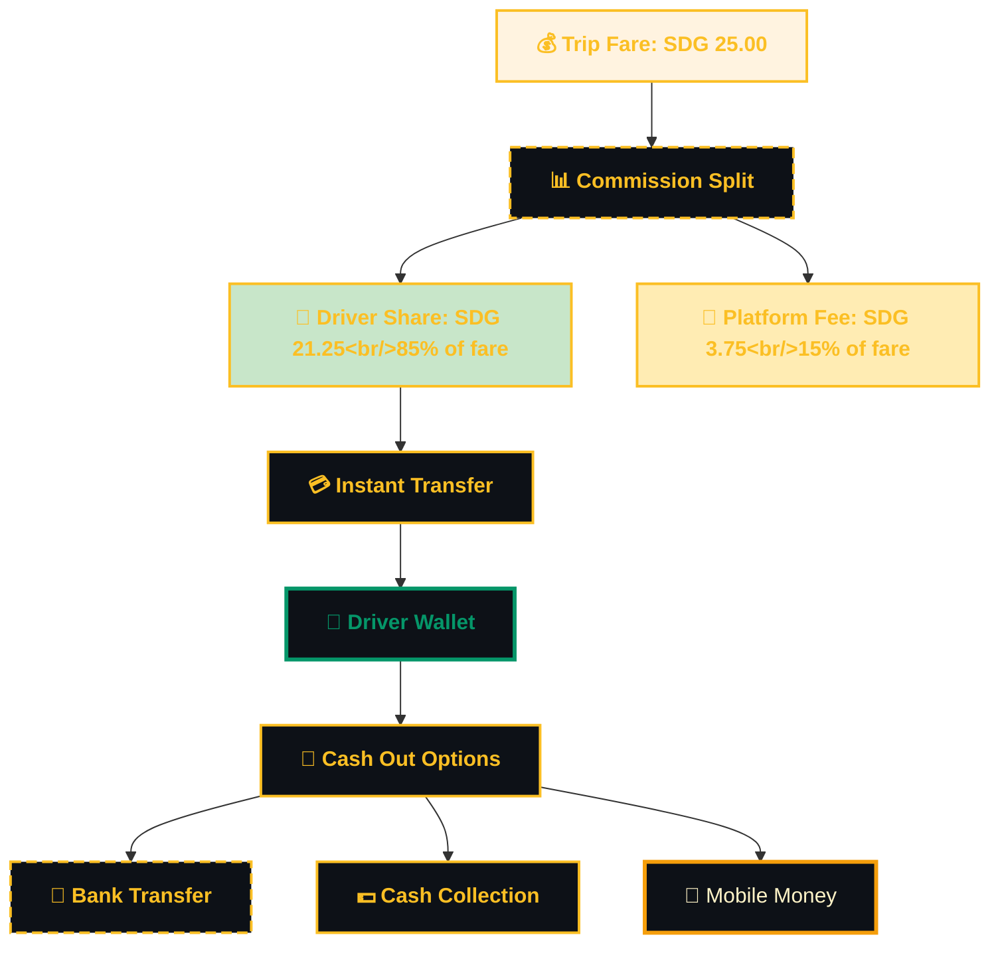

# 🚗 Sikka Transportation Platform - Driver Journey

> Comprehensive driver user journey with detailed flows, earnings optimization, and professional driver experience

## 📋 Table of Contents

- [🎯 Journey Overview](#-journey-overview)
- [📝 Driver Registration & Verification](#-driver-registration--verification)
- [🚗 Vehicle Setup & Documentation](#-vehicle-setup--documentation)
- [📱 Going Online & Availability](#-going-online--availability)
- [🔔 Trip Request & Acceptance](#-trip-request--acceptance)
- [🛣️ Trip Execution & Navigation](#️-trip-execution--navigation)
- [💰 Earnings & Payment](#-earnings--payment)
- [📊 Performance & Analytics](#-performance--analytics)
- [🔄 Alternative Scenarios](#-alternative-scenarios)

## 🎯 Journey Overview

The driver journey in the Sikka Transportation Platform is designed for **maximum earnings, operational efficiency, and professional growth**. From registration to daily operations, every aspect is optimized to help drivers succeed in the Sudanese transportation market.

### **🎨 Journey Principles**
- **💰 Earnings Focus**: Maximize driver income with transparent commission structure
- **⚡ Efficiency**: Streamlined operations with minimal downtime
- **📊 Transparency**: Clear earnings tracking and performance metrics
- **🛡️ Safety**: Comprehensive safety features and support
- **📈 Growth**: Tools and insights for professional development

### **📊 Driver Success Metrics**
- **Average Hourly Earnings**: SDG 45-65 per hour
- **Commission Structure**: 85% driver, 15% platform
- **Average Trips per Day**: 12-18 trips
- **Driver Satisfaction**: 4.6/5 rating
- **Monthly Retention**: 92% active drivers

## 📝 Driver Registration & Verification

### **🎯 Driver Onboarding Flow**

```mermaid
%%{init: {
  "theme": "dark",
  "themeVariables": {
    "primaryColor": "#0d1117",
    "primaryTextColor": "#fef3c7",
    "primaryBorderColor": "#d97706",
    "lineColor": "#d97706",
    "secondaryColor": "#f59e0b",
    "tertiaryColor": "#fbbf24",
    "background": "#0d1117",
    "mainBkg": "#0d1117",
    "secondBkg": "#451a03",
    "tertiaryBkg": "#fbbf24"
  },
  "flowchart": {
    "useMaxWidth": true,
    "htmlLabels": true
  },
  "sequence": {
    "useMaxWidth": true,
    "wrap": true
  },
  "class": {
    "useMaxWidth": true
  },
  "state": {
    "useMaxWidth": true
  },
  "er": {
    "useMaxWidth": true
  },
  "gantt": {
    "useMaxWidth": true
  }
}%%
flowchart TD
    A["📱 Download Sikka Driver"] --> B["📞 Phone Verification"]
    B --> C["👤 Personal Information"]
    C --> D["🆔 Identity Verification"]
    D --> E["🚗 Vehicle Information"]
    E --> F["📄 Document Upload"]
    F --> G["🏦 Banking Details"]
    G --> H["📚 Training Module"]
    H --> I["✅ Background Check"]
    I --> J {"🔍 Verification Status"}
    J --> |Approved| K["🎉 Account Activated"]
    J --> |Pending| L["⏳ Under Review"]
    J --> |Rejected| M["❌ Application Denied"]
    
    L --> N["📞 Support Contact"]
    M --> O["🔄 Reapplication Process"]
    
    style A fill:#e3f2fd;
    style K fill:#c8e6c9;
    style L fill:#ffecb3;
    style M fill:#ffcdd2;

    %%  --- DARK GRADIENT & GLOW STYLING ---
    
    %%  Main Dashboard (Neon Cyan/Blue)
    classDef main fill : #0d1117, stroke:#58a6ff, stroke-width: 4px,color:#58a6ff,font-weight: bold;
    
    
    %%  Decision Diamond (Gold Glow)
    classDef decision fill : #161b22, stroke:#d29922, color:#d29922,stroke-dasharray: 5 5;
    
    
    %%  Revenue (Emerald Gradient Style)
    classDef revNode fill : #04190b, stroke:#3fb950, color:#aff5b4,stroke-width: 2px;
    
    
    %%  Commission (Purple Gradient Style)
    classDef commNode fill : #12101e, stroke:#bc8cff, color:#e2c5ff,stroke-width: 2px;
    
    
    %%  Refund (Ruby Gradient Style)
    classDef refNode fill : #1a0b0b, stroke:#ff7b72, color:#ffa198,stroke-width: 2px;
    
    
    %%  Earnings (Sapphire Gradient Style)
    classDef earnNode fill : #051221, stroke:#388bfd, color:#a5d6ff,stroke-width: 2px;
    

    class A main;
    class B decision;
    class C revNode;
    class D commNode;
    class E refNode;
    class F earnNode;
    class G main;
    class H decision;
    class I revNode;
    class J commNode;
    class K refNode;
    class L earnNode;
    class M main;
    class N decision;
    class O revNode;
    class P commNode;
    class R refNode;


    %% --- DRIVER (PROFESSIONAL GOLD) THEME STYLING ---
    
    %% Primary nodes (main components)
    classDef primary fill:#0d1117,stroke:#d97706,stroke-width:4px,color:#fef3c7,font-weight:bold;
    
    %% Secondary nodes (supporting components)
    classDef secondary fill:#0d1117,stroke:#f59e0b,stroke-width:3px,color:#fef3c7,font-weight:normal;
    
    %% Accent nodes (highlights)
    classDef accent fill:#0d1117,stroke:#fbbf24,stroke-width:2px,color:#fbbf24,font-weight:bold;
    
    %% Success nodes (positive outcomes)
    classDef success fill:#0d1117,stroke:#059669,stroke-width:3px,color:#059669,font-weight:bold;
    
    %% Warning nodes (attention needed)
    classDef warning fill:#0d1117,stroke:#dc2626,stroke-width:3px,color:#dc2626,font-weight:bold,stroke-dasharray: 5 5;
    
    %% Error nodes (problems/failures)
    classDef error fill:#0d1117,stroke:#7c2d12,stroke-width:3px,color:#7c2d12,font-weight:bold,stroke-dasharray: 10 5;
    
    %% Database nodes (data storage)
    classDef database fill:#0d1117,stroke:#fbbf24,stroke-width:4px,color:#fbbf24,font-weight:bold;
    
    %% Process nodes (operations)
    classDef process fill:#451a03,stroke:#d97706,stroke-width:2px,color:#fef3c7,font-weight:normal;
    
    %% Decision nodes (branching points)
    classDef decision fill:#0d1117,stroke:#dc2626,stroke-width:3px,color:#dc2626,font-weight:bold,stroke-dasharray: 8 4;
    
    %% External nodes (third-party services)
    classDef external fill:#0d1117,stroke:#f59e0b,stroke-width:2px,color:#f59e0b,font-weight:normal,stroke-dasharray: 3 3;

    class A accent;
    class B decision;
    class C accent;
    class D decision;
    class E accent;
    class F accent;
    class G accent;
    class H accent;
    class I accent;
    class K accent;
    class L accent;
    class M secondary;
    class N accent;
    class O secondary;
```

### **📋 Required Documentation**

```mermaid
%%{init: {
    "theme": "dark",
    "themeVariables": {
    "primaryColor": "#0d1117",
    "primaryTextColor": "#58a6ff",
    "primaryBorderColor": "#58a6ff",
    "lineColor": "#58a6ff"
    },
    "flowchart": {
    "useMaxWidth": true,
    "htmlLabels": true
    }
    }}%%
%%{init: {
  "theme": "dark",
  "themeVariables": {
    "primaryColor": "#0d1117",
    "primaryTextColor": "#fef3c7",
    "primaryBorderColor": "#d97706",
    "lineColor": "#d97706",
    "secondaryColor": "#f59e0b",
    "tertiaryColor": "#fbbf24",
    "background": "#0d1117",
    "mainBkg": "#0d1117",
    "secondBkg": "#451a03",
    "tertiaryBkg": "#fbbf24"
  },
  "flowchart": {
    "useMaxWidth": true,
    "htmlLabels": true
  },
  "sequence": {
    "useMaxWidth": true,
    "wrap": true
  },
  "class": {
    "useMaxWidth": true
  },
  "state": {
    "useMaxWidth": true
  },
  "er": {
    "useMaxWidth": true
  },
  "gantt": {
    "useMaxWidth": true
  }
}%%
graph TB
    A["📄 Driver Documents"] --> B["🆔 National ID"]
    A --> C["🚗 Driving License"]
    A --> D["🚙 Vehicle Registration"]
    A --> E["🛡️ Insurance Certificate"]
    A --> F["🏥 Medical Certificate"]
    A --> G["🚫 Criminal Background Check"]
    
    B --> B1["✅ Valid & Clear Photo"]
    C --> C1["✅ Valid for 2+ years"]
    D --> D1["✅ Vehicle ownership proof"]
    E --> E1["✅ Comprehensive coverage"]
    F --> F1["✅ Issued within 6 months"]
    G --> G1["✅ Clean record required"]
    
    style A fill:#e8f5e8;
    style B1 fill:#c8e6c9;
    style C1 fill:#c8e6c9;
    style D1 fill:#c8e6c9;
    style E1 fill:#c8e6c9;
    style F1 fill:#c8e6c9;
    style G1 fill:#c8e6c9;

    %%  --- DARK GRADIENT & GLOW STYLING ---
    
    %%  Main Dashboard (Neon Cyan/Blue)
    classDef main fill : #0d1117, stroke:#58a6ff, stroke-width: 4px,color:#58a6ff,font-weight: bold;
    
    
    %%  Decision Diamond (Gold Glow)
    classDef decision fill : #161b22, stroke:#d29922, color:#d29922,stroke-dasharray: 5 5;
    
    
    %%  Revenue (Emerald Gradient Style)
    classDef revNode fill : #04190b, stroke:#3fb950, color:#aff5b4,stroke-width: 2px;
    
    
    %%  Commission (Purple Gradient Style)
    classDef commNode fill : #12101e, stroke:#bc8cff, color:#e2c5ff,stroke-width: 2px;
    
    
    %%  Refund (Ruby Gradient Style)
    classDef refNode fill : #1a0b0b, stroke:#ff7b72, color:#ffa198,stroke-width: 2px;
    
    
    %%  Earnings (Sapphire Gradient Style)
    classDef earnNode fill : #051221, stroke:#388bfd, color:#a5d6ff,stroke-width: 2px;
    

    class A main;
    class B decision;
    class B1 revNode;
    class C commNode;
    class C1 refNode;
    class D earnNode;
    class D1 main;
    class E decision;
    class E1 revNode;
    class F commNode;
    class F1 refNode;
    class G earnNode;
    class G1 main;




    %% --- DRIVER (PROFESSIONAL GOLD) THEME STYLING ---
    
    %% Primary nodes (main components)
    classDef primary fill:#0d1117,stroke:#d97706,stroke-width:4px,color:#fef3c7,font-weight:bold;
    
    %% Secondary nodes (supporting components)
    classDef secondary fill:#0d1117,stroke:#f59e0b,stroke-width:3px,color:#fef3c7,font-weight:normal;
    
    %% Accent nodes (highlights)
    classDef accent fill:#0d1117,stroke:#fbbf24,stroke-width:2px,color:#fbbf24,font-weight:bold;
    
    %% Success nodes (positive outcomes)
    classDef success fill:#0d1117,stroke:#059669,stroke-width:3px,color:#059669,font-weight:bold;
    
    %% Warning nodes (attention needed)
    classDef warning fill:#0d1117,stroke:#dc2626,stroke-width:3px,color:#dc2626,font-weight:bold,stroke-dasharray: 5 5;
    
    %% Error nodes (problems/failures)
    classDef error fill:#0d1117,stroke:#7c2d12,stroke-width:3px,color:#7c2d12,font-weight:bold,stroke-dasharray: 10 5;
    
    %% Database nodes (data storage)
    classDef database fill:#0d1117,stroke:#fbbf24,stroke-width:4px,color:#fbbf24,font-weight:bold;
    
    %% Process nodes (operations)
    classDef process fill:#451a03,stroke:#d97706,stroke-width:2px,color:#fef3c7,font-weight:normal;
    
    %% Decision nodes (branching points)
    classDef decision fill:#0d1117,stroke:#dc2626,stroke-width:3px,color:#dc2626,font-weight:bold,stroke-dasharray: 8 4;
    
    %% External nodes (third-party services)
    classDef external fill:#0d1117,stroke:#f59e0b,stroke-width:2px,color:#f59e0b,font-weight:normal,stroke-dasharray: 3 3;

    class A accent;
    class B accent;
    class C accent;
    class D accent;
    class E decision;
    class F decision;
    class G accent;
    class B1 accent;
    class C1 accent;
    class D1 accent;
    class E1 accent;
    class F1 error;
    class G1 accent;
```



### **🎓 Driver Training Program**

```mermaid
%%{init: {
  "theme": "dark",
  "themeVariables": {
    "primaryColor": "#0d1117",
    "primaryTextColor": "#fef3c7",
    "primaryBorderColor": "#d97706",
    "lineColor": "#d97706",
    "secondaryColor": "#f59e0b",
    "tertiaryColor": "#fbbf24",
    "background": "#0d1117",
    "mainBkg": "#0d1117",
    "secondBkg": "#451a03",
    "tertiaryBkg": "#fbbf24"
  },
  "flowchart": {
    "useMaxWidth": true,
    "htmlLabels": true
  },
  "sequence": {
    "useMaxWidth": true,
    "wrap": true
  },
  "class": {
    "useMaxWidth": true
  },
  "state": {
    "useMaxWidth": true
  },
  "er": {
    "useMaxWidth": true
  },
  "gantt": {
    "useMaxWidth": true
  }
}%%
sequenceDiagram
    participant D as "🚗 Driver"
    participant APP as "📱 Training App"
    participant SYS as "🎓 Training System"
    participant CERT as "📜 Certification"
    
    D->>APP: Start Training
    APP->>SYS: Load Module 1: Safety
    SYS->>D: Safety Guidelines
    D->>SYS: Complete Quiz (80% required)
    
    SYS->>APP: Load Module 2: Customer Service
    APP->>D: Service Excellence Training
    D->>SYS: Complete Assessment
    
    SYS->>APP: Load Module 3: App Usage
    APP->>D: Platform Tutorial
    D->>SYS: Practical Test
    
    SYS->>CERT: Generate Certificate
    CERT->>D: Training Completed
    D->>APP: Ready to Drive!

    %%  --- DARK GRADIENT & GLOW STYLING ---
    
    %%  Main Dashboard (Neon Cyan/Blue)
    classDef main fill : #0d1117, stroke:#58a6ff, stroke-width: 4px,color:#58a6ff,font-weight: bold;
    
    
    %%  Decision Diamond (Gold Glow)
    classDef decision fill : #161b22, stroke:#d29922, color:#d29922,stroke-dasharray: 5 5;
    
    
    %%  Revenue (Emerald Gradient Style)
    classDef revNode fill : #04190b, stroke:#3fb950, color:#aff5b4,stroke-width: 2px;
    
    
    %%  Commission (Purple Gradient Style)
    classDef commNode fill : #12101e, stroke:#bc8cff, color:#e2c5ff,stroke-width: 2px;
    
    
    %%  Refund (Ruby Gradient Style)
    classDef refNode fill : #1a0b0b, stroke:#ff7b72, color:#ffa198,stroke-width: 2px;
    
    
    %%  Earnings (Sapphire Gradient Style)
    classDef earnNode fill : #051221, stroke:#388bfd, color:#a5d6ff,stroke-width: 2px;
    

    class APP main;
    class D decision;
    class SYS revNode;


    %% --- DRIVER (PROFESSIONAL GOLD) THEME STYLING ---
    
    %% Primary nodes (main components)
    classDef primary fill:#0d1117,stroke:#d97706,stroke-width:4px,color:#fef3c7,font-weight:bold;
    
    %% Secondary nodes (supporting components)
    classDef secondary fill:#0d1117,stroke:#f59e0b,stroke-width:3px,color:#fef3c7,font-weight:normal;
    
    %% Accent nodes (highlights)
    classDef accent fill:#0d1117,stroke:#fbbf24,stroke-width:2px,color:#fbbf24,font-weight:bold;
    
    %% Success nodes (positive outcomes)
    classDef success fill:#0d1117,stroke:#059669,stroke-width:3px,color:#059669,font-weight:bold;
    
    %% Warning nodes (attention needed)
    classDef warning fill:#0d1117,stroke:#dc2626,stroke-width:3px,color:#dc2626,font-weight:bold,stroke-dasharray: 5 5;
    
    %% Error nodes (problems/failures)
    classDef error fill:#0d1117,stroke:#7c2d12,stroke-width:3px,color:#7c2d12,font-weight:bold,stroke-dasharray: 10 5;
    
    %% Database nodes (data storage)
    classDef database fill:#0d1117,stroke:#fbbf24,stroke-width:4px,color:#fbbf24,font-weight:bold;
    
    %% Process nodes (operations)
    classDef process fill:#451a03,stroke:#d97706,stroke-width:2px,color:#fef3c7,font-weight:normal;
    
    %% Decision nodes (branching points)
    classDef decision fill:#0d1117,stroke:#dc2626,stroke-width:3px,color:#dc2626,font-weight:bold,stroke-dasharray: 8 4;
    
    %% External nodes (third-party services)
    classDef external fill:#0d1117,stroke:#f59e0b,stroke-width:2px,color:#f59e0b,font-weight:normal,stroke-dasharray: 3 3;


```

## 🚗 Vehicle Setup & Documentation

### **🚙 Vehicle Requirements**

```typescript
interface VehicleRequirements {
  age: {
    maximum: 10; // years
    preferred: 5; // years for premium
  };
  condition: {
    exterior: 'excellent' | 'good' | 'fair';
    interior: 'clean' | 'very_clean' | 'pristine';
    mechanical: 'roadworthy' | 'excellent';
  };
  features: {
    airConditioning: boolean;
    musicSystem: boolean;
    phoneCharger: boolean;
    cleanSeats: boolean;
  };
  safety: {
    seatbelts: boolean;
    airbags: boolean;
    firstAidKit: boolean;
    fireExtinguisher: boolean;
  };
  documentation: {
    registration: 'valid';
    insurance: 'comprehensive';
    inspection: 'current';
  };
}
```

### **📊 Vehicle Categories**

```mermaid
%%{init: {
    "theme": "dark",
    "themeVariables": {
    "primaryColor": "#0d1117",
    "primaryTextColor": "#58a6ff",
    "primaryBorderColor": "#58a6ff",
    "lineColor": "#58a6ff"
    },
    "flowchart": {
    "useMaxWidth": true,
    "htmlLabels": true
    }
    }}%%
%%{init: {
  "theme": "dark",
  "themeVariables": {
    "primaryColor": "#0d1117",
    "primaryTextColor": "#fef3c7",
    "primaryBorderColor": "#d97706",
    "lineColor": "#d97706",
    "secondaryColor": "#f59e0b",
    "tertiaryColor": "#fbbf24",
    "background": "#0d1117",
    "mainBkg": "#0d1117",
    "secondBkg": "#451a03",
    "tertiaryBkg": "#fbbf24"
  },
  "flowchart": {
    "useMaxWidth": true,
    "htmlLabels": true
  },
  "sequence": {
    "useMaxWidth": true,
    "wrap": true
  },
  "class": {
    "useMaxWidth": true
  },
  "state": {
    "useMaxWidth": true
  },
  "er": {
    "useMaxWidth": true
  },
  "gantt": {
    "useMaxWidth": true
  }
}%%
graph TB
    A["🚗 Vehicle Categories"] --> B["🚙 Standard&lt;br/&gt;Sedan, Hatchback"]
    A --> C["🚗 Premium&lt;br/&gt;Luxury Sedan, SUV"]
    A --> D["🚐 Shared&lt;br/&gt;7+ Seater Van"]
    A --> E["📦 Delivery&lt;br/&gt;Pickup, Van"]
    
    B --> B1["💰 Base Rate: SDG 2/km"]
    C --> C1["💰 Premium Rate: SDG 3/km"]
    D --> D1["💰 Shared Rate: SDG 1.5/km"]
    E --> E1["💰 Delivery Rate: SDG 2.5/km"]
    
    style A fill:#e8f5e8;
    style B1 fill:#fff3e0;
    style C1 fill:#fff3e0;
    style D1 fill:#fff3e0;
    style E1 fill:#fff3e0;

    %%  --- DARK GRADIENT & GLOW STYLING ---
    
    %%  Main Dashboard (Neon Cyan/Blue)
    classDef main fill : #0d1117, stroke:#58a6ff, stroke-width: 4px,color:#58a6ff,font-weight: bold;
    
    
    %%  Decision Diamond (Gold Glow)
    classDef decision fill : #161b22, stroke:#d29922, color:#d29922,stroke-dasharray: 5 5;
    
    
    %%  Revenue (Emerald Gradient Style)
    classDef revNode fill : #04190b, stroke:#3fb950, color:#aff5b4,stroke-width: 2px;
    
    
    %%  Commission (Purple Gradient Style)
    classDef commNode fill : #12101e, stroke:#bc8cff, color:#e2c5ff,stroke-width: 2px;
    
    
    %%  Refund (Ruby Gradient Style)
    classDef refNode fill : #1a0b0b, stroke:#ff7b72, color:#ffa198,stroke-width: 2px;
    
    
    %%  Earnings (Sapphire Gradient Style)
    classDef earnNode fill : #051221, stroke:#388bfd, color:#a5d6ff,stroke-width: 2px;
    

    class A main;
    class B decision;
    class B1 revNode;
    class C commNode;
    class C1 refNode;
    class D earnNode;
    class D1 main;
    class E decision;
    class E1 revNode;




    %% --- DRIVER (PROFESSIONAL GOLD) THEME STYLING ---
    
    %% Primary nodes (main components)
    classDef primary fill:#0d1117,stroke:#d97706,stroke-width:4px,color:#fef3c7,font-weight:bold;
    
    %% Secondary nodes (supporting components)
    classDef secondary fill:#0d1117,stroke:#f59e0b,stroke-width:3px,color:#fef3c7,font-weight:normal;
    
    %% Accent nodes (highlights)
    classDef accent fill:#0d1117,stroke:#fbbf24,stroke-width:2px,color:#fbbf24,font-weight:bold;
    
    %% Success nodes (positive outcomes)
    classDef success fill:#0d1117,stroke:#059669,stroke-width:3px,color:#059669,font-weight:bold;
    
    %% Warning nodes (attention needed)
    classDef warning fill:#0d1117,stroke:#dc2626,stroke-width:3px,color:#dc2626,font-weight:bold,stroke-dasharray: 5 5;
    
    %% Error nodes (problems/failures)
    classDef error fill:#0d1117,stroke:#7c2d12,stroke-width:3px,color:#7c2d12,font-weight:bold,stroke-dasharray: 10 5;
    
    %% Database nodes (data storage)
    classDef database fill:#0d1117,stroke:#fbbf24,stroke-width:4px,color:#fbbf24,font-weight:bold;
    
    %% Process nodes (operations)
    classDef process fill:#451a03,stroke:#d97706,stroke-width:2px,color:#fef3c7,font-weight:normal;
    
    %% Decision nodes (branching points)
    classDef decision fill:#0d1117,stroke:#dc2626,stroke-width:3px,color:#dc2626,font-weight:bold,stroke-dasharray: 8 4;
    
    %% External nodes (third-party services)
    classDef external fill:#0d1117,stroke:#f59e0b,stroke-width:2px,color:#f59e0b,font-weight:normal,stroke-dasharray: 3 3;

    class A accent;
    class B accent;
    class C accent;
    class D accent;
    class E accent;
    class B1 accent;
    class C1 accent;
    class D1 accent;
    class E1 accent;
```



## 📱 Going Online & Availability

### **🔄 Daily Operations Flow**

```mermaid
%%{init: {
  "theme": "dark",
  "themeVariables": {
    "primaryColor": "#0d1117",
    "primaryTextColor": "#fef3c7",
    "primaryBorderColor": "#d97706",
    "lineColor": "#d97706",
    "secondaryColor": "#f59e0b",
    "tertiaryColor": "#fbbf24",
    "background": "#0d1117",
    "mainBkg": "#0d1117",
    "secondBkg": "#451a03",
    "tertiaryBkg": "#fbbf24"
  },
  "flowchart": {
    "useMaxWidth": true,
    "htmlLabels": true
  },
  "sequence": {
    "useMaxWidth": true,
    "wrap": true
  },
  "class": {
    "useMaxWidth": true
  },
  "state": {
    "useMaxWidth": true
  },
  "er": {
    "useMaxWidth": true
  },
  "gantt": {
    "useMaxWidth": true
  }
}%%
flowchart TD
    A["📱 Open Driver App"] --> B["🔐 Biometric Login"]
    B --> C["📍 Location Permission"]
    C --> D["🚗 Vehicle Inspection"]
    D --> E["📊 Daily Goals Setting"]
    E --> F["🟢 Go Online"]
    F --> G["📡 Waiting for Trips"]
    
    G --> H {"🔔 Trip Request"}
    H --> |Accept| I["🚗 Active Trip"]
    H --> |Decline| G
    H --> |Timeout| G
    
    I --> J["🏁 Trip Completed"]
    J --> K {"🔄 Continue Driving?"}
    K --> |Yes| G
    K --> |No| L["🔴 Go Offline"]
    
    L --> M["📊 Daily Summary"]
    M --> N["💰 Earnings Report"]
    N --> O["📱 Close App"]
    
    style F fill:#c8e6c9;
    style I fill:#e3f2fd;
    style L fill:#ffcdd2;

    %%  --- DARK GRADIENT & GLOW STYLING ---
    
    %%  Main Dashboard (Neon Cyan/Blue)
    classDef main fill : #0d1117, stroke:#58a6ff, stroke-width: 4px,color:#58a6ff,font-weight: bold;
    
    
    %%  Decision Diamond (Gold Glow)
    classDef decision fill : #161b22, stroke:#d29922, color:#d29922,stroke-dasharray: 5 5;
    
    
    %%  Revenue (Emerald Gradient Style)
    classDef revNode fill : #04190b, stroke:#3fb950, color:#aff5b4,stroke-width: 2px;
    
    
    %%  Commission (Purple Gradient Style)
    classDef commNode fill : #12101e, stroke:#bc8cff, color:#e2c5ff,stroke-width: 2px;
    
    
    %%  Refund (Ruby Gradient Style)
    classDef refNode fill : #1a0b0b, stroke:#ff7b72, color:#ffa198,stroke-width: 2px;
    
    
    %%  Earnings (Sapphire Gradient Style)
    classDef earnNode fill : #051221, stroke:#388bfd, color:#a5d6ff,stroke-width: 2px;
    

    class A main;
    class B decision;
    class C revNode;
    class D commNode;
    class E refNode;
    class F earnNode;
    class G main;
    class H decision;
    class I revNode;
    class J commNode;
    class K refNode;
    class L earnNode;
    class M main;
    class N decision;
    class O revNode;
    class T commNode;
    class Y refNode;


    %% --- DRIVER (PROFESSIONAL GOLD) THEME STYLING ---
    
    %% Primary nodes (main components)
    classDef primary fill:#0d1117,stroke:#d97706,stroke-width:4px,color:#fef3c7,font-weight:bold;
    
    %% Secondary nodes (supporting components)
    classDef secondary fill:#0d1117,stroke:#f59e0b,stroke-width:3px,color:#fef3c7,font-weight:normal;
    
    %% Accent nodes (highlights)
    classDef accent fill:#0d1117,stroke:#fbbf24,stroke-width:2px,color:#fbbf24,font-weight:bold;
    
    %% Success nodes (positive outcomes)
    classDef success fill:#0d1117,stroke:#059669,stroke-width:3px,color:#059669,font-weight:bold;
    
    %% Warning nodes (attention needed)
    classDef warning fill:#0d1117,stroke:#dc2626,stroke-width:3px,color:#dc2626,font-weight:bold,stroke-dasharray: 5 5;
    
    %% Error nodes (problems/failures)
    classDef error fill:#0d1117,stroke:#7c2d12,stroke-width:3px,color:#7c2d12,font-weight:bold,stroke-dasharray: 10 5;
    
    %% Database nodes (data storage)
    classDef database fill:#0d1117,stroke:#fbbf24,stroke-width:4px,color:#fbbf24,font-weight:bold;
    
    %% Process nodes (operations)
    classDef process fill:#451a03,stroke:#d97706,stroke-width:2px,color:#fef3c7,font-weight:normal;
    
    %% Decision nodes (branching points)
    classDef decision fill:#0d1117,stroke:#dc2626,stroke-width:3px,color:#dc2626,font-weight:bold,stroke-dasharray: 8 4;
    
    %% External nodes (third-party services)
    classDef external fill:#0d1117,stroke:#f59e0b,stroke-width:2px,color:#f59e0b,font-weight:normal,stroke-dasharray: 3 3;

    class A secondary;
    class B accent;
    class C accent;
    class D accent;
    class E accent;
    class F accent;
    class G accent;
    class I accent;
    class J accent;
    class L accent;
    class M accent;
    class N accent;
    class O secondary;
```

### **📍 Location & Availability Management**

```mermaid
%%{init: {
    "theme": "dark",
    "themeVariables": {
    "primaryColor": "#0d1117",
    "primaryTextColor": "#58a6ff",
    "primaryBorderColor": "#58a6ff",
    "lineColor": "#58a6ff"
    },
    "flowchart": {
    "useMaxWidth": true,
    "htmlLabels": true
    }
    }}%%
%%{init: {
  "theme": "dark",
  "themeVariables": {
    "primaryColor": "#0d1117",
    "primaryTextColor": "#fef3c7",
    "primaryBorderColor": "#d97706",
    "lineColor": "#d97706",
    "secondaryColor": "#f59e0b",
    "tertiaryColor": "#fbbf24",
    "background": "#0d1117",
    "mainBkg": "#0d1117",
    "secondBkg": "#451a03",
    "tertiaryBkg": "#fbbf24"
  },
  "flowchart": {
    "useMaxWidth": true,
    "htmlLabels": true
  },
  "sequence": {
    "useMaxWidth": true,
    "wrap": true
  },
  "class": {
    "useMaxWidth": true
  },
  "state": {
    "useMaxWidth": true
  },
  "er": {
    "useMaxWidth": true
  },
  "gantt": {
    "useMaxWidth": true
  }
}%%
graph TB
    A["📍 Driver Location"] --> B["🗺️ GPS Tracking"]
    A --> C["🏠 Preferred Areas"]
    A --> D["⚡ Availability Status"]
    
    B --> B1["📡 Real-time Updates"]
    B --> B2["🔋 Battery Optimization"]
    B --> B3["📶 Network Efficiency"]
    
    C --> C1["🏙️ City Center"]
    C --> C2["🏢 Business District"]
    C --> C3["✈️ Airport Zone"]
    C --> C4["🏥 Hospital Area"]
    
    D --> D1["🟢 Available"]
    D --> D2["🟡 Busy"]
    D --> D3["🔴 Offline"]
    D --> D4["⏸️ Break"]
    
    style A fill:#e8f5e8;
    style B1 fill:#e3f2fd;
    style D1 fill:#c8e6c9;
    style D3 fill:#ffcdd2;

    %%  --- DARK GRADIENT & GLOW STYLING ---
    
    %%  Main Dashboard (Neon Cyan/Blue)
    classDef main fill : #0d1117, stroke:#58a6ff, stroke-width: 4px,color:#58a6ff,font-weight: bold;
    
    
    %%  Decision Diamond (Gold Glow)
    classDef decision fill : #161b22, stroke:#d29922, color:#d29922,stroke-dasharray: 5 5;
    
    
    %%  Revenue (Emerald Gradient Style)
    classDef revNode fill : #04190b, stroke:#3fb950, color:#aff5b4,stroke-width: 2px;
    
    
    %%  Commission (Purple Gradient Style)
    classDef commNode fill : #12101e, stroke:#bc8cff, color:#e2c5ff,stroke-width: 2px;
    
    
    %%  Refund (Ruby Gradient Style)
    classDef refNode fill : #1a0b0b, stroke:#ff7b72, color:#ffa198,stroke-width: 2px;
    
    
    %%  Earnings (Sapphire Gradient Style)
    classDef earnNode fill : #051221, stroke:#388bfd, color:#a5d6ff,stroke-width: 2px;
    

    class A main;
    class B decision;
    class B1 revNode;
    class B2 commNode;
    class B3 refNode;
    class C earnNode;
    class C1 main;
    class C2 decision;
    class C3 revNode;
    class C4 commNode;
    class D refNode;
    class D1 earnNode;
    class D2 main;
    class D3 decision;
    class D4 revNode;




    %% --- DRIVER (PROFESSIONAL GOLD) THEME STYLING ---
    
    %% Primary nodes (main components)
    classDef primary fill:#0d1117,stroke:#d97706,stroke-width:4px,color:#fef3c7,font-weight:bold;
    
    %% Secondary nodes (supporting components)
    classDef secondary fill:#0d1117,stroke:#f59e0b,stroke-width:3px,color:#fef3c7,font-weight:normal;
    
    %% Accent nodes (highlights)
    classDef accent fill:#0d1117,stroke:#fbbf24,stroke-width:2px,color:#fbbf24,font-weight:bold;
    
    %% Success nodes (positive outcomes)
    classDef success fill:#0d1117,stroke:#059669,stroke-width:3px,color:#059669,font-weight:bold;
    
    %% Warning nodes (attention needed)
    classDef warning fill:#0d1117,stroke:#dc2626,stroke-width:3px,color:#dc2626,font-weight:bold,stroke-dasharray: 5 5;
    
    %% Error nodes (problems/failures)
    classDef error fill:#0d1117,stroke:#7c2d12,stroke-width:3px,color:#7c2d12,font-weight:bold,stroke-dasharray: 10 5;
    
    %% Database nodes (data storage)
    classDef database fill:#0d1117,stroke:#fbbf24,stroke-width:4px,color:#fbbf24,font-weight:bold;
    
    %% Process nodes (operations)
    classDef process fill:#451a03,stroke:#d97706,stroke-width:2px,color:#fef3c7,font-weight:normal;
    
    %% Decision nodes (branching points)
    classDef decision fill:#0d1117,stroke:#dc2626,stroke-width:3px,color:#dc2626,font-weight:bold,stroke-dasharray: 8 4;
    
    %% External nodes (third-party services)
    classDef external fill:#0d1117,stroke:#f59e0b,stroke-width:2px,color:#f59e0b,font-weight:normal,stroke-dasharray: 3 3;

    class A accent;
    class B accent;
    class C accent;
    class D accent;
    class B1 accent;
    class B2 accent;
    class B3 accent;
    class C1 accent;
    class C2 accent;
    class C3 accent;
    class C4 accent;
    class D1 accent;
    class D2 accent;
    class D3 accent;
    class D4 accent;
```



### **⚙️ Driver Preferences**

```typescript
interface DriverPreferences {
  workingHours: {
    start: string; // "06:00"
    end: string;   // "22:00"
    breakTimes: Array<{
      start: string;
      end: string;
      reason: string;
    }>;
  };
  tripTypes: {
    standard: boolean;
    premium: boolean;
    shared: boolean;
    delivery: boolean;
  };
  areas: {
    preferred: string[]; // ["Khartoum", "Omdurman"]
    avoided: string[];   // ["Industrial Area"]
  };
  passenger: {
    minimumRating: number; // 3.0
    maximumDistance: number; // 15 km
    acceptCash: boolean;
    acceptWallet: boolean;
  };
  notifications: {
    tripRequests: boolean;
    earnings: boolean;
    promotions: boolean;
    maintenance: boolean;
  };
}
```

## 🔔 Trip Request & Acceptance

### **📱 Trip Request Interface**

```mermaid
%%{init: {
  "theme": "dark",
  "themeVariables": {
    "primaryColor": "#0d1117",
    "primaryTextColor": "#fef3c7",
    "primaryBorderColor": "#d97706",
    "lineColor": "#d97706",
    "secondaryColor": "#f59e0b",
    "tertiaryColor": "#fbbf24",
    "background": "#0d1117",
    "mainBkg": "#0d1117",
    "secondBkg": "#451a03",
    "tertiaryBkg": "#fbbf24"
  },
  "flowchart": {
    "useMaxWidth": true,
    "htmlLabels": true
  },
  "sequence": {
    "useMaxWidth": true,
    "wrap": true
  },
  "class": {
    "useMaxWidth": true
  },
  "state": {
    "useMaxWidth": true
  },
  "er": {
    "useMaxWidth": true
  },
  "gantt": {
    "useMaxWidth": true
  }
}%%
sequenceDiagram
    participant P as "📱 Passenger"
    participant SYS as "🔌 System"
    participant D1 as "🚗 Driver 1"
    participant D2 as "🚗 Driver 2"
    participant D3 as "🚗 Driver 3"
    
    P->>SYS: Request Trip
    SYS->>SYS: Find Nearby Drivers
    
    par Notify Multiple Drivers
        SYS->>D1: Trip Request (30s timer)
        SYS->>D2: Trip Request (30s timer)
        SYS->>D3: Trip Request (30s timer)
    end
    
    Note over D1,D3: Drivers see trip details and decide
    
    alt First to Accept
        D2->>SYS: Accept Trip
        SYS->>D1: Trip Taken
        SYS->>D3: Trip Taken
        SYS->>P: Driver Assigned
    else No Response
        Note over SYS: Expand search radius
        SYS->>SYS: Find More Drivers
    end

    %%  --- DARK GRADIENT & GLOW STYLING ---
    
    %%  Main Dashboard (Neon Cyan/Blue)
    classDef main fill : #0d1117, stroke:#58a6ff, stroke-width: 4px,color:#58a6ff,font-weight: bold;
    
    
    %%  Decision Diamond (Gold Glow)
    classDef decision fill : #161b22, stroke:#d29922, color:#d29922,stroke-dasharray: 5 5;
    
    
    %%  Revenue (Emerald Gradient Style)
    classDef revNode fill : #04190b, stroke:#3fb950, color:#aff5b4,stroke-width: 2px;
    
    
    %%  Commission (Purple Gradient Style)
    classDef commNode fill : #12101e, stroke:#bc8cff, color:#e2c5ff,stroke-width: 2px;
    
    
    %%  Refund (Ruby Gradient Style)
    classDef refNode fill : #1a0b0b, stroke:#ff7b72, color:#ffa198,stroke-width: 2px;
    
    
    %%  Earnings (Sapphire Gradient Style)
    classDef earnNode fill : #051221, stroke:#388bfd, color:#a5d6ff,stroke-width: 2px;
    

    class D1 main;
    class D2 decision;
    class D3 revNode;
    class P commNode;
    class SYS refNode;


    %% --- DRIVER (PROFESSIONAL GOLD) THEME STYLING ---
    
    %% Primary nodes (main components)
    classDef primary fill:#0d1117,stroke:#d97706,stroke-width:4px,color:#fef3c7,font-weight:bold;
    
    %% Secondary nodes (supporting components)
    classDef secondary fill:#0d1117,stroke:#f59e0b,stroke-width:3px,color:#fef3c7,font-weight:normal;
    
    %% Accent nodes (highlights)
    classDef accent fill:#0d1117,stroke:#fbbf24,stroke-width:2px,color:#fbbf24,font-weight:bold;
    
    %% Success nodes (positive outcomes)
    classDef success fill:#0d1117,stroke:#059669,stroke-width:3px,color:#059669,font-weight:bold;
    
    %% Warning nodes (attention needed)
    classDef warning fill:#0d1117,stroke:#dc2626,stroke-width:3px,color:#dc2626,font-weight:bold,stroke-dasharray: 5 5;
    
    %% Error nodes (problems/failures)
    classDef error fill:#0d1117,stroke:#7c2d12,stroke-width:3px,color:#7c2d12,font-weight:bold,stroke-dasharray: 10 5;
    
    %% Database nodes (data storage)
    classDef database fill:#0d1117,stroke:#fbbf24,stroke-width:4px,color:#fbbf24,font-weight:bold;
    
    %% Process nodes (operations)
    classDef process fill:#451a03,stroke:#d97706,stroke-width:2px,color:#fef3c7,font-weight:normal;
    
    %% Decision nodes (branching points)
    classDef decision fill:#0d1117,stroke:#dc2626,stroke-width:3px,color:#dc2626,font-weight:bold,stroke-dasharray: 8 4;
    
    %% External nodes (third-party services)
    classDef external fill:#0d1117,stroke:#f59e0b,stroke-width:2px,color:#f59e0b,font-weight:normal,stroke-dasharray: 3 3;


```

### **📊 Trip Request Details**

```typescript
interface TripRequest {
  id: string;
  passenger: {
    name: string;
    rating: number;
    phone: string;
    photo?: string;
  };
  pickup: {
    address: string;
    latitude: number;
    longitude: number;
    landmark?: string;
  };
  dropoff: {
    address: string;
    latitude: number;
    longitude: number;
    landmark?: string;
  };
  trip: {
    type: 'standard' | 'premium' | 'shared' | 'delivery';
    estimatedDistance: number; // km
    estimatedDuration: number; // minutes
    estimatedFare: number;     // SDG
    driverEarnings: number;    // 85% of fare
  };
  payment: {
    method: 'wallet' | 'cash' | 'ebs' | 'cyberpay';
    guaranteed: boolean;
  };
  timing: {
    requestedAt: string;
    expiresAt: string; // 30 seconds to respond
  };
  notes?: string;
}
```

### **⚡ Quick Decision Interface**

```mermaid
%%{init: {
    "theme": "dark",
    "themeVariables": {
    "primaryColor": "#0d1117",
    "primaryTextColor": "#58a6ff",
    "primaryBorderColor": "#58a6ff",
    "lineColor": "#58a6ff"
    },
    "flowchart": {
    "useMaxWidth": true,
    "htmlLabels": true
    }
    }}%%
%%{init: {
  "theme": "dark",
  "themeVariables": {
    "primaryColor": "#0d1117",
    "primaryTextColor": "#fef3c7",
    "primaryBorderColor": "#d97706",
    "lineColor": "#d97706",
    "secondaryColor": "#f59e0b",
    "tertiaryColor": "#fbbf24",
    "background": "#0d1117",
    "mainBkg": "#0d1117",
    "secondBkg": "#451a03",
    "tertiaryBkg": "#fbbf24"
  },
  "flowchart": {
    "useMaxWidth": true,
    "htmlLabels": true
  },
  "sequence": {
    "useMaxWidth": true,
    "wrap": true
  },
  "class": {
    "useMaxWidth": true
  },
  "state": {
    "useMaxWidth": true
  },
  "er": {
    "useMaxWidth": true
  },
  "gantt": {
    "useMaxWidth": true
  }
}%%
graph TB
    A["🔔 Trip Request"] --> B["📊 Trip Details Card"]
    B --> C["💰 Earnings: SDG 21.25"]
    B --> D["📍 Distance: 2.3 km away"]
    B --> E["⏱️ Duration: 15 min trip"]
    B --> F["⭐ Passenger: 4.8 rating"]
    
    B --> G["✅ Accept (15s left)"]
    B --> H["❌ Decline"]
    
    G --> I["🚗 Trip Assigned"]
    H --> J["📱 Back to Waiting"]
    
    style A fill:#fff3e0;
    style G fill:#c8e6c9;
    style H fill:#ffcdd2;
    style I fill:#e3f2fd;

    %%  --- DARK GRADIENT & GLOW STYLING ---
    
    %%  Main Dashboard (Neon Cyan/Blue)
    classDef main fill : #0d1117, stroke:#58a6ff, stroke-width: 4px,color:#58a6ff,font-weight: bold;
    
    
    %%  Decision Diamond (Gold Glow)
    classDef decision fill : #161b22, stroke:#d29922, color:#d29922,stroke-dasharray: 5 5;
    
    
    %%  Revenue (Emerald Gradient Style)
    classDef revNode fill : #04190b, stroke:#3fb950, color:#aff5b4,stroke-width: 2px;
    
    
    %%  Commission (Purple Gradient Style)
    classDef commNode fill : #12101e, stroke:#bc8cff, color:#e2c5ff,stroke-width: 2px;
    
    
    %%  Refund (Ruby Gradient Style)
    classDef refNode fill : #1a0b0b, stroke:#ff7b72, color:#ffa198,stroke-width: 2px;
    
    
    %%  Earnings (Sapphire Gradient Style)
    classDef earnNode fill : #051221, stroke:#388bfd, color:#a5d6ff,stroke-width: 2px;
    

    class A main;
    class B decision;
    class C revNode;
    class D commNode;
    class E refNode;
    class F earnNode;
    class G main;
    class H decision;
    class I revNode;
    class J commNode;




    %% --- DRIVER (PROFESSIONAL GOLD) THEME STYLING ---
    
    %% Primary nodes (main components)
    classDef primary fill:#0d1117,stroke:#d97706,stroke-width:4px,color:#fef3c7,font-weight:bold;
    
    %% Secondary nodes (supporting components)
    classDef secondary fill:#0d1117,stroke:#f59e0b,stroke-width:3px,color:#fef3c7,font-weight:normal;
    
    %% Accent nodes (highlights)
    classDef accent fill:#0d1117,stroke:#fbbf24,stroke-width:2px,color:#fbbf24,font-weight:bold;
    
    %% Success nodes (positive outcomes)
    classDef success fill:#0d1117,stroke:#059669,stroke-width:3px,color:#059669,font-weight:bold;
    
    %% Warning nodes (attention needed)
    classDef warning fill:#0d1117,stroke:#dc2626,stroke-width:3px,color:#dc2626,font-weight:bold,stroke-dasharray: 5 5;
    
    %% Error nodes (problems/failures)
    classDef error fill:#0d1117,stroke:#7c2d12,stroke-width:3px,color:#7c2d12,font-weight:bold,stroke-dasharray: 10 5;
    
    %% Database nodes (data storage)
    classDef database fill:#0d1117,stroke:#fbbf24,stroke-width:4px,color:#fbbf24,font-weight:bold;
    
    %% Process nodes (operations)
    classDef process fill:#451a03,stroke:#d97706,stroke-width:2px,color:#fef3c7,font-weight:normal;
    
    %% Decision nodes (branching points)
    classDef decision fill:#0d1117,stroke:#dc2626,stroke-width:3px,color:#dc2626,font-weight:bold,stroke-dasharray: 8 4;
    
    %% External nodes (third-party services)
    classDef external fill:#0d1117,stroke:#f59e0b,stroke-width:2px,color:#f59e0b,font-weight:normal,stroke-dasharray: 3 3;

    class A accent;
    class B accent;
    class C accent;
    class D accent;
    class E accent;
    class F accent;
    class G accent;
    class H accent;
    class I accent;
    class J accent;
```



### **🎯 Acceptance Strategy**

```mermaid
%%{init: {
    "theme": "dark",
    "themeVariables": {
    "primaryColor": "#0d1117",
    "primaryTextColor": "#58a6ff",
    "primaryBorderColor": "#58a6ff",
    "lineColor": "#58a6ff"
    },
    "flowchart": {
    "useMaxWidth": true,
    "htmlLabels": true
    }
    }}%%
%%{init: {
  "theme": "dark",
  "themeVariables": {
    "primaryColor": "#0d1117",
    "primaryTextColor": "#fef3c7",
    "primaryBorderColor": "#d97706",
    "lineColor": "#d97706",
    "secondaryColor": "#f59e0b",
    "tertiaryColor": "#fbbf24",
    "background": "#0d1117",
    "mainBkg": "#0d1117",
    "secondBkg": "#451a03",
    "tertiaryBkg": "#fbbf24"
  },
  "flowchart": {
    "useMaxWidth": true,
    "htmlLabels": true
  },
  "sequence": {
    "useMaxWidth": true,
    "wrap": true
  },
  "class": {
    "useMaxWidth": true
  },
  "state": {
    "useMaxWidth": true
  },
  "er": {
    "useMaxWidth": true
  },
  "gantt": {
    "useMaxWidth": true
  }
}%%
graph TB
    A["🎯 Trip Evaluation"] --> B {"💰 Earnings Check"}
    B --> |Good| C {"📍 Distance Check"}
    B --> |Poor| D["❌ Decline"]
    
    C --> |Close| E {"⭐ Passenger Rating"}
    C --> |Far| F {"🚗 Return Trip Likely?"}
    
    E --> |High| G["✅ Accept"]
    E --> |Low| H {"💰 Worth the Risk?"}
    
    F --> |Yes| G
    F --> |No| D
    
    H --> |Yes| G
    H --> |No| D
    
    style G fill:#c8e6c9;
    style D fill:#ffcdd2;

    %%  --- DARK GRADIENT & GLOW STYLING ---
    
    %%  Main Dashboard (Neon Cyan/Blue)
    classDef main fill : #0d1117, stroke:#58a6ff, stroke-width: 4px,color:#58a6ff,font-weight: bold;
    
    
    %%  Decision Diamond (Gold Glow)
    classDef decision fill : #161b22, stroke:#d29922, color:#d29922,stroke-dasharray: 5 5;
    
    
    %%  Revenue (Emerald Gradient Style)
    classDef revNode fill : #04190b, stroke:#3fb950, color:#aff5b4,stroke-width: 2px;
    
    
    %%  Commission (Purple Gradient Style)
    classDef commNode fill : #12101e, stroke:#bc8cff, color:#e2c5ff,stroke-width: 2px;
    
    
    %%  Refund (Ruby Gradient Style)
    classDef refNode fill : #1a0b0b, stroke:#ff7b72, color:#ffa198,stroke-width: 2px;
    
    
    %%  Earnings (Sapphire Gradient Style)
    classDef earnNode fill : #051221, stroke:#388bfd, color:#a5d6ff,stroke-width: 2px;
    

    class A main;
    class B decision;
    class C revNode;
    class D commNode;
    class E refNode;
    class F earnNode;
    class G main;
    class H decision;
    class L revNode;
    class N commNode;
    class P refNode;
    class Y earnNode;


    %% --- DRIVER (PROFESSIONAL GOLD) THEME STYLING ---
    
    %% Primary nodes (main components)
    classDef primary fill:#0d1117,stroke:#d97706,stroke-width:4px,color:#fef3c7,font-weight:bold;
    
    %% Secondary nodes (supporting components)
    classDef secondary fill:#0d1117,stroke:#f59e0b,stroke-width:3px,color:#fef3c7,font-weight:normal;
    
    %% Accent nodes (highlights)
    classDef accent fill:#0d1117,stroke:#fbbf24,stroke-width:2px,color:#fbbf24,font-weight:bold;
    
    %% Success nodes (positive outcomes)
    classDef success fill:#0d1117,stroke:#059669,stroke-width:3px,color:#059669,font-weight:bold;
    
    %% Warning nodes (attention needed)
    classDef warning fill:#0d1117,stroke:#dc2626,stroke-width:3px,color:#dc2626,font-weight:bold,stroke-dasharray: 5 5;
    
    %% Error nodes (problems/failures)
    classDef error fill:#0d1117,stroke:#7c2d12,stroke-width:3px,color:#7c2d12,font-weight:bold,stroke-dasharray: 10 5;
    
    %% Database nodes (data storage)
    classDef database fill:#0d1117,stroke:#fbbf24,stroke-width:4px,color:#fbbf24,font-weight:bold;
    
    %% Process nodes (operations)
    classDef process fill:#451a03,stroke:#d97706,stroke-width:2px,color:#fef3c7,font-weight:normal;
    
    %% Decision nodes (branching points)
    classDef decision fill:#0d1117,stroke:#dc2626,stroke-width:3px,color:#dc2626,font-weight:bold,stroke-dasharray: 8 4;
    
    %% External nodes (third-party services)
    classDef external fill:#0d1117,stroke:#f59e0b,stroke-width:2px,color:#f59e0b,font-weight:normal,stroke-dasharray: 3 3;

    class A accent;
    class D accent;
    class G accent;
```

## 🛣️ Trip Execution & Navigation

### **🗺️ Navigation & Route Management**

```mermaid
%%{init: {
  "theme": "dark",
  "themeVariables": {
    "primaryColor": "#0d1117",
    "primaryTextColor": "#fef3c7",
    "primaryBorderColor": "#d97706",
    "lineColor": "#d97706",
    "secondaryColor": "#f59e0b",
    "tertiaryColor": "#fbbf24",
    "background": "#0d1117",
    "mainBkg": "#0d1117",
    "secondBkg": "#451a03",
    "tertiaryBkg": "#fbbf24"
  },
  "flowchart": {
    "useMaxWidth": true,
    "htmlLabels": true
  },
  "sequence": {
    "useMaxWidth": true,
    "wrap": true
  },
  "class": {
    "useMaxWidth": true
  },
  "state": {
    "useMaxWidth": true
  },
  "er": {
    "useMaxWidth": true
  },
  "gantt": {
    "useMaxWidth": true
  }
}%%
flowchart TD
    A["✅ Trip Accepted"] --> B["📍 Navigate to Pickup"]
    B --> C["🚗 En Route to Passenger"]
    C --> D["📱 Update ETA"]
    D --> E["📍 Arrived at Pickup"]
    E --> F["📞 Call/Message Passenger"]
    F --> G["👤 Passenger Located"]
    G --> H["🚀 Start Trip"]
    H --> I["🗺️ Navigate to Destination"]
    I --> J["📍 Real-time Location Updates"]
    J --> K["🏁 Arrived at Destination"]
    K --> L["✅ Complete Trip"]
    
    style A fill:#e3f2fd;
    style H fill:#fff3e0;
    style L fill:#c8e6c9;

    %%  --- DARK GRADIENT & GLOW STYLING ---
    
    %%  Main Dashboard (Neon Cyan/Blue)
    classDef main fill : #0d1117, stroke:#58a6ff, stroke-width: 4px,color:#58a6ff,font-weight: bold;
    
    
    %%  Decision Diamond (Gold Glow)
    classDef decision fill : #161b22, stroke:#d29922, color:#d29922,stroke-dasharray: 5 5;
    
    
    %%  Revenue (Emerald Gradient Style)
    classDef revNode fill : #04190b, stroke:#3fb950, color:#aff5b4,stroke-width: 2px;
    
    
    %%  Commission (Purple Gradient Style)
    classDef commNode fill : #12101e, stroke:#bc8cff, color:#e2c5ff,stroke-width: 2px;
    
    
    %%  Refund (Ruby Gradient Style)
    classDef refNode fill : #1a0b0b, stroke:#ff7b72, color:#ffa198,stroke-width: 2px;
    
    
    %%  Earnings (Sapphire Gradient Style)
    classDef earnNode fill : #051221, stroke:#388bfd, color:#a5d6ff,stroke-width: 2px;
    

    class A main;
    class B decision;
    class C revNode;
    class D commNode;
    class E refNode;
    class F earnNode;
    class G main;
    class H decision;
    class I revNode;
    class J commNode;
    class K refNode;
    class L earnNode;




    %% --- DRIVER (PROFESSIONAL GOLD) THEME STYLING ---
    
    %% Primary nodes (main components)
    classDef primary fill:#0d1117,stroke:#d97706,stroke-width:4px,color:#fef3c7,font-weight:bold;
    
    %% Secondary nodes (supporting components)
    classDef secondary fill:#0d1117,stroke:#f59e0b,stroke-width:3px,color:#fef3c7,font-weight:normal;
    
    %% Accent nodes (highlights)
    classDef accent fill:#0d1117,stroke:#fbbf24,stroke-width:2px,color:#fbbf24,font-weight:bold;
    
    %% Success nodes (positive outcomes)
    classDef success fill:#0d1117,stroke:#059669,stroke-width:3px,color:#059669,font-weight:bold;
    
    %% Warning nodes (attention needed)
    classDef warning fill:#0d1117,stroke:#dc2626,stroke-width:3px,color:#dc2626,font-weight:bold,stroke-dasharray: 5 5;
    
    %% Error nodes (problems/failures)
    classDef error fill:#0d1117,stroke:#7c2d12,stroke-width:3px,color:#7c2d12,font-weight:bold,stroke-dasharray: 10 5;
    
    %% Database nodes (data storage)
    classDef database fill:#0d1117,stroke:#fbbf24,stroke-width:4px,color:#fbbf24,font-weight:bold;
    
    %% Process nodes (operations)
    classDef process fill:#451a03,stroke:#d97706,stroke-width:2px,color:#fef3c7,font-weight:normal;
    
    %% Decision nodes (branching points)
    classDef decision fill:#0d1117,stroke:#dc2626,stroke-width:3px,color:#dc2626,font-weight:bold,stroke-dasharray: 8 4;
    
    %% External nodes (third-party services)
    classDef external fill:#0d1117,stroke:#f59e0b,stroke-width:2px,color:#f59e0b,font-weight:normal,stroke-dasharray: 3 3;

    class A accent;
    class B accent;
    class C accent;
    class D accent;
    class E accent;
    class F accent;
    class G accent;
    class H accent;
    class I accent;
    class J accent;
    class K accent;
    class L accent;
```



### **📱 Driver Interface During Trip**

```mermaid
%%{init: {
    "theme": "dark",
    "themeVariables": {
    "primaryColor": "#0d1117",
    "primaryTextColor": "#58a6ff",
    "primaryBorderColor": "#58a6ff",
    "lineColor": "#58a6ff"
    },
    "flowchart": {
    "useMaxWidth": true,
    "htmlLabels": true
    }
    }}%%
%%{init: {
  "theme": "dark",
  "themeVariables": {
    "primaryColor": "#0d1117",
    "primaryTextColor": "#fef3c7",
    "primaryBorderColor": "#d97706",
    "lineColor": "#d97706",
    "secondaryColor": "#f59e0b",
    "tertiaryColor": "#fbbf24",
    "background": "#0d1117",
    "mainBkg": "#0d1117",
    "secondBkg": "#451a03",
    "tertiaryBkg": "#fbbf24"
  },
  "flowchart": {
    "useMaxWidth": true,
    "htmlLabels": true
  },
  "sequence": {
    "useMaxWidth": true,
    "wrap": true
  },
  "class": {
    "useMaxWidth": true
  },
  "state": {
    "useMaxWidth": true
  },
  "er": {
    "useMaxWidth": true
  },
  "gantt": {
    "useMaxWidth": true
  }
}%%
graph TB
    A["📱 Active Trip Screen"] --> B["🗺️ Navigation Map"]
    A --> C["📊 Trip Information"]
    A --> D["🔧 Trip Actions"]
    A --> E["📞 Communication"]
    
    B --> B1["🛣️ Turn-by-turn directions"]
    B --> B2["🚦 Traffic conditions"]
    B --> B3["⛽ Nearby gas stations"]
    
    C --> C1["⏱️ Trip timer"]
    C --> C2["📏 Distance covered"]
    C --> C3["💰 Current earnings"]
    
    D --> D1["⏸️ Pause trip"]
    D --> D2["🚨 Emergency button"]
    D --> D3["❌ Report issue"]
    
    E --> E1["📞 Call passenger"]
    E --> E2["💬 Quick messages"]
    E --> E3["📍 Share location"]
    
    style A fill:#e3f2fd;
    style D2 fill:#ffcdd2;

    %%  --- DARK GRADIENT & GLOW STYLING ---
    
    %%  Main Dashboard (Neon Cyan/Blue)
    classDef main fill : #0d1117, stroke:#58a6ff, stroke-width: 4px,color:#58a6ff,font-weight: bold;
    
    
    %%  Decision Diamond (Gold Glow)
    classDef decision fill : #161b22, stroke:#d29922, color:#d29922,stroke-dasharray: 5 5;
    
    
    %%  Revenue (Emerald Gradient Style)
    classDef revNode fill : #04190b, stroke:#3fb950, color:#aff5b4,stroke-width: 2px;
    
    
    %%  Commission (Purple Gradient Style)
    classDef commNode fill : #12101e, stroke:#bc8cff, color:#e2c5ff,stroke-width: 2px;
    
    
    %%  Refund (Ruby Gradient Style)
    classDef refNode fill : #1a0b0b, stroke:#ff7b72, color:#ffa198,stroke-width: 2px;
    
    
    %%  Earnings (Sapphire Gradient Style)
    classDef earnNode fill : #051221, stroke:#388bfd, color:#a5d6ff,stroke-width: 2px;
    

    class A main;
    class B decision;
    class B1 revNode;
    class B2 commNode;
    class B3 refNode;
    class C earnNode;
    class C1 main;
    class C2 decision;
    class C3 revNode;
    class D commNode;
    class D1 refNode;
    class D2 earnNode;
    class D3 main;
    class E decision;
    class E1 revNode;
    class E2 commNode;
    class E3 refNode;




    %% --- DRIVER (PROFESSIONAL GOLD) THEME STYLING ---
    
    %% Primary nodes (main components)
    classDef primary fill:#0d1117,stroke:#d97706,stroke-width:4px,color:#fef3c7,font-weight:bold;
    
    %% Secondary nodes (supporting components)
    classDef secondary fill:#0d1117,stroke:#f59e0b,stroke-width:3px,color:#fef3c7,font-weight:normal;
    
    %% Accent nodes (highlights)
    classDef accent fill:#0d1117,stroke:#fbbf24,stroke-width:2px,color:#fbbf24,font-weight:bold;
    
    %% Success nodes (positive outcomes)
    classDef success fill:#0d1117,stroke:#059669,stroke-width:3px,color:#059669,font-weight:bold;
    
    %% Warning nodes (attention needed)
    classDef warning fill:#0d1117,stroke:#dc2626,stroke-width:3px,color:#dc2626,font-weight:bold,stroke-dasharray: 5 5;
    
    %% Error nodes (problems/failures)
    classDef error fill:#0d1117,stroke:#7c2d12,stroke-width:3px,color:#7c2d12,font-weight:bold,stroke-dasharray: 10 5;
    
    %% Database nodes (data storage)
    classDef database fill:#0d1117,stroke:#fbbf24,stroke-width:4px,color:#fbbf24,font-weight:bold;
    
    %% Process nodes (operations)
    classDef process fill:#451a03,stroke:#d97706,stroke-width:2px,color:#fef3c7,font-weight:normal;
    
    %% Decision nodes (branching points)
    classDef decision fill:#0d1117,stroke:#dc2626,stroke-width:3px,color:#dc2626,font-weight:bold,stroke-dasharray: 8 4;
    
    %% External nodes (third-party services)
    classDef external fill:#0d1117,stroke:#f59e0b,stroke-width:2px,color:#f59e0b,font-weight:normal,stroke-dasharray: 3 3;

    class A accent;
    class B accent;
    class C accent;
    class D process;
    class E accent;
    class B1 accent;
    class B2 decision;
    class B3 accent;
    class C1 accent;
    class C2 accent;
    class C3 accent;
    class D1 accent;
    class D2 accent;
    class D3 error;
    class E1 accent;
    class E2 accent;
    class E3 accent;
```



### **💬 Communication Templates**

```typescript
interface QuickMessages {
  arrival: [
    "I'm arriving in 2 minutes 🚗",
    "I'm here at the pickup location 📍",
    "I'm in a [vehicle color] [vehicle model] 🚙"
  ];
  enRoute: [
    "On my way to pick you up! ⏱️",
    "Traffic is light, arriving early 🚦",
    "Slight delay due to traffic, 5 min extra ⏰"
  ];
  destination: [
    "We're approaching your destination 🏁",
    "Which entrance would you prefer? 🚪",
    "Thank you for riding with Sikka! ⭐"
  ];
  issues: [
    "Having trouble finding you, can you help? 🔍",
    "Need to make a quick stop for fuel ⛽",
    "Road is blocked, taking alternate route 🛣️"
  ];
}
```

## 💰 Earnings & Payment

### **💵 Earnings Structure**



### **📊 Daily Earnings Tracking**

```typescript
interface DailyEarnings {
  date: string;
  summary: {
    totalTrips: number;
    totalEarnings: number;
    totalDistance: number;
    onlineHours: number;
    averagePerTrip: number;
    averagePerHour: number;
  };
  breakdown: {
    baseFares: number;
    distanceFares: number;
    timeFares: number;
    tips: number;
    bonuses: number;
    promotions: number;
  };
  expenses: {
    fuel: number;
    maintenance: number;
    other: number;
  };
  netEarnings: number;
  goals: {
    tripsTarget: number;
    earningsTarget: number;
    hoursTarget: number;
    achieved: boolean;
  };
}
```

### **🎯 Earnings Optimization**

```mermaid
%%{init: {
    "theme": "dark",
    "themeVariables": {
    "primaryColor": "#0d1117",
    "primaryTextColor": "#58a6ff",
    "primaryBorderColor": "#58a6ff",
    "lineColor": "#58a6ff"
    },
    "flowchart": {
    "useMaxWidth": true,
    "htmlLabels": true
    }
    }}%%
%%{init: {
  "theme": "dark",
  "themeVariables": {
    "primaryColor": "#0d1117",
    "primaryTextColor": "#fef3c7",
    "primaryBorderColor": "#d97706",
    "lineColor": "#d97706",
    "secondaryColor": "#f59e0b",
    "tertiaryColor": "#fbbf24",
    "background": "#0d1117",
    "mainBkg": "#0d1117",
    "secondBkg": "#451a03",
    "tertiaryBkg": "#fbbf24"
  },
  "flowchart": {
    "useMaxWidth": true,
    "htmlLabels": true
  },
  "sequence": {
    "useMaxWidth": true,
    "wrap": true
  },
  "class": {
    "useMaxWidth": true
  },
  "state": {
    "useMaxWidth": true
  },
  "er": {
    "useMaxWidth": true
  },
  "gantt": {
    "useMaxWidth": true
  }
}%%
graph TB
    A["📈 Maximize Earnings"] --> B["⏰ Peak Hours"]
    A --> C["📍 High-Demand Areas"]
    A --> D["🎯 Trip Selection"]
    A --> E["⭐ Service Quality"]
    
    B --> B1["🌅 Morning Rush: 7-9 AM"]
    B --> B2["🌆 Evening Rush: 5-7 PM"]
    B --> B3["🌙 Weekend Nights"]
    
    C --> C1["🏢 Business Districts"]
    C --> C2["✈️ Airport Routes"]
    C --> C3["🏥 Hospital Areas"]
    C --> C4["🛍️ Shopping Centers"]
    
    D --> D1["💰 Higher fare trips"]
    D --> D2["📍 Return trip potential"]
    D --> D3["🚫 Avoid traffic areas"]
    
    E --> E1["⭐ Maintain high rating"]
    E --> E2["💬 Excellent service"]
    E --> E3["🚗 Clean vehicle"]
    
    style A fill:#e8f5e8;
    style B1 fill:#fff3e0;
    style B2 fill:#fff3e0;
    style B3 fill:#fff3e0;

    %%  --- DARK GRADIENT & GLOW STYLING ---
    
    %%  Main Dashboard (Neon Cyan/Blue)
    classDef main fill : #0d1117, stroke:#58a6ff, stroke-width: 4px,color:#58a6ff,font-weight: bold;
    
    
    %%  Decision Diamond (Gold Glow)
    classDef decision fill : #161b22, stroke:#d29922, color:#d29922,stroke-dasharray: 5 5;
    
    
    %%  Revenue (Emerald Gradient Style)
    classDef revNode fill : #04190b, stroke:#3fb950, color:#aff5b4,stroke-width: 2px;
    
    
    %%  Commission (Purple Gradient Style)
    classDef commNode fill : #12101e, stroke:#bc8cff, color:#e2c5ff,stroke-width: 2px;
    
    
    %%  Refund (Ruby Gradient Style)
    classDef refNode fill : #1a0b0b, stroke:#ff7b72, color:#ffa198,stroke-width: 2px;
    
    
    %%  Earnings (Sapphire Gradient Style)
    classDef earnNode fill : #051221, stroke:#388bfd, color:#a5d6ff,stroke-width: 2px;
    

    class A main;
    class B decision;
    class B1 revNode;
    class B2 commNode;
    class B3 refNode;
    class C earnNode;
    class C1 main;
    class C2 decision;
    class C3 revNode;
    class C4 commNode;
    class D refNode;
    class D1 earnNode;
    class D2 main;
    class D3 decision;
    class E revNode;
    class E1 commNode;
    class E2 refNode;
    class E3 earnNode;




    %% --- DRIVER (PROFESSIONAL GOLD) THEME STYLING ---
    
    %% Primary nodes (main components)
    classDef primary fill:#0d1117,stroke:#d97706,stroke-width:4px,color:#fef3c7,font-weight:bold;
    
    %% Secondary nodes (supporting components)
    classDef secondary fill:#0d1117,stroke:#f59e0b,stroke-width:3px,color:#fef3c7,font-weight:normal;
    
    %% Accent nodes (highlights)
    classDef accent fill:#0d1117,stroke:#fbbf24,stroke-width:2px,color:#fbbf24,font-weight:bold;
    
    %% Success nodes (positive outcomes)
    classDef success fill:#0d1117,stroke:#059669,stroke-width:3px,color:#059669,font-weight:bold;
    
    %% Warning nodes (attention needed)
    classDef warning fill:#0d1117,stroke:#dc2626,stroke-width:3px,color:#dc2626,font-weight:bold,stroke-dasharray: 5 5;
    
    %% Error nodes (problems/failures)
    classDef error fill:#0d1117,stroke:#7c2d12,stroke-width:3px,color:#7c2d12,font-weight:bold,stroke-dasharray: 10 5;
    
    %% Database nodes (data storage)
    classDef database fill:#0d1117,stroke:#fbbf24,stroke-width:4px,color:#fbbf24,font-weight:bold;
    
    %% Process nodes (operations)
    classDef process fill:#451a03,stroke:#d97706,stroke-width:2px,color:#fef3c7,font-weight:normal;
    
    %% Decision nodes (branching points)
    classDef decision fill:#0d1117,stroke:#dc2626,stroke-width:3px,color:#dc2626,font-weight:bold,stroke-dasharray: 8 4;
    
    %% External nodes (third-party services)
    classDef external fill:#0d1117,stroke:#f59e0b,stroke-width:2px,color:#f59e0b,font-weight:normal,stroke-dasharray: 3 3;

    class A accent;
    class B accent;
    class C accent;
    class D accent;
    class E primary;
    class B1 accent;
    class B2 accent;
    class B3 accent;
    class C1 accent;
    class C2 accent;
    class C3 accent;
    class C4 accent;
    class D1 accent;
    class D2 accent;
    class D3 accent;
    class E1 accent;
    class E2 primary;
    class E3 accent;
```



### **💳 Payment & Withdrawal**

```mermaid
%%{init: {
  "theme": "dark",
  "themeVariables": {
    "primaryColor": "#0d1117",
    "primaryTextColor": "#fef3c7",
    "primaryBorderColor": "#d97706",
    "lineColor": "#d97706",
    "secondaryColor": "#f59e0b",
    "tertiaryColor": "#fbbf24",
    "background": "#0d1117",
    "mainBkg": "#0d1117",
    "secondBkg": "#451a03",
    "tertiaryBkg": "#fbbf24"
  },
  "flowchart": {
    "useMaxWidth": true,
    "htmlLabels": true
  },
  "sequence": {
    "useMaxWidth": true,
    "wrap": true
  },
  "class": {
    "useMaxWidth": true
  },
  "state": {
    "useMaxWidth": true
  },
  "er": {
    "useMaxWidth": true
  },
  "gantt": {
    "useMaxWidth": true
  }
}%%
sequenceDiagram
    participant D as "🚗 Driver"
    participant W as "💰 Wallet"
    participant B as "🏦 Bank"
    participant M as "📱 Mobile Money"
    
    Note over D,M: Trip completed, earnings credited
    
    D->>W: Check Balance
    W->>D: Current Balance: SDG 245.50
    
    alt Bank Transfer
        D->>W: Request Withdrawal (SDG 200)
        W->>B: Transfer Request
        B->>W: Transfer Confirmed
        W->>D: Withdrawal Successful
    else Mobile Money
        D->>W: Request Mobile Transfer
        W->>M: Transfer to Mobile Wallet
        M->>W: Transfer Confirmed
        W->>D: Mobile Transfer Complete
    else Cash Collection
        D->>W: Request Cash Pickup
        W->>W: Schedule Cash Collection
        W->>D: Collection Point Assigned
    end

    %%  --- DARK GRADIENT & GLOW STYLING ---
    
    %%  Main Dashboard (Neon Cyan/Blue)
    classDef main fill : #0d1117, stroke:#58a6ff, stroke-width: 4px,color:#58a6ff,font-weight: bold;
    
    
    %%  Decision Diamond (Gold Glow)
    classDef decision fill : #161b22, stroke:#d29922, color:#d29922,stroke-dasharray: 5 5;
    
    
    %%  Revenue (Emerald Gradient Style)
    classDef revNode fill : #04190b, stroke:#3fb950, color:#aff5b4,stroke-width: 2px;
    
    
    %%  Commission (Purple Gradient Style)
    classDef commNode fill : #12101e, stroke:#bc8cff, color:#e2c5ff,stroke-width: 2px;
    
    
    %%  Refund (Ruby Gradient Style)
    classDef refNode fill : #1a0b0b, stroke:#ff7b72, color:#ffa198,stroke-width: 2px;
    
    
    %%  Earnings (Sapphire Gradient Style)
    classDef earnNode fill : #051221, stroke:#388bfd, color:#a5d6ff,stroke-width: 2px;
    

    class B main;
    class D decision;
    class M revNode;
    class W commNode;


    %% --- DRIVER (PROFESSIONAL GOLD) THEME STYLING ---
    
    %% Primary nodes (main components)
    classDef primary fill:#0d1117,stroke:#d97706,stroke-width:4px,color:#fef3c7,font-weight:bold;
    
    %% Secondary nodes (supporting components)
    classDef secondary fill:#0d1117,stroke:#f59e0b,stroke-width:3px,color:#fef3c7,font-weight:normal;
    
    %% Accent nodes (highlights)
    classDef accent fill:#0d1117,stroke:#fbbf24,stroke-width:2px,color:#fbbf24,font-weight:bold;
    
    %% Success nodes (positive outcomes)
    classDef success fill:#0d1117,stroke:#059669,stroke-width:3px,color:#059669,font-weight:bold;
    
    %% Warning nodes (attention needed)
    classDef warning fill:#0d1117,stroke:#dc2626,stroke-width:3px,color:#dc2626,font-weight:bold,stroke-dasharray: 5 5;
    
    %% Error nodes (problems/failures)
    classDef error fill:#0d1117,stroke:#7c2d12,stroke-width:3px,color:#7c2d12,font-weight:bold,stroke-dasharray: 10 5;
    
    %% Database nodes (data storage)
    classDef database fill:#0d1117,stroke:#fbbf24,stroke-width:4px,color:#fbbf24,font-weight:bold;
    
    %% Process nodes (operations)
    classDef process fill:#451a03,stroke:#d97706,stroke-width:2px,color:#fef3c7,font-weight:normal;
    
    %% Decision nodes (branching points)
    classDef decision fill:#0d1117,stroke:#dc2626,stroke-width:3px,color:#dc2626,font-weight:bold,stroke-dasharray: 8 4;
    
    %% External nodes (third-party services)
    classDef external fill:#0d1117,stroke:#f59e0b,stroke-width:2px,color:#f59e0b,font-weight:normal,stroke-dasharray: 3 3;


```

## 📊 Performance & Analytics

### **📈 Driver Dashboard**

```mermaid
%%{init: {
    "theme": "dark",
    "themeVariables": {
    "primaryColor": "#0d1117",
    "primaryTextColor": "#58a6ff",
    "primaryBorderColor": "#58a6ff",
    "lineColor": "#58a6ff"
    },
    "flowchart": {
    "useMaxWidth": true,
    "htmlLabels": true
    }
    }}%%
%%{init: {
  "theme": "dark",
  "themeVariables": {
    "primaryColor": "#0d1117",
    "primaryTextColor": "#fef3c7",
    "primaryBorderColor": "#d97706",
    "lineColor": "#d97706",
    "secondaryColor": "#f59e0b",
    "tertiaryColor": "#fbbf24",
    "background": "#0d1117",
    "mainBkg": "#0d1117",
    "secondBkg": "#451a03",
    "tertiaryBkg": "#fbbf24"
  },
  "flowchart": {
    "useMaxWidth": true,
    "htmlLabels": true
  },
  "sequence": {
    "useMaxWidth": true,
    "wrap": true
  },
  "class": {
    "useMaxWidth": true
  },
  "state": {
    "useMaxWidth": true
  },
  "er": {
    "useMaxWidth": true
  },
  "gantt": {
    "useMaxWidth": true
  }
}%%
graph TB
    A["📊 Driver Dashboard"] --> B["💰 Earnings Overview"]
    A --> C["📈 Performance Metrics"]
    A --> D["⭐ Rating & Feedback"]
    A --> E["🎯 Goals & Achievements"]
    
    B --> B1["📅 Daily/Weekly/Monthly"]
    B --> B2["💵 Total Earnings"]
    B --> B3["📊 Earnings Trends"]
    
    C --> C1["🚗 Total Trips"]
    C --> C2["⏱️ Online Hours"]
    C --> C3["📍 Distance Covered"]
    C --> C4["✅ Acceptance Rate"]
    C --> C5["❌ Cancellation Rate"]
    
    D --> D1["⭐ Overall Rating"]
    D --> D2["💬 Recent Reviews"]
    D --> D3["📊 Rating Breakdown"]
    
    E --> E1["🎯 Daily Goals"]
    E --> E2["🏆 Achievements"]
    E --> E3["📈 Progress Tracking"]
    
    style A fill:#e3f2fd;
    style B fill:#c8e6c9;
    style C fill:#fff3e0;
    style D fill:#f3e5f5;
    style E fill:#e8f5e8;

    %%  --- DARK GRADIENT & GLOW STYLING ---
    
    %%  Main Dashboard (Neon Cyan/Blue)
    classDef main fill : #0d1117, stroke:#58a6ff, stroke-width: 4px,color:#58a6ff,font-weight: bold;
    
    
    %%  Decision Diamond (Gold Glow)
    classDef decision fill : #161b22, stroke:#d29922, color:#d29922,stroke-dasharray: 5 5;
    
    
    %%  Revenue (Emerald Gradient Style)
    classDef revNode fill : #04190b, stroke:#3fb950, color:#aff5b4,stroke-width: 2px;
    
    
    %%  Commission (Purple Gradient Style)
    classDef commNode fill : #12101e, stroke:#bc8cff, color:#e2c5ff,stroke-width: 2px;
    
    
    %%  Refund (Ruby Gradient Style)
    classDef refNode fill : #1a0b0b, stroke:#ff7b72, color:#ffa198,stroke-width: 2px;
    
    
    %%  Earnings (Sapphire Gradient Style)
    classDef earnNode fill : #051221, stroke:#388bfd, color:#a5d6ff,stroke-width: 2px;
    

    class A main;
    class B decision;
    class B1 revNode;
    class B2 commNode;
    class B3 refNode;
    class C earnNode;
    class C1 main;
    class C2 decision;
    class C3 revNode;
    class C4 commNode;
    class C5 refNode;
    class D earnNode;
    class D1 main;
    class D2 decision;
    class D3 revNode;
    class E commNode;
    class E1 refNode;
    class E2 earnNode;
    class E3 main;




    %% --- DRIVER (PROFESSIONAL GOLD) THEME STYLING ---
    
    %% Primary nodes (main components)
    classDef primary fill:#0d1117,stroke:#d97706,stroke-width:4px,color:#fef3c7,font-weight:bold;
    
    %% Secondary nodes (supporting components)
    classDef secondary fill:#0d1117,stroke:#f59e0b,stroke-width:3px,color:#fef3c7,font-weight:normal;
    
    %% Accent nodes (highlights)
    classDef accent fill:#0d1117,stroke:#fbbf24,stroke-width:2px,color:#fbbf24,font-weight:bold;
    
    %% Success nodes (positive outcomes)
    classDef success fill:#0d1117,stroke:#059669,stroke-width:3px,color:#059669,font-weight:bold;
    
    %% Warning nodes (attention needed)
    classDef warning fill:#0d1117,stroke:#dc2626,stroke-width:3px,color:#dc2626,font-weight:bold,stroke-dasharray: 5 5;
    
    %% Error nodes (problems/failures)
    classDef error fill:#0d1117,stroke:#7c2d12,stroke-width:3px,color:#7c2d12,font-weight:bold,stroke-dasharray: 10 5;
    
    %% Database nodes (data storage)
    classDef database fill:#0d1117,stroke:#fbbf24,stroke-width:4px,color:#fbbf24,font-weight:bold;
    
    %% Process nodes (operations)
    classDef process fill:#451a03,stroke:#d97706,stroke-width:2px,color:#fef3c7,font-weight:normal;
    
    %% Decision nodes (branching points)
    classDef decision fill:#0d1117,stroke:#dc2626,stroke-width:3px,color:#dc2626,font-weight:bold,stroke-dasharray: 8 4;
    
    %% External nodes (third-party services)
    classDef external fill:#0d1117,stroke:#f59e0b,stroke-width:2px,color:#f59e0b,font-weight:normal,stroke-dasharray: 3 3;

    class A accent;
    class B accent;
    class C accent;
    class D accent;
    class E accent;
    class B1 accent;
    class B2 accent;
    class B3 accent;
    class C1 accent;
    class C2 accent;
    class C3 accent;
    class C4 accent;
    class C5 accent;
    class D1 accent;
    class D2 accent;
    class D3 accent;
    class E1 accent;
    class E2 accent;
    class E3 accent;
```



### **⭐ Rating System**

```typescript
interface DriverRating {
  overall: number; // 1-5 stars
  categories: {
    punctuality: number;
    vehicleCondition: number;
    drivingSkill: number;
    communication: number;
    professionalism: number;
  };
  feedback: {
    positive: string[];
    negative: string[];
    suggestions: string[];
  };
  trends: {
    last7Days: number;
    last30Days: number;
    improvement: number;
  };
  impact: {
    onEarnings: string; // "positive" | "neutral" | "negative"
    onTripRequests: string;
    recommendations: string[];
  };
}
```

### **🏆 Achievement System**

```mermaid
%%{init: {
    "theme": "dark",
    "themeVariables": {
    "primaryColor": "#0d1117",
    "primaryTextColor": "#58a6ff",
    "primaryBorderColor": "#58a6ff",
    "lineColor": "#58a6ff"
    },
    "flowchart": {
    "useMaxWidth": true,
    "htmlLabels": true
    }
    }}%%
%%{init: {
  "theme": "dark",
  "themeVariables": {
    "primaryColor": "#0d1117",
    "primaryTextColor": "#fef3c7",
    "primaryBorderColor": "#d97706",
    "lineColor": "#d97706",
    "secondaryColor": "#f59e0b",
    "tertiaryColor": "#fbbf24",
    "background": "#0d1117",
    "mainBkg": "#0d1117",
    "secondBkg": "#451a03",
    "tertiaryBkg": "#fbbf24"
  },
  "flowchart": {
    "useMaxWidth": true,
    "htmlLabels": true
  },
  "sequence": {
    "useMaxWidth": true,
    "wrap": true
  },
  "class": {
    "useMaxWidth": true
  },
  "state": {
    "useMaxWidth": true
  },
  "er": {
    "useMaxWidth": true
  },
  "gantt": {
    "useMaxWidth": true
  }
}%%
graph TB
    A["🏆 Driver Achievements"] --> B["🚗 Trip Milestones"]
    A --> C["⭐ Rating Excellence"]
    A --> D["💰 Earnings Goals"]
    A --> E["📅 Consistency Awards"]
    
    B --> B1["🥉 100 Trips"]
    B --> B2["🥈 500 Trips"]
    B --> B3["🥇 1000 Trips"]
    
    C --> C1["⭐ 4.8+ Rating (30 days)"]
    C --> C2["🌟 5.0 Rating (Week)"]
    C --> C3["👑 Top Rated Driver"]
    
    D --> D1["💰 SDG 1000/day"]
    D --> D2["💎 SDG 5000/week"]
    D --> D3["👑 Top Earner"]
    
    E --> E1["📅 30 Days Active"]
    E --> E2["⚡ Peak Hours Champion"]
    E --> E3["🎯 Goal Achiever"]
    
    style A fill:#e8f5e8;
    style B3 fill:#ffd700;
    style C3 fill:#ffd700;
    style D3 fill:#ffd700;
    style E3 fill:#ffd700;

    %%  --- DARK GRADIENT & GLOW STYLING ---
    
    %%  Main Dashboard (Neon Cyan/Blue)
    classDef main fill : #0d1117, stroke:#58a6ff, stroke-width: 4px,color:#58a6ff,font-weight: bold;
    
    
    %%  Decision Diamond (Gold Glow)
    classDef decision fill : #161b22, stroke:#d29922, color:#d29922,stroke-dasharray: 5 5;
    
    
    %%  Revenue (Emerald Gradient Style)
    classDef revNode fill : #04190b, stroke:#3fb950, color:#aff5b4,stroke-width: 2px;
    
    
    %%  Commission (Purple Gradient Style)
    classDef commNode fill : #12101e, stroke:#bc8cff, color:#e2c5ff,stroke-width: 2px;
    
    
    %%  Refund (Ruby Gradient Style)
    classDef refNode fill : #1a0b0b, stroke:#ff7b72, color:#ffa198,stroke-width: 2px;
    
    
    %%  Earnings (Sapphire Gradient Style)
    classDef earnNode fill : #051221, stroke:#388bfd, color:#a5d6ff,stroke-width: 2px;
    

    class A main;
    class B decision;
    class B1 revNode;
    class B2 commNode;
    class B3 refNode;
    class C earnNode;
    class C1 main;
    class C2 decision;
    class C3 revNode;
    class D commNode;
    class D1 refNode;
    class D2 earnNode;
    class D3 main;
    class E decision;
    class E1 revNode;
    class E2 commNode;
    class E3 refNode;




    %% --- DRIVER (PROFESSIONAL GOLD) THEME STYLING ---
    
    %% Primary nodes (main components)
    classDef primary fill:#0d1117,stroke:#d97706,stroke-width:4px,color:#fef3c7,font-weight:bold;
    
    %% Secondary nodes (supporting components)
    classDef secondary fill:#0d1117,stroke:#f59e0b,stroke-width:3px,color:#fef3c7,font-weight:normal;
    
    %% Accent nodes (highlights)
    classDef accent fill:#0d1117,stroke:#fbbf24,stroke-width:2px,color:#fbbf24,font-weight:bold;
    
    %% Success nodes (positive outcomes)
    classDef success fill:#0d1117,stroke:#059669,stroke-width:3px,color:#059669,font-weight:bold;
    
    %% Warning nodes (attention needed)
    classDef warning fill:#0d1117,stroke:#dc2626,stroke-width:3px,color:#dc2626,font-weight:bold,stroke-dasharray: 5 5;
    
    %% Error nodes (problems/failures)
    classDef error fill:#0d1117,stroke:#7c2d12,stroke-width:3px,color:#7c2d12,font-weight:bold,stroke-dasharray: 10 5;
    
    %% Database nodes (data storage)
    classDef database fill:#0d1117,stroke:#fbbf24,stroke-width:4px,color:#fbbf24,font-weight:bold;
    
    %% Process nodes (operations)
    classDef process fill:#451a03,stroke:#d97706,stroke-width:2px,color:#fef3c7,font-weight:normal;
    
    %% Decision nodes (branching points)
    classDef decision fill:#0d1117,stroke:#dc2626,stroke-width:3px,color:#dc2626,font-weight:bold,stroke-dasharray: 8 4;
    
    %% External nodes (third-party services)
    classDef external fill:#0d1117,stroke:#f59e0b,stroke-width:2px,color:#f59e0b,font-weight:normal,stroke-dasharray: 3 3;

    class A accent;
    class B accent;
    class C accent;
    class D accent;
    class E accent;
    class B1 accent;
    class B2 accent;
    class B3 accent;
    class C1 accent;
    class C2 accent;
    class C3 accent;
    class D1 accent;
    class D2 accent;
    class D3 accent;
    class E1 accent;
    class E2 accent;
    class E3 accent;
```



## 🔄 Alternative Scenarios

### **❌ Trip Cancellation Handling**

```mermaid
%%{init: {
  "theme": "dark",
  "themeVariables": {
    "primaryColor": "#0d1117",
    "primaryTextColor": "#fef3c7",
    "primaryBorderColor": "#d97706",
    "lineColor": "#d97706",
    "secondaryColor": "#f59e0b",
    "tertiaryColor": "#fbbf24",
    "background": "#0d1117",
    "mainBkg": "#0d1117",
    "secondBkg": "#451a03",
    "tertiaryBkg": "#fbbf24"
  },
  "flowchart": {
    "useMaxWidth": true,
    "htmlLabels": true
  },
  "sequence": {
    "useMaxWidth": true,
    "wrap": true
  },
  "class": {
    "useMaxWidth": true
  },
  "state": {
    "useMaxWidth": true
  },
  "er": {
    "useMaxWidth": true
  },
  "gantt": {
    "useMaxWidth": true
  }
}%%
flowchart TD
    A["🚗 Active Trip"] --> B {"❌ Cancellation Event"}
    B --> |Passenger Cancels| C["👤 Passenger Cancellation"]
    B --> |Driver Cancels| D["🚗 Driver Cancellation"]
    B --> |Emergency| E["🚨 Emergency Cancellation"]
    
    C --> F {"⏰ Cancellation Timing"}
    F --> |Before Pickup| G["💰 Cancellation Fee to Driver"]
    F --> |After Pickup| H["💰 Minimum Fare Charged"]
    
    D --> I {"🔍 Reason Required"}
    I --> |Valid Reason| J["✅ No Penalty"]
    I --> |Invalid Reason| K["⚠️ Warning Issued"]
    
    E --> L["🚨 Emergency Protocol"]
    L --> M["📞 Support Contact"]
    L --> N["🚓 Authorities if needed"]
    
    G --> O["📱 Return to Available"]
    H --> P["💳 Process Payment"]
    J --> O
    K --> Q["📊 Record Incident"]
    M --> R["🎧 Support Assistance"]
    
    style E fill:#ffcdd2;
    style L fill:#ffcdd2;
    style M fill:#ffcdd2;

    %%  --- DARK GRADIENT & GLOW STYLING ---
    
    %%  Main Dashboard (Neon Cyan/Blue)
    classDef main fill : #0d1117, stroke:#58a6ff, stroke-width: 4px,color:#58a6ff,font-weight: bold;
    
    
    %%  Decision Diamond (Gold Glow)
    classDef decision fill : #161b22, stroke:#d29922, color:#d29922,stroke-dasharray: 5 5;
    
    
    %%  Revenue (Emerald Gradient Style)
    classDef revNode fill : #04190b, stroke:#3fb950, color:#aff5b4,stroke-width: 2px;
    
    
    %%  Commission (Purple Gradient Style)
    classDef commNode fill : #12101e, stroke:#bc8cff, color:#e2c5ff,stroke-width: 2px;
    
    
    %%  Refund (Ruby Gradient Style)
    classDef refNode fill : #1a0b0b, stroke:#ff7b72, color:#ffa198,stroke-width: 2px;
    
    
    %%  Earnings (Sapphire Gradient Style)
    classDef earnNode fill : #051221, stroke:#388bfd, color:#a5d6ff,stroke-width: 2px;
    

    class A main;
    class B decision;
    class C revNode;
    class D commNode;
    class E refNode;
    class F earnNode;
    class G main;
    class H decision;
    class I revNode;
    class J commNode;
    class K refNode;
    class L earnNode;
    class M main;
    class N decision;
    class O revNode;
    class P commNode;
    class Q refNode;
    class R earnNode;
    class V main;


    %% --- DRIVER (PROFESSIONAL GOLD) THEME STYLING ---
    
    %% Primary nodes (main components)
    classDef primary fill:#0d1117,stroke:#d97706,stroke-width:4px,color:#fef3c7,font-weight:bold;
    
    %% Secondary nodes (supporting components)
    classDef secondary fill:#0d1117,stroke:#f59e0b,stroke-width:3px,color:#fef3c7,font-weight:normal;
    
    %% Accent nodes (highlights)
    classDef accent fill:#0d1117,stroke:#fbbf24,stroke-width:2px,color:#fbbf24,font-weight:bold;
    
    %% Success nodes (positive outcomes)
    classDef success fill:#0d1117,stroke:#059669,stroke-width:3px,color:#059669,font-weight:bold;
    
    %% Warning nodes (attention needed)
    classDef warning fill:#0d1117,stroke:#dc2626,stroke-width:3px,color:#dc2626,font-weight:bold,stroke-dasharray: 5 5;
    
    %% Error nodes (problems/failures)
    classDef error fill:#0d1117,stroke:#7c2d12,stroke-width:3px,color:#7c2d12,font-weight:bold,stroke-dasharray: 10 5;
    
    %% Database nodes (data storage)
    classDef database fill:#0d1117,stroke:#fbbf24,stroke-width:4px,color:#fbbf24,font-weight:bold;
    
    %% Process nodes (operations)
    classDef process fill:#451a03,stroke:#d97706,stroke-width:2px,color:#fef3c7,font-weight:normal;
    
    %% Decision nodes (branching points)
    classDef decision fill:#0d1117,stroke:#dc2626,stroke-width:3px,color:#dc2626,font-weight:bold,stroke-dasharray: 8 4;
    
    %% External nodes (third-party services)
    classDef external fill:#0d1117,stroke:#f59e0b,stroke-width:2px,color:#f59e0b,font-weight:normal,stroke-dasharray: 3 3;

    class A accent;
    class C accent;
    class D accent;
    class E accent;
    class G accent;
    class H accent;
    class J accent;
    class K error;
    class L accent;
    class M accent;
    class N decision;
    class O accent;
    class P success;
    class Q accent;
    class R accent;
```

### **🚫 No-Show Scenarios**

```mermaid
%%{init: {
  "theme": "dark",
  "themeVariables": {
    "primaryColor": "#0d1117",
    "primaryTextColor": "#fef3c7",
    "primaryBorderColor": "#d97706",
    "lineColor": "#d97706",
    "secondaryColor": "#f59e0b",
    "tertiaryColor": "#fbbf24",
    "background": "#0d1117",
    "mainBkg": "#0d1117",
    "secondBkg": "#451a03",
    "tertiaryBkg": "#fbbf24"
  },
  "flowchart": {
    "useMaxWidth": true,
    "htmlLabels": true
  },
  "sequence": {
    "useMaxWidth": true,
    "wrap": true
  },
  "class": {
    "useMaxWidth": true
  },
  "state": {
    "useMaxWidth": true
  },
  "er": {
    "useMaxWidth": true
  },
  "gantt": {
    "useMaxWidth": true
  }
}%%
flowchart TD
    A["📍 Arrived at Pickup"] --> B["📞 Contact Passenger"]
    B --> C {"📱 Passenger Response"}
    C --> |Answers| D["👤 Passenger Coming"]
    C --> |No Answer| E["⏰ Wait Timer (5 min)"]
    
    D --> F["⏱️ Additional Wait"]
    F --> G {"👤 Passenger Arrives"}
    G --> |Yes| H["🚀 Start Trip"]
    G --> |No| I["❌ Mark No-Show"]
    
    E --> J["📞 Second Call Attempt"]
    J --> K {"📱 Response"}
    K --> |Answers| D
    K --> |No Answer| L["💬 Send SMS"]
    
    L --> M["⏰ Final Wait (2 min)"]
    M --> I
    
    I --> N["💰 No-Show Fee Applied"]
    N --> O["📊 Report Incident"]
    O --> P["📱 Return to Available"]
    
    style I fill:#ffcdd2;
    style N fill:#fff3e0;

    %%  --- DARK GRADIENT & GLOW STYLING ---
    
    %%  Main Dashboard (Neon Cyan/Blue)
    classDef main fill : #0d1117, stroke:#58a6ff, stroke-width: 4px,color:#58a6ff,font-weight: bold;
    
    
    %%  Decision Diamond (Gold Glow)
    classDef decision fill : #161b22, stroke:#d29922, color:#d29922,stroke-dasharray: 5 5;
    
    
    %%  Revenue (Emerald Gradient Style)
    classDef revNode fill : #04190b, stroke:#3fb950, color:#aff5b4,stroke-width: 2px;
    
    
    %%  Commission (Purple Gradient Style)
    classDef commNode fill : #12101e, stroke:#bc8cff, color:#e2c5ff,stroke-width: 2px;
    
    
    %%  Refund (Ruby Gradient Style)
    classDef refNode fill : #1a0b0b, stroke:#ff7b72, color:#ffa198,stroke-width: 2px;
    
    
    %%  Earnings (Sapphire Gradient Style)
    classDef earnNode fill : #051221, stroke:#388bfd, color:#a5d6ff,stroke-width: 2px;
    

    class A main;
    class B decision;
    class C revNode;
    class D commNode;
    class E refNode;
    class F earnNode;
    class G main;
    class H decision;
    class I revNode;
    class J commNode;
    class K refNode;
    class L earnNode;
    class M main;
    class N decision;
    class O revNode;
    class P commNode;
    class Y refNode;


    %% --- DRIVER (PROFESSIONAL GOLD) THEME STYLING ---
    
    %% Primary nodes (main components)
    classDef primary fill:#0d1117,stroke:#d97706,stroke-width:4px,color:#fef3c7,font-weight:bold;
    
    %% Secondary nodes (supporting components)
    classDef secondary fill:#0d1117,stroke:#f59e0b,stroke-width:3px,color:#fef3c7,font-weight:normal;
    
    %% Accent nodes (highlights)
    classDef accent fill:#0d1117,stroke:#fbbf24,stroke-width:2px,color:#fbbf24,font-weight:bold;
    
    %% Success nodes (positive outcomes)
    classDef success fill:#0d1117,stroke:#059669,stroke-width:3px,color:#059669,font-weight:bold;
    
    %% Warning nodes (attention needed)
    classDef warning fill:#0d1117,stroke:#dc2626,stroke-width:3px,color:#dc2626,font-weight:bold,stroke-dasharray: 5 5;
    
    %% Error nodes (problems/failures)
    classDef error fill:#0d1117,stroke:#7c2d12,stroke-width:3px,color:#7c2d12,font-weight:bold,stroke-dasharray: 10 5;
    
    %% Database nodes (data storage)
    classDef database fill:#0d1117,stroke:#fbbf24,stroke-width:4px,color:#fbbf24,font-weight:bold;
    
    %% Process nodes (operations)
    classDef process fill:#451a03,stroke:#d97706,stroke-width:2px,color:#fef3c7,font-weight:normal;
    
    %% Decision nodes (branching points)
    classDef decision fill:#0d1117,stroke:#dc2626,stroke-width:3px,color:#dc2626,font-weight:bold,stroke-dasharray: 8 4;
    
    %% External nodes (third-party services)
    classDef external fill:#0d1117,stroke:#f59e0b,stroke-width:2px,color:#f59e0b,font-weight:normal,stroke-dasharray: 3 3;

    class A accent;
    class B accent;
    class D accent;
    class E accent;
    class F accent;
    class H accent;
    class I accent;
    class J accent;
    class L accent;
    class M accent;
    class N secondary;
    class O accent;
    class P accent;
```

### **⚠️ Vehicle Breakdown**

```mermaid
%%{init: {
  "theme": "dark",
  "themeVariables": {
    "primaryColor": "#0d1117",
    "primaryTextColor": "#fef3c7",
    "primaryBorderColor": "#d97706",
    "lineColor": "#d97706",
    "secondaryColor": "#f59e0b",
    "tertiaryColor": "#fbbf24",
    "background": "#0d1117",
    "mainBkg": "#0d1117",
    "secondBkg": "#451a03",
    "tertiaryBkg": "#fbbf24"
  },
  "flowchart": {
    "useMaxWidth": true,
    "htmlLabels": true
  },
  "sequence": {
    "useMaxWidth": true,
    "wrap": true
  },
  "class": {
    "useMaxWidth": true
  },
  "state": {
    "useMaxWidth": true
  },
  "er": {
    "useMaxWidth": true
  },
  "gantt": {
    "useMaxWidth": true
  }
}%%
flowchart TD
    A["🚗 Vehicle Issue"] --> B["🛑 Safe Stop"]
    B --> C["🚨 Emergency Hazards"]
    C --> D {"👤 Passenger in Vehicle?"}
    D --> |Yes| E["👤 Passenger Safety First"]
    D --> |No| F["📞 Call Support"]
    
    E --> G["🚖 Arrange Alternative Transport"]
    G --> H["💰 No Charge to Passenger"]
    H --> I["📞 Call Support"]
    
    F --> J["🔧 Assess Situation"]
    I --> J
    
    J --> K {"🔧 Quick Fix Possible?"}
    K --> |Yes| L["🛠️ Minor Repair"]
    K --> |No| M["🚛 Call Tow Service"]
    
    L --> N["✅ Resume Operations"]
    M --> O["🏠 End Shift Early"]
    
    N --> P["📊 Report Incident"]
    O --> P
    P --> Q["📝 Maintenance Log"]
    
    style A fill:#ffcdd2;
    style B fill:#ffcdd2;
    style E fill:#fff3e0;
    style G fill:#e3f2fd;

    %%  --- DARK GRADIENT & GLOW STYLING ---
    
    %%  Main Dashboard (Neon Cyan/Blue)
    classDef main fill : #0d1117, stroke:#58a6ff, stroke-width: 4px,color:#58a6ff,font-weight: bold;
    
    
    %%  Decision Diamond (Gold Glow)
    classDef decision fill : #161b22, stroke:#d29922, color:#d29922,stroke-dasharray: 5 5;
    
    
    %%  Revenue (Emerald Gradient Style)
    classDef revNode fill : #04190b, stroke:#3fb950, color:#aff5b4,stroke-width: 2px;
    
    
    %%  Commission (Purple Gradient Style)
    classDef commNode fill : #12101e, stroke:#bc8cff, color:#e2c5ff,stroke-width: 2px;
    
    
    %%  Refund (Ruby Gradient Style)
    classDef refNode fill : #1a0b0b, stroke:#ff7b72, color:#ffa198,stroke-width: 2px;
    
    
    %%  Earnings (Sapphire Gradient Style)
    classDef earnNode fill : #051221, stroke:#388bfd, color:#a5d6ff,stroke-width: 2px;
    

    class A main;
    class B decision;
    class C revNode;
    class D commNode;
    class E refNode;
    class F earnNode;
    class G main;
    class H decision;
    class I revNode;
    class J commNode;
    class K refNode;
    class L earnNode;
    class M main;
    class N decision;
    class O revNode;
    class P commNode;
    class Q refNode;
    class Y earnNode;


    %% --- DRIVER (PROFESSIONAL GOLD) THEME STYLING ---
    
    %% Primary nodes (main components)
    classDef primary fill:#0d1117,stroke:#d97706,stroke-width:4px,color:#fef3c7,font-weight:bold;
    
    %% Secondary nodes (supporting components)
    classDef secondary fill:#0d1117,stroke:#f59e0b,stroke-width:3px,color:#fef3c7,font-weight:normal;
    
    %% Accent nodes (highlights)
    classDef accent fill:#0d1117,stroke:#fbbf24,stroke-width:2px,color:#fbbf24,font-weight:bold;
    
    %% Success nodes (positive outcomes)
    classDef success fill:#0d1117,stroke:#059669,stroke-width:3px,color:#059669,font-weight:bold;
    
    %% Warning nodes (attention needed)
    classDef warning fill:#0d1117,stroke:#dc2626,stroke-width:3px,color:#dc2626,font-weight:bold,stroke-dasharray: 5 5;
    
    %% Error nodes (problems/failures)
    classDef error fill:#0d1117,stroke:#7c2d12,stroke-width:3px,color:#7c2d12,font-weight:bold,stroke-dasharray: 10 5;
    
    %% Database nodes (data storage)
    classDef database fill:#0d1117,stroke:#fbbf24,stroke-width:4px,color:#fbbf24,font-weight:bold;
    
    %% Process nodes (operations)
    classDef process fill:#451a03,stroke:#d97706,stroke-width:2px,color:#fef3c7,font-weight:normal;
    
    %% Decision nodes (branching points)
    classDef decision fill:#0d1117,stroke:#dc2626,stroke-width:3px,color:#dc2626,font-weight:bold,stroke-dasharray: 8 4;
    
    %% External nodes (third-party services)
    classDef external fill:#0d1117,stroke:#f59e0b,stroke-width:2px,color:#f59e0b,font-weight:normal,stroke-dasharray: 3 3;

    class A error;
    class B accent;
    class C accent;
    class E accent;
    class F accent;
    class G accent;
    class H accent;
    class I accent;
    class J accent;
    class L accent;
    class M primary;
    class N process;
    class O decision;
    class P accent;
    class Q accent;
```

### **🚨 Safety Incidents**

```mermaid
%%{init: {
  "theme": "dark",
  "themeVariables": {
    "primaryColor": "#0d1117",
    "primaryTextColor": "#fef3c7",
    "primaryBorderColor": "#d97706",
    "lineColor": "#d97706",
    "secondaryColor": "#f59e0b",
    "tertiaryColor": "#fbbf24",
    "background": "#0d1117",
    "mainBkg": "#0d1117",
    "secondBkg": "#451a03",
    "tertiaryBkg": "#fbbf24"
  },
  "flowchart": {
    "useMaxWidth": true,
    "htmlLabels": true
  },
  "sequence": {
    "useMaxWidth": true,
    "wrap": true
  },
  "class": {
    "useMaxWidth": true
  },
  "state": {
    "useMaxWidth": true
  },
  "er": {
    "useMaxWidth": true
  },
  "gantt": {
    "useMaxWidth": true
  }
}%%
flowchart TD
    A["🚨 Safety Concern"] --> B["🛑 Immediate Action"]
    B --> C {"🚨 Severity Level"}
    C --> |High| D["🚓 Call Police (999)"]
    C --> |Medium| E["📞 Call Sikka Support"]
    C --> |Low| F["📝 Report Incident"]
    
    D --> G["📍 Share Location"]
    G --> H["🚨 Emergency Services"]
    H --> I["📞 Sikka Emergency Line"]
    
    E --> J["🎧 Support Agent"]
    J --> K["📋 Incident Assessment"]
    K --> L {"🔍 Action Required"}
    L --> |Yes| M["🚓 Escalate to Authorities"]
    L --> |No| N["📝 Document Incident"]
    
    F --> O["📊 Safety Report"]
    
    I --> P["📋 Follow-up Support"]
    M --> P
    N --> P
    O --> P
    
    P --> Q["🛡️ Safety Review"]
    Q --> R["📚 Additional Training if needed"]
    
    style A fill:#ffcdd2;
    style D fill:#ffcdd2;
    style H fill:#ffcdd2;
    style M fill:#ffcdd2;

    %%  --- DARK GRADIENT & GLOW STYLING ---
    
    %%  Main Dashboard (Neon Cyan/Blue)
    classDef main fill : #0d1117, stroke:#58a6ff, stroke-width: 4px,color:#58a6ff,font-weight: bold;
    
    
    %%  Decision Diamond (Gold Glow)
    classDef decision fill : #161b22, stroke:#d29922, color:#d29922,stroke-dasharray: 5 5;
    
    
    %%  Revenue (Emerald Gradient Style)
    classDef revNode fill : #04190b, stroke:#3fb950, color:#aff5b4,stroke-width: 2px;
    
    
    %%  Commission (Purple Gradient Style)
    classDef commNode fill : #12101e, stroke:#bc8cff, color:#e2c5ff,stroke-width: 2px;
    
    
    %%  Refund (Ruby Gradient Style)
    classDef refNode fill : #1a0b0b, stroke:#ff7b72, color:#ffa198,stroke-width: 2px;
    
    
    %%  Earnings (Sapphire Gradient Style)
    classDef earnNode fill : #051221, stroke:#388bfd, color:#a5d6ff,stroke-width: 2px;
    

    class A main;
    class B decision;
    class C revNode;
    class D commNode;
    class E refNode;
    class F earnNode;
    class G main;
    class H decision;
    class I revNode;
    class J commNode;
    class K refNode;
    class L earnNode;
    class M main;
    class N decision;
    class O revNode;
    class P commNode;
    class Q refNode;
    class R earnNode;
    class Y main;


    %% --- DRIVER (PROFESSIONAL GOLD) THEME STYLING ---
    
    %% Primary nodes (main components)
    classDef primary fill:#0d1117,stroke:#d97706,stroke-width:4px,color:#fef3c7,font-weight:bold;
    
    %% Secondary nodes (supporting components)
    classDef secondary fill:#0d1117,stroke:#f59e0b,stroke-width:3px,color:#fef3c7,font-weight:normal;
    
    %% Accent nodes (highlights)
    classDef accent fill:#0d1117,stroke:#fbbf24,stroke-width:2px,color:#fbbf24,font-weight:bold;
    
    %% Success nodes (positive outcomes)
    classDef success fill:#0d1117,stroke:#059669,stroke-width:3px,color:#059669,font-weight:bold;
    
    %% Warning nodes (attention needed)
    classDef warning fill:#0d1117,stroke:#dc2626,stroke-width:3px,color:#dc2626,font-weight:bold,stroke-dasharray: 5 5;
    
    %% Error nodes (problems/failures)
    classDef error fill:#0d1117,stroke:#7c2d12,stroke-width:3px,color:#7c2d12,font-weight:bold,stroke-dasharray: 10 5;
    
    %% Database nodes (data storage)
    classDef database fill:#0d1117,stroke:#fbbf24,stroke-width:4px,color:#fbbf24,font-weight:bold;
    
    %% Process nodes (operations)
    classDef process fill:#451a03,stroke:#d97706,stroke-width:2px,color:#fef3c7,font-weight:normal;
    
    %% Decision nodes (branching points)
    classDef decision fill:#0d1117,stroke:#dc2626,stroke-width:3px,color:#dc2626,font-weight:bold,stroke-dasharray: 8 4;
    
    %% External nodes (third-party services)
    classDef external fill:#0d1117,stroke:#f59e0b,stroke-width:2px,color:#f59e0b,font-weight:normal,stroke-dasharray: 3 3;

    class A accent;
    class B process;
    class D accent;
    class E accent;
    class F accent;
    class G accent;
    class H primary;
    class I accent;
    class J accent;
    class K accent;
    class M accent;
    class N accent;
    class O accent;
    class P accent;
    class Q accent;
    class R decision;
```

---

## 🎯 Driver Success Tips

### **💰 Maximizing Earnings**
- **⏰ Work Peak Hours**: Focus on rush hours and high-demand periods
- **📍 Strategic Positioning**: Stay in areas with consistent trip requests
- **⭐ Maintain High Rating**: Better ratings lead to more trip requests
- **🚗 Vehicle Maintenance**: Clean, comfortable vehicle increases tips
- **📱 App Optimization**: Keep app updated and maintain good internet connection

### **🛡️ Safety Best Practices**
- **🔍 Verify Passengers**: Confirm passenger identity before starting trip
- **📱 Share Trip Details**: Keep family/friends informed of your location
- **🚨 Trust Your Instincts**: Cancel trip if you feel unsafe
- **🛣️ Know Your Routes**: Familiarize yourself with safe, well-lit routes
- **📞 Emergency Contacts**: Keep emergency numbers easily accessible

### **⭐ Service Excellence**
- **😊 Professional Attitude**: Maintain friendly, respectful demeanor
- **🚗 Vehicle Cleanliness**: Regular cleaning and maintenance
- **🎵 Passenger Preferences**: Ask about music, temperature, route preferences
- **📱 Communication**: Keep passengers informed about delays or route changes
- **💬 Language Skills**: Basic English and Arabic for better communication

---

<div align="center">

**🚗 Empowering Sudanese Drivers**

[⭐ Star this repo](https://github.com/abdoElHodaky/transportapp) | [📱 Passenger Journey](passenger-flow.md) | [📊 Earnings Guide](../earnings/)

</div>

