# 🚗 Sikka Transportation Platform - Driver Journey

> Comprehensive driver user journey with detailed flows, earnings optimization, and professional driver experience

## 📋 Table of Contents

- [🎯 Journey Overview](#-journey-overview)
- [📝 Driver Registration & Verification](#-driver-registration--verification)
- [🚗 Vehicle Setup & Documentation](#-vehicle-setup--documentation)
- [📱 Going Online & Availability](#-going-online--availability)
- [🔔 Trip Request & Acceptance](#-trip-request--acceptance)
- [🛣️ Trip Execution & Navigation](#️-trip-execution--navigation)
- [💰 Earnings & Payment](#-earnings--payment)
- [📊 Performance & Analytics](#-performance--analytics)
- [🔄 Alternative Scenarios](#-alternative-scenarios)

## 🎯 Journey Overview

The driver journey in the Sikka Transportation Platform is designed for **maximum earnings, operational efficiency, and professional growth**. From registration to daily operations, every aspect is optimized to help drivers succeed in the Sudanese transportation market.

### **🎨 Journey Principles**
- **💰 Earnings Focus**: Maximize driver income with transparent commission structure
- **⚡ Efficiency**: Streamlined operations with minimal downtime
- **📊 Transparency**: Clear earnings tracking and performance metrics
- **🛡️ Safety**: Comprehensive safety features and support
- **📈 Growth**: Tools and insights for professional development

### **📊 Driver Success Metrics**
- **Average Hourly Earnings**: SDG 45-65 per hour
- **Commission Structure**: 85% driver, 15% platform
- **Average Trips per Day**: 12-18 trips
- **Driver Satisfaction**: 4.6/5 rating
- **Monthly Retention**: 92% active drivers

## 📝 Driver Registration & Verification

### **🎯 Driver Onboarding Flow**

```mermaid
flowchart TD
    A[📱 Download Sikka Driver] --> B[📞 Phone Verification]
    B --> C[👤 Personal Information]
    C --> D[🆔 Identity Verification]
    D --> E[🚗 Vehicle Information]
    E --> F[📄 Document Upload]
    F --> G[🏦 Banking Details]
    G --> H[📚 Training Module]
    H --> I[✅ Background Check]
    I --> J{🔍 Verification Status}
    J -->|Approved| K[🎉 Account Activated]
    J -->|Pending| L[⏳ Under Review]
    J -->|Rejected| M[❌ Application Denied]
    
    L --> N[📞 Support Contact]
    M --> O[🔄 Reapplication Process]
    
    style A fill:#e3f2fd
    style K fill:#c8e6c9
    style L fill:#ffecb3
    style M fill:#ffcdd2

    %% --- DARK GRADIENT & GLOW STYLING ---
    
    %% Main Dashboard (Neon Cyan/Blue)
    classDef main fill:#0d1117,stroke:#58a6ff,stroke-width:4px,color:#58a6ff,font-weight:bold;
    
    %% Decision Diamond (Gold Glow)
    classDef decision fill:#161b22,stroke:#d29922,color:#d29922,stroke-dasharray: 5 5;
    
    %% Revenue (Emerald Gradient Style)
    classDef revNode fill:#04190b,stroke:#3fb950,color:#aff5b4,stroke-width:2px;
    
    %% Commission (Purple Gradient Style)
    classDef commNode fill:#12101e,stroke:#bc8cff,color:#e2c5ff,stroke-width:2px;
    
    %% Refund (Ruby Gradient Style)
    classDef refNode fill:#1a0b0b,stroke:#ff7b72,color:#ffa198,stroke-width:2px;
    
    %% Earnings (Sapphire Gradient Style)
    classDef earnNode fill:#051221,stroke:#388bfd,color:#a5d6ff,stroke-width:2px;

    class A main;
    class B decision;
    class C revNode;
    class D commNode;
    class E refNode;
    class F earnNode;
    class G main;
    class H decision;
    class I revNode;
    class J commNode;
    class K refNode;
    class L earnNode;
    class M main;
    class N decision;
    class O revNode;
    class P commNode;
    class R refNode;
```

### **📋 Required Documentation**

```mermaid
graph TB
    A[📄 Driver Documents] --> B[🆔 National ID]
    A --> C[🚗 Driving License]
    A --> D[🚙 Vehicle Registration]
    A --> E[🛡️ Insurance Certificate]
    A --> F[🏥 Medical Certificate]
    A --> G[🚫 Criminal Background Check]
    
    B --> B1[✅ Valid & Clear Photo]
    C --> C1[✅ Valid for 2+ years]
    D --> D1[✅ Vehicle ownership proof]
    E --> E1[✅ Comprehensive coverage]
    F --> F1[✅ Issued within 6 months]
    G --> G1[✅ Clean record required]
    
    style A fill:#e8f5e8
    style B1 fill:#c8e6c9
    style C1 fill:#c8e6c9
    style D1 fill:#c8e6c9
    style E1 fill:#c8e6c9
    style F1 fill:#c8e6c9
    style G1 fill:#c8e6c9

    %% --- DARK GRADIENT & GLOW STYLING ---
    
    %% Main Dashboard (Neon Cyan/Blue)
    classDef main fill:#0d1117,stroke:#58a6ff,stroke-width:4px,color:#58a6ff,font-weight:bold;
    
    %% Decision Diamond (Gold Glow)
    classDef decision fill:#161b22,stroke:#d29922,color:#d29922,stroke-dasharray: 5 5;
    
    %% Revenue (Emerald Gradient Style)
    classDef revNode fill:#04190b,stroke:#3fb950,color:#aff5b4,stroke-width:2px;
    
    %% Commission (Purple Gradient Style)
    classDef commNode fill:#12101e,stroke:#bc8cff,color:#e2c5ff,stroke-width:2px;
    
    %% Refund (Ruby Gradient Style)
    classDef refNode fill:#1a0b0b,stroke:#ff7b72,color:#ffa198,stroke-width:2px;
    
    %% Earnings (Sapphire Gradient Style)
    classDef earnNode fill:#051221,stroke:#388bfd,color:#a5d6ff,stroke-width:2px;

    class A main;
    class B decision;
    class B1 revNode;
    class C commNode;
    class C1 refNode;
    class D earnNode;
    class D1 main;
    class E decision;
    class E1 revNode;
    class F commNode;
    class F1 refNode;
    class G earnNode;
    class G1 main;
```

### **🎓 Driver Training Program**

```mermaid
sequenceDiagram
    participant D as 🚗 Driver
    participant APP as 📱 Training App
    participant SYS as 🎓 Training System
    participant CERT as 📜 Certification
    
    D->>APP: Start Training
    APP->>SYS: Load Module 1: Safety
    SYS->>D: Safety Guidelines
    D->>SYS: Complete Quiz (80% required)
    
    SYS->>APP: Load Module 2: Customer Service
    APP->>D: Service Excellence Training
    D->>SYS: Complete Assessment
    
    SYS->>APP: Load Module 3: App Usage
    APP->>D: Platform Tutorial
    D->>SYS: Practical Test
    
    SYS->>CERT: Generate Certificate
    CERT->>D: Training Completed
    D->>APP: Ready to Drive!

    %% --- DARK GRADIENT & GLOW STYLING ---
    
    %% Main Dashboard (Neon Cyan/Blue)
    classDef main fill:#0d1117,stroke:#58a6ff,stroke-width:4px,color:#58a6ff,font-weight:bold;
    
    %% Decision Diamond (Gold Glow)
    classDef decision fill:#161b22,stroke:#d29922,color:#d29922,stroke-dasharray: 5 5;
    
    %% Revenue (Emerald Gradient Style)
    classDef revNode fill:#04190b,stroke:#3fb950,color:#aff5b4,stroke-width:2px;
    
    %% Commission (Purple Gradient Style)
    classDef commNode fill:#12101e,stroke:#bc8cff,color:#e2c5ff,stroke-width:2px;
    
    %% Refund (Ruby Gradient Style)
    classDef refNode fill:#1a0b0b,stroke:#ff7b72,color:#ffa198,stroke-width:2px;
    
    %% Earnings (Sapphire Gradient Style)
    classDef earnNode fill:#051221,stroke:#388bfd,color:#a5d6ff,stroke-width:2px;

    class APP main;
    class D decision;
    class SYS revNode;
```

## 🚗 Vehicle Setup & Documentation

### **🚙 Vehicle Requirements**

```typescript
interface VehicleRequirements {
  age: {
    maximum: 10; // years
    preferred: 5; // years for premium
  };
  condition: {
    exterior: 'excellent' | 'good' | 'fair';
    interior: 'clean' | 'very_clean' | 'pristine';
    mechanical: 'roadworthy' | 'excellent';
  };
  features: {
    airConditioning: boolean;
    musicSystem: boolean;
    phoneCharger: boolean;
    cleanSeats: boolean;
  };
  safety: {
    seatbelts: boolean;
    airbags: boolean;
    firstAidKit: boolean;
    fireExtinguisher: boolean;
  };
  documentation: {
    registration: 'valid';
    insurance: 'comprehensive';
    inspection: 'current';
  };
}
```

### **📊 Vehicle Categories**

```mermaid
graph TB
    A[🚗 Vehicle Categories] --> B[🚙 Standard<br/>Sedan, Hatchback]
    A --> C[🚗 Premium<br/>Luxury Sedan, SUV]
    A --> D[🚐 Shared<br/>7+ Seater Van]
    A --> E[📦 Delivery<br/>Pickup, Van]
    
    B --> B1[💰 Base Rate: SDG 2/km]
    C --> C1[💰 Premium Rate: SDG 3/km]
    D --> D1[💰 Shared Rate: SDG 1.5/km]
    E --> E1[💰 Delivery Rate: SDG 2.5/km]
    
    style A fill:#e8f5e8
    style B1 fill:#fff3e0
    style C1 fill:#fff3e0
    style D1 fill:#fff3e0
    style E1 fill:#fff3e0

    %% --- DARK GRADIENT & GLOW STYLING ---
    
    %% Main Dashboard (Neon Cyan/Blue)
    classDef main fill:#0d1117,stroke:#58a6ff,stroke-width:4px,color:#58a6ff,font-weight:bold;
    
    %% Decision Diamond (Gold Glow)
    classDef decision fill:#161b22,stroke:#d29922,color:#d29922,stroke-dasharray: 5 5;
    
    %% Revenue (Emerald Gradient Style)
    classDef revNode fill:#04190b,stroke:#3fb950,color:#aff5b4,stroke-width:2px;
    
    %% Commission (Purple Gradient Style)
    classDef commNode fill:#12101e,stroke:#bc8cff,color:#e2c5ff,stroke-width:2px;
    
    %% Refund (Ruby Gradient Style)
    classDef refNode fill:#1a0b0b,stroke:#ff7b72,color:#ffa198,stroke-width:2px;
    
    %% Earnings (Sapphire Gradient Style)
    classDef earnNode fill:#051221,stroke:#388bfd,color:#a5d6ff,stroke-width:2px;

    class A main;
    class B decision;
    class B1 revNode;
    class C commNode;
    class C1 refNode;
    class D earnNode;
    class D1 main;
    class E decision;
    class E1 revNode;
```

## 📱 Going Online & Availability

### **🔄 Daily Operations Flow**

```mermaid
flowchart TD
    A[📱 Open Driver App] --> B[🔐 Biometric Login]
    B --> C[📍 Location Permission]
    C --> D[🚗 Vehicle Inspection]
    D --> E[📊 Daily Goals Setting]
    E --> F[🟢 Go Online]
    F --> G[📡 Waiting for Trips]
    
    G --> H{🔔 Trip Request}
    H -->|Accept| I[🚗 Active Trip]
    H -->|Decline| G
    H -->|Timeout| G
    
    I --> J[🏁 Trip Completed]
    J --> K{🔄 Continue Driving?}
    K -->|Yes| G
    K -->|No| L[🔴 Go Offline]
    
    L --> M[📊 Daily Summary]
    M --> N[💰 Earnings Report]
    N --> O[📱 Close App]
    
    style F fill:#c8e6c9
    style I fill:#e3f2fd
    style L fill:#ffcdd2

    %% --- DARK GRADIENT & GLOW STYLING ---
    
    %% Main Dashboard (Neon Cyan/Blue)
    classDef main fill:#0d1117,stroke:#58a6ff,stroke-width:4px,color:#58a6ff,font-weight:bold;
    
    %% Decision Diamond (Gold Glow)
    classDef decision fill:#161b22,stroke:#d29922,color:#d29922,stroke-dasharray: 5 5;
    
    %% Revenue (Emerald Gradient Style)
    classDef revNode fill:#04190b,stroke:#3fb950,color:#aff5b4,stroke-width:2px;
    
    %% Commission (Purple Gradient Style)
    classDef commNode fill:#12101e,stroke:#bc8cff,color:#e2c5ff,stroke-width:2px;
    
    %% Refund (Ruby Gradient Style)
    classDef refNode fill:#1a0b0b,stroke:#ff7b72,color:#ffa198,stroke-width:2px;
    
    %% Earnings (Sapphire Gradient Style)
    classDef earnNode fill:#051221,stroke:#388bfd,color:#a5d6ff,stroke-width:2px;

    class A main;
    class B decision;
    class C revNode;
    class D commNode;
    class E refNode;
    class F earnNode;
    class G main;
    class H decision;
    class I revNode;
    class J commNode;
    class K refNode;
    class L earnNode;
    class M main;
    class N decision;
    class O revNode;
    class T commNode;
    class Y refNode;
```

### **📍 Location & Availability Management**

```mermaid
graph TB
    A[📍 Driver Location] --> B[🗺️ GPS Tracking]
    A --> C[🏠 Preferred Areas]
    A --> D[⚡ Availability Status]
    
    B --> B1[📡 Real-time Updates]
    B --> B2[🔋 Battery Optimization]
    B --> B3[📶 Network Efficiency]
    
    C --> C1[🏙️ City Center]
    C --> C2[🏢 Business District]
    C --> C3[✈️ Airport Zone]
    C --> C4[🏥 Hospital Area]
    
    D --> D1[🟢 Available]
    D --> D2[🟡 Busy]
    D --> D3[🔴 Offline]
    D --> D4[⏸️ Break]
    
    style A fill:#e8f5e8
    style B1 fill:#e3f2fd
    style D1 fill:#c8e6c9
    style D3 fill:#ffcdd2

    %% --- DARK GRADIENT & GLOW STYLING ---
    
    %% Main Dashboard (Neon Cyan/Blue)
    classDef main fill:#0d1117,stroke:#58a6ff,stroke-width:4px,color:#58a6ff,font-weight:bold;
    
    %% Decision Diamond (Gold Glow)
    classDef decision fill:#161b22,stroke:#d29922,color:#d29922,stroke-dasharray: 5 5;
    
    %% Revenue (Emerald Gradient Style)
    classDef revNode fill:#04190b,stroke:#3fb950,color:#aff5b4,stroke-width:2px;
    
    %% Commission (Purple Gradient Style)
    classDef commNode fill:#12101e,stroke:#bc8cff,color:#e2c5ff,stroke-width:2px;
    
    %% Refund (Ruby Gradient Style)
    classDef refNode fill:#1a0b0b,stroke:#ff7b72,color:#ffa198,stroke-width:2px;
    
    %% Earnings (Sapphire Gradient Style)
    classDef earnNode fill:#051221,stroke:#388bfd,color:#a5d6ff,stroke-width:2px;

    class A main;
    class B decision;
    class B1 revNode;
    class B2 commNode;
    class B3 refNode;
    class C earnNode;
    class C1 main;
    class C2 decision;
    class C3 revNode;
    class C4 commNode;
    class D refNode;
    class D1 earnNode;
    class D2 main;
    class D3 decision;
    class D4 revNode;
```

### **⚙️ Driver Preferences**

```typescript
interface DriverPreferences {
  workingHours: {
    start: string; // "06:00"
    end: string;   // "22:00"
    breakTimes: Array<{
      start: string;
      end: string;
      reason: string;
    }>;
  };
  tripTypes: {
    standard: boolean;
    premium: boolean;
    shared: boolean;
    delivery: boolean;
  };
  areas: {
    preferred: string[]; // ["Khartoum", "Omdurman"]
    avoided: string[];   // ["Industrial Area"]
  };
  passenger: {
    minimumRating: number; // 3.0
    maximumDistance: number; // 15 km
    acceptCash: boolean;
    acceptWallet: boolean;
  };
  notifications: {
    tripRequests: boolean;
    earnings: boolean;
    promotions: boolean;
    maintenance: boolean;
  };
}
```

## 🔔 Trip Request & Acceptance

### **📱 Trip Request Interface**

```mermaid
sequenceDiagram
    participant P as 📱 Passenger
    participant SYS as 🔌 System
    participant D1 as 🚗 Driver 1
    participant D2 as 🚗 Driver 2
    participant D3 as 🚗 Driver 3
    
    P->>SYS: Request Trip
    SYS->>SYS: Find Nearby Drivers
    
    par Notify Multiple Drivers
        SYS->>D1: Trip Request (30s timer)
        SYS->>D2: Trip Request (30s timer)
        SYS->>D3: Trip Request (30s timer)
    end
    
    Note over D1,D3: Drivers see trip details and decide
    
    alt First to Accept
        D2->>SYS: Accept Trip
        SYS->>D1: Trip Taken
        SYS->>D3: Trip Taken
        SYS->>P: Driver Assigned
    else No Response
        Note over SYS: Expand search radius
        SYS->>SYS: Find More Drivers
    end

    %% --- DARK GRADIENT & GLOW STYLING ---
    
    %% Main Dashboard (Neon Cyan/Blue)
    classDef main fill:#0d1117,stroke:#58a6ff,stroke-width:4px,color:#58a6ff,font-weight:bold;
    
    %% Decision Diamond (Gold Glow)
    classDef decision fill:#161b22,stroke:#d29922,color:#d29922,stroke-dasharray: 5 5;
    
    %% Revenue (Emerald Gradient Style)
    classDef revNode fill:#04190b,stroke:#3fb950,color:#aff5b4,stroke-width:2px;
    
    %% Commission (Purple Gradient Style)
    classDef commNode fill:#12101e,stroke:#bc8cff,color:#e2c5ff,stroke-width:2px;
    
    %% Refund (Ruby Gradient Style)
    classDef refNode fill:#1a0b0b,stroke:#ff7b72,color:#ffa198,stroke-width:2px;
    
    %% Earnings (Sapphire Gradient Style)
    classDef earnNode fill:#051221,stroke:#388bfd,color:#a5d6ff,stroke-width:2px;

    class D1 main;
    class D2 decision;
    class D3 revNode;
    class P commNode;
    class SYS refNode;
```

### **📊 Trip Request Details**

```typescript
interface TripRequest {
  id: string;
  passenger: {
    name: string;
    rating: number;
    phone: string;
    photo?: string;
  };
  pickup: {
    address: string;
    latitude: number;
    longitude: number;
    landmark?: string;
  };
  dropoff: {
    address: string;
    latitude: number;
    longitude: number;
    landmark?: string;
  };
  trip: {
    type: 'standard' | 'premium' | 'shared' | 'delivery';
    estimatedDistance: number; // km
    estimatedDuration: number; // minutes
    estimatedFare: number;     // SDG
    driverEarnings: number;    // 85% of fare
  };
  payment: {
    method: 'wallet' | 'cash' | 'ebs' | 'cyberpay';
    guaranteed: boolean;
  };
  timing: {
    requestedAt: string;
    expiresAt: string; // 30 seconds to respond
  };
  notes?: string;
}
```

### **⚡ Quick Decision Interface**

```mermaid
graph TB
    A[🔔 Trip Request] --> B[📊 Trip Details Card]
    B --> C[💰 Earnings: SDG 21.25]
    B --> D[📍 Distance: 2.3 km away]
    B --> E[⏱️ Duration: 15 min trip]
    B --> F[⭐ Passenger: 4.8 rating]
    
    B --> G[✅ Accept (15s left)]
    B --> H[❌ Decline]
    
    G --> I[🚗 Trip Assigned]
    H --> J[📱 Back to Waiting]
    
    style A fill:#fff3e0
    style G fill:#c8e6c9
    style H fill:#ffcdd2
    style I fill:#e3f2fd

    %% --- DARK GRADIENT & GLOW STYLING ---
    
    %% Main Dashboard (Neon Cyan/Blue)
    classDef main fill:#0d1117,stroke:#58a6ff,stroke-width:4px,color:#58a6ff,font-weight:bold;
    
    %% Decision Diamond (Gold Glow)
    classDef decision fill:#161b22,stroke:#d29922,color:#d29922,stroke-dasharray: 5 5;
    
    %% Revenue (Emerald Gradient Style)
    classDef revNode fill:#04190b,stroke:#3fb950,color:#aff5b4,stroke-width:2px;
    
    %% Commission (Purple Gradient Style)
    classDef commNode fill:#12101e,stroke:#bc8cff,color:#e2c5ff,stroke-width:2px;
    
    %% Refund (Ruby Gradient Style)
    classDef refNode fill:#1a0b0b,stroke:#ff7b72,color:#ffa198,stroke-width:2px;
    
    %% Earnings (Sapphire Gradient Style)
    classDef earnNode fill:#051221,stroke:#388bfd,color:#a5d6ff,stroke-width:2px;

    class A main;
    class B decision;
    class C revNode;
    class D commNode;
    class E refNode;
    class F earnNode;
    class G main;
    class H decision;
    class I revNode;
    class J commNode;
```

### **🎯 Acceptance Strategy**

```mermaid
graph TB
    A[🎯 Trip Evaluation] --> B{💰 Earnings Check}
    B -->|Good| C{📍 Distance Check}
    B -->|Poor| D[❌ Decline]
    
    C -->|Close| E{⭐ Passenger Rating}
    C -->|Far| F{🚗 Return Trip Likely?}
    
    E -->|High| G[✅ Accept]
    E -->|Low| H{💰 Worth the Risk?}
    
    F -->|Yes| G
    F -->|No| D
    
    H -->|Yes| G
    H -->|No| D
    
    style G fill:#c8e6c9
    style D fill:#ffcdd2

    %% --- DARK GRADIENT & GLOW STYLING ---
    
    %% Main Dashboard (Neon Cyan/Blue)
    classDef main fill:#0d1117,stroke:#58a6ff,stroke-width:4px,color:#58a6ff,font-weight:bold;
    
    %% Decision Diamond (Gold Glow)
    classDef decision fill:#161b22,stroke:#d29922,color:#d29922,stroke-dasharray: 5 5;
    
    %% Revenue (Emerald Gradient Style)
    classDef revNode fill:#04190b,stroke:#3fb950,color:#aff5b4,stroke-width:2px;
    
    %% Commission (Purple Gradient Style)
    classDef commNode fill:#12101e,stroke:#bc8cff,color:#e2c5ff,stroke-width:2px;
    
    %% Refund (Ruby Gradient Style)
    classDef refNode fill:#1a0b0b,stroke:#ff7b72,color:#ffa198,stroke-width:2px;
    
    %% Earnings (Sapphire Gradient Style)
    classDef earnNode fill:#051221,stroke:#388bfd,color:#a5d6ff,stroke-width:2px;

    class A main;
    class B decision;
    class C revNode;
    class D commNode;
    class E refNode;
    class F earnNode;
    class G main;
    class H decision;
    class L revNode;
    class N commNode;
    class P refNode;
    class Y earnNode;
```

## 🛣️ Trip Execution & Navigation

### **🗺️ Navigation & Route Management**

```mermaid
flowchart TD
    A[✅ Trip Accepted] --> B[📍 Navigate to Pickup]
    B --> C[🚗 En Route to Passenger]
    C --> D[📱 Update ETA]
    D --> E[📍 Arrived at Pickup]
    E --> F[📞 Call/Message Passenger]
    F --> G[👤 Passenger Located]
    G --> H[🚀 Start Trip]
    H --> I[🗺️ Navigate to Destination]
    I --> J[📍 Real-time Location Updates]
    J --> K[🏁 Arrived at Destination]
    K --> L[✅ Complete Trip]
    
    style A fill:#e3f2fd
    style H fill:#fff3e0
    style L fill:#c8e6c9

    %% --- DARK GRADIENT & GLOW STYLING ---
    
    %% Main Dashboard (Neon Cyan/Blue)
    classDef main fill:#0d1117,stroke:#58a6ff,stroke-width:4px,color:#58a6ff,font-weight:bold;
    
    %% Decision Diamond (Gold Glow)
    classDef decision fill:#161b22,stroke:#d29922,color:#d29922,stroke-dasharray: 5 5;
    
    %% Revenue (Emerald Gradient Style)
    classDef revNode fill:#04190b,stroke:#3fb950,color:#aff5b4,stroke-width:2px;
    
    %% Commission (Purple Gradient Style)
    classDef commNode fill:#12101e,stroke:#bc8cff,color:#e2c5ff,stroke-width:2px;
    
    %% Refund (Ruby Gradient Style)
    classDef refNode fill:#1a0b0b,stroke:#ff7b72,color:#ffa198,stroke-width:2px;
    
    %% Earnings (Sapphire Gradient Style)
    classDef earnNode fill:#051221,stroke:#388bfd,color:#a5d6ff,stroke-width:2px;

    class A main;
    class B decision;
    class C revNode;
    class D commNode;
    class E refNode;
    class F earnNode;
    class G main;
    class H decision;
    class I revNode;
    class J commNode;
    class K refNode;
    class L earnNode;
```

### **📱 Driver Interface During Trip**

```mermaid
graph TB
    A[📱 Active Trip Screen] --> B[🗺️ Navigation Map]
    A --> C[📊 Trip Information]
    A --> D[🔧 Trip Actions]
    A --> E[📞 Communication]
    
    B --> B1[🛣️ Turn-by-turn directions]
    B --> B2[🚦 Traffic conditions]
    B --> B3[⛽ Nearby gas stations]
    
    C --> C1[⏱️ Trip timer]
    C --> C2[📏 Distance covered]
    C --> C3[💰 Current earnings]
    
    D --> D1[⏸️ Pause trip]
    D --> D2[🚨 Emergency button]
    D --> D3[❌ Report issue]
    
    E --> E1[📞 Call passenger]
    E --> E2[💬 Quick messages]
    E --> E3[📍 Share location]
    
    style A fill:#e3f2fd
    style D2 fill:#ffcdd2

    %% --- DARK GRADIENT & GLOW STYLING ---
    
    %% Main Dashboard (Neon Cyan/Blue)
    classDef main fill:#0d1117,stroke:#58a6ff,stroke-width:4px,color:#58a6ff,font-weight:bold;
    
    %% Decision Diamond (Gold Glow)
    classDef decision fill:#161b22,stroke:#d29922,color:#d29922,stroke-dasharray: 5 5;
    
    %% Revenue (Emerald Gradient Style)
    classDef revNode fill:#04190b,stroke:#3fb950,color:#aff5b4,stroke-width:2px;
    
    %% Commission (Purple Gradient Style)
    classDef commNode fill:#12101e,stroke:#bc8cff,color:#e2c5ff,stroke-width:2px;
    
    %% Refund (Ruby Gradient Style)
    classDef refNode fill:#1a0b0b,stroke:#ff7b72,color:#ffa198,stroke-width:2px;
    
    %% Earnings (Sapphire Gradient Style)
    classDef earnNode fill:#051221,stroke:#388bfd,color:#a5d6ff,stroke-width:2px;

    class A main;
    class B decision;
    class B1 revNode;
    class B2 commNode;
    class B3 refNode;
    class C earnNode;
    class C1 main;
    class C2 decision;
    class C3 revNode;
    class D commNode;
    class D1 refNode;
    class D2 earnNode;
    class D3 main;
    class E decision;
    class E1 revNode;
    class E2 commNode;
    class E3 refNode;
```

### **💬 Communication Templates**

```typescript
interface QuickMessages {
  arrival: [
    "I'm arriving in 2 minutes 🚗",
    "I'm here at the pickup location 📍",
    "I'm in a [vehicle color] [vehicle model] 🚙"
  ];
  enRoute: [
    "On my way to pick you up! ⏱️",
    "Traffic is light, arriving early 🚦",
    "Slight delay due to traffic, 5 min extra ⏰"
  ];
  destination: [
    "We're approaching your destination 🏁",
    "Which entrance would you prefer? 🚪",
    "Thank you for riding with Sikka! ⭐"
  ];
  issues: [
    "Having trouble finding you, can you help? 🔍",
    "Need to make a quick stop for fuel ⛽",
    "Road is blocked, taking alternate route 🛣️"
  ];
}
```

## 💰 Earnings & Payment

### **💵 Earnings Structure**

```mermaid
graph TB
    A[💰 Trip Fare: SDG 25.00] --> B[📊 Commission Split]
    B --> C[🚗 Driver Share: SDG 21.25<br/>85% of fare]
    B --> D[🏢 Platform Fee: SDG 3.75<br/>15% of fare]
    
    C --> E[💳 Instant Transfer]
    E --> F[🏦 Driver Wallet]
    F --> G[💸 Cash Out Options]
    
    G --> G1[🏦 Bank Transfer]
    G --> G2[💵 Cash Collection]
    G --> G3[📱 Mobile Money]
    
    style A fill:#fff3e0
    style C fill:#c8e6c9
    style D fill:#ffecb3

    %% --- DARK GRADIENT & GLOW STYLING ---
    
    %% Main Dashboard (Neon Cyan/Blue)
    classDef main fill:#0d1117,stroke:#58a6ff,stroke-width:4px,color:#58a6ff,font-weight:bold;
    
    %% Decision Diamond (Gold Glow)
    classDef decision fill:#161b22,stroke:#d29922,color:#d29922,stroke-dasharray: 5 5;
    
    %% Revenue (Emerald Gradient Style)
    classDef revNode fill:#04190b,stroke:#3fb950,color:#aff5b4,stroke-width:2px;
    
    %% Commission (Purple Gradient Style)
    classDef commNode fill:#12101e,stroke:#bc8cff,color:#e2c5ff,stroke-width:2px;
    
    %% Refund (Ruby Gradient Style)
    classDef refNode fill:#1a0b0b,stroke:#ff7b72,color:#ffa198,stroke-width:2px;
    
    %% Earnings (Sapphire Gradient Style)
    classDef earnNode fill:#051221,stroke:#388bfd,color:#a5d6ff,stroke-width:2px;

    class A main;
    class B decision;
    class C revNode;
    class D commNode;
    class E refNode;
    class F earnNode;
    class G main;
    class G1 decision;
    class G2 revNode;
    class G3 commNode;
```

### **📊 Daily Earnings Tracking**

```typescript
interface DailyEarnings {
  date: string;
  summary: {
    totalTrips: number;
    totalEarnings: number;
    totalDistance: number;
    onlineHours: number;
    averagePerTrip: number;
    averagePerHour: number;
  };
  breakdown: {
    baseFares: number;
    distanceFares: number;
    timeFares: number;
    tips: number;
    bonuses: number;
    promotions: number;
  };
  expenses: {
    fuel: number;
    maintenance: number;
    other: number;
  };
  netEarnings: number;
  goals: {
    tripsTarget: number;
    earningsTarget: number;
    hoursTarget: number;
    achieved: boolean;
  };
}
```

### **🎯 Earnings Optimization**

```mermaid
graph TB
    A[📈 Maximize Earnings] --> B[⏰ Peak Hours]
    A --> C[📍 High-Demand Areas]
    A --> D[🎯 Trip Selection]
    A --> E[⭐ Service Quality]
    
    B --> B1[🌅 Morning Rush: 7-9 AM]
    B --> B2[🌆 Evening Rush: 5-7 PM]
    B --> B3[🌙 Weekend Nights]
    
    C --> C1[🏢 Business Districts]
    C --> C2[✈️ Airport Routes]
    C --> C3[🏥 Hospital Areas]
    C --> C4[🛍️ Shopping Centers]
    
    D --> D1[💰 Higher fare trips]
    D --> D2[📍 Return trip potential]
    D --> D3[🚫 Avoid traffic areas]
    
    E --> E1[⭐ Maintain high rating]
    E --> E2[💬 Excellent service]
    E --> E3[🚗 Clean vehicle]
    
    style A fill:#e8f5e8
    style B1 fill:#fff3e0
    style B2 fill:#fff3e0
    style B3 fill:#fff3e0

    %% --- DARK GRADIENT & GLOW STYLING ---
    
    %% Main Dashboard (Neon Cyan/Blue)
    classDef main fill:#0d1117,stroke:#58a6ff,stroke-width:4px,color:#58a6ff,font-weight:bold;
    
    %% Decision Diamond (Gold Glow)
    classDef decision fill:#161b22,stroke:#d29922,color:#d29922,stroke-dasharray: 5 5;
    
    %% Revenue (Emerald Gradient Style)
    classDef revNode fill:#04190b,stroke:#3fb950,color:#aff5b4,stroke-width:2px;
    
    %% Commission (Purple Gradient Style)
    classDef commNode fill:#12101e,stroke:#bc8cff,color:#e2c5ff,stroke-width:2px;
    
    %% Refund (Ruby Gradient Style)
    classDef refNode fill:#1a0b0b,stroke:#ff7b72,color:#ffa198,stroke-width:2px;
    
    %% Earnings (Sapphire Gradient Style)
    classDef earnNode fill:#051221,stroke:#388bfd,color:#a5d6ff,stroke-width:2px;

    class A main;
    class B decision;
    class B1 revNode;
    class B2 commNode;
    class B3 refNode;
    class C earnNode;
    class C1 main;
    class C2 decision;
    class C3 revNode;
    class C4 commNode;
    class D refNode;
    class D1 earnNode;
    class D2 main;
    class D3 decision;
    class E revNode;
    class E1 commNode;
    class E2 refNode;
    class E3 earnNode;
```

### **💳 Payment & Withdrawal**

```mermaid
sequenceDiagram
    participant D as 🚗 Driver
    participant W as 💰 Wallet
    participant B as 🏦 Bank
    participant M as 📱 Mobile Money
    
    Note over D,M: Trip completed, earnings credited
    
    D->>W: Check Balance
    W->>D: Current Balance: SDG 245.50
    
    alt Bank Transfer
        D->>W: Request Withdrawal (SDG 200)
        W->>B: Transfer Request
        B->>W: Transfer Confirmed
        W->>D: Withdrawal Successful
    else Mobile Money
        D->>W: Request Mobile Transfer
        W->>M: Transfer to Mobile Wallet
        M->>W: Transfer Confirmed
        W->>D: Mobile Transfer Complete
    else Cash Collection
        D->>W: Request Cash Pickup
        W->>W: Schedule Cash Collection
        W->>D: Collection Point Assigned
    end

    %% --- DARK GRADIENT & GLOW STYLING ---
    
    %% Main Dashboard (Neon Cyan/Blue)
    classDef main fill:#0d1117,stroke:#58a6ff,stroke-width:4px,color:#58a6ff,font-weight:bold;
    
    %% Decision Diamond (Gold Glow)
    classDef decision fill:#161b22,stroke:#d29922,color:#d29922,stroke-dasharray: 5 5;
    
    %% Revenue (Emerald Gradient Style)
    classDef revNode fill:#04190b,stroke:#3fb950,color:#aff5b4,stroke-width:2px;
    
    %% Commission (Purple Gradient Style)
    classDef commNode fill:#12101e,stroke:#bc8cff,color:#e2c5ff,stroke-width:2px;
    
    %% Refund (Ruby Gradient Style)
    classDef refNode fill:#1a0b0b,stroke:#ff7b72,color:#ffa198,stroke-width:2px;
    
    %% Earnings (Sapphire Gradient Style)
    classDef earnNode fill:#051221,stroke:#388bfd,color:#a5d6ff,stroke-width:2px;

    class B main;
    class D decision;
    class M revNode;
    class W commNode;
```

## 📊 Performance & Analytics

### **📈 Driver Dashboard**

```mermaid
graph TB
    A[📊 Driver Dashboard] --> B[💰 Earnings Overview]
    A --> C[📈 Performance Metrics]
    A --> D[⭐ Rating & Feedback]
    A --> E[🎯 Goals & Achievements]
    
    B --> B1[📅 Daily/Weekly/Monthly]
    B --> B2[💵 Total Earnings]
    B --> B3[📊 Earnings Trends]
    
    C --> C1[🚗 Total Trips]
    C --> C2[⏱️ Online Hours]
    C --> C3[📍 Distance Covered]
    C --> C4[✅ Acceptance Rate]
    C --> C5[❌ Cancellation Rate]
    
    D --> D1[⭐ Overall Rating]
    D --> D2[💬 Recent Reviews]
    D --> D3[📊 Rating Breakdown]
    
    E --> E1[🎯 Daily Goals]
    E --> E2[🏆 Achievements]
    E --> E3[📈 Progress Tracking]
    
    style A fill:#e3f2fd
    style B fill:#c8e6c9
    style C fill:#fff3e0
    style D fill:#f3e5f5
    style E fill:#e8f5e8

    %% --- DARK GRADIENT & GLOW STYLING ---
    
    %% Main Dashboard (Neon Cyan/Blue)
    classDef main fill:#0d1117,stroke:#58a6ff,stroke-width:4px,color:#58a6ff,font-weight:bold;
    
    %% Decision Diamond (Gold Glow)
    classDef decision fill:#161b22,stroke:#d29922,color:#d29922,stroke-dasharray: 5 5;
    
    %% Revenue (Emerald Gradient Style)
    classDef revNode fill:#04190b,stroke:#3fb950,color:#aff5b4,stroke-width:2px;
    
    %% Commission (Purple Gradient Style)
    classDef commNode fill:#12101e,stroke:#bc8cff,color:#e2c5ff,stroke-width:2px;
    
    %% Refund (Ruby Gradient Style)
    classDef refNode fill:#1a0b0b,stroke:#ff7b72,color:#ffa198,stroke-width:2px;
    
    %% Earnings (Sapphire Gradient Style)
    classDef earnNode fill:#051221,stroke:#388bfd,color:#a5d6ff,stroke-width:2px;

    class A main;
    class B decision;
    class B1 revNode;
    class B2 commNode;
    class B3 refNode;
    class C earnNode;
    class C1 main;
    class C2 decision;
    class C3 revNode;
    class C4 commNode;
    class C5 refNode;
    class D earnNode;
    class D1 main;
    class D2 decision;
    class D3 revNode;
    class E commNode;
    class E1 refNode;
    class E2 earnNode;
    class E3 main;
```

### **⭐ Rating System**

```typescript
interface DriverRating {
  overall: number; // 1-5 stars
  categories: {
    punctuality: number;
    vehicleCondition: number;
    drivingSkill: number;
    communication: number;
    professionalism: number;
  };
  feedback: {
    positive: string[];
    negative: string[];
    suggestions: string[];
  };
  trends: {
    last7Days: number;
    last30Days: number;
    improvement: number;
  };
  impact: {
    onEarnings: string; // "positive" | "neutral" | "negative"
    onTripRequests: string;
    recommendations: string[];
  };
}
```

### **🏆 Achievement System**

```mermaid
graph TB
    A[🏆 Driver Achievements] --> B[🚗 Trip Milestones]
    A --> C[⭐ Rating Excellence]
    A --> D[💰 Earnings Goals]
    A --> E[📅 Consistency Awards]
    
    B --> B1[🥉 100 Trips]
    B --> B2[🥈 500 Trips]
    B --> B3[🥇 1000 Trips]
    
    C --> C1[⭐ 4.8+ Rating (30 days)]
    C --> C2[🌟 5.0 Rating (Week)]
    C --> C3[👑 Top Rated Driver]
    
    D --> D1[💰 SDG 1000/day]
    D --> D2[💎 SDG 5000/week]
    D --> D3[👑 Top Earner]
    
    E --> E1[📅 30 Days Active]
    E --> E2[⚡ Peak Hours Champion]
    E --> E3[🎯 Goal Achiever]
    
    style A fill:#e8f5e8
    style B3 fill:#ffd700
    style C3 fill:#ffd700
    style D3 fill:#ffd700
    style E3 fill:#ffd700

    %% --- DARK GRADIENT & GLOW STYLING ---
    
    %% Main Dashboard (Neon Cyan/Blue)
    classDef main fill:#0d1117,stroke:#58a6ff,stroke-width:4px,color:#58a6ff,font-weight:bold;
    
    %% Decision Diamond (Gold Glow)
    classDef decision fill:#161b22,stroke:#d29922,color:#d29922,stroke-dasharray: 5 5;
    
    %% Revenue (Emerald Gradient Style)
    classDef revNode fill:#04190b,stroke:#3fb950,color:#aff5b4,stroke-width:2px;
    
    %% Commission (Purple Gradient Style)
    classDef commNode fill:#12101e,stroke:#bc8cff,color:#e2c5ff,stroke-width:2px;
    
    %% Refund (Ruby Gradient Style)
    classDef refNode fill:#1a0b0b,stroke:#ff7b72,color:#ffa198,stroke-width:2px;
    
    %% Earnings (Sapphire Gradient Style)
    classDef earnNode fill:#051221,stroke:#388bfd,color:#a5d6ff,stroke-width:2px;

    class A main;
    class B decision;
    class B1 revNode;
    class B2 commNode;
    class B3 refNode;
    class C earnNode;
    class C1 main;
    class C2 decision;
    class C3 revNode;
    class D commNode;
    class D1 refNode;
    class D2 earnNode;
    class D3 main;
    class E decision;
    class E1 revNode;
    class E2 commNode;
    class E3 refNode;
```

## 🔄 Alternative Scenarios

### **❌ Trip Cancellation Handling**

```mermaid
flowchart TD
    A[🚗 Active Trip] --> B{❌ Cancellation Event}
    B -->|Passenger Cancels| C[👤 Passenger Cancellation]
    B -->|Driver Cancels| D[🚗 Driver Cancellation]
    B -->|Emergency| E[🚨 Emergency Cancellation]
    
    C --> F{⏰ Cancellation Timing}
    F -->|Before Pickup| G[💰 Cancellation Fee to Driver]
    F -->|After Pickup| H[💰 Minimum Fare Charged]
    
    D --> I{🔍 Reason Required}
    I -->|Valid Reason| J[✅ No Penalty]
    I -->|Invalid Reason| K[⚠️ Warning Issued]
    
    E --> L[🚨 Emergency Protocol]
    L --> M[📞 Support Contact]
    L --> N[🚓 Authorities if needed]
    
    G --> O[📱 Return to Available]
    H --> P[💳 Process Payment]
    J --> O
    K --> Q[📊 Record Incident]
    M --> R[🎧 Support Assistance]
    
    style E fill:#ffcdd2
    style L fill:#ffcdd2
    style M fill:#ffcdd2

    %% --- DARK GRADIENT & GLOW STYLING ---
    
    %% Main Dashboard (Neon Cyan/Blue)
    classDef main fill:#0d1117,stroke:#58a6ff,stroke-width:4px,color:#58a6ff,font-weight:bold;
    
    %% Decision Diamond (Gold Glow)
    classDef decision fill:#161b22,stroke:#d29922,color:#d29922,stroke-dasharray: 5 5;
    
    %% Revenue (Emerald Gradient Style)
    classDef revNode fill:#04190b,stroke:#3fb950,color:#aff5b4,stroke-width:2px;
    
    %% Commission (Purple Gradient Style)
    classDef commNode fill:#12101e,stroke:#bc8cff,color:#e2c5ff,stroke-width:2px;
    
    %% Refund (Ruby Gradient Style)
    classDef refNode fill:#1a0b0b,stroke:#ff7b72,color:#ffa198,stroke-width:2px;
    
    %% Earnings (Sapphire Gradient Style)
    classDef earnNode fill:#051221,stroke:#388bfd,color:#a5d6ff,stroke-width:2px;

    class A main;
    class B decision;
    class C revNode;
    class D commNode;
    class E refNode;
    class F earnNode;
    class G main;
    class H decision;
    class I revNode;
    class J commNode;
    class K refNode;
    class L earnNode;
    class M main;
    class N decision;
    class O revNode;
    class P commNode;
    class Q refNode;
    class R earnNode;
    class V main;
```

### **🚫 No-Show Scenarios**

```mermaid
flowchart TD
    A[📍 Arrived at Pickup] --> B[📞 Contact Passenger]
    B --> C{📱 Passenger Response}
    C -->|Answers| D[👤 Passenger Coming]
    C -->|No Answer| E[⏰ Wait Timer (5 min)]
    
    D --> F[⏱️ Additional Wait]
    F --> G{👤 Passenger Arrives}
    G -->|Yes| H[🚀 Start Trip]
    G -->|No| I[❌ Mark No-Show]
    
    E --> J[📞 Second Call Attempt]
    J --> K{📱 Response}
    K -->|Answers| D
    K -->|No Answer| L[💬 Send SMS]
    
    L --> M[⏰ Final Wait (2 min)]
    M --> I
    
    I --> N[💰 No-Show Fee Applied]
    N --> O[📊 Report Incident]
    O --> P[📱 Return to Available]
    
    style I fill:#ffcdd2
    style N fill:#fff3e0

    %% --- DARK GRADIENT & GLOW STYLING ---
    
    %% Main Dashboard (Neon Cyan/Blue)
    classDef main fill:#0d1117,stroke:#58a6ff,stroke-width:4px,color:#58a6ff,font-weight:bold;
    
    %% Decision Diamond (Gold Glow)
    classDef decision fill:#161b22,stroke:#d29922,color:#d29922,stroke-dasharray: 5 5;
    
    %% Revenue (Emerald Gradient Style)
    classDef revNode fill:#04190b,stroke:#3fb950,color:#aff5b4,stroke-width:2px;
    
    %% Commission (Purple Gradient Style)
    classDef commNode fill:#12101e,stroke:#bc8cff,color:#e2c5ff,stroke-width:2px;
    
    %% Refund (Ruby Gradient Style)
    classDef refNode fill:#1a0b0b,stroke:#ff7b72,color:#ffa198,stroke-width:2px;
    
    %% Earnings (Sapphire Gradient Style)
    classDef earnNode fill:#051221,stroke:#388bfd,color:#a5d6ff,stroke-width:2px;

    class A main;
    class B decision;
    class C revNode;
    class D commNode;
    class E refNode;
    class F earnNode;
    class G main;
    class H decision;
    class I revNode;
    class J commNode;
    class K refNode;
    class L earnNode;
    class M main;
    class N decision;
    class O revNode;
    class P commNode;
    class Y refNode;
```

### **⚠️ Vehicle Breakdown**

```mermaid
flowchart TD
    A[🚗 Vehicle Issue] --> B[🛑 Safe Stop]
    B --> C[🚨 Emergency Hazards]
    C --> D{👤 Passenger in Vehicle?}
    D -->|Yes| E[👤 Passenger Safety First]
    D -->|No| F[📞 Call Support]
    
    E --> G[🚖 Arrange Alternative Transport]
    G --> H[💰 No Charge to Passenger]
    H --> I[📞 Call Support]
    
    F --> J[🔧 Assess Situation]
    I --> J
    
    J --> K{🔧 Quick Fix Possible?}
    K -->|Yes| L[🛠️ Minor Repair]
    K -->|No| M[🚛 Call Tow Service]
    
    L --> N[✅ Resume Operations]
    M --> O[🏠 End Shift Early]
    
    N --> P[📊 Report Incident]
    O --> P
    P --> Q[📝 Maintenance Log]
    
    style A fill:#ffcdd2
    style B fill:#ffcdd2
    style E fill:#fff3e0
    style G fill:#e3f2fd

    %% --- DARK GRADIENT & GLOW STYLING ---
    
    %% Main Dashboard (Neon Cyan/Blue)
    classDef main fill:#0d1117,stroke:#58a6ff,stroke-width:4px,color:#58a6ff,font-weight:bold;
    
    %% Decision Diamond (Gold Glow)
    classDef decision fill:#161b22,stroke:#d29922,color:#d29922,stroke-dasharray: 5 5;
    
    %% Revenue (Emerald Gradient Style)
    classDef revNode fill:#04190b,stroke:#3fb950,color:#aff5b4,stroke-width:2px;
    
    %% Commission (Purple Gradient Style)
    classDef commNode fill:#12101e,stroke:#bc8cff,color:#e2c5ff,stroke-width:2px;
    
    %% Refund (Ruby Gradient Style)
    classDef refNode fill:#1a0b0b,stroke:#ff7b72,color:#ffa198,stroke-width:2px;
    
    %% Earnings (Sapphire Gradient Style)
    classDef earnNode fill:#051221,stroke:#388bfd,color:#a5d6ff,stroke-width:2px;

    class A main;
    class B decision;
    class C revNode;
    class D commNode;
    class E refNode;
    class F earnNode;
    class G main;
    class H decision;
    class I revNode;
    class J commNode;
    class K refNode;
    class L earnNode;
    class M main;
    class N decision;
    class O revNode;
    class P commNode;
    class Q refNode;
    class Y earnNode;
```

### **🚨 Safety Incidents**

```mermaid
flowchart TD
    A[🚨 Safety Concern] --> B[🛑 Immediate Action]
    B --> C{🚨 Severity Level}
    C -->|High| D[🚓 Call Police (999)]
    C -->|Medium| E[📞 Call Sikka Support]
    C -->|Low| F[📝 Report Incident]
    
    D --> G[📍 Share Location]
    G --> H[🚨 Emergency Services]
    H --> I[📞 Sikka Emergency Line]
    
    E --> J[🎧 Support Agent]
    J --> K[📋 Incident Assessment]
    K --> L{🔍 Action Required}
    L -->|Yes| M[🚓 Escalate to Authorities]
    L -->|No| N[📝 Document Incident]
    
    F --> O[📊 Safety Report]
    
    I --> P[📋 Follow-up Support]
    M --> P
    N --> P
    O --> P
    
    P --> Q[🛡️ Safety Review]
    Q --> R[📚 Additional Training if needed]
    
    style A fill:#ffcdd2
    style D fill:#ffcdd2
    style H fill:#ffcdd2
    style M fill:#ffcdd2

    %% --- DARK GRADIENT & GLOW STYLING ---
    
    %% Main Dashboard (Neon Cyan/Blue)
    classDef main fill:#0d1117,stroke:#58a6ff,stroke-width:4px,color:#58a6ff,font-weight:bold;
    
    %% Decision Diamond (Gold Glow)
    classDef decision fill:#161b22,stroke:#d29922,color:#d29922,stroke-dasharray: 5 5;
    
    %% Revenue (Emerald Gradient Style)
    classDef revNode fill:#04190b,stroke:#3fb950,color:#aff5b4,stroke-width:2px;
    
    %% Commission (Purple Gradient Style)
    classDef commNode fill:#12101e,stroke:#bc8cff,color:#e2c5ff,stroke-width:2px;
    
    %% Refund (Ruby Gradient Style)
    classDef refNode fill:#1a0b0b,stroke:#ff7b72,color:#ffa198,stroke-width:2px;
    
    %% Earnings (Sapphire Gradient Style)
    classDef earnNode fill:#051221,stroke:#388bfd,color:#a5d6ff,stroke-width:2px;

    class A main;
    class B decision;
    class C revNode;
    class D commNode;
    class E refNode;
    class F earnNode;
    class G main;
    class H decision;
    class I revNode;
    class J commNode;
    class K refNode;
    class L earnNode;
    class M main;
    class N decision;
    class O revNode;
    class P commNode;
    class Q refNode;
    class R earnNode;
    class Y main;
```

---

## 🎯 Driver Success Tips

### **💰 Maximizing Earnings**
- **⏰ Work Peak Hours**: Focus on rush hours and high-demand periods
- **📍 Strategic Positioning**: Stay in areas with consistent trip requests
- **⭐ Maintain High Rating**: Better ratings lead to more trip requests
- **🚗 Vehicle Maintenance**: Clean, comfortable vehicle increases tips
- **📱 App Optimization**: Keep app updated and maintain good internet connection

### **🛡️ Safety Best Practices**
- **🔍 Verify Passengers**: Confirm passenger identity before starting trip
- **📱 Share Trip Details**: Keep family/friends informed of your location
- **🚨 Trust Your Instincts**: Cancel trip if you feel unsafe
- **🛣️ Know Your Routes**: Familiarize yourself with safe, well-lit routes
- **📞 Emergency Contacts**: Keep emergency numbers easily accessible

### **⭐ Service Excellence**
- **😊 Professional Attitude**: Maintain friendly, respectful demeanor
- **🚗 Vehicle Cleanliness**: Regular cleaning and maintenance
- **🎵 Passenger Preferences**: Ask about music, temperature, route preferences
- **📱 Communication**: Keep passengers informed about delays or route changes
- **💬 Language Skills**: Basic English and Arabic for better communication

---

<div align="center">

**🚗 Empowering Sudanese Drivers**

[⭐ Star this repo](https://github.com/abdoElHodaky/transportapp) | [📱 Passenger Journey](passenger-flow.md) | [📊 Earnings Guide](../earnings/)

</div>

