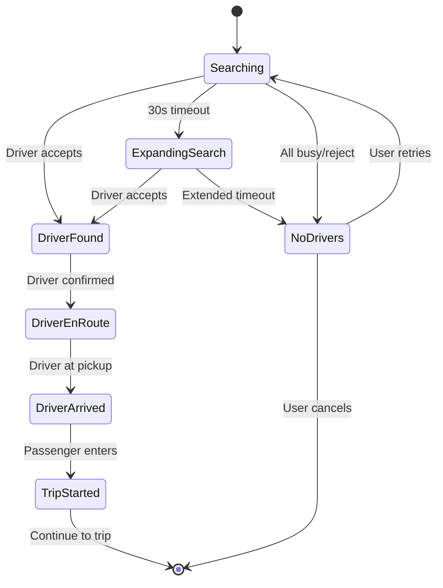

# 📱 Sikka Transportation Platform - Passenger Journey

> Comprehensive passenger user journey with detailed flows, decision points, and user experience optimization

## 📋 Table of Contents

- [🎯 Journey Overview](#-journey-overview)
- [📱 App Registration & Onboarding](#-app-registration--onboarding)
- [🚗 Trip Booking Flow](#-trip-booking-flow)
- [⏱️ Waiting & Tracking Experience](#️-waiting--tracking-experience)
- [🛣️ In-Trip Experience](#️-in-trip-experience)
- [💳 Payment & Completion](#-payment--completion)
- [⭐ Rating & Feedback](#-rating--feedback)
- [🔄 Alternative Flows](#-alternative-flows)
- [📊 User Experience Optimization](#-user-experience-optimization)

## 🎯 Journey Overview

The passenger journey in the Sikka Transportation Platform is designed for **simplicity, transparency, and reliability**. From registration to trip completion, every step is optimized for the Sudanese market with local payment methods, Arabic language support, and cultural considerations.

### **🎨 Journey Principles**
- **🚀 Speed**: Quick booking with minimal steps
- **🔍 Transparency**: Clear pricing and driver information
- **🛡️ Safety**: Real-time tracking and emergency features
- **💰 Flexibility**: Multiple payment options including cash
- **📱 Accessibility**: Simple interface for all user levels

### **📊 Journey Statistics**
- **Average Booking Time**: 2-3 minutes
- **Steps to Complete Booking**: 4 main steps
- **Payment Options**: 4 methods (Wallet, Cash, EBS, CyberPay)
- **Languages Supported**: Arabic, English
- **Accessibility**: Voice commands, large text options

## 📱 App Registration & Onboarding

### **🎯 First-Time User Flow**

```mermaid
%%{init: {
  "theme": "dark",
  "themeVariables": {
    "primaryColor": "#0d1117",
    "primaryTextColor": "#ddd6fe",
    "primaryBorderColor": "#7c3aed",
    "lineColor": "#7c3aed",
    "secondaryColor": "#8b5cf6",
    "tertiaryColor": "#a78bfa",
    "background": "#0d1117",
    "mainBkg": "#0d1117",
    "secondBkg": "#3730a3",
    "tertiaryBkg": "#a78bfa"
  },
  "flowchart": {
    "useMaxWidth": true,
    "htmlLabels": true
  },
  "sequence": {
    "useMaxWidth": true,
    "wrap": true
  },
  "class": {
    "useMaxWidth": true
  },
  "state": {
    "useMaxWidth": true
  },
  "er": {
    "useMaxWidth": true
  },
  "gantt": {
    "useMaxWidth": true
  }
}%%
flowchart TD
    A["📱 Download Sikka App"] --> B {"🌍 Language Selection"}
    B --> C["📞 Phone Number Entry"]
    C --> D["📨 OTP Verification"]
    D --> E {"✅ OTP Valid?"}
    E --> |No| F["❌ Error Message"]
    F --> D
    E --> |Yes| G["👤 Profile Creation"]
    G --> H["📍 Location Permission"]
    H --> I["🔔 Notification Permission"]
    I --> J["💰 Wallet Setup"]
    J --> K["🎉 Welcome Tutorial"]
    K --> L["🏠 Home Screen"]
    
    style A fill:#e3f2fd;
    style L fill:#c8e6c9;
    style F fill:#ffcdd2;

    %%  --- DARK GRADIENT & GLOW STYLING ---
    
    %%  Main Dashboard (Neon Cyan/Blue)
    classDef main fill : #0d1117, stroke:#58a6ff, stroke-width: 4px,color:#58a6ff,font-weight: bold;
    
    
    %%  Decision Diamond (Gold Glow)
    classDef decision fill : #161b22, stroke:#d29922, color:#d29922,stroke-dasharray: 5 5;
    
    
    %%  Revenue (Emerald Gradient Style)
    classDef revNode fill : #04190b, stroke:#3fb950, color:#aff5b4,stroke-width: 2px;
    
    
    %%  Commission (Purple Gradient Style)
    classDef commNode fill : #12101e, stroke:#bc8cff, color:#e2c5ff,stroke-width: 2px;
    
    
    %%  Refund (Ruby Gradient Style)
    classDef refNode fill : #1a0b0b, stroke:#ff7b72, color:#ffa198,stroke-width: 2px;
    
    
    %%  Earnings (Sapphire Gradient Style)
    classDef earnNode fill : #051221, stroke:#388bfd, color:#a5d6ff,stroke-width: 2px;
    

    class A main;
    class B decision;
    class C revNode;
    class D commNode;
    class E refNode;
    class F earnNode;
    class G main;
    class H decision;
    class I revNode;
    class J commNode;
    class K refNode;
    class L earnNode;
    class N main;
    class Y decision;


    %% --- PASSENGER (ROYAL PURPLE) THEME STYLING ---
    
    %% Primary nodes (main components)
    classDef primary fill:#0d1117,stroke:#7c3aed,stroke-width:4px,color:#ddd6fe,font-weight:bold;
    
    %% Secondary nodes (supporting components)
    classDef secondary fill:#0d1117,stroke:#8b5cf6,stroke-width:3px,color:#ddd6fe,font-weight:normal;
    
    %% Accent nodes (highlights)
    classDef accent fill:#0d1117,stroke:#a78bfa,stroke-width:2px,color:#a78bfa,font-weight:bold;
    
    %% Success nodes (positive outcomes)
    classDef success fill:#0d1117,stroke:#059669,stroke-width:3px,color:#059669,font-weight:bold;
    
    %% Warning nodes (attention needed)
    classDef warning fill:#0d1117,stroke:#d97706,stroke-width:3px,color:#d97706,font-weight:bold,stroke-dasharray: 5 5;
    
    %% Error nodes (problems/failures)
    classDef error fill:#0d1117,stroke:#dc2626,stroke-width:3px,color:#dc2626,font-weight:bold,stroke-dasharray: 10 5;
    
    %% Database nodes (data storage)
    classDef database fill:#0d1117,stroke:#a78bfa,stroke-width:4px,color:#a78bfa,font-weight:bold;
    
    %% Process nodes (operations)
    classDef process fill:#3730a3,stroke:#7c3aed,stroke-width:2px,color:#ddd6fe,font-weight:normal;
    
    %% Decision nodes (branching points)
    classDef decision fill:#0d1117,stroke:#d97706,stroke-width:3px,color:#d97706,font-weight:bold,stroke-dasharray: 8 4;
    
    %% External nodes (third-party services)
    classDef external fill:#0d1117,stroke:#8b5cf6,stroke-width:2px,color:#8b5cf6,font-weight:normal,stroke-dasharray: 3 3;

    class A secondary;
    class C accent;
    class D decision;
    class F error;
    class G accent;
    class H accent;
    class I decision;
    class J success;
    class K accent;
    class L accent;
```

### **📝 Registration Details**

#### **📞 Phone Number Verification**
```mermaid
%%{init: {
  "theme": "dark",
  "themeVariables": {
    "primaryColor": "#0d1117",
    "primaryTextColor": "#ddd6fe",
    "primaryBorderColor": "#7c3aed",
    "lineColor": "#7c3aed",
    "secondaryColor": "#8b5cf6",
    "tertiaryColor": "#a78bfa",
    "background": "#0d1117",
    "mainBkg": "#0d1117",
    "secondBkg": "#3730a3",
    "tertiaryBkg": "#a78bfa"
  },
  "flowchart": {
    "useMaxWidth": true,
    "htmlLabels": true
  },
  "sequence": {
    "useMaxWidth": true,
    "wrap": true
  },
  "class": {
    "useMaxWidth": true
  },
  "state": {
    "useMaxWidth": true
  },
  "er": {
    "useMaxWidth": true
  },
  "gantt": {
    "useMaxWidth": true
  }
}%%
sequenceDiagram
    participant U as "👤 User"
    participant APP as "📱 Sikka App"
    participant API as "🔌 API Server"
    participant SMS as "📱 SMS Service"
    
    U->>APP: Enter Phone (+249XXXXXXXXX)
    APP->>APP: Validate Sudan Format
    APP->>API: Send Registration Request
    API->>SMS: Send OTP
    SMS->>U: OTP Message (6 digits)
    U->>APP: Enter OTP
    APP->>API: Verify OTP
    API->>APP: Registration Success
    APP->>APP: Create Local Profile
    APP->>U: Welcome Screen

    %%  --- DARK GRADIENT & GLOW STYLING ---
    
    %%  Main Dashboard (Neon Cyan/Blue)
    classDef main fill : #0d1117, stroke:#58a6ff, stroke-width: 4px,color:#58a6ff,font-weight: bold;
    
    
    %%  Decision Diamond (Gold Glow)
    classDef decision fill : #161b22, stroke:#d29922, color:#d29922,stroke-dasharray: 5 5;
    
    
    %%  Revenue (Emerald Gradient Style)
    classDef revNode fill : #04190b, stroke:#3fb950, color:#aff5b4,stroke-width: 2px;
    
    
    %%  Commission (Purple Gradient Style)
    classDef commNode fill : #12101e, stroke:#bc8cff, color:#e2c5ff,stroke-width: 2px;
    
    
    %%  Refund (Ruby Gradient Style)
    classDef refNode fill : #1a0b0b, stroke:#ff7b72, color:#ffa198,stroke-width: 2px;
    
    
    %%  Earnings (Sapphire Gradient Style)
    classDef earnNode fill : #051221, stroke:#388bfd, color:#a5d6ff,stroke-width: 2px;
    

    class API main;
    class APP decision;
    class SMS revNode;
    class U commNode;


    %% --- PASSENGER (ROYAL PURPLE) THEME STYLING ---
    
    %% Primary nodes (main components)
    classDef primary fill:#0d1117,stroke:#7c3aed,stroke-width:4px,color:#ddd6fe,font-weight:bold;
    
    %% Secondary nodes (supporting components)
    classDef secondary fill:#0d1117,stroke:#8b5cf6,stroke-width:3px,color:#ddd6fe,font-weight:normal;
    
    %% Accent nodes (highlights)
    classDef accent fill:#0d1117,stroke:#a78bfa,stroke-width:2px,color:#a78bfa,font-weight:bold;
    
    %% Success nodes (positive outcomes)
    classDef success fill:#0d1117,stroke:#059669,stroke-width:3px,color:#059669,font-weight:bold;
    
    %% Warning nodes (attention needed)
    classDef warning fill:#0d1117,stroke:#d97706,stroke-width:3px,color:#d97706,font-weight:bold,stroke-dasharray: 5 5;
    
    %% Error nodes (problems/failures)
    classDef error fill:#0d1117,stroke:#dc2626,stroke-width:3px,color:#dc2626,font-weight:bold,stroke-dasharray: 10 5;
    
    %% Database nodes (data storage)
    classDef database fill:#0d1117,stroke:#a78bfa,stroke-width:4px,color:#a78bfa,font-weight:bold;
    
    %% Process nodes (operations)
    classDef process fill:#3730a3,stroke:#7c3aed,stroke-width:2px,color:#ddd6fe,font-weight:normal;
    
    %% Decision nodes (branching points)
    classDef decision fill:#0d1117,stroke:#d97706,stroke-width:3px,color:#d97706,font-weight:bold,stroke-dasharray: 8 4;
    
    %% External nodes (third-party services)
    classDef external fill:#0d1117,stroke:#8b5cf6,stroke-width:2px,color:#8b5cf6,font-weight:normal,stroke-dasharray: 3 3;


```

#### **👤 Profile Setup**
```typescript
interface PassengerProfile {
  firstName: string;           // "أحمد" or "Ahmed"
  name: string;               // Full name
  phone: string;              // "+249123456789"
  preferredLanguage: 'ar' | 'en';
  emergencyContact?: {
    name: string;
    phone: string;
    relationship: string;
  };
  preferences: {
    paymentMethod: 'wallet' | 'cash' | 'ebs' | 'cyberpay';
    vehicleType: 'any' | 'sedan' | 'suv';
    musicPreference: boolean;
    acPreference: boolean;
  };
}
```

### **🎓 Onboarding Tutorial**


## 🚗 Trip Booking Flow

### **🎯 Main Booking Journey**

```mermaid
%%{init: {
  "theme": "dark",
  "themeVariables": {
    "primaryColor": "#0d1117",
    "primaryTextColor": "#ddd6fe",
    "primaryBorderColor": "#7c3aed",
    "lineColor": "#7c3aed",
    "secondaryColor": "#8b5cf6",
    "tertiaryColor": "#a78bfa",
    "background": "#0d1117",
    "mainBkg": "#0d1117",
    "secondBkg": "#3730a3",
    "tertiaryBkg": "#a78bfa"
  },
  "flowchart": {
    "useMaxWidth": true,
    "htmlLabels": true
  },
  "sequence": {
    "useMaxWidth": true,
    "wrap": true
  },
  "class": {
    "useMaxWidth": true
  },
  "state": {
    "useMaxWidth": true
  },
  "er": {
    "useMaxWidth": true
  },
  "gantt": {
    "useMaxWidth": true
  }
}%%
flowchart TD
    A["🏠 Home Screen"] --> B["📍 Set Pickup Location"]
    B --> C {"🗺️ Location Method"}
    C --> |GPS| D["📍 Current Location"]
    C --> |Search| E["🔍 Address Search"]
    C --> |Map| F["🗺️ Pin on Map"]
    
    D --> G["📍 Set Destination"]
    E --> G
    F --> G
    
    G --> H {"🗺️ Destination Method"}
    H --> |Search| I["🔍 Address Search"]
    H --> |Map| J["🗺️ Pin on Map"]
    H --> |Favorites| K["⭐ Saved Places"]
    
    I --> L["🚗 Select Vehicle Type"]
    J --> L
    K --> L
    
    L --> M["💰 View Fare Estimate"]
    M --> N["💳 Choose Payment Method"]
    N --> O["📝 Add Notes (Optional)"]
    O --> P["🚀 Confirm Booking"]
    P --> Q["⏳ Finding Driver..."]
    
    style A fill:#e3f2fd;
    style P fill:#fff3e0;
    style Q fill:#f3e5f5;

    %%  --- DARK GRADIENT & GLOW STYLING ---
    
    %%  Main Dashboard (Neon Cyan/Blue)
    classDef main fill : #0d1117, stroke:#58a6ff, stroke-width: 4px,color:#58a6ff,font-weight: bold;
    
    
    %%  Decision Diamond (Gold Glow)
    classDef decision fill : #161b22, stroke:#d29922, color:#d29922,stroke-dasharray: 5 5;
    
    
    %%  Revenue (Emerald Gradient Style)
    classDef revNode fill : #04190b, stroke:#3fb950, color:#aff5b4,stroke-width: 2px;
    
    
    %%  Commission (Purple Gradient Style)
    classDef commNode fill : #12101e, stroke:#bc8cff, color:#e2c5ff,stroke-width: 2px;
    
    
    %%  Refund (Ruby Gradient Style)
    classDef refNode fill : #1a0b0b, stroke:#ff7b72, color:#ffa198,stroke-width: 2px;
    
    
    %%  Earnings (Sapphire Gradient Style)
    classDef earnNode fill : #051221, stroke:#388bfd, color:#a5d6ff,stroke-width: 2px;
    

    class A main;
    class B decision;
    class C revNode;
    class D commNode;
    class E refNode;
    class F earnNode;
    class G main;
    class GPS decision;
    class H revNode;
    class I commNode;
    class J refNode;
    class K earnNode;
    class L main;
    class M decision;
    class N revNode;
    class O commNode;
    class P refNode;
    class Q earnNode;
    class S main;


    %% --- PASSENGER (ROYAL PURPLE) THEME STYLING ---
    
    %% Primary nodes (main components)
    classDef primary fill:#0d1117,stroke:#7c3aed,stroke-width:4px,color:#ddd6fe,font-weight:bold;
    
    %% Secondary nodes (supporting components)
    classDef secondary fill:#0d1117,stroke:#8b5cf6,stroke-width:3px,color:#ddd6fe,font-weight:normal;
    
    %% Accent nodes (highlights)
    classDef accent fill:#0d1117,stroke:#a78bfa,stroke-width:2px,color:#a78bfa,font-weight:bold;
    
    %% Success nodes (positive outcomes)
    classDef success fill:#0d1117,stroke:#059669,stroke-width:3px,color:#059669,font-weight:bold;
    
    %% Warning nodes (attention needed)
    classDef warning fill:#0d1117,stroke:#d97706,stroke-width:3px,color:#d97706,font-weight:bold,stroke-dasharray: 5 5;
    
    %% Error nodes (problems/failures)
    classDef error fill:#0d1117,stroke:#dc2626,stroke-width:3px,color:#dc2626,font-weight:bold,stroke-dasharray: 10 5;
    
    %% Database nodes (data storage)
    classDef database fill:#0d1117,stroke:#a78bfa,stroke-width:4px,color:#a78bfa,font-weight:bold;
    
    %% Process nodes (operations)
    classDef process fill:#3730a3,stroke:#7c3aed,stroke-width:2px,color:#ddd6fe,font-weight:normal;
    
    %% Decision nodes (branching points)
    classDef decision fill:#0d1117,stroke:#d97706,stroke-width:3px,color:#d97706,font-weight:bold,stroke-dasharray: 8 4;
    
    %% External nodes (third-party services)
    classDef external fill:#0d1117,stroke:#8b5cf6,stroke-width:2px,color:#8b5cf6,font-weight:normal,stroke-dasharray: 3 3;

    class A accent;
    class B accent;
    class D accent;
    class E accent;
    class F accent;
    class G accent;
    class I accent;
    class J accent;
    class K accent;
    class L accent;
    class M accent;
    class N success;
    class O accent;
    class P accent;
    class Q accent;
```

### **🚗 Vehicle Selection**

```mermaid
%%{init: {
    "theme": "dark",
    "themeVariables": {
    "primaryColor": "#0d1117",
    "primaryTextColor": "#58a6ff",
    "primaryBorderColor": "#58a6ff",
    "lineColor": "#58a6ff"
    },
    "flowchart": {
    "useMaxWidth": true,
    "htmlLabels": true
    }
    }}%%
%%{init: {
  "theme": "dark",
  "themeVariables": {
    "primaryColor": "#0d1117",
    "primaryTextColor": "#ddd6fe",
    "primaryBorderColor": "#7c3aed",
    "lineColor": "#7c3aed",
    "secondaryColor": "#8b5cf6",
    "tertiaryColor": "#a78bfa",
    "background": "#0d1117",
    "mainBkg": "#0d1117",
    "secondBkg": "#3730a3",
    "tertiaryBkg": "#a78bfa"
  },
  "flowchart": {
    "useMaxWidth": true,
    "htmlLabels": true
  },
  "sequence": {
    "useMaxWidth": true,
    "wrap": true
  },
  "class": {
    "useMaxWidth": true
  },
  "state": {
    "useMaxWidth": true
  },
  "er": {
    "useMaxWidth": true
  },
  "gantt": {
    "useMaxWidth": true
  }
}%%
graph TB
    A["🚗 Vehicle Types"] --> B["🚙 Standard&lt;br/&gt;SDG 15-25"]
    A --> C["🚗 Premium&lt;br/&gt;SDG 25-40"]
    A --> D["🚐 Shared&lt;br/&gt;SDG 8-15"]
    A --> E["📦 Delivery&lt;br/&gt;SDG 10-20"]
    
    B --> F["📊 Fare Calculation"]
    C --> F
    D --> F
    E --> F
    
    F --> G["💰 Final Estimate"]
    
    style A fill:#e8f5e8;
    style G fill:#fff3e0;

    %%  --- DARK GRADIENT & GLOW STYLING ---
    
    %%  Main Dashboard (Neon Cyan/Blue)
    classDef main fill : #0d1117, stroke:#58a6ff, stroke-width: 4px,color:#58a6ff,font-weight: bold;
    
    
    %%  Decision Diamond (Gold Glow)
    classDef decision fill : #161b22, stroke:#d29922, color:#d29922,stroke-dasharray: 5 5;
    
    
    %%  Revenue (Emerald Gradient Style)
    classDef revNode fill : #04190b, stroke:#3fb950, color:#aff5b4,stroke-width: 2px;
    
    
    %%  Commission (Purple Gradient Style)
    classDef commNode fill : #12101e, stroke:#bc8cff, color:#e2c5ff,stroke-width: 2px;
    
    
    %%  Refund (Ruby Gradient Style)
    classDef refNode fill : #1a0b0b, stroke:#ff7b72, color:#ffa198,stroke-width: 2px;
    
    
    %%  Earnings (Sapphire Gradient Style)
    classDef earnNode fill : #051221, stroke:#388bfd, color:#a5d6ff,stroke-width: 2px;
    

    class A main;
    class B decision;
    class C revNode;
    class D commNode;
    class E refNode;
    class F earnNode;
    class G main;




    %% --- PASSENGER (ROYAL PURPLE) THEME STYLING ---
    
    %% Primary nodes (main components)
    classDef primary fill:#0d1117,stroke:#7c3aed,stroke-width:4px,color:#ddd6fe,font-weight:bold;
    
    %% Secondary nodes (supporting components)
    classDef secondary fill:#0d1117,stroke:#8b5cf6,stroke-width:3px,color:#ddd6fe,font-weight:normal;
    
    %% Accent nodes (highlights)
    classDef accent fill:#0d1117,stroke:#a78bfa,stroke-width:2px,color:#a78bfa,font-weight:bold;
    
    %% Success nodes (positive outcomes)
    classDef success fill:#0d1117,stroke:#059669,stroke-width:3px,color:#059669,font-weight:bold;
    
    %% Warning nodes (attention needed)
    classDef warning fill:#0d1117,stroke:#d97706,stroke-width:3px,color:#d97706,font-weight:bold,stroke-dasharray: 5 5;
    
    %% Error nodes (problems/failures)
    classDef error fill:#0d1117,stroke:#dc2626,stroke-width:3px,color:#dc2626,font-weight:bold,stroke-dasharray: 10 5;
    
    %% Database nodes (data storage)
    classDef database fill:#0d1117,stroke:#a78bfa,stroke-width:4px,color:#a78bfa,font-weight:bold;
    
    %% Process nodes (operations)
    classDef process fill:#3730a3,stroke:#7c3aed,stroke-width:2px,color:#ddd6fe,font-weight:normal;
    
    %% Decision nodes (branching points)
    classDef decision fill:#0d1117,stroke:#d97706,stroke-width:3px,color:#d97706,font-weight:bold,stroke-dasharray: 8 4;
    
    %% External nodes (third-party services)
    classDef external fill:#0d1117,stroke:#8b5cf6,stroke-width:2px,color:#8b5cf6,font-weight:normal,stroke-dasharray: 3 3;

    class A accent;
    class B accent;
    class C accent;
    class D accent;
    class E accent;
    class F accent;
    class G accent;
```



### **💰 Fare Calculation Logic**

```typescript
interface FareCalculation {
  basefare: number;           // Base fare (SDG 5)
  distanceFare: number;       // SDG 2 per km
  timeFare: number;          // SDG 1 per minute
  vehicleMultiplier: number; // Standard: 1x, Premium: 1.5x
  peakHourMultiplier: number; // Rush hour: 1.2x
  platformFee: number;       // SDG 2.50
  total: number;
}

// Example calculation
const calculateFare = (distance: number, duration: number, vehicleType: string) => {
  const base = 5;
  const distanceCost = distance * 2;
  const timeCost = duration * 1;
  const vehicleMultiplier = vehicleType === 'premium' ? 1.5 : 1;
  const peakMultiplier = isPeakHour() ? 1.2 : 1;
  
  const subtotal = (base + distanceCost + timeCost) * vehicleMultiplier * peakMultiplier;
  const platformFee = 2.50;
  
  return {
    basefare: base,
    distanceFare: distanceCost,
    timeFare: timeCost,
    vehicleMultiplier,
    peakHourMultiplier: peakMultiplier,
    platformFee,
    total: subtotal + platformFee
  };
};
```

### **💳 Payment Method Selection**

```mermaid
%%{init: {
    "theme": "dark",
    "themeVariables": {
    "primaryColor": "#0d1117",
    "primaryTextColor": "#58a6ff",
    "primaryBorderColor": "#58a6ff",
    "lineColor": "#58a6ff"
    },
    "flowchart": {
    "useMaxWidth": true,
    "htmlLabels": true
    }
    }}%%
%%{init: {
  "theme": "dark",
  "themeVariables": {
    "primaryColor": "#0d1117",
    "primaryTextColor": "#ddd6fe",
    "primaryBorderColor": "#7c3aed",
    "lineColor": "#7c3aed",
    "secondaryColor": "#8b5cf6",
    "tertiaryColor": "#a78bfa",
    "background": "#0d1117",
    "mainBkg": "#0d1117",
    "secondBkg": "#3730a3",
    "tertiaryBkg": "#a78bfa"
  },
  "flowchart": {
    "useMaxWidth": true,
    "htmlLabels": true
  },
  "sequence": {
    "useMaxWidth": true,
    "wrap": true
  },
  "class": {
    "useMaxWidth": true
  },
  "state": {
    "useMaxWidth": true
  },
  "er": {
    "useMaxWidth": true
  },
  "gantt": {
    "useMaxWidth": true
  }
}%%
graph TB
    A["💳 Payment Options"] --> B["💰 Sikka Wallet&lt;br/&gt;Balance: SDG 125.50"]
    A --> C["💵 Cash Payment&lt;br/&gt;Pay Driver Directly"]
    A --> D["🏦 EBS Card&lt;br/&gt;Bank Card Payment"]
    A --> E["💳 CyberPay&lt;br/&gt;Digital Wallet"]
    
    B --> F {"💰 Sufficient Balance?"}
    F --> |Yes| G["✅ Wallet Selected"]
    F --> |No| H["⚠️ Top Up Required"]
    
    C --> I["✅ Cash Selected"]
    D --> J["🔐 Card Details Required"]
    E --> K["🔐 CyberPay Login"]
    
    style A fill:#e3f2fd;
    style G fill:#c8e6c9;
    style I fill:#c8e6c9;
    style H fill:#ffecb3;

    %%  --- DARK GRADIENT & GLOW STYLING ---
    
    %%  Main Dashboard (Neon Cyan/Blue)
    classDef main fill : #0d1117, stroke:#58a6ff, stroke-width: 4px,color:#58a6ff,font-weight: bold;
    
    
    %%  Decision Diamond (Gold Glow)
    classDef decision fill : #161b22, stroke:#d29922, color:#d29922,stroke-dasharray: 5 5;
    
    
    %%  Revenue (Emerald Gradient Style)
    classDef revNode fill : #04190b, stroke:#3fb950, color:#aff5b4,stroke-width: 2px;
    
    
    %%  Commission (Purple Gradient Style)
    classDef commNode fill : #12101e, stroke:#bc8cff, color:#e2c5ff,stroke-width: 2px;
    
    
    %%  Refund (Ruby Gradient Style)
    classDef refNode fill : #1a0b0b, stroke:#ff7b72, color:#ffa198,stroke-width: 2px;
    
    
    %%  Earnings (Sapphire Gradient Style)
    classDef earnNode fill : #051221, stroke:#388bfd, color:#a5d6ff,stroke-width: 2px;
    

    class A main;
    class B decision;
    class C revNode;
    class D commNode;
    class E refNode;
    class F earnNode;
    class G main;
    class H decision;
    class I revNode;
    class J commNode;
    class K refNode;
    class N earnNode;
    class Y main;


    %% --- PASSENGER (ROYAL PURPLE) THEME STYLING ---
    
    %% Primary nodes (main components)
    classDef primary fill:#0d1117,stroke:#7c3aed,stroke-width:4px,color:#ddd6fe,font-weight:bold;
    
    %% Secondary nodes (supporting components)
    classDef secondary fill:#0d1117,stroke:#8b5cf6,stroke-width:3px,color:#ddd6fe,font-weight:normal;
    
    %% Accent nodes (highlights)
    classDef accent fill:#0d1117,stroke:#a78bfa,stroke-width:2px,color:#a78bfa,font-weight:bold;
    
    %% Success nodes (positive outcomes)
    classDef success fill:#0d1117,stroke:#059669,stroke-width:3px,color:#059669,font-weight:bold;
    
    %% Warning nodes (attention needed)
    classDef warning fill:#0d1117,stroke:#d97706,stroke-width:3px,color:#d97706,font-weight:bold,stroke-dasharray: 5 5;
    
    %% Error nodes (problems/failures)
    classDef error fill:#0d1117,stroke:#dc2626,stroke-width:3px,color:#dc2626,font-weight:bold,stroke-dasharray: 10 5;
    
    %% Database nodes (data storage)
    classDef database fill:#0d1117,stroke:#a78bfa,stroke-width:4px,color:#a78bfa,font-weight:bold;
    
    %% Process nodes (operations)
    classDef process fill:#3730a3,stroke:#7c3aed,stroke-width:2px,color:#ddd6fe,font-weight:normal;
    
    %% Decision nodes (branching points)
    classDef decision fill:#0d1117,stroke:#d97706,stroke-width:3px,color:#d97706,font-weight:bold,stroke-dasharray: 8 4;
    
    %% External nodes (third-party services)
    classDef external fill:#0d1117,stroke:#8b5cf6,stroke-width:2px,color:#8b5cf6,font-weight:normal,stroke-dasharray: 3 3;

    class A success;
    class B success;
    class C success;
    class D success;
    class E success;
    class G success;
    class H accent;
    class I accent;
    class J accent;
    class K accent;
```

## ⏱️ Waiting & Tracking Experience

### **🔍 Driver Matching Process**

```mermaid
%%{init: {
  "theme": "dark",
  "themeVariables": {
    "primaryColor": "#0d1117",
    "primaryTextColor": "#ddd6fe",
    "primaryBorderColor": "#7c3aed",
    "lineColor": "#7c3aed",
    "secondaryColor": "#8b5cf6",
    "tertiaryColor": "#a78bfa",
    "background": "#0d1117",
    "mainBkg": "#0d1117",
    "secondBkg": "#3730a3",
    "tertiaryBkg": "#a78bfa"
  },
  "flowchart": {
    "useMaxWidth": true,
    "htmlLabels": true
  },
  "sequence": {
    "useMaxWidth": true,
    "wrap": true
  },
  "class": {
    "useMaxWidth": true
  },
  "state": {
    "useMaxWidth": true
  },
  "er": {
    "useMaxWidth": true
  },
  "gantt": {
    "useMaxWidth": true
  }
}%%
sequenceDiagram
    participant P as "📱 Passenger"
    participant API as "🔌 API Server"
    participant LS as "📍 Location Service"
    participant D1 as "🚗 Driver 1"
    participant D2 as "🚗 Driver 2"
    participant D3 as "🚗 Driver 3"
    
    P->>API: Confirm Booking
    API->>LS: Find Nearby Drivers
    LS->>API: Return Driver List
    
    par Notify Multiple Drivers
        API->>D1: New Trip Available
        API->>D2: New Trip Available
        API->>D3: New Trip Available
    end
    
    P->>P: Show "Finding Driver..." (30s timeout)
    
    alt Driver Accepts
        D2->>API: Accept Trip
        API->>P: Driver Found!
        API->>D1: Trip Taken
        API->>D3: Trip Taken
    else No Response (30s)
        API->>P: Expanding Search -.-> API->>LS: Find Drivers (Larger Radius)
    else All Drivers Busy
        API->>P: No Drivers Available
        P->>P: Retry or Cancel Options
    end

    %%  --- DARK GRADIENT & GLOW STYLING ---
    
    %%  Main Dashboard (Neon Cyan/Blue)
    classDef main fill : #0d1117, stroke:#58a6ff, stroke-width: 4px,color:#58a6ff,font-weight: bold;
    
    
    %%  Decision Diamond (Gold Glow)
    classDef decision fill : #161b22, stroke:#d29922, color:#d29922,stroke-dasharray: 5 5;
    
    
    %%  Revenue (Emerald Gradient Style)
    classDef revNode fill : #04190b, stroke:#3fb950, color:#aff5b4,stroke-width: 2px;
    
    
    %%  Commission (Purple Gradient Style)
    classDef commNode fill : #12101e, stroke:#bc8cff, color:#e2c5ff,stroke-width: 2px;
    
    
    %%  Refund (Ruby Gradient Style)
    classDef refNode fill : #1a0b0b, stroke:#ff7b72, color:#ffa198,stroke-width: 2px;
    
    
    %%  Earnings (Sapphire Gradient Style)
    classDef earnNode fill : #051221, stroke:#388bfd, color:#a5d6ff,stroke-width: 2px;
    

    class API main;
    class D1 decision;
    class D2 revNode;
    class D3 commNode;
    class LS refNode;
    class P earnNode;


    %% --- PASSENGER (ROYAL PURPLE) THEME STYLING ---
    
    %% Primary nodes (main components)
    classDef primary fill:#0d1117,stroke:#7c3aed,stroke-width:4px,color:#ddd6fe,font-weight:bold;
    
    %% Secondary nodes (supporting components)
    classDef secondary fill:#0d1117,stroke:#8b5cf6,stroke-width:3px,color:#ddd6fe,font-weight:normal;
    
    %% Accent nodes (highlights)
    classDef accent fill:#0d1117,stroke:#a78bfa,stroke-width:2px,color:#a78bfa,font-weight:bold;
    
    %% Success nodes (positive outcomes)
    classDef success fill:#0d1117,stroke:#059669,stroke-width:3px,color:#059669,font-weight:bold;
    
    %% Warning nodes (attention needed)
    classDef warning fill:#0d1117,stroke:#d97706,stroke-width:3px,color:#d97706,font-weight:bold,stroke-dasharray: 5 5;
    
    %% Error nodes (problems/failures)
    classDef error fill:#0d1117,stroke:#dc2626,stroke-width:3px,color:#dc2626,font-weight:bold,stroke-dasharray: 10 5;
    
    %% Database nodes (data storage)
    classDef database fill:#0d1117,stroke:#a78bfa,stroke-width:4px,color:#a78bfa,font-weight:bold;
    
    %% Process nodes (operations)
    classDef process fill:#3730a3,stroke:#7c3aed,stroke-width:2px,color:#ddd6fe,font-weight:normal;
    
    %% Decision nodes (branching points)
    classDef decision fill:#0d1117,stroke:#d97706,stroke-width:3px,color:#d97706,font-weight:bold,stroke-dasharray: 8 4;
    
    %% External nodes (third-party services)
    classDef external fill:#0d1117,stroke:#8b5cf6,stroke-width:2px,color:#8b5cf6,font-weight:normal,stroke-dasharray: 3 3;


```

### **📱 Waiting Screen Experience**



### **📊 Real-Time Updates**

```typescript
interface WaitingScreenData {
  status: 'searching' | 'driver_found' | 'driver_enroute' | 'driver_arrived';
  driver?: {
    id: string;
    name: string;
    rating: number;
    phone: string;
    photo: string;
    vehicle: {
      make: string;
      model: string;
      color: string;
      plateNumber: string;
    };
    location: {
      latitude: number;
      longitude: number;
      heading: number;
    };
    estimatedArrival: number; // minutes
  };
  searchRadius: number; // meters
  nearbyDriversCount: number;
  estimatedWaitTime: number; // minutes
}
```

## 🛣️ In-Trip Experience

### **🚗 Trip Progression**

```mermaid
%%{init: {
  "theme": "dark",
  "themeVariables": {
    "primaryColor": "#0d1117",
    "primaryTextColor": "#ddd6fe",
    "primaryBorderColor": "#7c3aed",
    "lineColor": "#7c3aed",
    "secondaryColor": "#8b5cf6",
    "tertiaryColor": "#a78bfa",
    "background": "#0d1117",
    "mainBkg": "#0d1117",
    "secondBkg": "#3730a3",
    "tertiaryBkg": "#a78bfa"
  },
  "flowchart": {
    "useMaxWidth": true,
    "htmlLabels": true
  },
  "sequence": {
    "useMaxWidth": true,
    "wrap": true
  },
  "class": {
    "useMaxWidth": true
  },
  "state": {
    "useMaxWidth": true
  },
  "er": {
    "useMaxWidth": true
  },
  "gantt": {
    "useMaxWidth": true
  }
}%%
flowchart TD
    A["🚗 Driver Arrived"] --> B["📱 Passenger Notified"]
    B --> C["🚶 Passenger Enters Vehicle"]
    C --> D["🚀 Trip Started"]
    D --> E["📍 Real-time Tracking"]
    E --> F["🗺️ Route Following"]
    F --> G {"🛣️ Route Deviation?"}
    G --> |No| H["📍 Continue Tracking"]
    G --> |Yes| I["⚠️ Route Alert"]
    H --> J["📍 Approaching Destination"]
    I --> J
    J --> K["🏁 Arrived at Destination"]
    K --> L["🚗 Trip Completed"]
    
    style A fill:#e3f2fd;
    style L fill:#c8e6c9;
    style I fill:#ffecb3;

    %%  --- DARK GRADIENT & GLOW STYLING ---
    
    %%  Main Dashboard (Neon Cyan/Blue)
    classDef main fill : #0d1117, stroke:#58a6ff, stroke-width: 4px,color:#58a6ff,font-weight: bold;
    
    
    %%  Decision Diamond (Gold Glow)
    classDef decision fill : #161b22, stroke:#d29922, color:#d29922,stroke-dasharray: 5 5;
    
    
    %%  Revenue (Emerald Gradient Style)
    classDef revNode fill : #04190b, stroke:#3fb950, color:#aff5b4,stroke-width: 2px;
    
    
    %%  Commission (Purple Gradient Style)
    classDef commNode fill : #12101e, stroke:#bc8cff, color:#e2c5ff,stroke-width: 2px;
    
    
    %%  Refund (Ruby Gradient Style)
    classDef refNode fill : #1a0b0b, stroke:#ff7b72, color:#ffa198,stroke-width: 2px;
    
    
    %%  Earnings (Sapphire Gradient Style)
    classDef earnNode fill : #051221, stroke:#388bfd, color:#a5d6ff,stroke-width: 2px;
    

    class A main;
    class B decision;
    class C revNode;
    class D commNode;
    class E refNode;
    class F earnNode;
    class G main;
    class H decision;
    class I revNode;
    class J commNode;
    class K refNode;
    class L earnNode;
    class N main;
    class Y decision;


    %% --- PASSENGER (ROYAL PURPLE) THEME STYLING ---
    
    %% Primary nodes (main components)
    classDef primary fill:#0d1117,stroke:#7c3aed,stroke-width:4px,color:#ddd6fe,font-weight:bold;
    
    %% Secondary nodes (supporting components)
    classDef secondary fill:#0d1117,stroke:#8b5cf6,stroke-width:3px,color:#ddd6fe,font-weight:normal;
    
    %% Accent nodes (highlights)
    classDef accent fill:#0d1117,stroke:#a78bfa,stroke-width:2px,color:#a78bfa,font-weight:bold;
    
    %% Success nodes (positive outcomes)
    classDef success fill:#0d1117,stroke:#059669,stroke-width:3px,color:#059669,font-weight:bold;
    
    %% Warning nodes (attention needed)
    classDef warning fill:#0d1117,stroke:#d97706,stroke-width:3px,color:#d97706,font-weight:bold,stroke-dasharray: 5 5;
    
    %% Error nodes (problems/failures)
    classDef error fill:#0d1117,stroke:#dc2626,stroke-width:3px,color:#dc2626,font-weight:bold,stroke-dasharray: 10 5;
    
    %% Database nodes (data storage)
    classDef database fill:#0d1117,stroke:#a78bfa,stroke-width:4px,color:#a78bfa,font-weight:bold;
    
    %% Process nodes (operations)
    classDef process fill:#3730a3,stroke:#7c3aed,stroke-width:2px,color:#ddd6fe,font-weight:normal;
    
    %% Decision nodes (branching points)
    classDef decision fill:#0d1117,stroke:#d97706,stroke-width:3px,color:#d97706,font-weight:bold,stroke-dasharray: 8 4;
    
    %% External nodes (third-party services)
    classDef external fill:#0d1117,stroke:#8b5cf6,stroke-width:2px,color:#8b5cf6,font-weight:normal,stroke-dasharray: 3 3;

    class A accent;
    class B decision;
    class C accent;
    class D accent;
    class E accent;
    class F accent;
    class H accent;
    class I warning;
    class J secondary;
    class K accent;
    class L accent;
```

### **📱 In-Trip Interface**

```mermaid
%%{init: {
    "theme": "dark",
    "themeVariables": {
    "primaryColor": "#0d1117",
    "primaryTextColor": "#58a6ff",
    "primaryBorderColor": "#58a6ff",
    "lineColor": "#58a6ff"
    },
    "flowchart": {
    "useMaxWidth": true,
    "htmlLabels": true
    }
    }}%%
%%{init: {
  "theme": "dark",
  "themeVariables": {
    "primaryColor": "#0d1117",
    "primaryTextColor": "#ddd6fe",
    "primaryBorderColor": "#7c3aed",
    "lineColor": "#7c3aed",
    "secondaryColor": "#8b5cf6",
    "tertiaryColor": "#a78bfa",
    "background": "#0d1117",
    "mainBkg": "#0d1117",
    "secondBkg": "#3730a3",
    "tertiaryBkg": "#a78bfa"
  },
  "flowchart": {
    "useMaxWidth": true,
    "htmlLabels": true
  },
  "sequence": {
    "useMaxWidth": true,
    "wrap": true
  },
  "class": {
    "useMaxWidth": true
  },
  "state": {
    "useMaxWidth": true
  },
  "er": {
    "useMaxWidth": true
  },
  "gantt": {
    "useMaxWidth": true
  }
}%%
graph TB
    A["📱 Trip Screen"] --> B["🗺️ Live Map View"]
    A --> C["👤 Driver Info Panel"]
    A --> D["📊 Trip Progress"]
    A --> E["🔧 Trip Actions"]
    
    B --> B1["📍 Current Location"]
    B --> B2["🛣️ Route Path"]
    B --> B3["🏁 Destination Marker"]
    
    C --> C1["📞 Call Driver"]
    C --> C2["💬 Message Driver"]
    C --> C3["⭐ Driver Rating"]
    
    D --> D1["⏱️ Elapsed Time"]
    D --> D2["📏 Distance Covered"]
    D --> D3["💰 Current Fare"]
    
    E --> E1["🚨 Emergency Button"]
    E --> E2["🔄 Share Trip"]
    E --> E3["❌ Report Issue"]
    
    style A fill:#e3f2fd;
    style E1 fill:#ffcdd2;

    %%  --- DARK GRADIENT & GLOW STYLING ---
    
    %%  Main Dashboard (Neon Cyan/Blue)
    classDef main fill : #0d1117, stroke:#58a6ff, stroke-width: 4px,color:#58a6ff,font-weight: bold;
    
    
    %%  Decision Diamond (Gold Glow)
    classDef decision fill : #161b22, stroke:#d29922, color:#d29922,stroke-dasharray: 5 5;
    
    
    %%  Revenue (Emerald Gradient Style)
    classDef revNode fill : #04190b, stroke:#3fb950, color:#aff5b4,stroke-width: 2px;
    
    
    %%  Commission (Purple Gradient Style)
    classDef commNode fill : #12101e, stroke:#bc8cff, color:#e2c5ff,stroke-width: 2px;
    
    
    %%  Refund (Ruby Gradient Style)
    classDef refNode fill : #1a0b0b, stroke:#ff7b72, color:#ffa198,stroke-width: 2px;
    
    
    %%  Earnings (Sapphire Gradient Style)
    classDef earnNode fill : #051221, stroke:#388bfd, color:#a5d6ff,stroke-width: 2px;
    

    class A main;
    class B decision;
    class B1 revNode;
    class B2 commNode;
    class B3 refNode;
    class C earnNode;
    class C1 main;
    class C2 decision;
    class C3 revNode;
    class D commNode;
    class D1 refNode;
    class D2 earnNode;
    class D3 main;
    class E decision;
    class E1 revNode;
    class E2 commNode;
    class E3 refNode;




    %% --- PASSENGER (ROYAL PURPLE) THEME STYLING ---
    
    %% Primary nodes (main components)
    classDef primary fill:#0d1117,stroke:#7c3aed,stroke-width:4px,color:#ddd6fe,font-weight:bold;
    
    %% Secondary nodes (supporting components)
    classDef secondary fill:#0d1117,stroke:#8b5cf6,stroke-width:3px,color:#ddd6fe,font-weight:normal;
    
    %% Accent nodes (highlights)
    classDef accent fill:#0d1117,stroke:#a78bfa,stroke-width:2px,color:#a78bfa,font-weight:bold;
    
    %% Success nodes (positive outcomes)
    classDef success fill:#0d1117,stroke:#059669,stroke-width:3px,color:#059669,font-weight:bold;
    
    %% Warning nodes (attention needed)
    classDef warning fill:#0d1117,stroke:#d97706,stroke-width:3px,color:#d97706,font-weight:bold,stroke-dasharray: 5 5;
    
    %% Error nodes (problems/failures)
    classDef error fill:#0d1117,stroke:#dc2626,stroke-width:3px,color:#dc2626,font-weight:bold,stroke-dasharray: 10 5;
    
    %% Database nodes (data storage)
    classDef database fill:#0d1117,stroke:#a78bfa,stroke-width:4px,color:#a78bfa,font-weight:bold;
    
    %% Process nodes (operations)
    classDef process fill:#3730a3,stroke:#7c3aed,stroke-width:2px,color:#ddd6fe,font-weight:normal;
    
    %% Decision nodes (branching points)
    classDef decision fill:#0d1117,stroke:#d97706,stroke-width:3px,color:#d97706,font-weight:bold,stroke-dasharray: 8 4;
    
    %% External nodes (third-party services)
    classDef external fill:#0d1117,stroke:#8b5cf6,stroke-width:2px,color:#8b5cf6,font-weight:normal,stroke-dasharray: 3 3;

    class A accent;
    class B accent;
    class C accent;
    class D accent;
    class E process;
    class B1 accent;
    class B2 accent;
    class B3 accent;
    class C1 accent;
    class C2 accent;
    class C3 accent;
    class D1 accent;
    class D2 accent;
    class D3 accent;
    class E1 accent;
    class E2 accent;
    class E3 error;
```



### **🚨 Safety Features**

```mermaid
%%{init: {
  "theme": "dark",
  "themeVariables": {
    "primaryColor": "#0d1117",
    "primaryTextColor": "#ddd6fe",
    "primaryBorderColor": "#7c3aed",
    "lineColor": "#7c3aed",
    "secondaryColor": "#8b5cf6",
    "tertiaryColor": "#a78bfa",
    "background": "#0d1117",
    "mainBkg": "#0d1117",
    "secondBkg": "#3730a3",
    "tertiaryBkg": "#a78bfa"
  },
  "flowchart": {
    "useMaxWidth": true,
    "htmlLabels": true
  },
  "sequence": {
    "useMaxWidth": true,
    "wrap": true
  },
  "class": {
    "useMaxWidth": true
  },
  "state": {
    "useMaxWidth": true
  },
  "er": {
    "useMaxWidth": true
  },
  "gantt": {
    "useMaxWidth": true
  }
}%%
graph LR
    A["🛡️ Safety Features"] --> B["🚨 Emergency Button"]
    A --> C["📍 Live Location Sharing"]
    A --> D["📞 Emergency Contacts"]
    A --> E["🔔 Trip Monitoring"]
    
    B --> B1["🚓 Police Alert"]
    B --> B2["📱 Emergency SMS"]
    B --> B3["📞 Auto Call"]
    
    C --> C1["👨‍👩‍👧‍👦 Family Sharing"]
    C --> C2["🔗 Share Link"]
    C --> C3["⏰ Auto Updates"]
    
    style A fill:#e8f5e8;
    style B fill:#ffcdd2;

    %%  --- DARK GRADIENT & GLOW STYLING ---
    
    %%  Main Dashboard (Neon Cyan/Blue)
    classDef main fill : #0d1117, stroke:#58a6ff, stroke-width: 4px,color:#58a6ff,font-weight: bold;
    
    
    %%  Decision Diamond (Gold Glow)
    classDef decision fill : #161b22, stroke:#d29922, color:#d29922,stroke-dasharray: 5 5;
    
    
    %%  Revenue (Emerald Gradient Style)
    classDef revNode fill : #04190b, stroke:#3fb950, color:#aff5b4,stroke-width: 2px;
    
    
    %%  Commission (Purple Gradient Style)
    classDef commNode fill : #12101e, stroke:#bc8cff, color:#e2c5ff,stroke-width: 2px;
    
    
    %%  Refund (Ruby Gradient Style)
    classDef refNode fill : #1a0b0b, stroke:#ff7b72, color:#ffa198,stroke-width: 2px;
    
    
    %%  Earnings (Sapphire Gradient Style)
    classDef earnNode fill : #051221, stroke:#388bfd, color:#a5d6ff,stroke-width: 2px;
    

    class A main;
    class B decision;
    class B1 revNode;
    class B2 commNode;
    class B3 refNode;
    class C earnNode;
    class C1 main;
    class C2 decision;
    class C3 revNode;
    class D commNode;
    class E refNode;




    %% --- PASSENGER (ROYAL PURPLE) THEME STYLING ---
    
    %% Primary nodes (main components)
    classDef primary fill:#0d1117,stroke:#7c3aed,stroke-width:4px,color:#ddd6fe,font-weight:bold;
    
    %% Secondary nodes (supporting components)
    classDef secondary fill:#0d1117,stroke:#8b5cf6,stroke-width:3px,color:#ddd6fe,font-weight:normal;
    
    %% Accent nodes (highlights)
    classDef accent fill:#0d1117,stroke:#a78bfa,stroke-width:2px,color:#a78bfa,font-weight:bold;
    
    %% Success nodes (positive outcomes)
    classDef success fill:#0d1117,stroke:#059669,stroke-width:3px,color:#059669,font-weight:bold;
    
    %% Warning nodes (attention needed)
    classDef warning fill:#0d1117,stroke:#d97706,stroke-width:3px,color:#d97706,font-weight:bold,stroke-dasharray: 5 5;
    
    %% Error nodes (problems/failures)
    classDef error fill:#0d1117,stroke:#dc2626,stroke-width:3px,color:#dc2626,font-weight:bold,stroke-dasharray: 10 5;
    
    %% Database nodes (data storage)
    classDef database fill:#0d1117,stroke:#a78bfa,stroke-width:4px,color:#a78bfa,font-weight:bold;
    
    %% Process nodes (operations)
    classDef process fill:#3730a3,stroke:#7c3aed,stroke-width:2px,color:#ddd6fe,font-weight:normal;
    
    %% Decision nodes (branching points)
    classDef decision fill:#0d1117,stroke:#d97706,stroke-width:3px,color:#d97706,font-weight:bold,stroke-dasharray: 8 4;
    
    %% External nodes (third-party services)
    classDef external fill:#0d1117,stroke:#8b5cf6,stroke-width:2px,color:#8b5cf6,font-weight:normal,stroke-dasharray: 3 3;

    class A accent;
    class B accent;
    class C accent;
    class D accent;
    class E accent;
    class B1 warning;
    class B2 accent;
    class B3 accent;
    class C1 accent;
    class C2 accent;
    class C3 accent;
```



## 💳 Payment & Completion

### **💰 Payment Processing Flow**

```mermaid
%%{init: {
  "theme": "dark",
  "themeVariables": {
    "primaryColor": "#0d1117",
    "primaryTextColor": "#ddd6fe",
    "primaryBorderColor": "#7c3aed",
    "lineColor": "#7c3aed",
    "secondaryColor": "#8b5cf6",
    "tertiaryColor": "#a78bfa",
    "background": "#0d1117",
    "mainBkg": "#0d1117",
    "secondBkg": "#3730a3",
    "tertiaryBkg": "#a78bfa"
  },
  "flowchart": {
    "useMaxWidth": true,
    "htmlLabels": true
  },
  "sequence": {
    "useMaxWidth": true,
    "wrap": true
  },
  "class": {
    "useMaxWidth": true
  },
  "state": {
    "useMaxWidth": true
  },
  "er": {
    "useMaxWidth": true
  },
  "gantt": {
    "useMaxWidth": true
  }
}%%
sequenceDiagram
    participant P as "📱 Passenger"
    participant APP as "📱 App"
    participant API as "🔌 API Server"
    participant PS as "💳 Payment Service"
    participant GW as "🏦 Gateway"
    participant D as "🚗 Driver"
    
    P->>APP: Trip Completed
    APP->>API: Calculate Final Fare
    API->>API: Apply Discounts/Promotions
    API->>P: Show Final Amount
    
    alt Wallet Payment
        P->>APP: Confirm Payment
        APP->>PS: Process Wallet Payment
        PS->>PS: Deduct from Wallet
        PS->>API: Payment Success
    else Card Payment
        P->>APP: Confirm Payment
        APP->>PS: Process Card Payment
        PS->>GW: Gateway Request
        GW->>PS: Payment Response
        PS->>API: Payment Result
    else Cash Payment
        P->>APP: Confirm Cash Payment
        APP->>API: Mark as Cash Payment
        API->>D: Collect Cash from Passenger
    end
    
    API->>PS: Distribute Earnings
    PS->>D: Transfer Driver Share (85%)
    PS->>PS: Collect Platform Fee (15%)
    API->>P: Payment Receipt
    API->>D: Trip Completed

    %%  --- DARK GRADIENT & GLOW STYLING ---
    
    %%  Main Dashboard (Neon Cyan/Blue)
    classDef main fill : #0d1117, stroke:#58a6ff, stroke-width: 4px,color:#58a6ff,font-weight: bold;
    
    
    %%  Decision Diamond (Gold Glow)
    classDef decision fill : #161b22, stroke:#d29922, color:#d29922,stroke-dasharray: 5 5;
    
    
    %%  Revenue (Emerald Gradient Style)
    classDef revNode fill : #04190b, stroke:#3fb950, color:#aff5b4,stroke-width: 2px;
    
    
    %%  Commission (Purple Gradient Style)
    classDef commNode fill : #12101e, stroke:#bc8cff, color:#e2c5ff,stroke-width: 2px;
    
    
    %%  Refund (Ruby Gradient Style)
    classDef refNode fill : #1a0b0b, stroke:#ff7b72, color:#ffa198,stroke-width: 2px;
    
    
    %%  Earnings (Sapphire Gradient Style)
    classDef earnNode fill : #051221, stroke:#388bfd, color:#a5d6ff,stroke-width: 2px;
    

    class API main;
    class APP decision;
    class D revNode;
    class GW commNode;
    class P refNode;
    class PS earnNode;


    %% --- PASSENGER (ROYAL PURPLE) THEME STYLING ---
    
    %% Primary nodes (main components)
    classDef primary fill:#0d1117,stroke:#7c3aed,stroke-width:4px,color:#ddd6fe,font-weight:bold;
    
    %% Secondary nodes (supporting components)
    classDef secondary fill:#0d1117,stroke:#8b5cf6,stroke-width:3px,color:#ddd6fe,font-weight:normal;
    
    %% Accent nodes (highlights)
    classDef accent fill:#0d1117,stroke:#a78bfa,stroke-width:2px,color:#a78bfa,font-weight:bold;
    
    %% Success nodes (positive outcomes)
    classDef success fill:#0d1117,stroke:#059669,stroke-width:3px,color:#059669,font-weight:bold;
    
    %% Warning nodes (attention needed)
    classDef warning fill:#0d1117,stroke:#d97706,stroke-width:3px,color:#d97706,font-weight:bold,stroke-dasharray: 5 5;
    
    %% Error nodes (problems/failures)
    classDef error fill:#0d1117,stroke:#dc2626,stroke-width:3px,color:#dc2626,font-weight:bold,stroke-dasharray: 10 5;
    
    %% Database nodes (data storage)
    classDef database fill:#0d1117,stroke:#a78bfa,stroke-width:4px,color:#a78bfa,font-weight:bold;
    
    %% Process nodes (operations)
    classDef process fill:#3730a3,stroke:#7c3aed,stroke-width:2px,color:#ddd6fe,font-weight:normal;
    
    %% Decision nodes (branching points)
    classDef decision fill:#0d1117,stroke:#d97706,stroke-width:3px,color:#d97706,font-weight:bold,stroke-dasharray: 8 4;
    
    %% External nodes (third-party services)
    classDef external fill:#0d1117,stroke:#8b5cf6,stroke-width:2px,color:#8b5cf6,font-weight:normal,stroke-dasharray: 3 3;


```

### **🧾 Receipt Generation**

```typescript
interface TripReceipt {
  receiptNumber: string;        // "RCP-2024-001234"
  tripId: string;
  date: string;
  passenger: {
    name: string;
    phone: string;
  };
  driver: {
    name: string;
    phone: string;
    vehicle: string;
  };
  route: {
    pickup: string;
    dropoff: string;
    distance: number;           // km
    duration: number;           // minutes
  };
  fare: {
    baseFare: number;
    distanceFare: number;
    timeFare: number;
    platformFee: number;
    discount: number;
    total: number;
  };
  payment: {
    method: string;
    status: 'completed' | 'pending' | 'failed';
    transactionId: string;
  };
  driverEarnings: number;       // 85% of fare
  platformCommission: number;  // 15% of fare
}
```

### **💳 Payment Methods Comparison**

| **Method** | **Processing Time** | **Fees** | **Availability** | **User Experience** |
|------------|-------------------|----------|------------------|-------------------|
| **💰 Sikka Wallet** | Instant | Free | 24/7 | ⭐⭐⭐⭐⭐ |
| **💵 Cash** | Manual | Free | 24/7 | ⭐⭐⭐⭐ |
| **🏦 EBS Card** | 2-5 seconds | 1% | Business hours | ⭐⭐⭐ |
| **💳 CyberPay** | 3-10 seconds | 0.5% | 24/7 | ⭐⭐⭐⭐ |

## ⭐ Rating & Feedback

### **📊 Rating System Flow**

```mermaid
%%{init: {
  "theme": "dark",
  "themeVariables": {
    "primaryColor": "#0d1117",
    "primaryTextColor": "#ddd6fe",
    "primaryBorderColor": "#7c3aed",
    "lineColor": "#7c3aed",
    "secondaryColor": "#8b5cf6",
    "tertiaryColor": "#a78bfa",
    "background": "#0d1117",
    "mainBkg": "#0d1117",
    "secondBkg": "#3730a3",
    "tertiaryBkg": "#a78bfa"
  },
  "flowchart": {
    "useMaxWidth": true,
    "htmlLabels": true
  },
  "sequence": {
    "useMaxWidth": true,
    "wrap": true
  },
  "class": {
    "useMaxWidth": true
  },
  "state": {
    "useMaxWidth": true
  },
  "er": {
    "useMaxWidth": true
  },
  "gantt": {
    "useMaxWidth": true
  }
}%%
flowchart TD
    A["💳 Payment Completed"] --> B["⭐ Rating Screen"]
    B --> C["🌟 Overall Rating (1-5)"]
    C --> D["📝 Category Ratings"]
    D --> E["💬 Written Feedback"]
    E --> F["📸 Photo Upload (Optional)"]
    F --> G["🏷️ Tags Selection"]
    G --> H["📤 Submit Rating"]
    H --> I["🎉 Thank You Screen"]
    I --> J["🏠 Return to Home"]
    
    style A fill:#e3f2fd;
    style I fill:#c8e6c9;

    %%  --- DARK GRADIENT & GLOW STYLING ---
    
    %%  Main Dashboard (Neon Cyan/Blue)
    classDef main fill : #0d1117, stroke:#58a6ff, stroke-width: 4px,color:#58a6ff,font-weight: bold;
    
    
    %%  Decision Diamond (Gold Glow)
    classDef decision fill : #161b22, stroke:#d29922, color:#d29922,stroke-dasharray: 5 5;
    
    
    %%  Revenue (Emerald Gradient Style)
    classDef revNode fill : #04190b, stroke:#3fb950, color:#aff5b4,stroke-width: 2px;
    
    
    %%  Commission (Purple Gradient Style)
    classDef commNode fill : #12101e, stroke:#bc8cff, color:#e2c5ff,stroke-width: 2px;
    
    
    %%  Refund (Ruby Gradient Style)
    classDef refNode fill : #1a0b0b, stroke:#ff7b72, color:#ffa198,stroke-width: 2px;
    
    
    %%  Earnings (Sapphire Gradient Style)
    classDef earnNode fill : #051221, stroke:#388bfd, color:#a5d6ff,stroke-width: 2px;
    

    class A main;
    class B decision;
    class C revNode;
    class D commNode;
    class E refNode;
    class F earnNode;
    class G main;
    class H decision;
    class I revNode;
    class J commNode;




    %% --- PASSENGER (ROYAL PURPLE) THEME STYLING ---
    
    %% Primary nodes (main components)
    classDef primary fill:#0d1117,stroke:#7c3aed,stroke-width:4px,color:#ddd6fe,font-weight:bold;
    
    %% Secondary nodes (supporting components)
    classDef secondary fill:#0d1117,stroke:#8b5cf6,stroke-width:3px,color:#ddd6fe,font-weight:normal;
    
    %% Accent nodes (highlights)
    classDef accent fill:#0d1117,stroke:#a78bfa,stroke-width:2px,color:#a78bfa,font-weight:bold;
    
    %% Success nodes (positive outcomes)
    classDef success fill:#0d1117,stroke:#059669,stroke-width:3px,color:#059669,font-weight:bold;
    
    %% Warning nodes (attention needed)
    classDef warning fill:#0d1117,stroke:#d97706,stroke-width:3px,color:#d97706,font-weight:bold,stroke-dasharray: 5 5;
    
    %% Error nodes (problems/failures)
    classDef error fill:#0d1117,stroke:#dc2626,stroke-width:3px,color:#dc2626,font-weight:bold,stroke-dasharray: 10 5;
    
    %% Database nodes (data storage)
    classDef database fill:#0d1117,stroke:#a78bfa,stroke-width:4px,color:#a78bfa,font-weight:bold;
    
    %% Process nodes (operations)
    classDef process fill:#3730a3,stroke:#7c3aed,stroke-width:2px,color:#ddd6fe,font-weight:normal;
    
    %% Decision nodes (branching points)
    classDef decision fill:#0d1117,stroke:#d97706,stroke-width:3px,color:#d97706,font-weight:bold,stroke-dasharray: 8 4;
    
    %% External nodes (third-party services)
    classDef external fill:#0d1117,stroke:#8b5cf6,stroke-width:2px,color:#8b5cf6,font-weight:normal,stroke-dasharray: 3 3;

    class A success;
    class B accent;
    class C accent;
    class D accent;
    class E accent;
    class F accent;
    class G accent;
    class H accent;
    class I accent;
    class J accent;
```



### **📊 Rating Categories**

```mermaid
%%{init: {
    "theme": "dark",
    "themeVariables": {
    "primaryColor": "#0d1117",
    "primaryTextColor": "#58a6ff",
    "primaryBorderColor": "#58a6ff",
    "lineColor": "#58a6ff"
    },
    "flowchart": {
    "useMaxWidth": true,
    "htmlLabels": true
    }
    }}%%
%%{init: {
  "theme": "dark",
  "themeVariables": {
    "primaryColor": "#0d1117",
    "primaryTextColor": "#ddd6fe",
    "primaryBorderColor": "#7c3aed",
    "lineColor": "#7c3aed",
    "secondaryColor": "#8b5cf6",
    "tertiaryColor": "#a78bfa",
    "background": "#0d1117",
    "mainBkg": "#0d1117",
    "secondBkg": "#3730a3",
    "tertiaryBkg": "#a78bfa"
  },
  "flowchart": {
    "useMaxWidth": true,
    "htmlLabels": true
  },
  "sequence": {
    "useMaxWidth": true,
    "wrap": true
  },
  "class": {
    "useMaxWidth": true
  },
  "state": {
    "useMaxWidth": true
  },
  "er": {
    "useMaxWidth": true
  },
  "gantt": {
    "useMaxWidth": true
  }
}%%
graph TB
    A["⭐ Rating Categories"] --> B["🚗 Vehicle Condition&lt;br/&gt;Cleanliness, Comfort"]
    A --> C["🚦 Driving Quality&lt;br/&gt;Safety, Route Knowledge"]
    A --> D["💬 Communication&lt;br/&gt;Politeness, Helpfulness"]
    A --> E["⏰ Punctuality&lt;br/&gt;Arrival Time, Trip Duration"]
    A --> F["🎵 Overall Experience&lt;br/&gt;Music, Temperature, etc."]
    
    style A fill:#e8f5e8;

    %%  --- DARK GRADIENT & GLOW STYLING ---
    
    %%  Main Dashboard (Neon Cyan/Blue)
    classDef main fill : #0d1117, stroke:#58a6ff, stroke-width: 4px,color:#58a6ff,font-weight: bold;
    
    
    %%  Decision Diamond (Gold Glow)
    classDef decision fill : #161b22, stroke:#d29922, color:#d29922,stroke-dasharray: 5 5;
    
    
    %%  Revenue (Emerald Gradient Style)
    classDef revNode fill : #04190b, stroke:#3fb950, color:#aff5b4,stroke-width: 2px;
    
    
    %%  Commission (Purple Gradient Style)
    classDef commNode fill : #12101e, stroke:#bc8cff, color:#e2c5ff,stroke-width: 2px;
    
    
    %%  Refund (Ruby Gradient Style)
    classDef refNode fill : #1a0b0b, stroke:#ff7b72, color:#ffa198,stroke-width: 2px;
    
    
    %%  Earnings (Sapphire Gradient Style)
    classDef earnNode fill : #051221, stroke:#388bfd, color:#a5d6ff,stroke-width: 2px;
    

    class A main;
    class B decision;
    class C revNode;
    class D commNode;
    class E refNode;
    class F earnNode;




    %% --- PASSENGER (ROYAL PURPLE) THEME STYLING ---
    
    %% Primary nodes (main components)
    classDef primary fill:#0d1117,stroke:#7c3aed,stroke-width:4px,color:#ddd6fe,font-weight:bold;
    
    %% Secondary nodes (supporting components)
    classDef secondary fill:#0d1117,stroke:#8b5cf6,stroke-width:3px,color:#ddd6fe,font-weight:normal;
    
    %% Accent nodes (highlights)
    classDef accent fill:#0d1117,stroke:#a78bfa,stroke-width:2px,color:#a78bfa,font-weight:bold;
    
    %% Success nodes (positive outcomes)
    classDef success fill:#0d1117,stroke:#059669,stroke-width:3px,color:#059669,font-weight:bold;
    
    %% Warning nodes (attention needed)
    classDef warning fill:#0d1117,stroke:#d97706,stroke-width:3px,color:#d97706,font-weight:bold,stroke-dasharray: 5 5;
    
    %% Error nodes (problems/failures)
    classDef error fill:#0d1117,stroke:#dc2626,stroke-width:3px,color:#dc2626,font-weight:bold,stroke-dasharray: 10 5;
    
    %% Database nodes (data storage)
    classDef database fill:#0d1117,stroke:#a78bfa,stroke-width:4px,color:#a78bfa,font-weight:bold;
    
    %% Process nodes (operations)
    classDef process fill:#3730a3,stroke:#7c3aed,stroke-width:2px,color:#ddd6fe,font-weight:normal;
    
    %% Decision nodes (branching points)
    classDef decision fill:#0d1117,stroke:#d97706,stroke-width:3px,color:#d97706,font-weight:bold,stroke-dasharray: 8 4;
    
    %% External nodes (third-party services)
    classDef external fill:#0d1117,stroke:#8b5cf6,stroke-width:2px,color:#8b5cf6,font-weight:normal,stroke-dasharray: 3 3;

    class A accent;
    class B decision;
    class C accent;
    class D accent;
    class E accent;
    class F accent;
```



### **🏷️ Quick Feedback Tags**

```typescript
interface FeedbackTags {
  positive: [
    'Great driver! 👍',
    'Clean vehicle 🧽',
    'Safe driving 🛡️',
    'On time ⏰',
    'Friendly 😊',
    'Good music 🎵',
    'Comfortable ride 🛋️',
    'Knew shortcuts 🗺️'
  ];
  negative: [
    'Late arrival ⏰',
    'Rude behavior 😠',
    'Unsafe driving ⚠️',
    'Dirty vehicle 🚫',
    'Wrong route 🗺️',
    'Overcharged 💰',
    'Phone usage 📱',
    'Smoking 🚭'
  ];
}
```

## 🔄 Alternative Flows

### **❌ Cancellation Scenarios**

```mermaid
%%{init: {
  "theme": "dark",
  "themeVariables": {
    "primaryColor": "#0d1117",
    "primaryTextColor": "#ddd6fe",
    "primaryBorderColor": "#7c3aed",
    "lineColor": "#7c3aed",
    "secondaryColor": "#8b5cf6",
    "tertiaryColor": "#a78bfa",
    "background": "#0d1117",
    "mainBkg": "#0d1117",
    "secondBkg": "#3730a3",
    "tertiaryBkg": "#a78bfa"
  },
  "flowchart": {
    "useMaxWidth": true,
    "htmlLabels": true
  },
  "sequence": {
    "useMaxWidth": true,
    "wrap": true
  },
  "class": {
    "useMaxWidth": true
  },
  "state": {
    "useMaxWidth": true
  },
  "er": {
    "useMaxWidth": true
  },
  "gantt": {
    "useMaxWidth": true
  }
}%%
flowchart TD
    A["🚗 Active Trip"] --> B {"❌ Cancellation Request"}
    B --> |Passenger| C["👤 Passenger Cancellation"]
    B --> |Driver| D["🚗 Driver Cancellation"]
    B --> |System| E["🔧 System Cancellation"]
    
    C --> F {"⏰ Cancellation Timing"}
    F --> |Before Driver Assigned| G["✅ Free Cancellation"]
    F --> |Driver En Route| H["💰 Cancellation Fee (SDG 5)"]
    F --> |Driver Arrived| I["💰 Cancellation Fee (SDG 10)"]
    F --> |Trip Started| J["💰 Minimum Fare Charged"]
    
    D --> K {"🔍 Reason"}
    K --> |Emergency| L["✅ No Penalty"]
    K --> |Passenger No-Show| M["💰 No-Show Fee"]
    K --> |Other| N["⚠️ Driver Warning"]
    
    E --> O["🔄 Auto Reassignment"]
    
    G --> P["🏠 Return to Home"]
    H --> P
    I --> P
    J --> Q["💳 Process Payment"]
    L --> P
    M --> Q
    N --> P
    O --> R["🔍 Find New Driver"]
    Q --> P
    
    style G fill:#c8e6c9;
    style H fill:#ffecb3;
    style I fill:#ffcdd2;
    style J fill:#ffcdd2;

    %%  --- DARK GRADIENT & GLOW STYLING ---
    
    %%  Main Dashboard (Neon Cyan/Blue)
    classDef main fill : #0d1117, stroke:#58a6ff, stroke-width: 4px,color:#58a6ff,font-weight: bold;
    
    
    %%  Decision Diamond (Gold Glow)
    classDef decision fill : #161b22, stroke:#d29922, color:#d29922,stroke-dasharray: 5 5;
    
    
    %%  Revenue (Emerald Gradient Style)
    classDef revNode fill : #04190b, stroke:#3fb950, color:#aff5b4,stroke-width: 2px;
    
    
    %%  Commission (Purple Gradient Style)
    classDef commNode fill : #12101e, stroke:#bc8cff, color:#e2c5ff,stroke-width: 2px;
    
    
    %%  Refund (Ruby Gradient Style)
    classDef refNode fill : #1a0b0b, stroke:#ff7b72, color:#ffa198,stroke-width: 2px;
    
    
    %%  Earnings (Sapphire Gradient Style)
    classDef earnNode fill : #051221, stroke:#388bfd, color:#a5d6ff,stroke-width: 2px;
    

    class A main;
    class B decision;
    class C revNode;
    class D commNode;
    class E refNode;
    class F earnNode;
    class G main;
    class H decision;
    class I revNode;
    class J commNode;
    class K refNode;
    class L earnNode;
    class M main;
    class N decision;
    class O revNode;
    class P commNode;
    class Q refNode;
    class R earnNode;
    class S main;
    class T decision;


    %% --- PASSENGER (ROYAL PURPLE) THEME STYLING ---
    
    %% Primary nodes (main components)
    classDef primary fill:#0d1117,stroke:#7c3aed,stroke-width:4px,color:#ddd6fe,font-weight:bold;
    
    %% Secondary nodes (supporting components)
    classDef secondary fill:#0d1117,stroke:#8b5cf6,stroke-width:3px,color:#ddd6fe,font-weight:normal;
    
    %% Accent nodes (highlights)
    classDef accent fill:#0d1117,stroke:#a78bfa,stroke-width:2px,color:#a78bfa,font-weight:bold;
    
    %% Success nodes (positive outcomes)
    classDef success fill:#0d1117,stroke:#059669,stroke-width:3px,color:#059669,font-weight:bold;
    
    %% Warning nodes (attention needed)
    classDef warning fill:#0d1117,stroke:#d97706,stroke-width:3px,color:#d97706,font-weight:bold,stroke-dasharray: 5 5;
    
    %% Error nodes (problems/failures)
    classDef error fill:#0d1117,stroke:#dc2626,stroke-width:3px,color:#dc2626,font-weight:bold,stroke-dasharray: 10 5;
    
    %% Database nodes (data storage)
    classDef database fill:#0d1117,stroke:#a78bfa,stroke-width:4px,color:#a78bfa,font-weight:bold;
    
    %% Process nodes (operations)
    classDef process fill:#3730a3,stroke:#7c3aed,stroke-width:2px,color:#ddd6fe,font-weight:normal;
    
    %% Decision nodes (branching points)
    classDef decision fill:#0d1117,stroke:#d97706,stroke-width:3px,color:#d97706,font-weight:bold,stroke-dasharray: 8 4;
    
    %% External nodes (third-party services)
    classDef external fill:#0d1117,stroke:#8b5cf6,stroke-width:2px,color:#8b5cf6,font-weight:normal,stroke-dasharray: 3 3;

    class A accent;
    class C accent;
    class D accent;
    class E accent;
    class G accent;
    class H accent;
    class I accent;
    class J accent;
    class L accent;
    class M accent;
    class N warning;
    class O accent;
    class P accent;
    class Q success;
    class R accent;
```

### **🚫 No Driver Available**

```mermaid
%%{init: {
  "theme": "dark",
  "themeVariables": {
    "primaryColor": "#0d1117",
    "primaryTextColor": "#ddd6fe",
    "primaryBorderColor": "#7c3aed",
    "lineColor": "#7c3aed",
    "secondaryColor": "#8b5cf6",
    "tertiaryColor": "#a78bfa",
    "background": "#0d1117",
    "mainBkg": "#0d1117",
    "secondBkg": "#3730a3",
    "tertiaryBkg": "#a78bfa"
  },
  "flowchart": {
    "useMaxWidth": true,
    "htmlLabels": true
  },
  "sequence": {
    "useMaxWidth": true,
    "wrap": true
  },
  "class": {
    "useMaxWidth": true
  },
  "state": {
    "useMaxWidth": true
  },
  "er": {
    "useMaxWidth": true
  },
  "gantt": {
    "useMaxWidth": true
  }
}%%
flowchart TD
    A["🔍 Searching for Driver"] --> B {"⏰ 2 Minutes Elapsed"}
    B --> |No Response| C["📡 Expand Search Radius"]
    C --> D {"⏰ Additional 2 Minutes"}
    D --> |Still No Response| E["📢 Increase Fare Incentive"]
    E --> F {"⏰ Final 2 Minutes"}
    F --> |No Driver| G["❌ No Drivers Available"]
    
    G --> H["📱 Show Options"]
    H --> I["🔄 Try Again Later"]
    H --> J["📞 Call Sikka Support"]
    H --> K["🚖 Alternative Transport"]
    H --> L["⏰ Schedule for Later"]
    
    style G fill:#ffcdd2;
    style I fill:#e3f2fd;
    style J fill:#fff3e0;
    style K fill:#f3e5f5;
    style L fill:#e8f5e8;

    %%  --- DARK GRADIENT & GLOW STYLING ---
    
    %%  Main Dashboard (Neon Cyan/Blue)
    classDef main fill : #0d1117, stroke:#58a6ff, stroke-width: 4px,color:#58a6ff,font-weight: bold;
    
    
    %%  Decision Diamond (Gold Glow)
    classDef decision fill : #161b22, stroke:#d29922, color:#d29922,stroke-dasharray: 5 5;
    
    
    %%  Revenue (Emerald Gradient Style)
    classDef revNode fill : #04190b, stroke:#3fb950, color:#aff5b4,stroke-width: 2px;
    
    
    %%  Commission (Purple Gradient Style)
    classDef commNode fill : #12101e, stroke:#bc8cff, color:#e2c5ff,stroke-width: 2px;
    
    
    %%  Refund (Ruby Gradient Style)
    classDef refNode fill : #1a0b0b, stroke:#ff7b72, color:#ffa198,stroke-width: 2px;
    
    
    %%  Earnings (Sapphire Gradient Style)
    classDef earnNode fill : #051221, stroke:#388bfd, color:#a5d6ff,stroke-width: 2px;
    

    class A main;
    class B decision;
    class C revNode;
    class D commNode;
    class E refNode;
    class F earnNode;
    class G main;
    class H decision;
    class I revNode;
    class J commNode;
    class K refNode;
    class L earnNode;
    class N main;
    class S decision;


    %% --- PASSENGER (ROYAL PURPLE) THEME STYLING ---
    
    %% Primary nodes (main components)
    classDef primary fill:#0d1117,stroke:#7c3aed,stroke-width:4px,color:#ddd6fe,font-weight:bold;
    
    %% Secondary nodes (supporting components)
    classDef secondary fill:#0d1117,stroke:#8b5cf6,stroke-width:3px,color:#ddd6fe,font-weight:normal;
    
    %% Accent nodes (highlights)
    classDef accent fill:#0d1117,stroke:#a78bfa,stroke-width:2px,color:#a78bfa,font-weight:bold;
    
    %% Success nodes (positive outcomes)
    classDef success fill:#0d1117,stroke:#059669,stroke-width:3px,color:#059669,font-weight:bold;
    
    %% Warning nodes (attention needed)
    classDef warning fill:#0d1117,stroke:#d97706,stroke-width:3px,color:#d97706,font-weight:bold,stroke-dasharray: 5 5;
    
    %% Error nodes (problems/failures)
    classDef error fill:#0d1117,stroke:#dc2626,stroke-width:3px,color:#dc2626,font-weight:bold,stroke-dasharray: 10 5;
    
    %% Database nodes (data storage)
    classDef database fill:#0d1117,stroke:#a78bfa,stroke-width:4px,color:#a78bfa,font-weight:bold;
    
    %% Process nodes (operations)
    classDef process fill:#3730a3,stroke:#7c3aed,stroke-width:2px,color:#ddd6fe,font-weight:normal;
    
    %% Decision nodes (branching points)
    classDef decision fill:#0d1117,stroke:#d97706,stroke-width:3px,color:#d97706,font-weight:bold,stroke-dasharray: 8 4;
    
    %% External nodes (third-party services)
    classDef external fill:#0d1117,stroke:#8b5cf6,stroke-width:2px,color:#8b5cf6,font-weight:normal,stroke-dasharray: 3 3;

    class A accent;
    class C accent;
    class E accent;
    class G accent;
    class H accent;
    class I accent;
    class J accent;
    class K accent;
    class L accent;
```

### **⚠️ Emergency Situations**

```mermaid
%%{init: {
  "theme": "dark",
  "themeVariables": {
    "primaryColor": "#0d1117",
    "primaryTextColor": "#ddd6fe",
    "primaryBorderColor": "#7c3aed",
    "lineColor": "#7c3aed",
    "secondaryColor": "#8b5cf6",
    "tertiaryColor": "#a78bfa",
    "background": "#0d1117",
    "mainBkg": "#0d1117",
    "secondBkg": "#3730a3",
    "tertiaryBkg": "#a78bfa"
  },
  "flowchart": {
    "useMaxWidth": true,
    "htmlLabels": true
  },
  "sequence": {
    "useMaxWidth": true,
    "wrap": true
  },
  "class": {
    "useMaxWidth": true
  },
  "state": {
    "useMaxWidth": true
  },
  "er": {
    "useMaxWidth": true
  },
  "gantt": {
    "useMaxWidth": true
  }
}%%
flowchart TD
    A["🚨 Emergency Button Pressed"] --> B["📱 Emergency Alert Screen"]
    B --> C["🚓 Contact Police"]
    B --> D["👨‍👩‍👧‍👦 Call Emergency Contact"]
    B --> E["📞 Call Sikka Support"]
    B --> F["📍 Share Live Location"]
    
    C --> G["📞 Auto Dial 999"]
    D --> H["📞 Auto Dial Contact"]
    E --> I["📞 24/7 Support Line"]
    F --> J["📱 SMS with Location"]
    
    G --> K["🚓 Police Notified"]
    H --> L["👨‍👩‍👧‍👦 Family Alerted"]
    I --> M["🎧 Support Connected"]
    J --> N["📍 Location Shared"]
    
    style A fill:#ffcdd2;
    style B fill:#ffcdd2;
    style K fill:#ffcdd2;
    style L fill:#ffecb3;
    style M fill:#e3f2fd;
    style N fill:#e8f5e8;

    %%  --- DARK GRADIENT & GLOW STYLING ---
    
    %%  Main Dashboard (Neon Cyan/Blue)
    classDef main fill : #0d1117, stroke:#58a6ff, stroke-width: 4px,color:#58a6ff,font-weight: bold;
    
    
    %%  Decision Diamond (Gold Glow)
    classDef decision fill : #161b22, stroke:#d29922, color:#d29922,stroke-dasharray: 5 5;
    
    
    %%  Revenue (Emerald Gradient Style)
    classDef revNode fill : #04190b, stroke:#3fb950, color:#aff5b4,stroke-width: 2px;
    
    
    %%  Commission (Purple Gradient Style)
    classDef commNode fill : #12101e, stroke:#bc8cff, color:#e2c5ff,stroke-width: 2px;
    
    
    %%  Refund (Ruby Gradient Style)
    classDef refNode fill : #1a0b0b, stroke:#ff7b72, color:#ffa198,stroke-width: 2px;
    
    
    %%  Earnings (Sapphire Gradient Style)
    classDef earnNode fill : #051221, stroke:#388bfd, color:#a5d6ff,stroke-width: 2px;
    

    class A main;
    class B decision;
    class C revNode;
    class D commNode;
    class E refNode;
    class F earnNode;
    class G main;
    class H decision;
    class I revNode;
    class J commNode;
    class K refNode;
    class L earnNode;
    class M main;
    class N decision;




    %% --- PASSENGER (ROYAL PURPLE) THEME STYLING ---
    
    %% Primary nodes (main components)
    classDef primary fill:#0d1117,stroke:#7c3aed,stroke-width:4px,color:#ddd6fe,font-weight:bold;
    
    %% Secondary nodes (supporting components)
    classDef secondary fill:#0d1117,stroke:#8b5cf6,stroke-width:3px,color:#ddd6fe,font-weight:normal;
    
    %% Accent nodes (highlights)
    classDef accent fill:#0d1117,stroke:#a78bfa,stroke-width:2px,color:#a78bfa,font-weight:bold;
    
    %% Success nodes (positive outcomes)
    classDef success fill:#0d1117,stroke:#059669,stroke-width:3px,color:#059669,font-weight:bold;
    
    %% Warning nodes (attention needed)
    classDef warning fill:#0d1117,stroke:#d97706,stroke-width:3px,color:#d97706,font-weight:bold,stroke-dasharray: 5 5;
    
    %% Error nodes (problems/failures)
    classDef error fill:#0d1117,stroke:#dc2626,stroke-width:3px,color:#dc2626,font-weight:bold,stroke-dasharray: 10 5;
    
    %% Database nodes (data storage)
    classDef database fill:#0d1117,stroke:#a78bfa,stroke-width:4px,color:#a78bfa,font-weight:bold;
    
    %% Process nodes (operations)
    classDef process fill:#3730a3,stroke:#7c3aed,stroke-width:2px,color:#ddd6fe,font-weight:normal;
    
    %% Decision nodes (branching points)
    classDef decision fill:#0d1117,stroke:#d97706,stroke-width:3px,color:#d97706,font-weight:bold,stroke-dasharray: 8 4;
    
    %% External nodes (third-party services)
    classDef external fill:#0d1117,stroke:#8b5cf6,stroke-width:2px,color:#8b5cf6,font-weight:normal,stroke-dasharray: 3 3;

    class A accent;
    class B warning;
    class C accent;
    class D accent;
    class E accent;
    class F accent;
    class G accent;
    class H accent;
    class I accent;
    class J accent;
    class K decision;
    class L warning;
    class M accent;
    class N accent;
```



## 📊 User Experience Optimization

### **⚡ Performance Metrics**

| **Metric** | **Target** | **Current** | **Status** |
|------------|------------|-------------|------------|
| **App Launch Time** | < 3 seconds | 2.1 seconds | ✅ |
| **Booking Completion** | < 2 minutes | 1.8 minutes | ✅ |
| **Driver Matching** | < 30 seconds | 25 seconds | ✅ |
| **Payment Processing** | < 10 seconds | 7 seconds | ✅ |
| **App Crash Rate** | < 0.1% | 0.05% | ✅ |

### **📱 Accessibility Features**

```mermaid
%%{init: {
    "theme": "dark",
    "themeVariables": {
    "primaryColor": "#0d1117",
    "primaryTextColor": "#58a6ff",
    "primaryBorderColor": "#58a6ff",
    "lineColor": "#58a6ff"
    },
    "flowchart": {
    "useMaxWidth": true,
    "htmlLabels": true
    }
    }}%%
%%{init: {
  "theme": "dark",
  "themeVariables": {
    "primaryColor": "#0d1117",
    "primaryTextColor": "#ddd6fe",
    "primaryBorderColor": "#7c3aed",
    "lineColor": "#7c3aed",
    "secondaryColor": "#8b5cf6",
    "tertiaryColor": "#a78bfa",
    "background": "#0d1117",
    "mainBkg": "#0d1117",
    "secondBkg": "#3730a3",
    "tertiaryBkg": "#a78bfa"
  },
  "flowchart": {
    "useMaxWidth": true,
    "htmlLabels": true
  },
  "sequence": {
    "useMaxWidth": true,
    "wrap": true
  },
  "class": {
    "useMaxWidth": true
  },
  "state": {
    "useMaxWidth": true
  },
  "er": {
    "useMaxWidth": true
  },
  "gantt": {
    "useMaxWidth": true
  }
}%%
graph TB
    A["♿ Accessibility"] --> B["🔤 Large Text Support"]
    A --> C["🎤 Voice Commands"]
    A --> D["🔊 Audio Feedback"]
    A --> E["🎨 High Contrast Mode"]
    A --> F["👆 Touch Assistance"]
    
    B --> B1["📱 System Font Scaling"]
    C --> C1["🗣️ "Book a ride to...""]
    D --> D1["🔊 Trip Status Updates"]
    E --> E1["⚫⚪ Color Adjustments"]
    F --> F1["👆 Larger Touch Targets"]
    
    style A fill:#e8f5e8;

    %%  --- DARK GRADIENT & GLOW STYLING ---
    
    %%  Main Dashboard (Neon Cyan/Blue)
    classDef main fill : #0d1117, stroke:#58a6ff, stroke-width: 4px,color:#58a6ff,font-weight: bold;
    
    
    %%  Decision Diamond (Gold Glow)
    classDef decision fill : #161b22, stroke:#d29922, color:#d29922,stroke-dasharray: 5 5;
    
    
    %%  Revenue (Emerald Gradient Style)
    classDef revNode fill : #04190b, stroke:#3fb950, color:#aff5b4,stroke-width: 2px;
    
    
    %%  Commission (Purple Gradient Style)
    classDef commNode fill : #12101e, stroke:#bc8cff, color:#e2c5ff,stroke-width: 2px;
    
    
    %%  Refund (Ruby Gradient Style)
    classDef refNode fill : #1a0b0b, stroke:#ff7b72, color:#ffa198,stroke-width: 2px;
    
    
    %%  Earnings (Sapphire Gradient Style)
    classDef earnNode fill : #051221, stroke:#388bfd, color:#a5d6ff,stroke-width: 2px;
    

    class A main;
    class B decision;
    class B1 revNode;
    class C commNode;
    class C1 refNode;
    class D earnNode;
    class D1 main;
    class E decision;
    class E1 revNode;
    class F commNode;
    class F1 refNode;




    %% --- PASSENGER (ROYAL PURPLE) THEME STYLING ---
    
    %% Primary nodes (main components)
    classDef primary fill:#0d1117,stroke:#7c3aed,stroke-width:4px,color:#ddd6fe,font-weight:bold;
    
    %% Secondary nodes (supporting components)
    classDef secondary fill:#0d1117,stroke:#8b5cf6,stroke-width:3px,color:#ddd6fe,font-weight:normal;
    
    %% Accent nodes (highlights)
    classDef accent fill:#0d1117,stroke:#a78bfa,stroke-width:2px,color:#a78bfa,font-weight:bold;
    
    %% Success nodes (positive outcomes)
    classDef success fill:#0d1117,stroke:#059669,stroke-width:3px,color:#059669,font-weight:bold;
    
    %% Warning nodes (attention needed)
    classDef warning fill:#0d1117,stroke:#d97706,stroke-width:3px,color:#d97706,font-weight:bold,stroke-dasharray: 5 5;
    
    %% Error nodes (problems/failures)
    classDef error fill:#0d1117,stroke:#dc2626,stroke-width:3px,color:#dc2626,font-weight:bold,stroke-dasharray: 10 5;
    
    %% Database nodes (data storage)
    classDef database fill:#0d1117,stroke:#a78bfa,stroke-width:4px,color:#a78bfa,font-weight:bold;
    
    %% Process nodes (operations)
    classDef process fill:#3730a3,stroke:#7c3aed,stroke-width:2px,color:#ddd6fe,font-weight:normal;
    
    %% Decision nodes (branching points)
    classDef decision fill:#0d1117,stroke:#d97706,stroke-width:3px,color:#d97706,font-weight:bold,stroke-dasharray: 8 4;
    
    %% External nodes (third-party services)
    classDef external fill:#0d1117,stroke:#8b5cf6,stroke-width:2px,color:#8b5cf6,font-weight:normal,stroke-dasharray: 3 3;

    class A accent;
    class B accent;
    class C accent;
    class D accent;
    class E accent;
    class F accent;
    class B1 accent;
    class D1 accent;
    class E1 accent;
    class F1 accent;
```



### **🌍 Localization Features**

```typescript
interface LocalizationSupport {
  languages: ['ar', 'en'];
  currency: 'SDG';
  dateFormat: 'DD/MM/YYYY';
  timeFormat: '12h' | '24h';
  numberFormat: 'arabic' | 'western';
  rtlSupport: boolean;
  localizedAddresses: boolean;
  culturalConsiderations: {
    prayerTimeAlerts: boolean;
    ramadanMode: boolean;
    genderPreferences: boolean;
  };
}
```

### **📊 User Satisfaction Tracking**

```mermaid
%%{init: {
    "theme": "dark",
    "themeVariables": {
    "primaryColor": "#0d1117",
    "primaryTextColor": "#58a6ff",
    "primaryBorderColor": "#58a6ff",
    "lineColor": "#58a6ff"
    },
    "flowchart": {
    "useMaxWidth": true,
    "htmlLabels": true
    }
    }}%%
%%{init: {
  "theme": "dark",
  "themeVariables": {
    "primaryColor": "#0d1117",
    "primaryTextColor": "#ddd6fe",
    "primaryBorderColor": "#7c3aed",
    "lineColor": "#7c3aed",
    "secondaryColor": "#8b5cf6",
    "tertiaryColor": "#a78bfa",
    "background": "#0d1117",
    "mainBkg": "#0d1117",
    "secondBkg": "#3730a3",
    "tertiaryBkg": "#a78bfa"
  },
  "flowchart": {
    "useMaxWidth": true,
    "htmlLabels": true
  },
  "sequence": {
    "useMaxWidth": true,
    "wrap": true
  },
  "class": {
    "useMaxWidth": true
  },
  "state": {
    "useMaxWidth": true
  },
  "er": {
    "useMaxWidth": true
  },
  "gantt": {
    "useMaxWidth": true
  }
}%%
graph TB
    A["📊 Satisfaction Metrics"] --> B["⭐ Trip Ratings"]
    A --> C["📱 App Store Reviews"]
    A --> D["📞 Support Tickets"]
    A --> E["🔄 User Retention"]
    
    B --> B1["📈 Average: 4.7/5"]
    C --> C1["📈 Average: 4.5/5"]
    D --> D1["📉 &lt; 2% of trips"]
    E --> E1["📈 85% monthly retention"]
    
    style A fill:#e3f2fd;
    style B1 fill:#c8e6c9;
    style C1 fill:#c8e6c9;
    style D1 fill:#c8e6c9;
    style E1 fill:#c8e6c9;

    %%  --- DARK GRADIENT & GLOW STYLING ---
    
    %%  Main Dashboard (Neon Cyan/Blue)
    classDef main fill : #0d1117, stroke:#58a6ff, stroke-width: 4px,color:#58a6ff,font-weight: bold;
    
    
    %%  Decision Diamond (Gold Glow)
    classDef decision fill : #161b22, stroke:#d29922, color:#d29922,stroke-dasharray: 5 5;
    
    
    %%  Revenue (Emerald Gradient Style)
    classDef revNode fill : #04190b, stroke:#3fb950, color:#aff5b4,stroke-width: 2px;
    
    
    %%  Commission (Purple Gradient Style)
    classDef commNode fill : #12101e, stroke:#bc8cff, color:#e2c5ff,stroke-width: 2px;
    
    
    %%  Refund (Ruby Gradient Style)
    classDef refNode fill : #1a0b0b, stroke:#ff7b72, color:#ffa198,stroke-width: 2px;
    
    
    %%  Earnings (Sapphire Gradient Style)
    classDef earnNode fill : #051221, stroke:#388bfd, color:#a5d6ff,stroke-width: 2px;
    

    class A main;
    class B decision;
    class B1 revNode;
    class C commNode;
    class C1 refNode;
    class D earnNode;
    class D1 main;
    class E decision;
    class E1 revNode;




    %% --- PASSENGER (ROYAL PURPLE) THEME STYLING ---
    
    %% Primary nodes (main components)
    classDef primary fill:#0d1117,stroke:#7c3aed,stroke-width:4px,color:#ddd6fe,font-weight:bold;
    
    %% Secondary nodes (supporting components)
    classDef secondary fill:#0d1117,stroke:#8b5cf6,stroke-width:3px,color:#ddd6fe,font-weight:normal;
    
    %% Accent nodes (highlights)
    classDef accent fill:#0d1117,stroke:#a78bfa,stroke-width:2px,color:#a78bfa,font-weight:bold;
    
    %% Success nodes (positive outcomes)
    classDef success fill:#0d1117,stroke:#059669,stroke-width:3px,color:#059669,font-weight:bold;
    
    %% Warning nodes (attention needed)
    classDef warning fill:#0d1117,stroke:#d97706,stroke-width:3px,color:#d97706,font-weight:bold,stroke-dasharray: 5 5;
    
    %% Error nodes (problems/failures)
    classDef error fill:#0d1117,stroke:#dc2626,stroke-width:3px,color:#dc2626,font-weight:bold,stroke-dasharray: 10 5;
    
    %% Database nodes (data storage)
    classDef database fill:#0d1117,stroke:#a78bfa,stroke-width:4px,color:#a78bfa,font-weight:bold;
    
    %% Process nodes (operations)
    classDef process fill:#3730a3,stroke:#7c3aed,stroke-width:2px,color:#ddd6fe,font-weight:normal;
    
    %% Decision nodes (branching points)
    classDef decision fill:#0d1117,stroke:#d97706,stroke-width:3px,color:#d97706,font-weight:bold,stroke-dasharray: 8 4;
    
    %% External nodes (third-party services)
    classDef external fill:#0d1117,stroke:#8b5cf6,stroke-width:2px,color:#8b5cf6,font-weight:normal,stroke-dasharray: 3 3;

    class A process;
    class B accent;
    class C secondary;
    class D accent;
    class E accent;
    class B1 accent;
    class C1 accent;
    class D1 accent;
    class E1 accent;
```



---

## 🎯 Continuous Improvement

### **📈 User Feedback Integration**
- **Weekly Reviews**: Analyze user ratings and feedback
- **Feature Requests**: Track and prioritize user suggestions
- **A/B Testing**: Test interface improvements
- **Performance Monitoring**: Track app performance metrics
- **User Interviews**: Conduct regular user research

### **🔄 Journey Optimization**
- **Reduce Friction**: Minimize steps in booking flow
- **Improve Clarity**: Clear communication at each step
- **Enhance Safety**: Continuous safety feature improvements
- **Payment Innovation**: Add new payment methods
- **Personalization**: Customize experience based on usage patterns

---

<div align="center">

**📱 Designed for Sudanese Passengers**

[⭐ Star this repo](https://github.com/abdoElHodaky/transportapp) | [🚗 Driver Journey](driver-flow.md) | [📊 Analytics](../analytics/)

</div>

