# 📱 Sikka Transportation Platform - Passenger Journey

> Comprehensive passenger user journey with detailed flows, decision points, and user experience optimization

## 📋 Table of Contents

- [🎯 Journey Overview](#-journey-overview)
- [📱 App Registration & Onboarding](#-app-registration--onboarding)
- [🚗 Trip Booking Flow](#-trip-booking-flow)
- [⏱️ Waiting & Tracking Experience](#️-waiting--tracking-experience)
- [🛣️ In-Trip Experience](#️-in-trip-experience)
- [💳 Payment & Completion](#-payment--completion)
- [⭐ Rating & Feedback](#-rating--feedback)
- [🔄 Alternative Flows](#-alternative-flows)
- [📊 User Experience Optimization](#-user-experience-optimization)

## 🎯 Journey Overview

The passenger journey in the Sikka Transportation Platform is designed for **simplicity, transparency, and reliability**. From registration to trip completion, every step is optimized for the Sudanese market with local payment methods, Arabic language support, and cultural considerations.

### **🎨 Journey Principles**
- **🚀 Speed**: Quick booking with minimal steps
- **🔍 Transparency**: Clear pricing and driver information
- **🛡️ Safety**: Real-time tracking and emergency features
- **💰 Flexibility**: Multiple payment options including cash
- **📱 Accessibility**: Simple interface for all user levels

### **📊 Journey Statistics**
- **Average Booking Time**: 2-3 minutes
- **Steps to Complete Booking**: 4 main steps
- **Payment Options**: 4 methods (Wallet, Cash, EBS, CyberPay)
- **Languages Supported**: Arabic, English
- **Accessibility**: Voice commands, large text options

## 📱 App Registration & Onboarding

### **🎯 First-Time User Flow**

```mermaid
flowchart TD
    A[📱 Download Sikka App] --> B{🌍 Language Selection}
    B --> C[📞 Phone Number Entry]
    C --> D[📨 OTP Verification]
    D --> E{✅ OTP Valid?}
    E -->|No| F[❌ Error Message]
    F --> D
    E -->|Yes| G[👤 Profile Creation]
    G --> H[📍 Location Permission]
    H --> I[🔔 Notification Permission]
    I --> J[💰 Wallet Setup]
    J --> K[🎉 Welcome Tutorial]
    K --> L[🏠 Home Screen]
    
    style A fill:#e3f2fd
    style L fill:#c8e6c9
    style F fill:#ffcdd2
```

### **📝 Registration Details**

#### **📞 Phone Number Verification**
```mermaid
sequenceDiagram
    participant U as 👤 User
    participant APP as 📱 Sikka App
    participant API as 🔌 API Server
    participant SMS as 📱 SMS Service
    
    U->>APP: Enter Phone (+249XXXXXXXXX)
    APP->>APP: Validate Sudan Format
    APP->>API: Send Registration Request
    API->>SMS: Send OTP
    SMS->>U: OTP Message (6 digits)
    U->>APP: Enter OTP
    APP->>API: Verify OTP
    API->>APP: Registration Success
    APP->>APP: Create Local Profile
    APP->>U: Welcome Screen
```

#### **👤 Profile Setup**
```typescript
interface PassengerProfile {
  firstName: string;           // "أحمد" or "Ahmed"
  name: string;               // Full name
  phone: string;              // "+249123456789"
  preferredLanguage: 'ar' | 'en';
  emergencyContact?: {
    name: string;
    phone: string;
    relationship: string;
  };
  preferences: {
    paymentMethod: 'wallet' | 'cash' | 'ebs' | 'cyberpay';
    vehicleType: 'any' | 'sedan' | 'suv';
    musicPreference: boolean;
    acPreference: boolean;
  };
}
```

### **🎓 Onboarding Tutorial**

```mermaid
graph LR
    A[🎯 Welcome] --> B[🚗 How to Book]
    B --> C[📍 Track Your Ride]
    C --> D[💳 Payment Options]
    D --> E[⭐ Rate Your Trip]
    E --> F[🎉 Ready to Go!]
    
    style A fill:#e1f5fe
    style F fill:#c8e6c9
```

## 🚗 Trip Booking Flow

### **🎯 Main Booking Journey**

```mermaid
flowchart TD
    A[🏠 Home Screen] --> B[📍 Set Pickup Location]
    B --> C{🗺️ Location Method}
    C -->|GPS| D[📍 Current Location]
    C -->|Search| E[🔍 Address Search]
    C -->|Map| F[🗺️ Pin on Map]
    
    D --> G[📍 Set Destination]
    E --> G
    F --> G
    
    G --> H{🗺️ Destination Method}
    H -->|Search| I[🔍 Address Search]
    H -->|Map| J[🗺️ Pin on Map]
    H -->|Favorites| K[⭐ Saved Places]
    
    I --> L[🚗 Select Vehicle Type]
    J --> L
    K --> L
    
    L --> M[💰 View Fare Estimate]
    M --> N[💳 Choose Payment Method]
    N --> O[📝 Add Notes (Optional)]
    O --> P[🚀 Confirm Booking]
    P --> Q[⏳ Finding Driver...]
    
    style A fill:#e3f2fd
    style P fill:#fff3e0
    style Q fill:#f3e5f5
```

### **🚗 Vehicle Selection**

```mermaid
graph TB
    A[🚗 Vehicle Types] --> B[🚙 Standard<br/>SDG 15-25]
    A --> C[🚗 Premium<br/>SDG 25-40]
    A --> D[🚐 Shared<br/>SDG 8-15]
    A --> E[📦 Delivery<br/>SDG 10-20]
    
    B --> F[📊 Fare Calculation]
    C --> F
    D --> F
    E --> F
    
    F --> G[💰 Final Estimate]
    
    style A fill:#e8f5e8
    style G fill:#fff3e0
```

### **💰 Fare Calculation Logic**

```typescript
interface FareCalculation {
  basefare: number;           // Base fare (SDG 5)
  distanceFare: number;       // SDG 2 per km
  timeFare: number;          // SDG 1 per minute
  vehicleMultiplier: number; // Standard: 1x, Premium: 1.5x
  peakHourMultiplier: number; // Rush hour: 1.2x
  platformFee: number;       // SDG 2.50
  total: number;
}

// Example calculation
const calculateFare = (distance: number, duration: number, vehicleType: string) => {
  const base = 5;
  const distanceCost = distance * 2;
  const timeCost = duration * 1;
  const vehicleMultiplier = vehicleType === 'premium' ? 1.5 : 1;
  const peakMultiplier = isPeakHour() ? 1.2 : 1;
  
  const subtotal = (base + distanceCost + timeCost) * vehicleMultiplier * peakMultiplier;
  const platformFee = 2.50;
  
  return {
    basefare: base,
    distanceFare: distanceCost,
    timeFare: timeCost,
    vehicleMultiplier,
    peakHourMultiplier: peakMultiplier,
    platformFee,
    total: subtotal + platformFee
  };
};
```

### **💳 Payment Method Selection**

```mermaid
graph TB
    A[💳 Payment Options] --> B[💰 Sikka Wallet<br/>Balance: SDG 125.50]
    A --> C[💵 Cash Payment<br/>Pay Driver Directly]
    A --> D[🏦 EBS Card<br/>Bank Card Payment]
    A --> E[💳 CyberPay<br/>Digital Wallet]
    
    B --> F{💰 Sufficient Balance?}
    F -->|Yes| G[✅ Wallet Selected]
    F -->|No| H[⚠️ Top Up Required]
    
    C --> I[✅ Cash Selected]
    D --> J[🔐 Card Details Required]
    E --> K[🔐 CyberPay Login]
    
    style A fill:#e3f2fd
    style G fill:#c8e6c9
    style I fill:#c8e6c9
    style H fill:#ffecb3
```

## ⏱️ Waiting & Tracking Experience

### **🔍 Driver Matching Process**

```mermaid
sequenceDiagram
    participant P as 📱 Passenger
    participant API as 🔌 API Server
    participant LS as 📍 Location Service
    participant D1 as 🚗 Driver 1
    participant D2 as 🚗 Driver 2
    participant D3 as 🚗 Driver 3
    
    P->>API: Confirm Booking
    API->>LS: Find Nearby Drivers
    LS->>API: Return Driver List
    
    par Notify Multiple Drivers
        API->>D1: New Trip Available
        API->>D2: New Trip Available
        API->>D3: New Trip Available
    end
    
    P->>P: Show "Finding Driver..." (30s timeout)
    
    alt Driver Accepts
        D2->>API: Accept Trip
        API->>P: Driver Found!
        API->>D1: Trip Taken
        API->>D3: Trip Taken
    else No Response (30s)
        API->>P: Expanding Search...
        API->>LS: Find Drivers (Larger Radius)
    else All Drivers Busy
        API->>P: No Drivers Available
        P->>P: Retry or Cancel Options
    end
```

### **📱 Waiting Screen Experience**

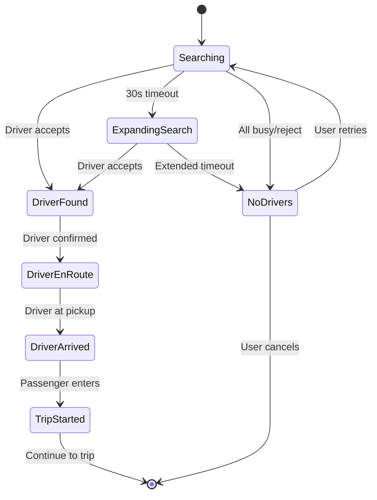

### **📊 Real-Time Updates**

```typescript
interface WaitingScreenData {
  status: 'searching' | 'driver_found' | 'driver_enroute' | 'driver_arrived';
  driver?: {
    id: string;
    name: string;
    rating: number;
    phone: string;
    photo: string;
    vehicle: {
      make: string;
      model: string;
      color: string;
      plateNumber: string;
    };
    location: {
      latitude: number;
      longitude: number;
      heading: number;
    };
    estimatedArrival: number; // minutes
  };
  searchRadius: number; // meters
  nearbyDriversCount: number;
  estimatedWaitTime: number; // minutes
}
```

## 🛣️ In-Trip Experience

### **🚗 Trip Progression**

```mermaid
flowchart TD
    A[🚗 Driver Arrived] --> B[📱 Passenger Notified]
    B --> C[🚶 Passenger Enters Vehicle]
    C --> D[🚀 Trip Started]
    D --> E[📍 Real-time Tracking]
    E --> F[🗺️ Route Following]
    F --> G{🛣️ Route Deviation?}
    G -->|No| H[📍 Continue Tracking]
    G -->|Yes| I[⚠️ Route Alert]
    H --> J[📍 Approaching Destination]
    I --> J
    J --> K[🏁 Arrived at Destination]
    K --> L[🚗 Trip Completed]
    
    style A fill:#e3f2fd
    style L fill:#c8e6c9
    style I fill:#ffecb3
```

### **📱 In-Trip Interface**

```mermaid
graph TB
    A[📱 Trip Screen] --> B[🗺️ Live Map View]
    A --> C[👤 Driver Info Panel]
    A --> D[📊 Trip Progress]
    A --> E[🔧 Trip Actions]
    
    B --> B1[📍 Current Location]
    B --> B2[🛣️ Route Path]
    B --> B3[🏁 Destination Marker]
    
    C --> C1[📞 Call Driver]
    C --> C2[💬 Message Driver]
    C --> C3[⭐ Driver Rating]
    
    D --> D1[⏱️ Elapsed Time]
    D --> D2[📏 Distance Covered]
    D --> D3[💰 Current Fare]
    
    E --> E1[🚨 Emergency Button]
    E --> E2[🔄 Share Trip]
    E --> E3[❌ Report Issue]
    
    style A fill:#e3f2fd
    style E1 fill:#ffcdd2
```

### **🚨 Safety Features**

```mermaid
graph LR
    A[🛡️ Safety Features] --> B[🚨 Emergency Button]
    A --> C[📍 Live Location Sharing]
    A --> D[📞 Emergency Contacts]
    A --> E[🔔 Trip Monitoring]
    
    B --> B1[🚓 Police Alert]
    B --> B2[📱 Emergency SMS]
    B --> B3[📞 Auto Call]
    
    C --> C1[👨‍👩‍👧‍👦 Family Sharing]
    C --> C2[🔗 Share Link]
    C --> C3[⏰ Auto Updates]
    
    style A fill:#e8f5e8
    style B fill:#ffcdd2
```

## 💳 Payment & Completion

### **💰 Payment Processing Flow**

```mermaid
sequenceDiagram
    participant P as 📱 Passenger
    participant APP as 📱 App
    participant API as 🔌 API Server
    participant PS as 💳 Payment Service
    participant GW as 🏦 Gateway
    participant D as 🚗 Driver
    
    P->>APP: Trip Completed
    APP->>API: Calculate Final Fare
    API->>API: Apply Discounts/Promotions
    API->>P: Show Final Amount
    
    alt Wallet Payment
        P->>APP: Confirm Payment
        APP->>PS: Process Wallet Payment
        PS->>PS: Deduct from Wallet
        PS->>API: Payment Success
    else Card Payment
        P->>APP: Confirm Payment
        APP->>PS: Process Card Payment
        PS->>GW: Gateway Request
        GW->>PS: Payment Response
        PS->>API: Payment Result
    else Cash Payment
        P->>APP: Confirm Cash Payment
        APP->>API: Mark as Cash Payment
        API->>D: Collect Cash from Passenger
    end
    
    API->>PS: Distribute Earnings
    PS->>D: Transfer Driver Share (85%)
    PS->>PS: Collect Platform Fee (15%)
    API->>P: Payment Receipt
    API->>D: Trip Completed
```

### **🧾 Receipt Generation**

```typescript
interface TripReceipt {
  receiptNumber: string;        // "RCP-2024-001234"
  tripId: string;
  date: string;
  passenger: {
    name: string;
    phone: string;
  };
  driver: {
    name: string;
    phone: string;
    vehicle: string;
  };
  route: {
    pickup: string;
    dropoff: string;
    distance: number;           // km
    duration: number;           // minutes
  };
  fare: {
    baseFare: number;
    distanceFare: number;
    timeFare: number;
    platformFee: number;
    discount: number;
    total: number;
  };
  payment: {
    method: string;
    status: 'completed' | 'pending' | 'failed';
    transactionId: string;
  };
  driverEarnings: number;       // 85% of fare
  platformCommission: number;  // 15% of fare
}
```

### **💳 Payment Methods Comparison**

| **Method** | **Processing Time** | **Fees** | **Availability** | **User Experience** |
|------------|-------------------|----------|------------------|-------------------|
| **💰 Sikka Wallet** | Instant | Free | 24/7 | ⭐⭐⭐⭐⭐ |
| **💵 Cash** | Manual | Free | 24/7 | ⭐⭐⭐⭐ |
| **🏦 EBS Card** | 2-5 seconds | 1% | Business hours | ⭐⭐⭐ |
| **💳 CyberPay** | 3-10 seconds | 0.5% | 24/7 | ⭐⭐⭐⭐ |

## ⭐ Rating & Feedback

### **📊 Rating System Flow**

```mermaid
flowchart TD
    A[💳 Payment Completed] --> B[⭐ Rating Screen]
    B --> C[🌟 Overall Rating (1-5)]
    C --> D[📝 Category Ratings]
    D --> E[💬 Written Feedback]
    E --> F[📸 Photo Upload (Optional)]
    F --> G[🏷️ Tags Selection]
    G --> H[📤 Submit Rating]
    H --> I[🎉 Thank You Screen]
    I --> J[🏠 Return to Home]
    
    style A fill:#e3f2fd
    style I fill:#c8e6c9
```

### **📊 Rating Categories**

```mermaid
graph TB
    A[⭐ Rating Categories] --> B[🚗 Vehicle Condition<br/>Cleanliness, Comfort]
    A --> C[🚦 Driving Quality<br/>Safety, Route Knowledge]
    A --> D[💬 Communication<br/>Politeness, Helpfulness]
    A --> E[⏰ Punctuality<br/>Arrival Time, Trip Duration]
    A --> F[🎵 Overall Experience<br/>Music, Temperature, etc.]
    
    style A fill:#e8f5e8
```

### **🏷️ Quick Feedback Tags**

```typescript
interface FeedbackTags {
  positive: [
    'Great driver! 👍',
    'Clean vehicle 🧽',
    'Safe driving 🛡️',
    'On time ⏰',
    'Friendly 😊',
    'Good music 🎵',
    'Comfortable ride 🛋️',
    'Knew shortcuts 🗺️'
  ];
  negative: [
    'Late arrival ⏰',
    'Rude behavior 😠',
    'Unsafe driving ⚠️',
    'Dirty vehicle 🚫',
    'Wrong route 🗺️',
    'Overcharged 💰',
    'Phone usage 📱',
    'Smoking 🚭'
  ];
}
```

## 🔄 Alternative Flows

### **❌ Cancellation Scenarios**

```mermaid
flowchart TD
    A[🚗 Active Trip] --> B{❌ Cancellation Request}
    B -->|Passenger| C[👤 Passenger Cancellation]
    B -->|Driver| D[🚗 Driver Cancellation]
    B -->|System| E[🔧 System Cancellation]
    
    C --> F{⏰ Cancellation Timing}
    F -->|Before Driver Assigned| G[✅ Free Cancellation]
    F -->|Driver En Route| H[💰 Cancellation Fee (SDG 5)]
    F -->|Driver Arrived| I[💰 Cancellation Fee (SDG 10)]
    F -->|Trip Started| J[💰 Minimum Fare Charged]
    
    D --> K{🔍 Reason}
    K -->|Emergency| L[✅ No Penalty]
    K -->|Passenger No-Show| M[💰 No-Show Fee]
    K -->|Other| N[⚠️ Driver Warning]
    
    E --> O[🔄 Auto Reassignment]
    
    G --> P[🏠 Return to Home]
    H --> P
    I --> P
    J --> Q[💳 Process Payment]
    L --> P
    M --> Q
    N --> P
    O --> R[🔍 Find New Driver]
    Q --> P
    
    style G fill:#c8e6c9
    style H fill:#ffecb3
    style I fill:#ffcdd2
    style J fill:#ffcdd2
```

### **🚫 No Driver Available**

```mermaid
flowchart TD
    A[🔍 Searching for Driver] --> B{⏰ 2 Minutes Elapsed}
    B -->|No Response| C[📡 Expand Search Radius]
    C --> D{⏰ Additional 2 Minutes}
    D -->|Still No Response| E[📢 Increase Fare Incentive]
    E --> F{⏰ Final 2 Minutes}
    F -->|No Driver| G[❌ No Drivers Available]
    
    G --> H[📱 Show Options]
    H --> I[🔄 Try Again Later]
    H --> J[📞 Call Sikka Support]
    H --> K[🚖 Alternative Transport]
    H --> L[⏰ Schedule for Later]
    
    style G fill:#ffcdd2
    style I fill:#e3f2fd
    style J fill:#fff3e0
    style K fill:#f3e5f5
    style L fill:#e8f5e8
```

### **⚠️ Emergency Situations**

```mermaid
flowchart TD
    A[🚨 Emergency Button Pressed] --> B[📱 Emergency Alert Screen]
    B --> C[🚓 Contact Police]
    B --> D[👨‍👩‍👧‍👦 Call Emergency Contact]
    B --> E[📞 Call Sikka Support]
    B --> F[📍 Share Live Location]
    
    C --> G[📞 Auto Dial 999]
    D --> H[📞 Auto Dial Contact]
    E --> I[📞 24/7 Support Line]
    F --> J[📱 SMS with Location]
    
    G --> K[🚓 Police Notified]
    H --> L[👨‍👩‍👧‍👦 Family Alerted]
    I --> M[🎧 Support Connected]
    J --> N[📍 Location Shared]
    
    style A fill:#ffcdd2
    style B fill:#ffcdd2
    style K fill:#ffcdd2
    style L fill:#ffecb3
    style M fill:#e3f2fd
    style N fill:#e8f5e8
```

## 📊 User Experience Optimization

### **⚡ Performance Metrics**

| **Metric** | **Target** | **Current** | **Status** |
|------------|------------|-------------|------------|
| **App Launch Time** | < 3 seconds | 2.1 seconds | ✅ |
| **Booking Completion** | < 2 minutes | 1.8 minutes | ✅ |
| **Driver Matching** | < 30 seconds | 25 seconds | ✅ |
| **Payment Processing** | < 10 seconds | 7 seconds | ✅ |
| **App Crash Rate** | < 0.1% | 0.05% | ✅ |

### **📱 Accessibility Features**

```mermaid
graph TB
    A[♿ Accessibility] --> B[🔤 Large Text Support]
    A --> C[🎤 Voice Commands]
    A --> D[🔊 Audio Feedback]
    A --> E[🎨 High Contrast Mode]
    A --> F[👆 Touch Assistance]
    
    B --> B1[📱 System Font Scaling]
    C --> C1[🗣️ "Book a ride to..."]
    D --> D1[🔊 Trip Status Updates]
    E --> E1[⚫⚪ Color Adjustments]
    F --> F1[👆 Larger Touch Targets]
    
    style A fill:#e8f5e8
```

### **🌍 Localization Features**

```typescript
interface LocalizationSupport {
  languages: ['ar', 'en'];
  currency: 'SDG';
  dateFormat: 'DD/MM/YYYY';
  timeFormat: '12h' | '24h';
  numberFormat: 'arabic' | 'western';
  rtlSupport: boolean;
  localizedAddresses: boolean;
  culturalConsiderations: {
    prayerTimeAlerts: boolean;
    ramadanMode: boolean;
    genderPreferences: boolean;
  };
}
```

### **📊 User Satisfaction Tracking**

```mermaid
graph TB
    A[📊 Satisfaction Metrics] --> B[⭐ Trip Ratings]
    A --> C[📱 App Store Reviews]
    A --> D[📞 Support Tickets]
    A --> E[🔄 User Retention]
    
    B --> B1[📈 Average: 4.7/5]
    C --> C1[📈 Average: 4.5/5]
    D --> D1[📉 < 2% of trips]
    E --> E1[📈 85% monthly retention]
    
    style A fill:#e3f2fd
    style B1 fill:#c8e6c9
    style C1 fill:#c8e6c9
    style D1 fill:#c8e6c9
    style E1 fill:#c8e6c9
```

---

## 🎯 Continuous Improvement

### **📈 User Feedback Integration**
- **Weekly Reviews**: Analyze user ratings and feedback
- **Feature Requests**: Track and prioritize user suggestions
- **A/B Testing**: Test interface improvements
- **Performance Monitoring**: Track app performance metrics
- **User Interviews**: Conduct regular user research

### **🔄 Journey Optimization**
- **Reduce Friction**: Minimize steps in booking flow
- **Improve Clarity**: Clear communication at each step
- **Enhance Safety**: Continuous safety feature improvements
- **Payment Innovation**: Add new payment methods
- **Personalization**: Customize experience based on usage patterns

---

<div align="center">

**📱 Designed for Sudanese Passengers**

[⭐ Star this repo](https://github.com/abdoElHodaky/transportapp) | [🚗 Driver Journey](driver-flow.md) | [📊 Analytics](../analytics/)

</div>

