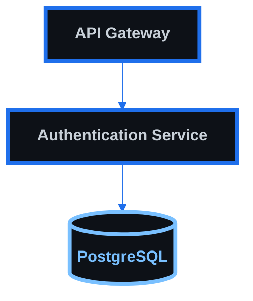
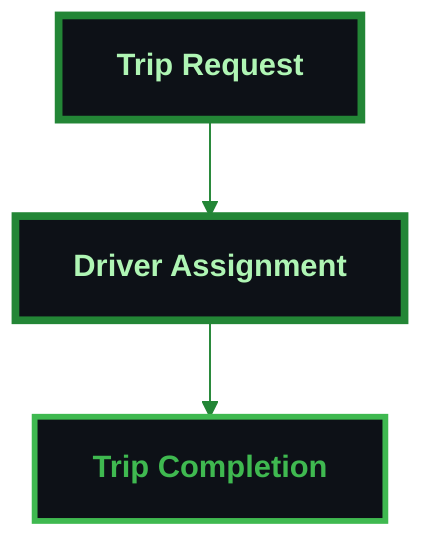
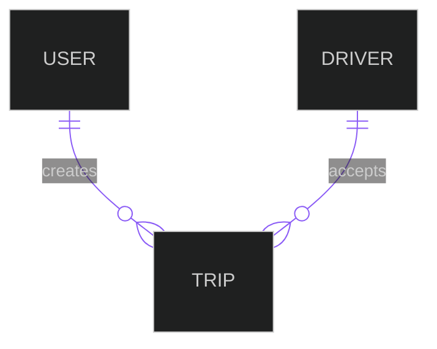
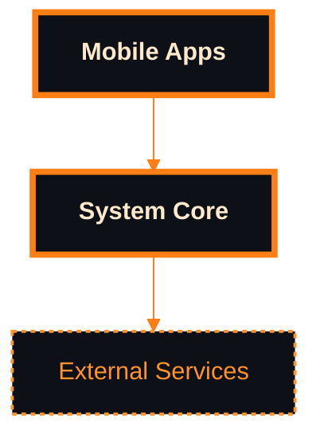
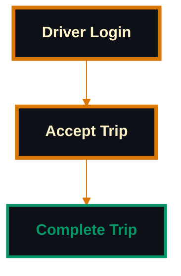
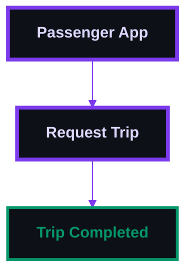
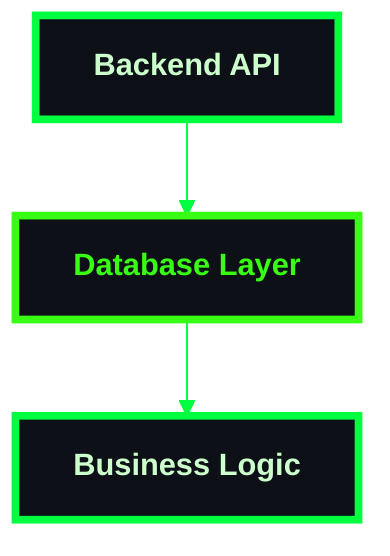

# Distinguished Mermaid Styling Showcase

This file demonstrates the different styling themes applied to each document type.

## Architecture Theme (Tech Blue)



## Business Process Theme (Corporate Green)



## Database Schema Theme (Data Purple)



## System Overview Theme (Orange Gradient)



## WebSocket Events Theme (Electric Cyan)

```mermaid
%%{init: {
  "theme": "dark",
  "themeVariables": {
    "primaryColor": "#0d1117",
    "primaryTextColor": "#cffafe",
    "primaryBorderColor": "#06b6d4",
    "lineColor": "#06b6d4"
  },
  "sequence": {
    "useMaxWidth": true,
    "wrap": true
  }
}}%%
sequenceDiagram
    participant C as "Client"
    participant S as "Server"
    
    C->>S: Connect
    S->>C: Connected
    
    classDef primary fill:#0d1117,stroke:#06b6d4,stroke-width:4px,color:#cffafe,font-weight:bold;
```

## Driver Flow Theme (Professional Gold)



## Passenger Flow Theme (Royal Purple)



## Backend Development Theme (Matrix Green)



## Theme Summary

Each document type now has its own distinctive visual identity:

- **Architecture**: Professional tech blue for system architecture
- **Business Processes**: Corporate green for business workflows
- **Database Schema**: Data purple for database diagrams
- **System Overview**: Orange gradient for system overviews
- **WebSocket Events**: Electric cyan for real-time communications
- **Driver Flow**: Professional gold for driver journeys
- **Passenger Flow**: Royal purple for passenger journeys
- **Backend Development**: Matrix green for development tasks
