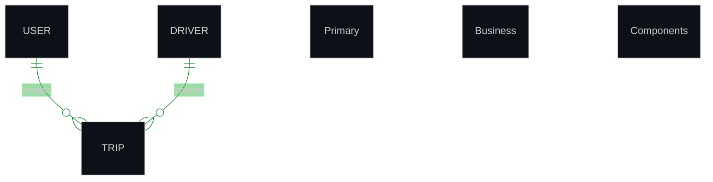

# Distinguished Mermaid Styling Showcase

This file demonstrates the different styling themes applied to each document type.

## Architecture Theme (Tech Blue)

```mermaid
%%{init: {
  "theme": "dark",
  "themeVariables": {
    "primaryColor": "#0d1117",
    "primaryTextColor": "#aff5b4",
    "primaryBorderColor": "#238636",
    "lineColor": "#238636",
    "secondaryColor": "#2ea043",
    "tertiaryColor": "#3fb950",
    "background": "#0d1117",
    "mainBkg": "#0d1117",
    "secondBkg": "#21262d"
  },
  "flowchart": {
    "useMaxWidth": true,
    "htmlLabels": true
  },
  "sequence": {
    "useMaxWidth": true,
    "wrap": true
  }
}}%%
graph TB
    A["API Gateway"] --> B["Authentication Service"]
    B --> C[("PostgreSQL")]

     Primary nodes (main components)

     Primary Business Components

    %% Secondary Business Components

    %% Process Steps

    %% Decision Points

    %% Success States

    %% External Systems

    %% Database Systems

    %% Node Classifications
    %% --- CORPORATE GREEN THEME STYLING ---
    classDef primary fill:#0d1117,stroke:#238636,stroke-width:4px,color:#aff5b4,font-weight:bold;
    classDef secondary fill:#0d1117,stroke:#2ea043,stroke-width:3px,color:#aff5b4,font-weight:normal;
    classDef process fill:#21262d,stroke:#238636,stroke-width:2px,color:#aff5b4,font-weight:normal;
    classDef decision fill:#0d1117,stroke:#d29922,stroke-width:3px,color:#d29922,font-weight:bold,stroke-dasharray: 8 4;
    classDef success fill:#0d1117,stroke:#238636,stroke-width:3px,color:#238636,font-weight:bold;
    classDef external fill:#0d1117,stroke:#2ea043,stroke-width:2px,color:#2ea043,font-weight:normal,stroke-dasharray: 3 3;
    classDef database fill:#0d1117,stroke:#3fb950,stroke-width:4px,color:#3fb950,font-weight:bold;
    %% Node Classifications
    class A gateway;
    class B secondary;
    class C database;

```

## Business Process Theme (Corporate Green)

```mermaid
%%{init: {
  "theme": "dark",
  "themeVariables": {
    "primaryColor": "#0d1117",
    "primaryTextColor": "#aff5b4",
    "primaryBorderColor": "#238636",
    "lineColor": "#238636",
    "secondaryColor": "#2ea043",
    "tertiaryColor": "#3fb950",
    "background": "#0d1117",
    "mainBkg": "#0d1117",
    "secondBkg": "#21262d"
  },
  "flowchart": {
    "useMaxWidth": true,
    "htmlLabels": true
  },
  "sequence": {
    "useMaxWidth": true,
    "wrap": true
  }
}}%%
graph TB
    A["Trip Request"] --> B["Driver Assignment"]
    B --> C["Trip Completion"]

     Primary nodes (main components)

     Primary Business Components

    %% Secondary Business Components

    %% Process Steps

    %% Decision Points

    %% Success States

    %% External Systems

    %% Database Systems

    %% Node Classifications
    %% --- CORPORATE GREEN THEME STYLING ---
    classDef primary fill:#0d1117,stroke:#238636,stroke-width:4px,color:#aff5b4,font-weight:bold;
    classDef secondary fill:#0d1117,stroke:#2ea043,stroke-width:3px,color:#aff5b4,font-weight:normal;
    classDef process fill:#21262d,stroke:#238636,stroke-width:2px,color:#aff5b4,font-weight:normal;
    classDef decision fill:#0d1117,stroke:#d29922,stroke-width:3px,color:#d29922,font-weight:bold,stroke-dasharray: 8 4;
    classDef success fill:#0d1117,stroke:#238636,stroke-width:3px,color:#238636,font-weight:bold;
    classDef external fill:#0d1117,stroke:#2ea043,stroke-width:2px,color:#2ea043,font-weight:normal,stroke-dasharray: 3 3;
    classDef database fill:#0d1117,stroke:#3fb950,stroke-width:4px,color:#3fb950,font-weight:bold;
    %% Node Classifications
    class A,B,C process;

```

## Database Schema Theme (Data Purple)



## System Overview Theme (Orange Gradient)

```mermaid
%%{init: {
  "theme": "dark",
  "themeVariables": {
    "primaryColor": "#0d1117",
    "primaryTextColor": "#aff5b4",
    "primaryBorderColor": "#238636",
    "lineColor": "#238636",
    "secondaryColor": "#2ea043",
    "tertiaryColor": "#3fb950",
    "background": "#0d1117",
    "mainBkg": "#0d1117",
    "secondBkg": "#21262d"
  },
  "flowchart": {
    "useMaxWidth": true,
    "htmlLabels": true
  },
  "sequence": {
    "useMaxWidth": true,
    "wrap": true
  }
}}%%
graph TB
    A["Mobile Apps"] --> B["System Core"]
    B --> C["External Services"]

     Primary nodes (main components)

     Primary Business Components

    %% Secondary Business Components

    %% Process Steps

    %% Decision Points

    %% Success States

    %% External Systems

    %% Database Systems

    %% Node Classifications
    %% --- CORPORATE GREEN THEME STYLING ---
    classDef primary fill:#0d1117,stroke:#238636,stroke-width:4px,color:#aff5b4,font-weight:bold;
    classDef secondary fill:#0d1117,stroke:#2ea043,stroke-width:3px,color:#aff5b4,font-weight:normal;
    classDef process fill:#21262d,stroke:#238636,stroke-width:2px,color:#aff5b4,font-weight:normal;
    classDef decision fill:#0d1117,stroke:#d29922,stroke-width:3px,color:#d29922,font-weight:bold,stroke-dasharray: 8 4;
    classDef success fill:#0d1117,stroke:#238636,stroke-width:3px,color:#238636,font-weight:bold;
    classDef external fill:#0d1117,stroke:#2ea043,stroke-width:2px,color:#2ea043,font-weight:normal,stroke-dasharray: 3 3;
    classDef database fill:#0d1117,stroke:#3fb950,stroke-width:4px,color:#3fb950,font-weight:bold;
    %% Node Classifications
    class A primary;
    class B process;
    class C secondary;

```

## WebSocket Events Theme (Electric Cyan)

```mermaid
%%{init: {
  "theme": "dark",
  "themeVariables": {
    "primaryColor": "#0d1117",
    "primaryTextColor": "#aff5b4",
    "primaryBorderColor": "#238636",
    "lineColor": "#238636",
    "secondaryColor": "#2ea043",
    "tertiaryColor": "#3fb950",
    "background": "#0d1117",
    "mainBkg": "#0d1117",
    "secondBkg": "#21262d"
  },
  "flowchart": {
    "useMaxWidth": true,
    "htmlLabels": true
  },
  "sequence": {
    "useMaxWidth": true,
    "wrap": true
  }
}}%%
sequenceDiagram
    participant C as "Client"
    participant S as "Server"
    
    C->>S: Connect
    S->>C: Connected

     Primary nodes (main components)

     Primary Business Components

    %% Secondary Business Components

    %% Process Steps

    %% Decision Points

    %% Success States

    %% External Systems

    %% Database Systems
    %% --- CORPORATE GREEN THEME STYLING ---
    classDef primary fill:#0d1117,stroke:#238636,stroke-width:4px,color:#aff5b4,font-weight:bold;
    classDef secondary fill:#0d1117,stroke:#2ea043,stroke-width:3px,color:#aff5b4,font-weight:normal;
    classDef process fill:#21262d,stroke:#238636,stroke-width:2px,color:#aff5b4,font-weight:normal;
    classDef decision fill:#0d1117,stroke:#d29922,stroke-width:3px,color:#d29922,font-weight:bold,stroke-dasharray: 8 4;
    classDef success fill:#0d1117,stroke:#238636,stroke-width:3px,color:#238636,font-weight:bold;
    classDef external fill:#0d1117,stroke:#2ea043,stroke-width:2px,color:#2ea043,font-weight:normal,stroke-dasharray: 3 3;
    classDef database fill:#0d1117,stroke:#3fb950,stroke-width:4px,color:#3fb950,font-weight:bold;
```

## Driver Flow Theme (Professional Gold)

```mermaid
%%{init: {
  "theme": "dark",
  "themeVariables": {
    "primaryColor": "#0d1117",
    "primaryTextColor": "#aff5b4",
    "primaryBorderColor": "#238636",
    "lineColor": "#238636",
    "secondaryColor": "#2ea043",
    "tertiaryColor": "#3fb950",
    "background": "#0d1117",
    "mainBkg": "#0d1117",
    "secondBkg": "#21262d"
  },
  "flowchart": {
    "useMaxWidth": true,
    "htmlLabels": true
  },
  "sequence": {
    "useMaxWidth": true,
    "wrap": true
  }
}}%%
graph TB
    A["Driver Login"] --> B["Accept Trip"]
    B --> C["Complete Trip"]

     Primary nodes (main components)

     Primary Business Components

    %% Secondary Business Components

    %% Process Steps

    %% Decision Points

    %% Success States

    %% External Systems

    %% Database Systems

    %% Node Classifications
    %% --- CORPORATE GREEN THEME STYLING ---
    classDef primary fill:#0d1117,stroke:#238636,stroke-width:4px,color:#aff5b4,font-weight:bold;
    classDef secondary fill:#0d1117,stroke:#2ea043,stroke-width:3px,color:#aff5b4,font-weight:normal;
    classDef process fill:#21262d,stroke:#238636,stroke-width:2px,color:#aff5b4,font-weight:normal;
    classDef decision fill:#0d1117,stroke:#d29922,stroke-width:3px,color:#d29922,font-weight:bold,stroke-dasharray: 8 4;
    classDef success fill:#0d1117,stroke:#238636,stroke-width:3px,color:#238636,font-weight:bold;
    classDef external fill:#0d1117,stroke:#2ea043,stroke-width:2px,color:#2ea043,font-weight:normal,stroke-dasharray: 3 3;
    classDef database fill:#0d1117,stroke:#3fb950,stroke-width:4px,color:#3fb950,font-weight:bold;
    %% Node Classifications
    class A,B,C process;

```

## Passenger Flow Theme (Royal Purple)

```mermaid
%%{init: {
  "theme": "dark",
  "themeVariables": {
    "primaryColor": "#0d1117",
    "primaryTextColor": "#aff5b4",
    "primaryBorderColor": "#238636",
    "lineColor": "#238636",
    "secondaryColor": "#2ea043",
    "tertiaryColor": "#3fb950",
    "background": "#0d1117",
    "mainBkg": "#0d1117",
    "secondBkg": "#21262d"
  },
  "flowchart": {
    "useMaxWidth": true,
    "htmlLabels": true
  },
  "sequence": {
    "useMaxWidth": true,
    "wrap": true
  }
}}%%
graph TB
    A["Passenger App"] --> B["Request Trip"]
    B --> C["Trip Completed"]

     Primary nodes (main components)

     Primary Business Components

    %% Secondary Business Components

    %% Process Steps

    %% Decision Points

    %% Success States

    %% External Systems

    %% Database Systems

    %% Node Classifications
    %% --- CORPORATE GREEN THEME STYLING ---
    classDef primary fill:#0d1117,stroke:#238636,stroke-width:4px,color:#aff5b4,font-weight:bold;
    classDef secondary fill:#0d1117,stroke:#2ea043,stroke-width:3px,color:#aff5b4,font-weight:normal;
    classDef process fill:#21262d,stroke:#238636,stroke-width:2px,color:#aff5b4,font-weight:normal;
    classDef decision fill:#0d1117,stroke:#d29922,stroke-width:3px,color:#d29922,font-weight:bold,stroke-dasharray: 8 4;
    classDef success fill:#0d1117,stroke:#238636,stroke-width:3px,color:#238636,font-weight:bold;
    classDef external fill:#0d1117,stroke:#2ea043,stroke-width:2px,color:#2ea043,font-weight:normal,stroke-dasharray: 3 3;
    classDef database fill:#0d1117,stroke:#3fb950,stroke-width:4px,color:#3fb950,font-weight:bold;
    %% Node Classifications
    class A primary;
    class B,C process;

```

## Backend Development Theme (Matrix Green)

```mermaid
%%{init: {
  "theme": "dark",
  "themeVariables": {
    "primaryColor": "#0d1117",
    "primaryTextColor": "#aff5b4",
    "primaryBorderColor": "#238636",
    "lineColor": "#238636",
    "secondaryColor": "#2ea043",
    "tertiaryColor": "#3fb950",
    "background": "#0d1117",
    "mainBkg": "#0d1117",
    "secondBkg": "#21262d"
  },
  "flowchart": {
    "useMaxWidth": true,
    "htmlLabels": true
  },
  "sequence": {
    "useMaxWidth": true,
    "wrap": true
  }
}}%%
graph TB
    A["Backend API"] --> B["Database Layer"]
    B --> C["Business Logic"]

     Primary nodes (main components)

     Primary Business Components

    %% Secondary Business Components

    %% Process Steps

    %% Decision Points

    %% Success States

    %% External Systems

    %% Database Systems

    %% Node Classifications
    %% --- CORPORATE GREEN THEME STYLING ---
    classDef primary fill:#0d1117,stroke:#238636,stroke-width:4px,color:#aff5b4,font-weight:bold;
    classDef secondary fill:#0d1117,stroke:#2ea043,stroke-width:3px,color:#aff5b4,font-weight:normal;
    classDef process fill:#21262d,stroke:#238636,stroke-width:2px,color:#aff5b4,font-weight:normal;
    classDef decision fill:#0d1117,stroke:#d29922,stroke-width:3px,color:#d29922,font-weight:bold,stroke-dasharray: 8 4;
    classDef success fill:#0d1117,stroke:#238636,stroke-width:3px,color:#238636,font-weight:bold;
    classDef external fill:#0d1117,stroke:#2ea043,stroke-width:2px,color:#2ea043,font-weight:normal,stroke-dasharray: 3 3;
    classDef database fill:#0d1117,stroke:#3fb950,stroke-width:4px,color:#3fb950,font-weight:bold;
    %% Node Classifications
    class A secondary;
    class B database;
    class C process;

```

## Theme Summary

Each document type now has its own distinctive visual identity:

- **Architecture**: Professional tech blue for system architecture
- **Business Processes**: Corporate green for business workflows
- **Database Schema**: Data purple for database diagrams
- **System Overview**: Orange gradient for system overviews
- **WebSocket Events**: Electric cyan for real-time communications
- **Driver Flow**: Professional gold for driver journeys
- **Passenger Flow**: Royal purple for passenger journeys
- **Backend Development**: Matrix green for development tasks
