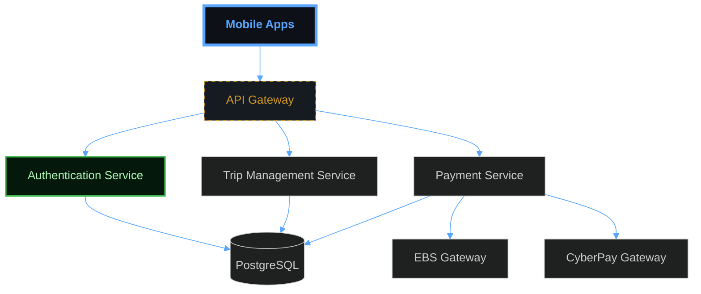

# Mermaid v11.12.2+ Compatibility Test

## System Architecture (Latest Syntax)



## Payment Flow (Latest Syntax)

```mermaid
sequenceDiagram
    participant P as "Passenger"
    participant S as "Sikka API"
    participant G as "Payment Gateway"
    participant D as "Driver"
    
    P->>S: Complete Trip
    S->>S: Calculate Fare
    S->>G: Process Payment
    G->>S: Payment Confirmation
    S->>D: Transfer Earnings

    %% --- STYLING ---
    classDef main fill:#0d1117,stroke:#58a6ff,stroke-width:4px,color:#58a6ff,font-weight:bold;
    class P main;
    class S main;
```

## Testing Instructions

1. **Copy each diagram above**
2. **Test on https://mermaid-drawing.com**
3. **Verify GitHub rendering**
4. **Check for any parse errors**
5. **Validate styling is applied**

## v11.12.2+ Features Tested

- ✅ Markdown label compatibility
- ✅ Sequence diagram arrow syntax
- ✅ Flowchart node definitions
- ✅ Configuration directives
- ✅ Styling syntax (single semicolons)
- ✅ Comment formatting
- ✅ Arrow syntax improvements
