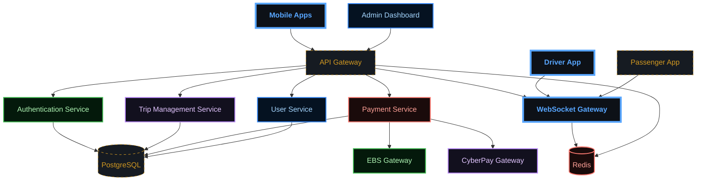

# Test Diagrams for Validation

## System Architecture (Fixed)



## Payment Flow (Fixed)

```mermaid
sequenceDiagram
    participant P as "Passenger"
    participant S as "Sikka API"
    participant G as "Payment Gateway"
    participant D as "Driver"
    
    P->>S: Complete Trip
    S->>S: Calculate Fare
    S->>G: Process Payment
    G->>S: Payment Confirmation
    S->>S: Update Wallet Balances
    S->>D: Transfer Driver Earnings (85%)
    S->>S: Collect Platform Commission (15%)
    S->>P: Payment Receipt

    %% --- DARK GRADIENT & GLOW STYLING ---
    
    %% Main Dashboard (Neon Cyan/Blue)
    classDef main fill:#0d1117,stroke:#58a6ff,stroke-width:4px,color:#58a6ff,font-weight:bold;
    
    %% Decision Diamond (Gold Glow)
    classDef decision fill:#161b22,stroke:#d29922,color:#d29922,stroke-dasharray: 5 5;
    
    %% Revenue (Emerald Gradient Style)
    classDef revNode fill:#04190b,stroke:#3fb950,color:#aff5b4,stroke-width:2px;
    
    %% Commission (Purple Gradient Style)
    classDef commNode fill:#12101e,stroke:#bc8cff,color:#e2c5ff,stroke-width:2px;
    
    %% Refund (Ruby Gradient Style)
    classDef refNode fill:#1a0b0b,stroke:#ff7b72,color:#ffa198,stroke-width:2px;
    
    %% Earnings (Sapphire Gradient Style)
    classDef earnNode fill:#051221,stroke:#388bfd,color:#a5d6ff,stroke-width:2px;

    class P main;
    class S decision;
    class G revNode;
    class D commNode;
```

## Instructions

1. Copy each diagram above
2. Test on https://mermaid-drawing.com
3. Verify they render correctly
4. Check styling is applied properly
